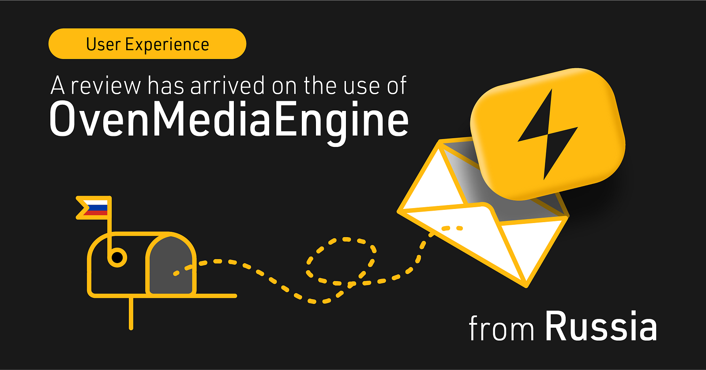
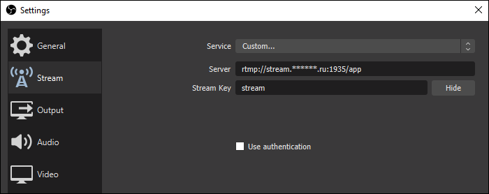
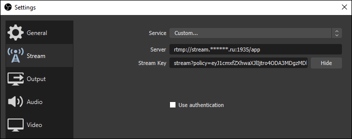
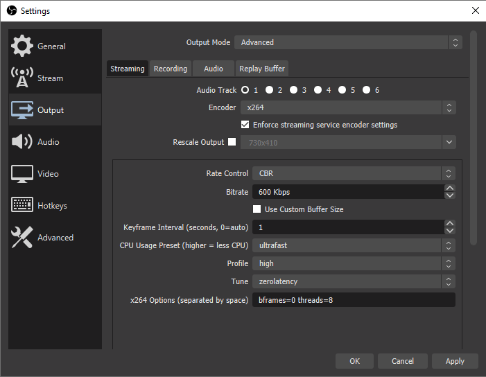
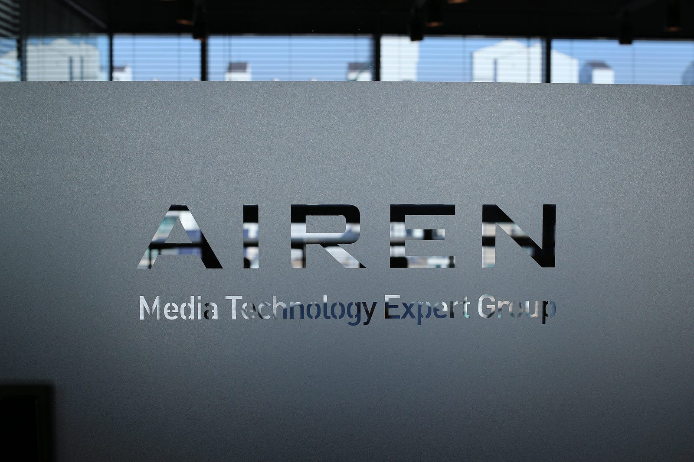

This article has been shared from Russia. Thank you, [Alexander](https://habr.com/ru/users/Alexufo/), for writing this article.

{/* truncate */}

Also, we have tried translating this article from Russian to English as smoothly as possible. Still, some parts could be controversial due to translation errors, so click [HERE](https://habr.com/ru/post/532424/) to check the original.



## Video streaming with OvenMediaEngine, goodbye Nginx-RTMP module!

Before [Roman Arutyunyan](https://github.com/arut) released the [Nginx-RTMP module](https://github.com/arut/nginx-rtmp-module), the video broadcasting/streaming availability seemed like an expensive and complex business.

**On December 31**, Adobe didn’t officially support Flash Player and removed the download URL. Of course, I have no choice but to be happy. Even advanced users who have the button using Flash Player turned on by default must also use antivirus software. Everyone knows that this monster has endlessly requested updates through your browser.

Who is Flash Player giving up at the end of 2020? Flash Player is the only one that supports streaming over the RTMP protocol in browsers with relatively low latency. So I think it’s not bad, considering streaming services such as YouTube, Twitch, and more are requested to transmit the video using the RTMP protocol. In addition, of course, a more recent [SRT](https://obsproject.com/wiki/Streaming-With-SRT-Protocol) comes along, but that’s not the topic of this article.

***“Adobe will remove the ability to play videos in browsers using RTMP, but where is the alternative?”***

The HTTP formats require proper buffering, converting latency to about 15 seconds. However, this rule is unacceptable if you communicate online with your audience.

WebRTC solutions are not suitable for one-to-many streaming implementations. Well, how bad it is, if you can experience it will be okay. Softwares are on the market, but the problem is still in coverage. According to my research, WebRTC has found some stable steps it can use. However, there are still small issues with video formats across platforms. Previously, everything looked so terrible that it was more comfortable to ask to install Flash Player just for the sake of a slight delay.

In the Nginx-RTMP module issues, I’m not the only one who left questions [[1]](https://github.com/arut/nginx-rtmp-module/issues/1454#issuecomment-564746046)[[2]](https://github.com/arut/nginx-rtmp-module/issues/1566) about the support of the video transmission formats over [*HTTP with low latency*](https://www.appeartv.com/streaming/chunked-cmaf/) (2 to 3 seconds). For example, it would be entirely suitable for broadcast in DASH and HLS format for up to 3 seconds using the Nginx-RTMP module. However, there is no answer to these questions. Also, in 2020, lower latency is more needed, but that is no progress. Unfortunately, I think this project has not been developed since [2017](https://github.com/arut/nginx-rtmp-module/commits/master).

### “Open-Source Streaming Server with Sub-Second Latency” OvenMediaEngine

A great alternative that meets all my needs is an Open-Source and Sub-Second Latency Streaming Server, [OvenMediaEngine](https://github.com/AirenSoft/OvenMediaEngine), which provides not only coding and clustering tools (e.g., Nginx-RTMP module) but also playback tools (e.g., HTML5 Player [OvenPlayer](https://github.com/AirenSoft/OvenPlayer)). Korean media technology experts released those I was looking for. With great interest, I tested it for a week and thought it would be a game-changer.

- *With WebRTC, the streaming latency is sub-second.*
- *With Low Latency DASH, the streaming latency is within 2 seconds.*
- *Low Latency HLS is coming soon.*

### Features

- Input: WebRTC, RTSP, SRT, MPEG-TS, RTMP
- Adaptive Bitrate Streaming* (ABR)* for LLHLS and WebRTC
- Sub-Second Streaming using WebRTC  
- WebRTC over TCP *(With Embedded TURN Server)*  
- Embedded WebRTC Signalling Server *(WebSocket-based)*  
- Retransmission with NACK*  
- *ULP FEC* (Uneven Level Protection Forward Error Correction)* with VP8, H.264  
- In-band FEC with Opus
- Low-Latency Streaming using LLHLS
- Legacy HLS/MPEG-DASH streaming
- Embedded Live Transcoder*  
*- Video: VP8, H264, Pass-through  
- Audio: Opus, AAC, Pass-through
- Clustering *(Origin-Edge structure)*
- Monitoring
- Access Control  
- Admission Webhooks  
- Singed Policy
- Add-ons  
- File Recording  
- RTMP Push Publishing *(Re-streaming)*  
- Thumbnail  
- REST API
- Experiment  
- P2P Traffic Distribution *(WebRTC-Only)*

Since the OvenMediaEngine team is actively developing this media server, I decided to use the Docker installation they suggested for a quick start. It rolls only two things inside the container, Let’s Encrypt’s certificate and a server configuration file.

[*OvenMediaEngine’s user guide*](https://airensoft.gitbook.io/ovenmediaengine/) includes a quick start page, but it doesn’t explain the best default practices due to the up-to-dateness of the project. After investigating all of this myself, I identified two issues in the release and felt I needed an article.

1. This example shows how it works with HTTP and WS protocols, but if you want to know how to work with HTTPS and WSS, you’ll have to reconfigure everything. And the documentation doesn’t have a word for attaching a free certificate like Let’s Encrypt, but it’s officially fully supported.
2. When I configure and start my server, the entry point is publicly available to everyone. Therefore, It would be best to show me how to secure the entry point like the Nginx-RTMP module immediately.

I think these are all small things, and I would like to praise the very convenient debugging tools they provide:

- without TLS: [http://demo.ovenplayer.com](http://demo.ovenplayer.com/)
- with TLS: [https://demo.ovenplayer.com](https://demo.ovenplayer.com/)

HTTP and HTTPS for server debugging. Moreover, the setting is reflected immediately as the “GET” parameter in the address bar. It’s very convenient to test between browsers. However, I’m confused about protocols, ports, and clerical notes in URLs during the first preparation of the server is still something to do! So, I bookmarked the browser’s link and returned when I needed to configure it!

### Installation

I used Ubuntu 20 following the [*Getting Started*](https://airensoft.gitbook.io/ovenmediaengine/v/0.10.10/getting-started) they provided.

```
docker run -d \
-p 1935:1935 -p 4000-4005:4000-4005/udp -p 3333:3333 -p 8080:8080 -p 9000:9000 -p 10000-10010:10000-10010/udp \
airensoft/ovenmediaengine:latest
```

Then I installed Certbot, bound the IP to the domain, and imported the certificate. And I got the name of the Docker container (e.g., 87b8610034bc).

**Server.xml:**

```
sudo docker container ls
```

Let’s import the configuration from the container for editing. I think It’s more convenient when I’m studying the config to see it somewhere with syntax highlighting, so I pulled out the file.

```
sudo docker cp 87b8610034bc:/opt/ovenmediaengine/bin/origin_conf/Server.xml ./Server.xml
```

Please click HERE to see the default configuration.

In the VirtualHost section, I set the server name and specified the path to the certificate inside the container.

The server name in the form of an asterisk or any other word in the configuration won’t allow OvenMediaEngine to start correctly using TLS.

```
<Host>
  <Names>
    <Name>stream.***.ru</Name>
  </Names>
  <TLS>
    <CertPath>/opt/ovenmediaengine/bin/cert.pem</CertPath>
    <KeyPath>/opt/ovenmediaengine/bin/privkey.pem</KeyPath>
    <ChainCertPath>/opt/ovenmediaengine/bin/chain.pem</ChainCertPath>
  </TLS>
</Host>
```

Then, I need to leave the TLSPort ports.

```
<Publishers>
  <HLS>
    <TLSPort>{env:OME_HLS_STREAM_PORT:8080}</TLSPort>
  </HLS>
  <DASH>
    <TLSPort>{env:OME_DASH_STREAM_PORT:8080}</TLSPort>
  </DASH>
  <WebRTC>
    <Signalling>
      <TLSPort>{env:OME_SIGNALLING_PORT:3333}</TLSPort>
    </Signalling>
  </WebRTC>
</Publishers>
```

*※ I don’t know why, but if you put a dollar sign ($) in this code box, Medium occurs an error. So that article omitted $ between &lt;TLSPort> and &#123;env:~&#125;.*

Why do I recommend specifying the same ports as used for HTTP? Otherwise, the server will not start on the same ports. I don’t know how, but by inventing a new port when installing Docker, the developers have already made the bindings to the container unnecessary in the example.

I filled the config back.

```
sudo docker cp ./Server.xml 87b8610034bc:/opt/ovenmediaengine/bin/origin_conf/Server.xml
```

So it throws the keys along the given path.

```
docker cp /etc/letsencrypt/live/stream.*.ru/chain.pem 87b8610034bc:/opt/ovenmediaengine/bin/
docker cp /etc/letsencrypt/live/stream.*.ru/privkey.pem 87b8610034bc:/opt/ovenmediaengine/bin/
docker cp /etc/letsencrypt/live/stream.*.ru/cert.pem 87b8610034bc:/opt/ovenmediaengine/bin/
```

Restart!

```
sudo docker restart 87b8610034bc
```

Let’s try it! Enter this stream URL below in the Server tab of OBS settings.

```
rtmp://stream.*.ru:1935/app
```



And fill “stream” into the Stream key tab.

Here’s a streaming URL for the public:

```
DASH https://stream.*.ru:8080/app/stream/manifest.mpd
LLDASH https://stream.*.ru:8080/app/stream/manifest_ll.mpd
HLS https://stream.*.ru:8080/app/stream/playlist.m3u8
WebRTC wss://stream.*.ru:3333/app/stream/
```

After starting the broadcast on OBS, if everything is fine and the links give the manifest, you can check the video on the OvenPlayer.

### Signed URL

OvenMediaEngine is designed to allow you to create URLs with permissions. For example, the same link can be limited in different ways depending on the IP range or publishing time. You don’t need to change server settings. It has the same logic as Google’s [*Signed URL*](https://cloud.google.com/storage/docs/access-control/signed-urls).

**1. Add the &lt;SignedPolicy> code to the VirtualHost section in Server.xml.**

```
<SignedPolicy>
  <PolicyQueryKeyName>policy</PolicyQueryKeyName>
  <SignatureQueryKeyName>signature</SignatureQueryKeyName>
  <SecretKey>secretkey</SecretKey>
  
  <Enables>
    <Providers>rtmp</Providers>
    <Publishers>webrtc,hls,dash,lldash</Publishers>
  </Enables>
</SignedPolicy>
```

After that, you can’t stream to the existing OBS URL or receive traffic on the published link without a signature.

**2. Run **[***signed_policy_url_generator.sh***](https://github.com/AirenSoft/OvenMediaEngine/blob/master/misc/signed_policy_url_generator.sh)** with the parameters described inside.**

For example:

```
sudo bash ./signed_policy_url_generator.sh secretkey rtmp://stream.***.ru:1935/app/stream signature policy '{«url_expire»:8807083098927}'
```

&#123;url_expire&#125; is a required parameter to ask in milliseconds. It’s not a Unix timestamp but uses [*Current Millis*](http://currentmillis.com/) to indicate when the URL will expire.

Result:

```
rtmp://stream.***.ru:1935/app/stream?policy=eyJ1cmxfZXhwaXJlIjo4ODA3MDgzMDk4OTI3fQ&signature=xjS7NY-l4lY1f9e9sOiRNhPtAqI
```

“rtmp://stream.***.ru:1935/app” goes to the Server, and the rest goes to the Stream key on OBS. Like this:



**3. If OBS has started broadcasting, you will need to sign a mandatory public link for WebRTC.**

```
sudo bash ./signed_policy_url_generator.sh secretkey wss://stream.***.ru:3333/app/stream signature policy '{"url_expire":8807083098927}'
```

So, if you don’t know the access key, you can no longer access this streaming.

Finally, register the Docker in your settings to automatically run the container on your system. Then, install and renew the certificate using a script that copies the container’s key and restarts it.

```
sudo systemctl enable docker
```

```
sudo docker update --restart unless-stopped 87b8610034bc
```

### Encoder

AirenSoft considers OBS to be the most popular encoder for OvenMediaEngine. Therefore, in the [documentation](https://airensoft.gitbook.io/ovenmediaengine/v/0.10.10/getting-started#example-of-using-obs-encoder) and more detail in the [blog,](https://www.airensoft.com/post/best_encoder_for_ome) you can find suitable settings that minimize broadcasting latency.

Right, OBS is the most popular encoder on the market. So, if you take a closer look at the [documentation](https://airensoft.gitbook.io/ovenmediaengine/v/0.10.10/getting-started#example-of-using-obs-encoder) and [AirenBlog](https://www.airensoft.com/post/best_encoder_for_ome), you can find suitable settings that minimize broadcast latency.

If you need sub-second latency streaming from OvenMediaEngine using OBS Studio, see:



Of course, such a low latency stream comes with lower video quality on the zero-latency preset in OBS. Other presets add a delay of about 1.5 seconds, but the video quality is better.

So AirenSoft has released the encoder SDK (e.g., [OvenLiveKit](https://www.ovenmediaengine.com/olk)) for Android they made. They also provide a sample app, OvenStreamEncder, for anyone to experience. Click [HERE](https://play.google.com/store/apps/details?id=com.airensoft.ovenstreamencoder.camera) to download.

## Let’s learn a little more about OvenMediaEngine.

- *The server publishes multiple streams for different platforms, and the player already selects the ones the browser needs to function. The only drawback of modern video broadcasting is the large size of the dependency bundle. You know, the DASH.js file size is over 175kb via gzip.*
- *OvenPlayer is started according to the order of sources in the configuration.*
- *When the user chooses WebRTC as the player’s source, OvenMediaEngine encodes the audio to the Opus format on the fly. This is a standard requirement for OME.*
- *I don’t understand; WebRTC can’t work with mono sound, so you don’t try to switch the sound from a stereo in the media server settings. It obviously won’t start, but it’s not an OME problem.*

## What I wish for OvenMediaEngine.

1. *The log system is just text files. It would be nice if there were some more advanced visual analysis; it would help you easily identify things such as the number of viewers online, the type of traffic, and more.*
2. *I tried a new Nginx-unit with nice JSON-API as management/config commands. The main point is that I update my web server, and it keeps working. You don’t need to reboot when uploading certificates, adding domains/subdomains, adding/removing headers, and more. And a very convenient million admin panels appear with UI on top of JSON-API. I think OvenMediaEngine doesn’t seem to need such an API, but someone will come up with something later.*

## Learn more about AirenSoft.

AirenSoft is a group of media technology experts, and they have [a blog](https://www.airensoft.com/airenblog) with exciting content.

Judging by the fact that AirenSoft is working closely with a large telecommunications company, they have a perfect background to be able to support open-source projects. It’s amazing. I’ll attach a couple of pictures from AirenSoft’s new office.

AirenSoft’s developers said hello to everyone, and they knew that the article would be written.




Thanks again to Alexander for using OvenMediaEngine and for sharing his review. But we know there are still many areas for improvement and development. So for us, improving FFmpeg is a top priority.

And many features, which have not yet been released, such as Thumbnail extraction, Re-streaming with RTMP, Support HEVC, Recording (DVR), and more, are already added and are being tested. Also, we will look into the full compatibility of RTMP encoders as soon as possible!

With a lot of our efforts, OvenMediaEngine on a 40-core server has succeeded in receiving a pull of 3,000 RTSPs and transmitting 3,000 WebRTCs. We’ll share this news soon.

Thank you!
