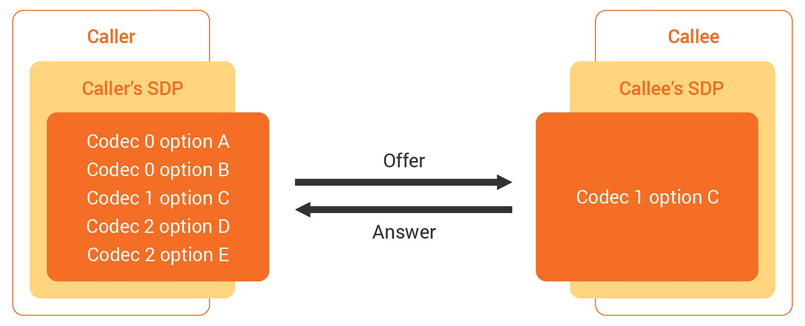
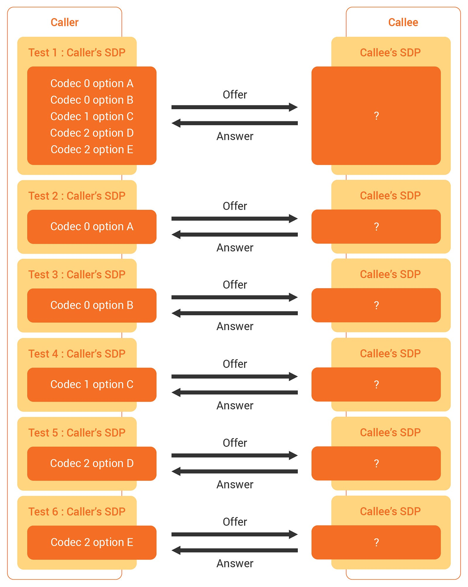
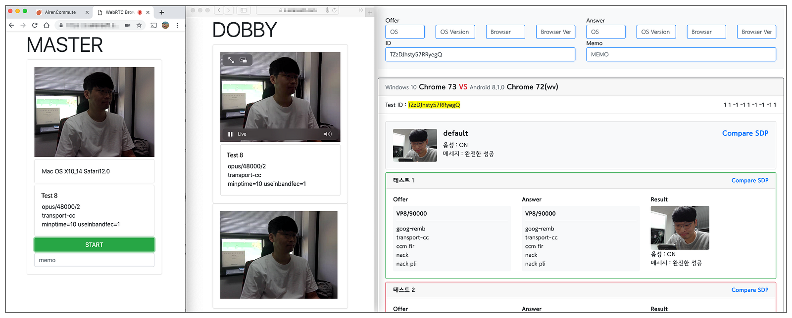
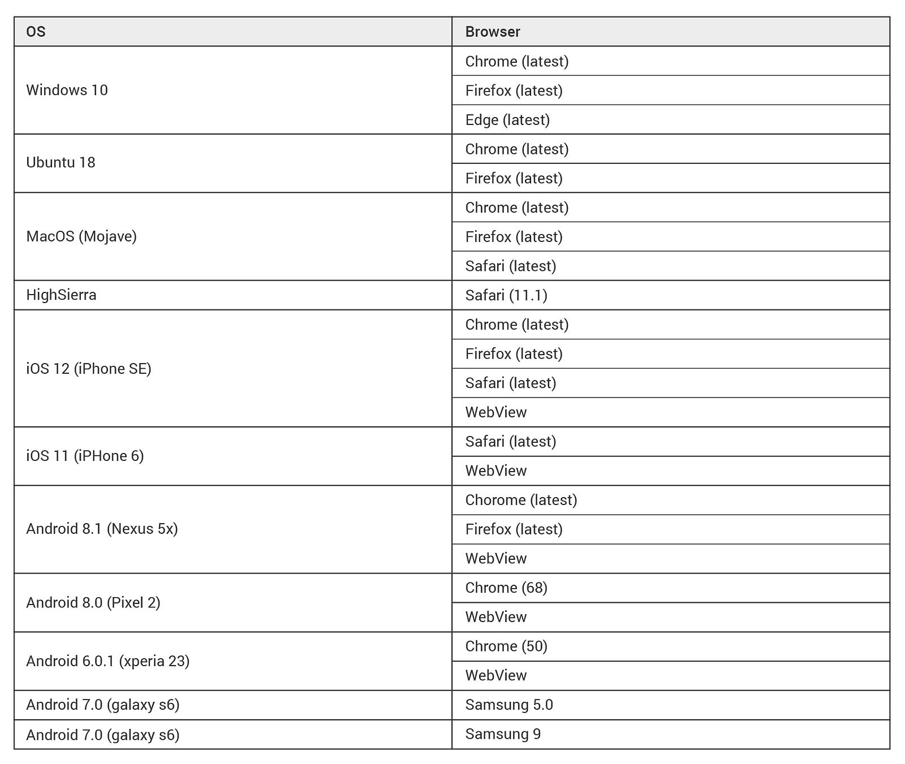
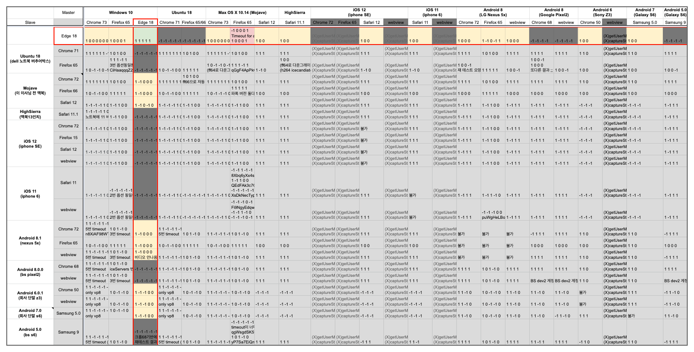
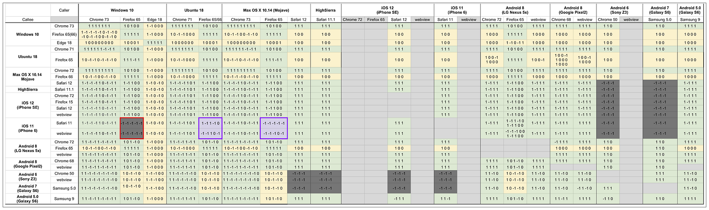

We are working [OvenMediaEngine (OME)](https://github.com/AirenSoft/OvenMediaEngine), an open-source project that streams by a latency of less than 1 second and is available using WebRTC protocol. Furthermore, in the OME project, we intend to develop and introduce a [P2P Delivery](https://www.ovenmediaengine.com/labs) function that can save system resources and budget during streaming.

{/* truncate */}

However, we sometimes receive inquiries from our open-source users that they cannot stream with WebRTC. The problem of being unable to play with WebRTC in our Sub-Second Latency Streaming project has the possibility of causing significant issues soon, even though there is an alternative protocol right now.

Most web browsers such as Chrome, Safari, Firefox, and Edge have already announced that they support WebRTC, so we have trusted. Nevertheless, we were curious how browsers over a long distance can exchange data. Also, we analyzed the reasons for differences between cases of streaming smoothly and cases of not. We did for the community and us.

- *We used the devices for the test are *[*AirenSoft*](https://airensoft.com/)*, *[*SK Open lab*](https://developers.sktelecom.com/about/openlab/)*, and *[*BrowserStack*](https://www.browserstack.com/)*.*

## Conclusion

**Streaming sent out from Windows 10 Edge (18) cannot be played on the public network.**

The Edge browser cannot make a candidate of public IP from STUN.

**Safari cannot play a stream on a private network.**

Safari does not create a candidate of local IP. That’s why it cannot play the stream from other peers in the same private network.

Safari should secure the authority in a capture device to create a local candidate for security reasons. Moreover, if you want to test in Safari on a desktop, you need to select “Disable ICE Candidate Restrictions.” in the menu of [Develop] → [WebRTC] and reload the relevant page.

**Safari and Android Chrome (50) are not compatible with each other.**

Literally, Safari and Android Chrome(50) can’t play each other’s stream.

## Testing Process

WebRTC needs a process of signaling to adjust communication among browsers. In this process, a caller uses **Offer Session Description Protocol** (SDP), and a callee uses **Answer SDP** to exchange each other’s media information.

We created each SDP using a lot of codec information that SDP includes and tested it to confirm which options specific browsers’ codec Offer, which options they Answer, and whether the stream is usually played.

This picture briefly expresses the exchange process between Offer SDP and Answer SDP.

**Signaling is processed in the following way**: When Caller offers by containing various types of the codec in SDP, Callee answers playable codec.

This figure was made to show you the exchange process that we organized for the test.

**We tested the following**:

1. *Extract all codecs and option information existing internally by dissembling Offer SDP.*
2. *Create a new Offer SDP that has each codec. (Test 2 to 6).*
3. *Execute WebRTC Signaling by crossing the original Offer SDP (Test 1) and multiple newly created Offer SDPs (Test 2 to 6) on each browser.*
4. *Store Offer SDP, Answer SDP, each browser’s user agent, and whether streaming succeeds or fails as data.*

Cross-test in the browsers of Caller and Callee. And the test result is stored in our database.

This test is a primary step and is processed based on the version used by most people. However, we promise to test all OS and browsers possible by investing more time and effort in our project.

- ***Windows****: the most used version.*
- ***macOS****: the most used version, and Safari 11.*
- ***Ubuntu****: the most used version.*
- ***Android****: the most used version and the minimum version that supports WebRTC.*
- ***iOS****: the most used version, and Safari 11.*
- ***Reference****: *[*StatCounter*](http://gs.statcounter.com/)* (the latest: as of 2019–03–25).*

When the test is done in the same condition, the results can sometimes differ. For example, some streams played a few seconds ago but cannot stream suddenly. In addition, certain streams do not play unless it is a specific codec. These phenomena frequently happened in Windows 10 Edge and Safari.

We thought these phenomena were the stability problems of WebRTC that uses UDP, and later the results became stable as we used the **TURN server**. However, not everyone can use a stable TURN server in the WebRTC service environment, so these results do not indicate 100% stability. Therefore, we decided to analyze the causes further.

### #01. STUN issue in Windows Edge browser

We checked the STUN problem in the Windows Edge browser by accessing [*The trickle ICE functionality in a WebRTC implementation*](https://webrtc.github.io/samples/src/content/peerconnection/trickle-ice/) in Windows 10. We found out the Edge browser was the only one that could not create a candidate of public IP through STUN. In other words, if TURN is not enabled, peers located in different networks cannot play WebRTC streams sent from the Edge.

### #02. Problems with ICE Candidate Restrictions in Safari

Regarding ICE Candidate Restrictions in Safari, Safari could not generate a candidate of private IP. It is contrary to Windows Edge. In other words, if TURN is disabled, Safari cannot play WebRTC streams transmitted by different peers in the private network.

When we first tested on Safari, this problem did not occur. Ironically, this happened as “Disable Safari ICE Candidate Restrictions.” was added to the developer option in Safari for Mojave. We thought this was a chronic problem with previous versions of Safari. However, we noticed that all versions of Safari are blocking the relevant function due to a security problem.

If you want to play a stream sent from a private network in Safari, you either need to turn on the appropriate option (Disable Safari ICE Candidate Restrictions) in the developer option of Safari or need to set permissions for the camera and microphone.

## Test Result

This record is the cross-codec test result between Caller and Callee that we have done so far. Also, the reason that the number of digits is different in each cell is codecs that each browser supports are other.

**The meaning of the numbers in each cell is as follows**:

- ***1****: Streaming success.*
- ***0****: The codec option is different, but streaming is successful.*
- ***-1****: Streaming failed.*

**The meaning of the colors in each cell is as follows**:

- ***Green****: One or more matched the codec type and option between Caller and Callee, and the streaming succeeded.*
- ***Yellow****: No matched the codec option, but the streaming succeeded.*
- ***Gray****: Streaming failed.*

We used the TURN server to solve the Edge and Safari problems mentioned above, but Safari for iOS 11 cannot play a stream transmitted from Firefox. Also, we confirmed that Safari and Chrome (50) for Android could not communicate with each other in our test.

Moreover, we will release detailed options and results for our test when the relevant data becomes more solid by repeating tests repeatedly. So please wait a little bit longer.

## Ending the first test

Lastly, we could find an answer: *When a user using Safari for iPhone becomes a client peer, why cannot stream? *However, there was no discord between codecs of different browsers, unlike our forecast. Rather, the network issues related to STUN/TURN hindered our testing, and we determined that STUN/TURN was a major cause of being unable to play stream usually in service environments with WebRTC utilized.

Therefore, if you build a separate **TURN server** and develop it by considering **Edge** and **Safari** browsers mentioned above, you will provide the streaming service with WebRTC to your customers very stable.

This is the first result we have tested for WebRTC compatibility on each browser, and it will be updated continuously. Thank you for sparing your time to read this!
