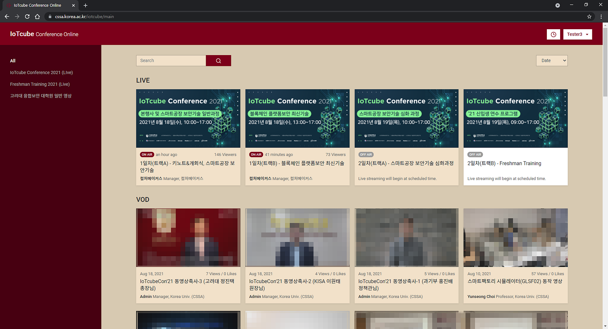
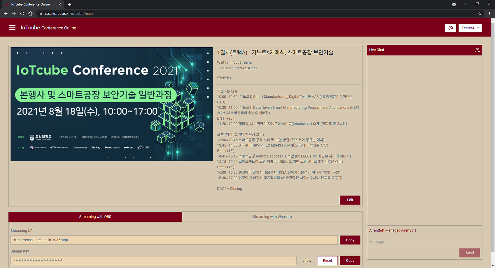
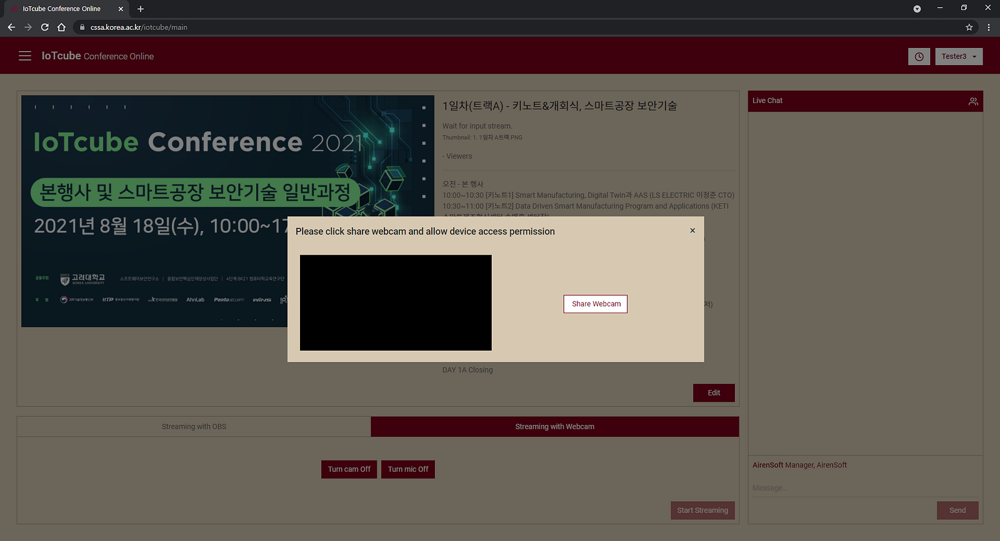
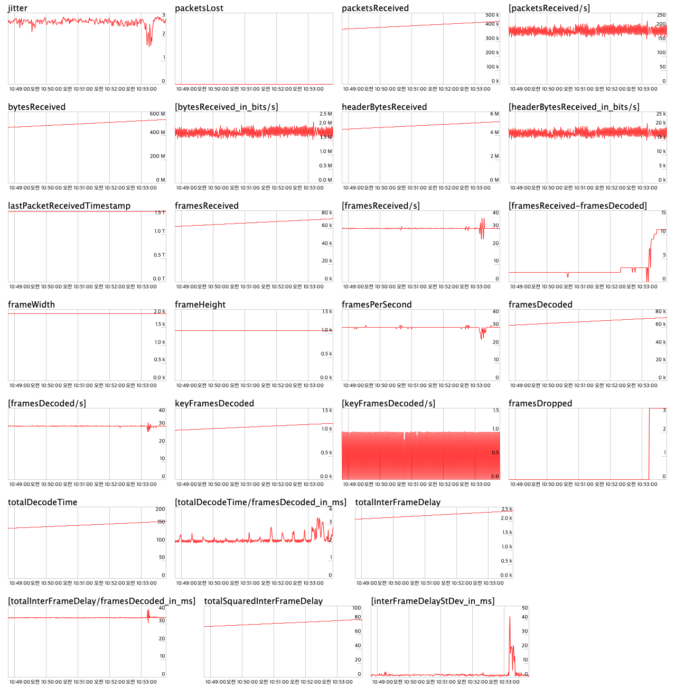
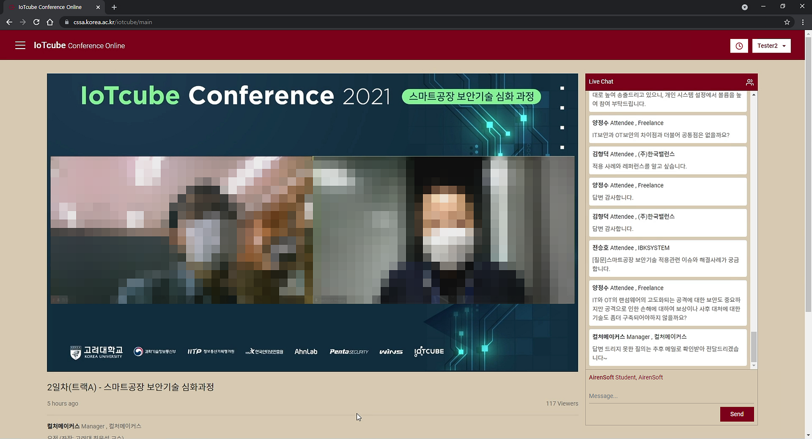

We would like to introduce you to a good use case of a successful online conference using OvenMediaEngine and OvenPlayer. This conference, held from August 18th to 19th, 2021, is called the [IoTcube Conference 2021](https://cssa.korea.ac.kr/iotcube/2021/). The IoTcube Conference is a prestigious conference in computer security in Korea and is now in its 5th year. We were honored to use our technology at this conference.

{/* truncate */}

The conference organizer’s requirements could be solved very simply with** **[OvenMediaEngine](https://github.com/AirenSoft/OvenMediaEngine) (OME). They wanted to stream with sub-second latency because of smooth communication between presenters and attendees during live streaming. We applied OME as the stream server and OvenPlayer as the player to support a successful conference.

Explain in more detail, we made a basic sign-up and sign-in function and provided a content-focused layout using Korea University’s signature colors.

This image is the first main screen you will see after logging into the IoTcube conference.

We have set basic settings in OME: RTMP as input and WebRTC, DASH, and HLS as output. So your thinking is correct; this input method is the most basic and standard way to connect to a server using a Streaming URL and Stream Key. Like this.

This image shows a person with broadcast rights trying to broadcast in RTMP.

We also set WebRTC as input and output by applying **OvenLiveKit for Web**, which can send media stream to OvenMediaEngine’s WebRTC Provider to direct broadcasting using a webcam/microphone on the desktop rather than an encoder as OvenStreamEncoder, OBS, or XSplit. If you are interested in OvenLiveKit for Web, click [HERE](https://github.com/AirenSoft/OvenLiveKit-Web) for more information.

And we applied [OvenPlayer](https://github.com/AirenSoft/OvenPlayer), an open-source JavaScript-based WebRTC player with good synergy for OME, to the streaming settings, streaming viewing, and VOD viewing screens.

This image shows a person with broadcast rights trying to broadcast in WebRTC.

We knew about 400 people registered for this conference, but OME can work in various server environments. So the performance of OME will depend on variables such as the hardware/network performance of the server and input video quality, and encoding profile. Therefore, in the conference preparation stage, we tested whether it could accommodate up to 500 people simultaneously in a configuration similar to Korea University servers to ensure OME stability, and the results were stable.

However, since this conference joined presenters and attendees from countries other than Korea, we decided that the server’s performance and location could interfere with smooth conference progress, so we installed OME on AWS ([c5.4xlarge](https://aws.amazon.com/ec2/instance-types/c5)) and provided it.

This image shows that the OME used for the IoTcube conference is working reliably.

This conference was broadcast continuously for 8 hours a day at a **bitrate of 2mbps** (CBR) based on **1080p@30fps**, and the maximum number of concurrent users we counted was about 400.

We learned later that this conference was held in two studios simultaneously, and despite relying on one Wi-Fi to send continuous streams, the streaming quality and performance provided by OME were very stable.

This image shows the presenter answering attendees’ questions in near real-time after the lecture is over.

Surprisingly, this conference had a **streaming latency of 0.5 to 0.8 seconds**. Even though access from various countries such as Korea, the US, UK, and Germany, the presenter saw attendees’ chats/questions and could communicate immediately. Thus, we have experienced near real-time response possible in live streaming.

As a result, this conference with OME achieved a two-fold increase in the number of presenters and content, a four-fold increase in conference size and attendees, and stable sub-second latency streaming even while simultaneously connected to four countries.

We felt a sense of achievement in making this idea a reality. Even though I was at home, it was like sitting in the classroom listening to the professor’s lecture and discussing it, which was at the heart of this conference. And we are satisfied because we have experienced regular two-way communication using OvenMediaEngine.

Thanks for reading!
