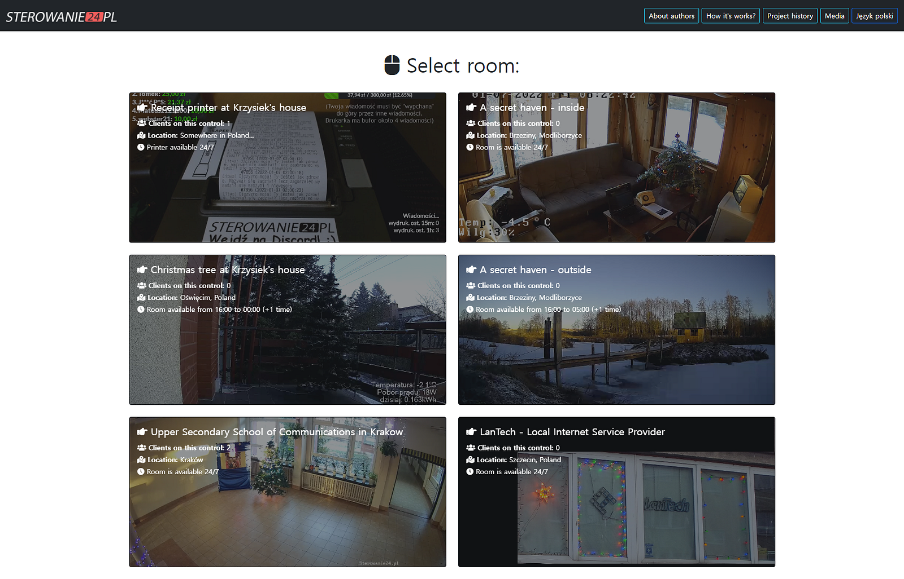
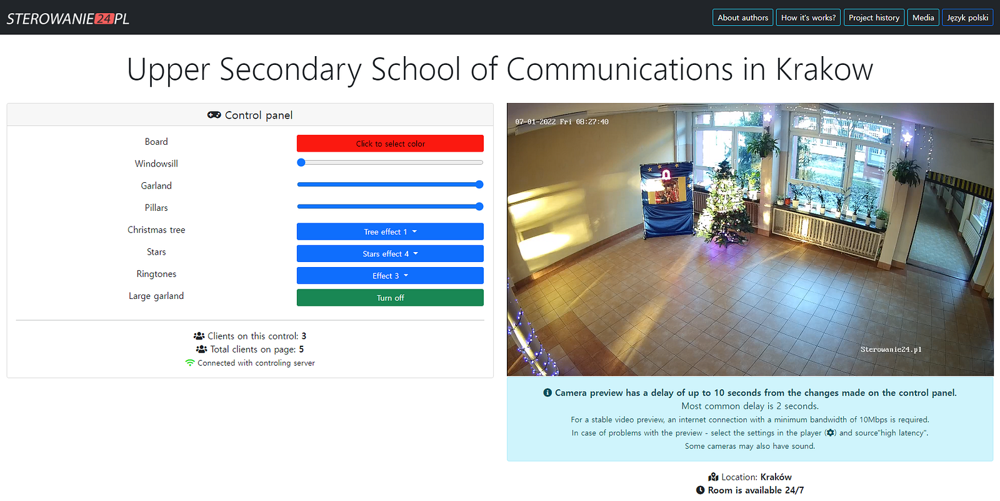
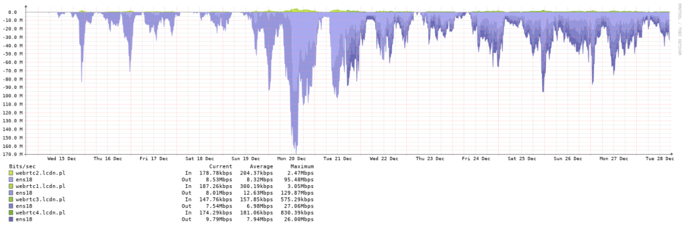
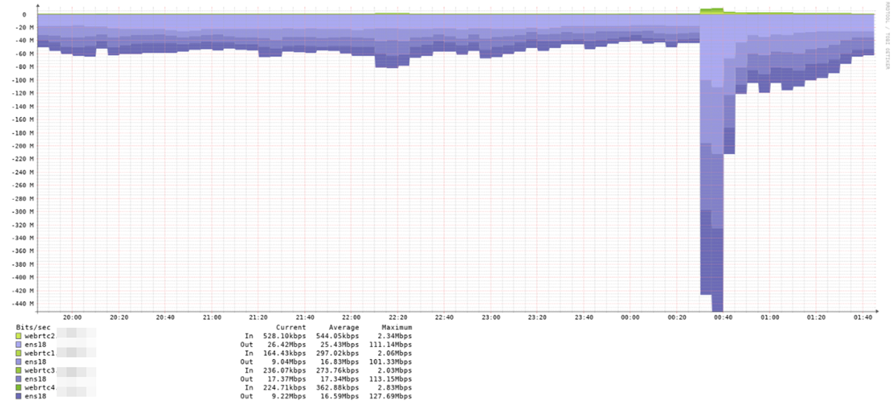

The Sterowanie24 team has created and published a web-based remote lighting control project and exhibition, and they are using OvenMediaEngine to stream it with low latency.

{/* truncate */}

Their wonderful project has been ongoing for ten years and is still developing. This is full of fun interactive elements with IP cameras. Turn on/off the lights, change the text on the signboard, make a sound, and more. You can control these elements in Poland with low latency, wherever you are. If you’re interested, click [HERE](https://smartpixels.app/) to experience low-latency interactivity.

Here we go!

### Q. What kind of project did you do?

We created a non-commercial project needing an independent web-camera streaming system. This project first started in 2012 and is being improved every year.

Our project allows you to control Christmas lighting via a website and observe effects on a preview of a video broadcast. We operate as [Sterowanie24.pl](https://sterowanie24.pl/) in Poland. This year, we also translated the site for foreign users as [Smartpixels.app](https://smartpixels.app/). And you can be admired the whole with the camera transmitting live images.

Also, our project enjoys increasing popularity year by year, translating into the number of visits to the website. We have entries from virtually all over the world.

*The interactive events they prepared were varied and amazing*

### Q. How is your project structured?

Our project can be divided into the controller, web application, and live streaming parts.

- **Controller  
- **The lights are connected to controllers (usually ESP8266 or Arduino) linked to the computer (Raspberry Pi). Colors or effects are sent to the controller in a given location via Socket.io software. Each of us has different proprietary controllers, but the whole thing is based on the client’s code running in the Node.js — JavaScript runtime.
- **Web Application  
- **The web application runs with Node.js — it generates a website with a control panel. And the user page is delivered from the nearest server through Cloudflare. Infrastructure is designed for high availability and the ability to scale quickly.
- **Live Streaming  
- **We have our own video streaming solutions. We use WebRTC and HTTP live Streaming technologies to deliver camera footage to users. As cameras, we usually use consumer surveillance IP cameras that are calibrated to ensure the highest possible image quality.

### Q. Why did you choose/use OvenMediaEngine?

We needed a free system with the lowest possible latency. Furthermore, it had to work on both mobile devices (Android and iPhone) and desktops (Windows, Linux, OS X). OvenMediaEngine enabled us to implement such a system. Currently, video delay is around two seconds due to latency generated by IP cameras and image processing. For now, receiving transmissions is done by Nginx-RTMP, transcoding via FFmpeg, but this will change in the future.

*We selected one event and adjusted the color and brightness of the lights*

## Q. What have you achieved with OvenMediaEngine?

Since the beginning of December, we have been delivering a stable web camera view to our users. In addition, OvenMediaEngine allowed us to deliver 0.5Gbps (peak) in WebRTC for 100 simultaneous users without any slowdowns. Please see the network usage chart we shared below.

*Two weeks of network usage they shared with us*

*One day of network usage, they shared with us*

### Q. What is the good/bad point of OvenMediaEngine that you think?

Our problem is a performance with a large number of users. However, we created a streaming cluster based on several servers. In addition, we have prepared a proprietary load balancer that distributes users so that the user always goes to the least loaded server.

### Q. What improvements are needed for OvenMediaEngine?

We want OvenMediaEngine to provide features like Autoscaling, WebRTC and HLS with ABR, JPG thumbnails generator with some cache, Thumbnails using MP4, RTMP Pull to save bandwidth on edge WebRTC servers, and Some load balancer on the OvenMediaEngine side. Of course, we know that some of the above lists are already included in the roadmap through discussion.

If you are more interested in this project and need more details, please click [HERE](https://www.electronics-lab.com/smartpixels-app-lighting-control-project-used-to-control-christmas-lights/) and [HERE](https://smartpixels.app/howitworks) to read articles. Sadly, their exhibition is only held in winter. So we plan to discuss their event on AirenBlog again in December 2022. So we look forward to seeing how you come back.

Once again, special thanks to [fcqpl](https://github.com/fcqpl), and thanks to you for reading our fourth use case.

Thank you!
