We carried out several tests to perform the Sub-Second Latency Streaming concept of OvenMediaEngine in a better way. First, we announced each test result that used [OBS](https://obsproject.com/) and [OvenLiveKit (GitHub)](https://github.com/OvenMediaLabs/OvenLiveKit-Web) as live encoders last June through [AirenSoft’s Twitter](https://twitter.com/AirenSoft). Then, we executed the update of OvenLiveKit, OvenMediaEngine, and OvenPlayer after collecting the weak points found from the tests.

{/* truncate */}

- *What is OvenLiveKit? It was checked streaming was available at the latency of 5 frames in the optimized environment with *a *mobile live encoder optimized for OvenMediaEngine. Though it was not open-source, we produced a sample app called *[*OvenStreamEncoder*](https://play.google.com/store/apps/details?id=com.airensoft.ovenstreamencoder.camera)* and released it in Google Play.*

We carried out multiple pieces of research to find the optimum setting capable of utilizing OvenMediaEngine better after the update. The results are as below.

## 1. Open Broadcaster Software (OBS).

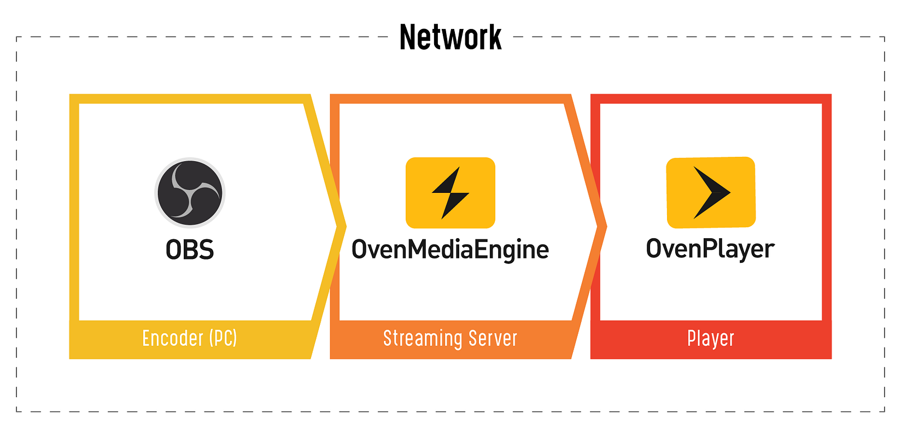

We set the optimum environment as the figure above and performed a Sub-Second Latency Streaming test using OBS. **X264** and **NVENC** were used among various encoders that OBS supports.

*** Common Setup**

- *Resolution: 1920x1080 (Full HD)*
- *Video Bitrate: 2500kbps*
- *Video Framerate: 30fps*
- *Audio Bitrate: 64kbps*
- *Audio Samplerate: 48kHz*

### a) x264

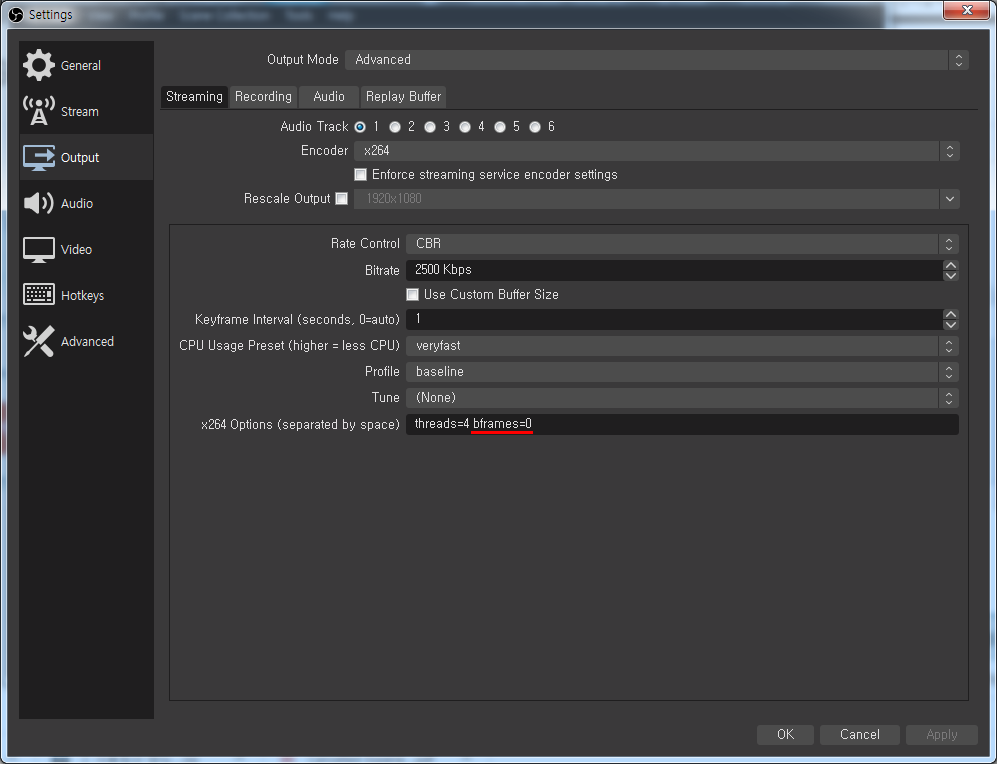

We recognized that ***bframes=0*** was effective among the settings from multiple OBS tests. If you are willing to do the test, I hope you proceed by referring to the setting image above.

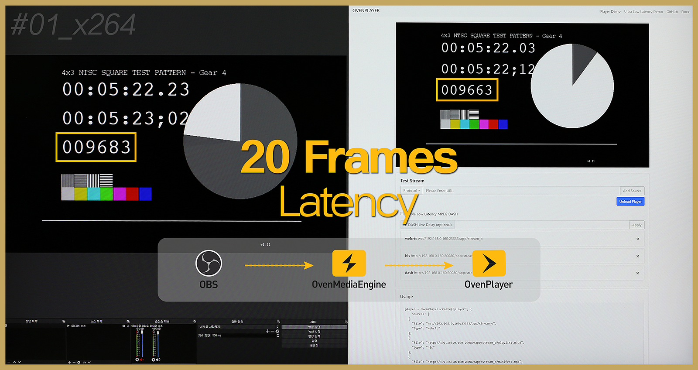

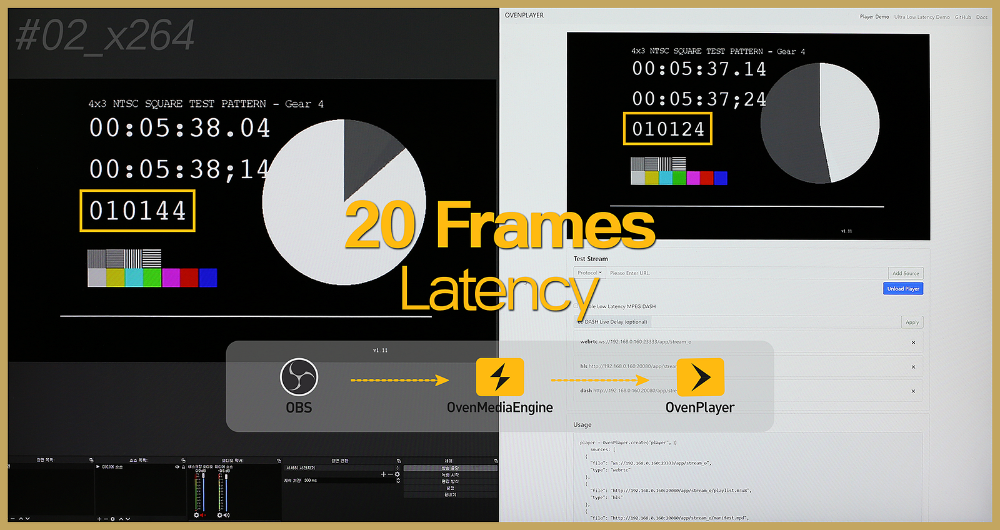

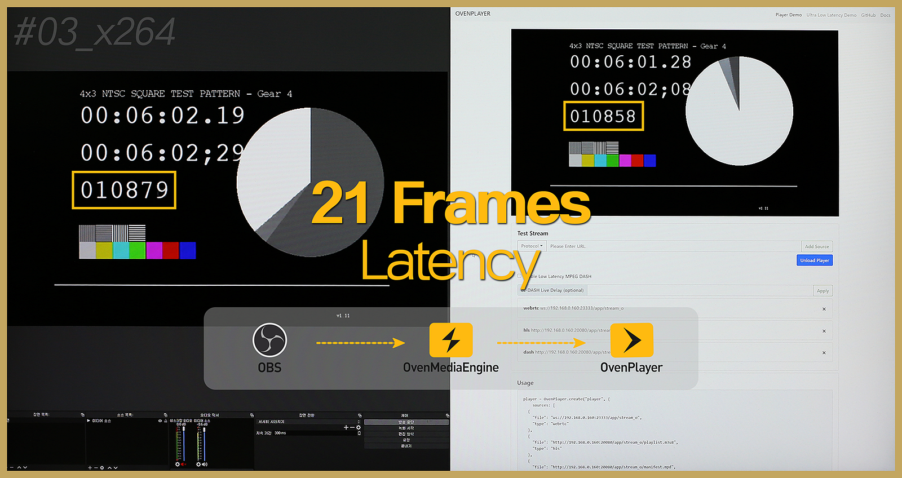

We already know that stream was available with **the latency of about 20 frames** using x264 from the [*LAST TEST*](https://twitter.com/AirenSoft/status/1276462251956776960?s=20), but we newly achieved the result that more stable streaming was feasible by the update.

### b) NVIDIA NVENC

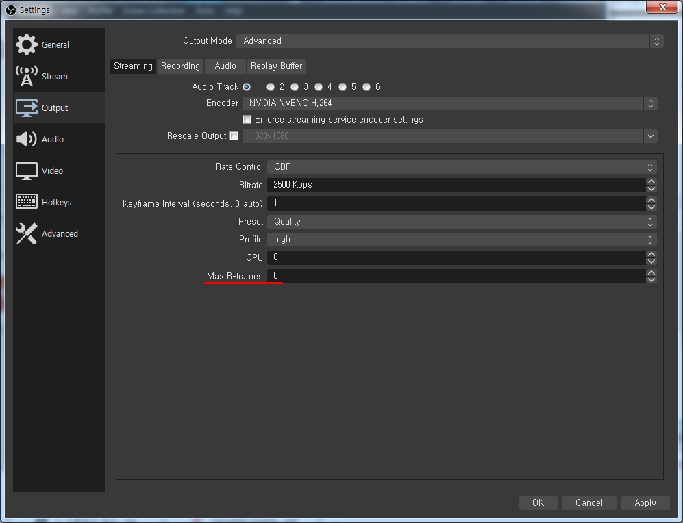

NVENC is the specific option that can be chosen only if you use the graphics card of NVIDIA. Please check the graphic card if NVENC is not found among the options. The value of “Max B-frames” must be “**0**” regarding NVENC, like the setting of x264.

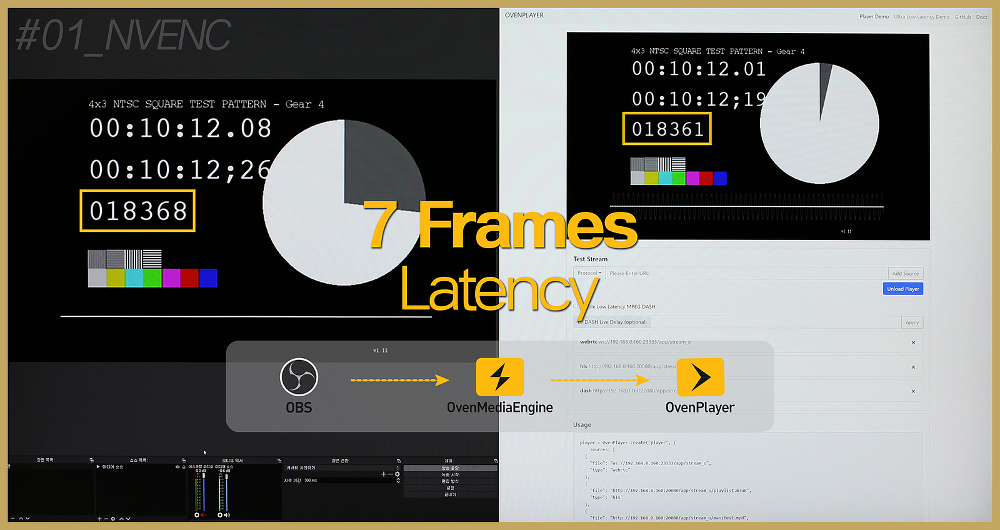

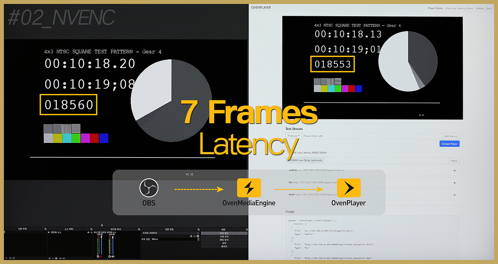

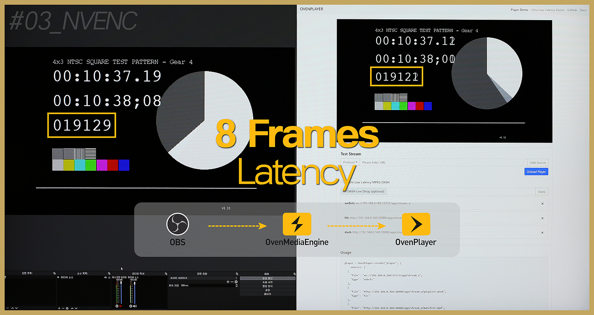

We acquired the surprising result that streaming was available with **a latency of about 7 frames** when using NVENC. If NVENC can be used on various devices, you can experience almost real-time ‘INTERACTIVE’ when combined with OvenMediaEngine.

## 2. OvenLiveKit (OvenStreamEncoder).

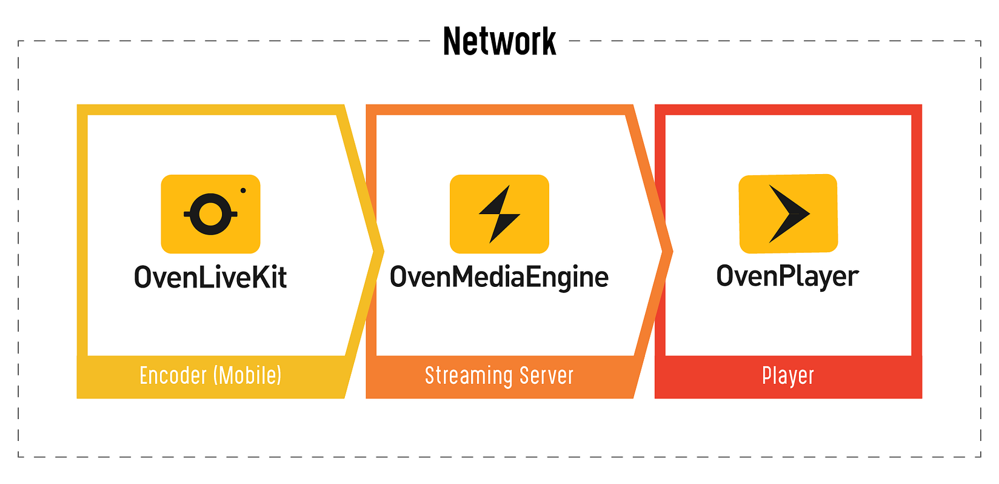

First off, I think you need an explanation of OvenLiveKit and OvenStreamEncoder.

OvenLiveKit is a transmission SDK. Anyone can easily add broadcast transmission functions to their apps using this SDK. And OvenStreamEncoder is a straightforward sample app that shows you can make and use it with OvenLiveKit.

- *If you like the performance of OvenStreamEncoder and purchase OvenLiveKit, we provide you with the SDK binary and OvenStreamEncoder source.*

Going back to the main point, we set the optimum environment like the OBS test and proceeded with the Sub-Second Latency Streaming test that used OvenLiveKit.

*** Common Setup**

- *Resolution: 1920x1080 (Full HD)*
- *Video Bitrate: 2500kbps*
- *Video Framerate: 30fps*
- *Audio Bitrate: 64kbps*
- *Audio Samplerate: 48kHz*

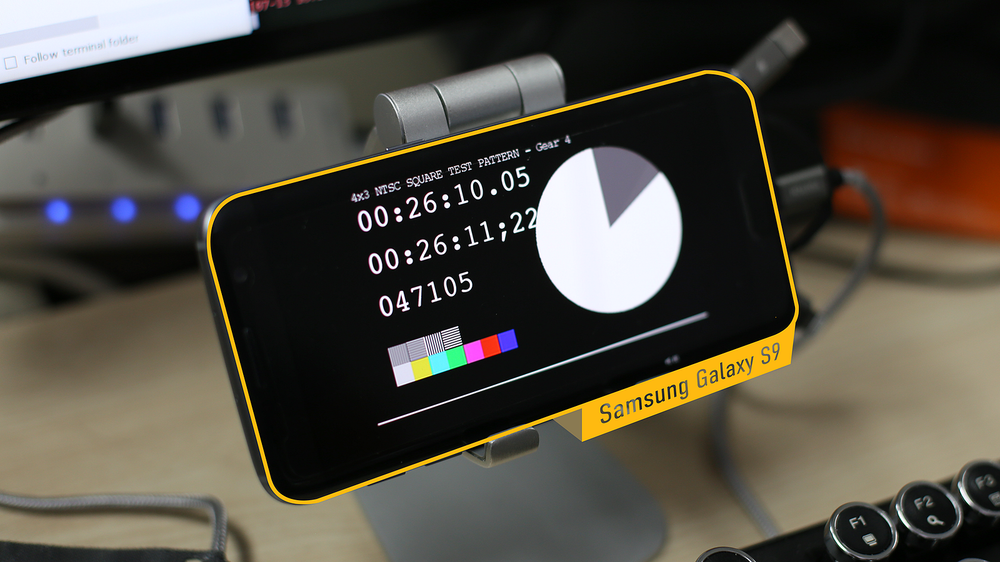

The test was done with a smartphone as OvenLiveKit was developed to support more stable Sub-Second Latency Streaming in the mobile environment. The smartphone we used was the **Samsung Galaxy S9** (launched in 2018) which has become ordinary now due to the development of technology.

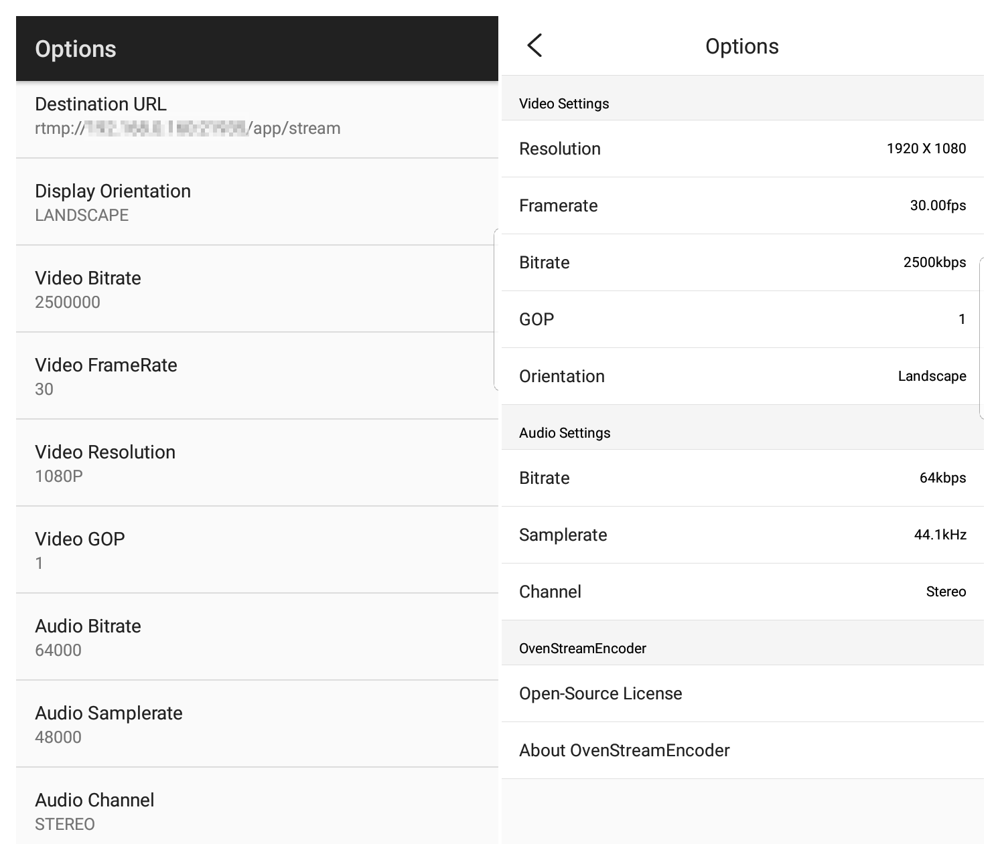

The configuration images above are the OvenStreamEncoder screen created by linking the OvenLiveKit API. Usually, you can see the image on the right. Anyway, it showed stable streaming results even at the maximum settings supported by this app.

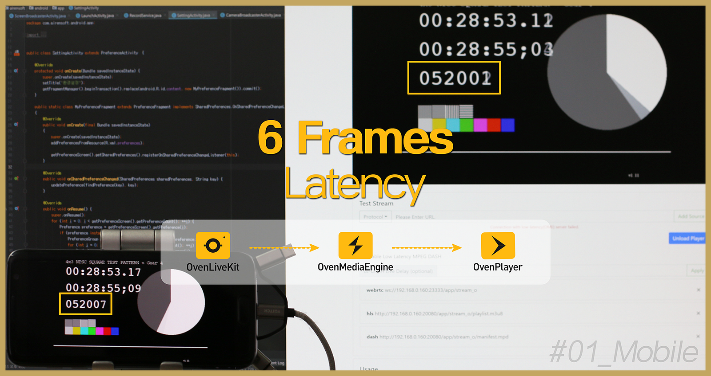

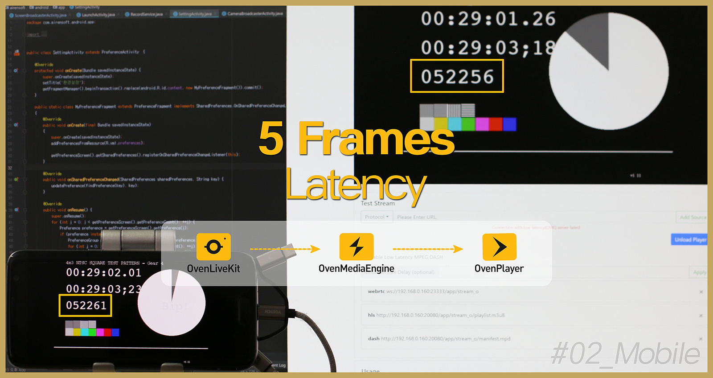

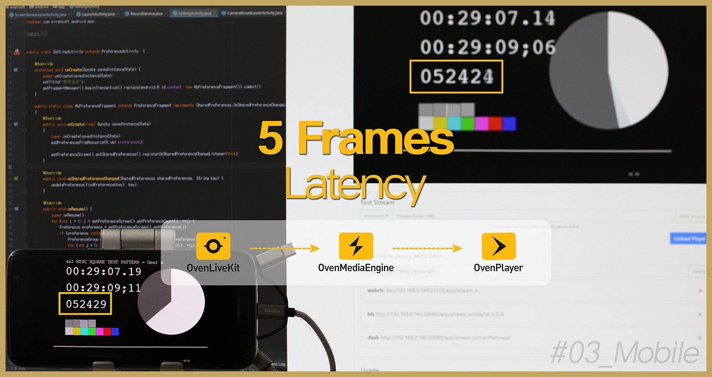

We gained the surprising result from the [LAST TEST](https://twitter.com/AirenSoft/status/1277834234523119617?s=20) that streaming was available with a latency of about 7 frames when using OvenLiveKit. However, we achieved the extraordinary impact that stable streaming was possible with **the latency of approximately 5 frames** from the test performed after the update. Furthermore, we were surprised that faster and more stable streaming was achievable on a mobile device that would be unstable compared to a desktop.

It was a good case that we could check how much **OvenLiveKit** (live encoder) and **OvenPlayer** (HTML5 player) were optimized for **OvenMediaEngine** (streaming server) from the test. We will keep improving the stability and performance of OvenMediaEngine and OvenPlayer with continuous tests that use various encoders and players like this.

If you are interested in OvenLiveKit, which enables almost real-time streaming in a mobile environment, send an email to [contact@ovenmedia.com](mailto:contact@ovenmedia.com) after using [OvenStreamEncoder](https://play.google.com/store/apps/details?id=com.airensoft.ovenstreamencoder.camera), our sample app, first.

Always, OvenMediaEngine wishes you a successful project.

Thank you!
