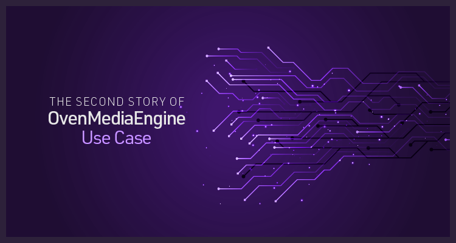

Stefano Mazzoni leveraged OME’s sub-second latency streaming technology to create the Webinar System for Religious Nonprofit Organizations. He/she shared this use case to contribute to OvenMediaEngine. Let’s read this story!

{/* truncate */}

### Q. What were you trying to do with OvenMediaEngine?

A. I’m making a free webinar system project for a religious non-profit organization. And the important webinar was successfully completed, and thank you again for offering this fantastic tool.

### Q. Why did you need OvenMediaEngine?

A. I chose OME because it was the only open-source software capable of streaming in real-time to many users (500+). My goal is to build a webinar system with two-way communication (Publisher and Viewer as a speaker) that can scale quickly.

### Q. What advantages did you find in OvenMediaEngine?

A. With OME, I could stream real-time webinars to many viewers without quality reliability downgrade (except for intermittent segmentation faults crashes). So scalability is the main strong point of OME. And I like your team’s prompt communications.

### Q. What else would you like from OvenMediaEngine?

A. OME features that I would like to have:

1. *WebRTC publisher.*
2. *Multiple combined WebRTC publishers and RTMP publishers converge in a single video stream (this would allow the host to publish via RTMP and viewers to publish via WebRTC so that all can see multiple people speaking with only one stream).*
3. *Authentication mechanisms for the Publisher and Viewer.*
4. *Possibly encrypt Publisher streams.*

Now, with the efforts of our team and feedback from Mazzoni, all of these issues have been resolved. Thank you to everyone who worked hard to advance OvenMediaEngine. Please click [HERE](https://github.com/AirenSoft/OvenMediaEngine/releases) to see the latest version of OvenMediaEngine.

Thanks for reading!
