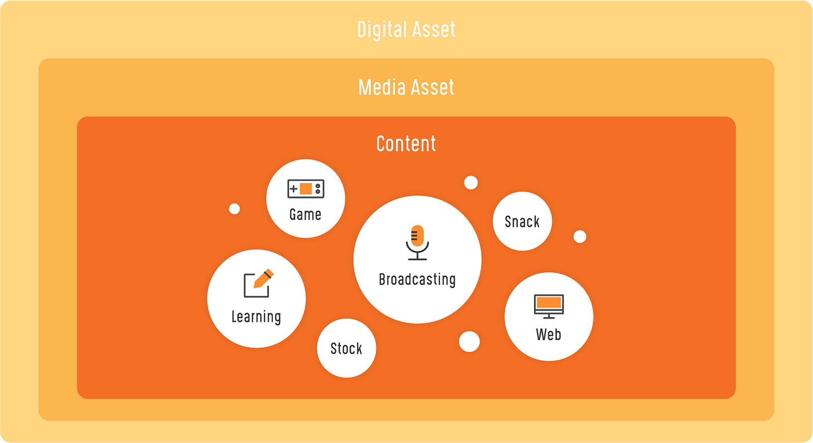

## What are Property and Asset?

Everyone has a rough idea of the media asset. But it’s hard to tell precisely, *“Hey! listen carefully, and the media asset is this!”* This is applied to me as well. So, before talking about media assets, we should know the general concept of property and assets first.

{/* truncate */}

A long time ago, people bartered exchanging an object with another with equal value to get necessary things. From this time, people set and gave discounts to objects by the degree of necessity. As people’s interest gets diversified and the value is expanded in the current era, the asset is classified as follows.

- **Realty**: Unmovable property like land, house, and building.
- **Chattel**: Movable property like money, car, and equipment.
- **Intellectual property**: Creation like design, music, and literature.

In other words, property means **economic value**, just like a house, land, and money that we own or could own. When these properties get accumulate, they become the asset.

## What are Digital and Media Assets?

In fact, before discussing media assets, we should understand digital assets more extensively. The digital asset is the digitalized asset. Currently, lots of data have been digitalized, such as:

1. *Account information, including personal information.*
2. *Computer-written or Scanned documents.*
3. *Videos, Images, and Music files made by creators.*
4. *Software development codes and Databases.*
5. *More.*

Thanks to the development and spread of digital devices, everyone can quickly produce, save, and share data anytime and anywhere, which is a natural daily life for us.

All digitalized assets are generally called digital assets. However, it includes much more than the stuff we easily get, such as *documents*, *videos*, *Images*, and m*usic files*. These are generally called content divided in detail by effective use form. For example, the contents handled on webs like blogs and internet news are the **web contents**, while the content produced/distributed for education is the **learning content**. The contents consumed in a specific frame (1:1 size, length around 30 seconds), like Instagram, are the **social contents** or **snack content**. The use of content has been much more diversified than before, which will be expanded to more types of content.

But there is a hidden trick here. The web contents are documents written in texts, while the learning contents are produced as videos to deliver information. Social contents use image or music to attract people’s attention. In other words, content cannot essentially get out of the category of video, photo, music, and document; we call these digitalized media files **media assets**.

Some people call them content assets. Of course, it’s not wrong if the results as produced content are only collected and managed. However, in the creator and creation team position, it’s impossible to mention the results of all the content in the world because all the original sources, references, and people’s ideas used for producing content are all valuable assets.

## Then, is it possible to tell all the media files as media assets?

I would love to say *Yes!* But, unfortunately, the answer is *No.* As mentioned earlier, the property needs to have economic value. Therefore, the creative content/work/production like Film, Broadcasting, Art, Music, and Literature made by creators are classified into property, which is called **intellectual property**. Thus, all the media files used for making content created by creators, not just by anyone, could be called media assets.

Are you a creator? Even if you are not, don’t worry because everyone can become a creator. At this moment, I’m also a creator writing this in the blog. Why? The consumers’ values have been diversified and will be diversified than before. And the values of all the contents are decided by consumers.

## Which media assets would be more emphasized than many media assets such as video, image, music, and text?

Of course, it’s the video. Numerous channels we are constantly participating in, such as YouTube, Vimeo, Facebook, Instagram, Twitch, and Mixer, have selected videos already because videos could include all the images, music, and text with the strength of creating/showing the next scene. In other words, videos can solve the visual limitation of images, music, and text.

Let’s talk about music as an example. When listening to music *A*, someone is reminded of heaven while others remind of hell because everyone has a different picture in his/her mind depending on the living environment. Some say it should be allowed as a part of the Experiential arts. But, most content creators want the viewers to correctly understand their intentions because that misunderstanding usually leads to harsh criticism instead of favorable comments.

Returning to the original story of music *A*, if someone creates a video by combining the image symbolizing heaven with this music, no one will remind of hell after listening to this music. This would be applied to the novel as well. All the contents accepted by to head and mind depending on the imagination of listeners/readers, could cause misunderstandings. To solve this problem, images are partially used, which is too limited. Therefore, we widely use the tool called video.

<iframe width="560" height="315" src="https://www.youtube.com/embed/j2tpVyyYP3A" title="YouTube video" frameborder="0" allow="accelerometer; autoplay; clipboard-write; encrypted-media; gyroscope; picture-in-picture" allowfullscreen></iframe>

Of course, there are genres like Experimental film intentionally create misunderstandings. However, the video is the most effective tool for delivering the intentions and messages. During web surfing, your eyes will be drawn more to the GIF meme than the JPG meme. Moreover, if the proper texts are placed together with sound effects, it could secure attention and fun.

## What are the problems with the video?

The problems with the video could be:

1. *Expertise in smooth production.*
2. *Management of multiple used files before and after production.*

To produce a video, you should know about many different things like Resolution, Aspect ratio, Image scanning (Interlace and Progressive), Bit-rate, Frame-rate, Key-frame, Buffer, Codec, Format, and more. Moreover, in this era, simply knowing about video does not mean that you can create content. To create content, you need to have a sense and knowledge of music, design, and literature. So, creators should view and feel much more things than others, and our hard-disc is filled with references. Where are all sorts of references, tutorials, completed works, and sources accumulated so far? It isn’t easy to manage the contents and media sources. People are looking for tools for centralizing and classifying media files like MAM, Cloud, and NAS. They are tools feeling like the content butler.

## Which elements should be considered to manage your precious media asset?

Depending on people’s demands, there are diverse types of MAM, Cloud, and NAS worldwide. However, we cannot put our precious media assets in unverified places for management. We don’t feel secure. So, I will tell you the elements that should be emphasized when selecting MAM, Cloud, and NAS.

First, think about the process of producing and publishing content. Then, of course, I will use video as an example, as the video is the only thing I know.

### #01. Centralizing and classifying

I just listed it in my thoughts, and it goes through considerably many processes. Of course, all of them could be done by oneself. However, in most cases, content is produced by a team composed of experts. Therefore, at this time, the most important thing is to centralize all the sources like video, image, music, and document necessary to the production of the content, and also to classify them in each type of file so that all your team members should be able to use them efficiently. Moreover, to increase usability, it would be better to have a function of leaving the record of using this content by whom and when. Also, a function of marking that indicates whether team members are using it.

### #02. Not being lost

As mentioned earlier, about dozens or hundreds of sources are needed to produce content. If the centralized shooting sources are damaged or deleted, all the time, money, effort, and plan we have invested in them will come to nothing. Therefore, to protect all the uploaded contents from damage or loss, we should check if the original file has been duplicated in the server.

### #03. Not being leaked out

For the production of content, we frequently cooperate with outside experts. In other words, they go through many people before distributing the content. At this time, if the contents are leaked for various reasons, such as mistaking the date of distribution, it will cause a considerable loss to you. Even though everyone knows the risk of leakage, it’s hard to predict who will leak them and when. Therefore, we should check if there are measures to prevent the leakage, such as a system in which outsiders can view the file only in the designated period or if the delivery of files is only allowed when complete information is blocked.

### #04. Making it to be used anytime and anywhere

Even if the contents are distributed once, the utilization or value does not go down. They could be mentioned/used by follow-up content, or some unused sources are reusable. In other words, the utilization depends on the creators. Whenever having an idea like “*It would be great to use this source for here!*”, the source could be delivered to others by finding the previously-centralized & well-classified source in a web or app. It could be roughly edited to deliver the feeling to others if necessary.

Thank you so much for reading this long writing.
