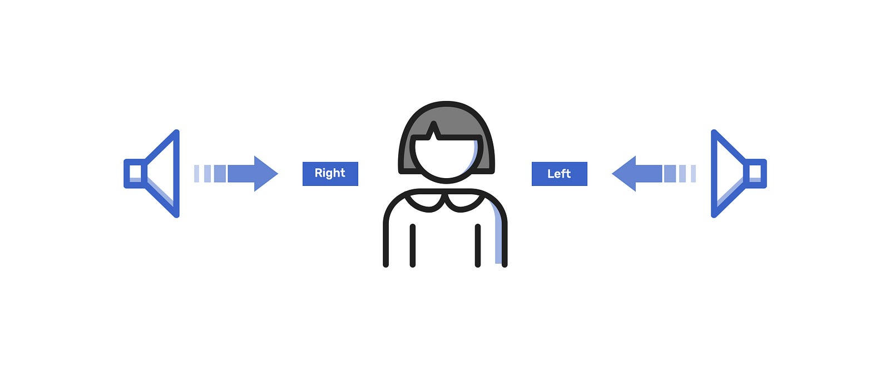
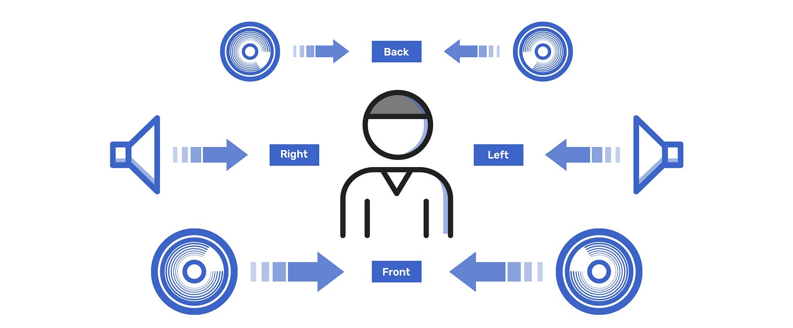
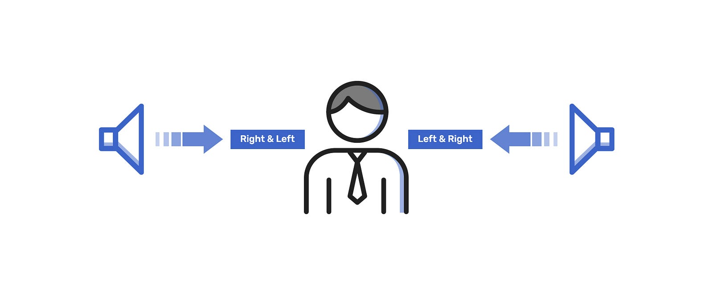
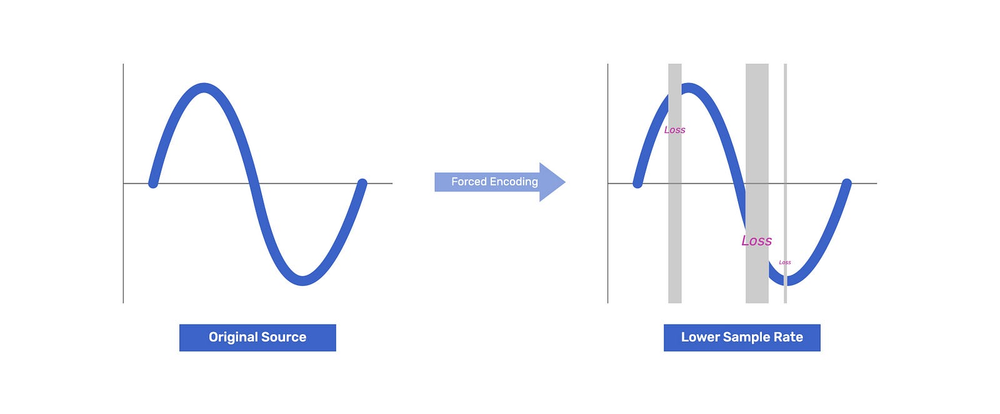
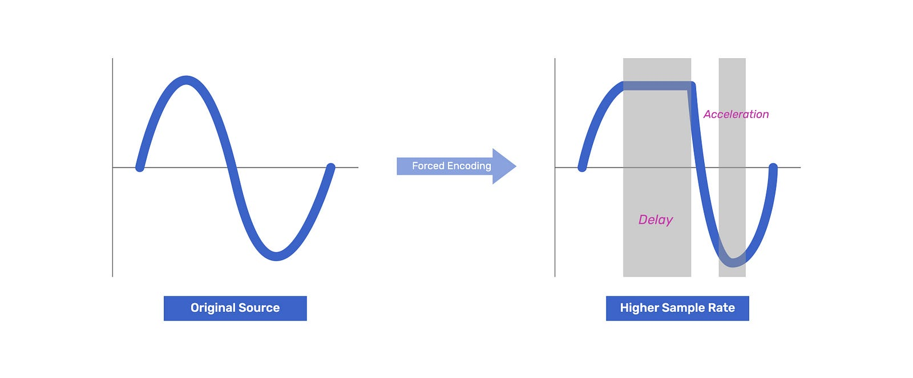

This is the 4th session of the Metadata series, and let me explain **Audio Metadata**. Note that this article is talking about the basics of audio metadata, not a reference to professional audio technology.

{/* truncate */}

## What is Audio Channel?

Have you heard audio channels such as Stereo, Surround, and Mono? These terms show how many speakers can output audio in an audio file. They mean **the number of sounds**.

### #01. Stereo

**Stereo** has two channels, allowing the left and right sounds to be distinguished for a moderate sense of space. In other words, if you use a headset or earphones, you can hear the sound from the left on the left and vice versa. You can also move the sound from left to right and right to left to make viewers recognize the direction of an object.

### #02. Surround

Rather than being called **Surround**, surround is usually referred to as the number of output enable speakers, the channels 5.1, 6, 7.1, 8, and has a larger number of sounds like a more expanded concept than stereo.

In the past, it was used to increase the immersion by dividing sounds into **high-tone**, **mid-tone**, and **low-tone** for rich sound effects of sending the sound that seems to be heard in the actual scene to the viewer.

However, most creators knew it was more useful to explain the area on the screen using **the view of the near**, **middle**, and **distant** than the variation of sound to give a sense of realism. Therefore, according to the producer's intention, it creates a more authentic sense of space by installing multiple speakers and giving your sound to convey space, mood, and feeling.

## #03. Mono

Unlike the concept of stereo or surround, **Mono** consists of only one channel, making all speakers produce the same sound regardless of whether one speaker or 100+ speakers are used. Mono is a whole system of audio channels and is the only channel that can be represented on all devices and speakers worldwide.

Because you can hear the sound in the video even if the video you’re watching is rendered to support 8-channels of audio, and your speaker can represent only 1-channel.

## Do more channels guarantee the better sound quality?

Unfortunately, more channels never guarantee better sound quality. The audio channel is suitable for expressing the sound's direction and location. Literally, you can easily understand that the source of sound comes from the left, right, behind, above, or below.

In the video, many audio channels were used to give viewers a deep contextual immersion, and advanced speaker technology was added to express even more detailed sound. That is why it is used a lot in games these days that need to be sensitive to sound. For example, there is a headset with an 8.1-channel. This headset has four small speakers on the left and four on the right, helping you understand the sound source in more detail.

## What is Sample Rate?

When processing audio in a video, you may have seen numbers like 44.1 (44,100), 48 (48,000), or 96 (96,000). These are standards that are the most commonly used in audio sample rates.

Rather than describing the Sample Rate (Samplerate, Sample-Rate) in fragments, let me help you understand the concept of how audio is recorded and output. When transmitted, all sounds create a constant vibration. How many times per second this vibration occurs is called **Frequency**, and the unit is **Hz**. Therefore, it is called 1Hz when there is one vibration per second.

### #01. Analog

Because a continuous transmission process is required to transmit sound through this frequency, a signal delivery system called **Analog** was created. However, there is a problem. Analog requires continuous delivery, but interference or jam from the outside would lead to unconditional data loss.

For example, when you want to listen to the radio, find and tune in to the frequency of the broadcaster. It is very convenient, but on the other hand, the agent often finds out the frequency of the two-way radio for wiretapping in the movie. In other words, anyone could intervene quickly and only by determining the frequency.

### #02. Digital

With the advent of the era, as computers gradually developed and most data was processed using computers, the sound as analog signals were standardized into a simple using 1 or 0, enabling large amounts of information to be transmitted or received at once. The main point is made external interference difficult and reduces data loss. This is the so-called **Digital** signaling system.

## What is Sampling (Sample)?

This analog signal, called sound, goes through the process of being converted into a digital signal on a computer called **Sample** or **Sampling**. In other words, the sample rate is the rate at which analog signals are converted to digital signals per second.

According to the **Nyquist theory**, which formulated the sampling process, when an analog signal is converted to a digital signal, the analog signal must be repeated two or more times before it can be converted into a digital signal without loss.

In other words, if all analogs are repeated twice at the same speed and converted to digital, the sound for 1 second will be converted to sound for 2 seconds. Therefore, analog must be repeated at a rate of twice or more to be converted to digital.

## Why is 44,100 Hz a Standard?

44,100 Hz or 44.1 kHz is the television broadcast systems' standard audio sample rate. The International Media Association judged that the range of 20 to 20,000 Hz that is audible to the human ear, that is, 20,000 Hz, which is the limit of **audible frequencies**, should be more than double to reduce data loss according to the Nyquist theory. Thus, 44,100 Hz, including a 4,100 Hz reserve frequency, was defined as a standard and has been widely used.

However, since music has so much missing sound data when expressed with 44,100Hz, it is often necessary to use 48,000Hz or even 96,000Hz. Therefore, many communities have proven that using 48,000Hz is the most effective sample rate in this digital age to reduce distortion and loss when producing video or music. This has become an implicit new rule.

Because if you forcibly convert the music made at 48,000Hz to a too-low sample rate and insert it into the video, you will not be able to represent all the sounds of the original, resulting in losses. This is the main cause of the plosive sound like ticking.

Conversely, suppose you convert it to a too-high sample rate and insert it into the video. In that case, you may experience more garbage data, that is, useless data between sound waves, causing the sound to be delayed or speeded up. And most of all, the file size is bigger, making it harder to share.

That is why video and music producers use 48,000Hz a lot when collaborating, which is a satisfactory level. In addition, the AES (Audio Engineering Society) recommends using 48kHz.

Even if not good enough, I try to convey all the information I know easily. Thank you very much for reading this article, and next time I will explain video bitrate.

Thank you!
