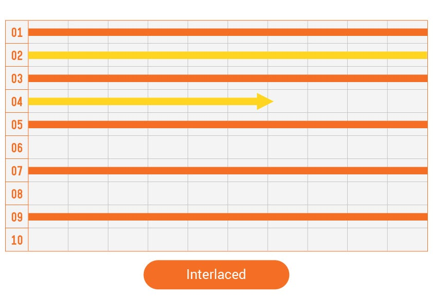

Today, we would like to talk to you about **Frame rate **(Framerate, Frame-rate), one of the factors making up a video, and it has always been used when we are **shooting**, **encoding**, **streaming**, or even **playing**. Frame-rate is a word combining two words — frame and speed.

{/* truncate */}

## What is Frame Rate?

In the history of video, it shows stopped-sequential pictures at high speed to people, So it creates the illusion that they are alive. In other words, every video shows a series of images very fast. This one still image that composes the video is called **Frame**, and the word **Rate**, which represents the speed, is combined to make this word frame rate. So the precise meaning of this word is “How many are still images per second used to show the screen?”

At frame-rate 30, A camera captures 30 images per second to produce one-second of the video. So, If this video played for 10 seconds, it is the same as having 300 frames. We use a unit called **Frames Per Second (fps)** to tell people involved in this video when shooting or playing.

This same rule applies to 60fps. The camera captures 60-times to create one second. This means it requires 60 images for one second and captures images twice as more as at 30fps. And you can feel smoother motion at 60fps, so people prefer 60fps when playing a video game or watching YouTube.

## How was the Frame rate defined?

Numerous producers have experienced trials and mistakes in creating video content such as TV programs, films, and animations and have come up with reasonable frame rates such as 12fps, 24fps, 30fps, and 60fps.

First, in the early stage of the age of silent films, it was not necessary to add sounds to a movie so a producer could determine the frame rate as he/she pleased. However, technology has evolved, and the advent of **Optical Sound** converts audio onto an image and prints it on the edges of a film, and then turns it to sound as the light penetrates.

People needed at least 24fps to take advantage of this technology, and a roll of film was cut and connected directly to another scene with scissors and glue when editing. So, they preferred an even number because an odd number cannot continue dividing. Of course, the expensive film had significantly impacted the cost of making movies, and producers have increasingly used 24fps, the minimum standard for optical sound technology. So, 24fps has become standard for creating video.

Also, the types of AC determine the frame rate for TV shows. For instance, since a **Cathode-Ray Tube(CRT)** using NTSC used an AC of 60Hz, it was proper to handle a frame rate of 60 under the frequency of the current.

However, they used the **interlaced scan method**, which sets the order of the display from top to bottom, scans odd-rows first, then even-rows to reduce flicker. In other words, the process of scanning uses two screens alternately, and it was possible to broadcast reliably even at 30fps, which is half of the 60fps. I would be organized the contents of Interlaced and Progressive and post them on [AirenBlog](https://www.airensoft.com/airenblog) later.

## Why has the Frame rate with a decimal point?

The frame rates have decimal points, such as **23.976**, **29.97**, and **59.94,** instead of 24, 30, and 60, respectively. Such frame rates were the unique result of the transition period from monochrome TV to color TV. Since all viewers could not have color TV during this period, the station sent colors to the last frame to be compatible with black and white TVs and color TVs. Therefore, the calculated 0.03Hz has been omitted from the frame rate for transmitting the color, and it has become general ever since.

However, don’t you think it would cause any inconvenience since a decimal-point frame could have a higher chance of errors while editing compared to an integer-number frame? Therefore, the producer devised the **Drop Frame** rule to round off any error caused by decimal points so that a decimal-point frame rate could operate the same as an integer-number frame rate.

We have focused on the frame rate topic, so I will wrap it up now. Thanks for reading!
