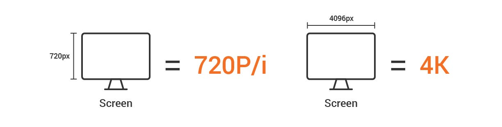
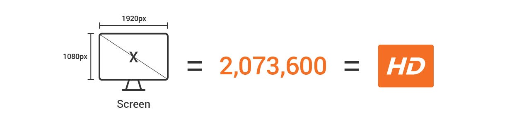
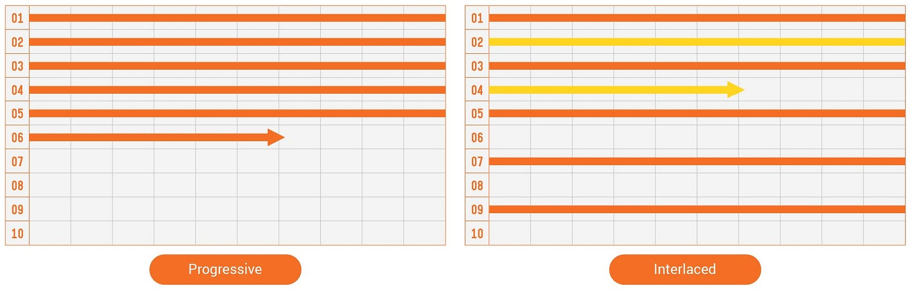

Today, we will talk about Frame Size following Frame Rate. The** Frame** is defined as one still image. The word **Size** is combined with the frame, so you can see that the phrase size means the video screen size.

{/* truncate */}

It is commonly marked as **Horizontal pixels x Vertical pixels**, also called *Resolution*. This term refers to how many pixels are on the horizontal and vertical axis of the screen. And frame size is classified as **Analog** and **Digital** depending on the TV scanning method. I will talk more in detail below.

### #01. Analog

First, in analog, it uses the scanning method that arranges horizontal lines vertically, and it is called either Height or Vertical standard; it is generally expressed as 480P, 720P, 1080P or 480i, 720i, 1080i. These numbers represent the number of pixels on the vertical axis. In other words, 480P means a display has 480 pixels on the vertical axis.

### #02. Digital

The transition from analog to the digital age became insignificant for scanning methods because High-resolution standards such as 2K, 4K, and 8K, based on either width or horizontal axis, are used. These numbers represent the numbers of pixels on the horizontal axis of a display. Like the above, 2K means the screen has about 2,000 pixels on the horizontal axis.

## What is the Picture Element (PEL)?

Of course, as the digital age changes, there are new ways of presenting the resolution with specific standards, such as SD, HD, Full HD (FHD), and Ultra HD (UHD). In general, 480P is referred to as SD, 720P as HD, 1080P as FHD, and 2K or above as UHD. Let’s talk about pixels a little bit further, and I mentioned above that the display size is expressed with the **Number of pixels on the horizontal axis **x** **the **Number of the vertical axis**.

※ Where “**x**” is a multiplication sign, not a simple notation.

For example, 1080P constitutes 1920 pixels on the horizontal axis and 1080 pixels on the vertical axis, and the multiplication of these two values ​​is the resolution. In other words, **1080P** is calculated as **2,073,600,** about 2 million pixels. So the 2 million pixels are called FHD.

## Why is Frame Size based on the scanning method?

You need to know about Scanning to understand how to define frame size. Scanning is basically *How to draw a screen?* When displayed on a TV or a monitor. In other words, it is a method of creating a screen, and there are analog scanning and digital scanning. I focus on analog scanning.

The analog scanning was marked with “**P**” or “**i**.” The P represents the Progressive scanning in which all the rows draw vertically in sequential order, and i represents the Interlaced scanning in which it describes the odd-numbered rows first and the even-numbered rows later.

### #01. Field

Since interlaced scanning has not been commonly used recently, we are more used to a progressive notations such as 720P and 1080P. However, interlaced scanning is a method widely used in the past when image transmission technologies were not developed. When the vertical length is 1080 pixels, it creates 1080 vertical rows based on these pixels. These vertical rows are called **Field**.

### #02. Scanning

As mentioned before, progressive scanning is to fill out this field from up to bottom in sequential order, while interlaced scanning is to fill out this field by one-half of the rows first and the other half in the next. At this time, the field is drawn from left to right at breakneck speed regardless of the scanning method. Hence, it is called **Left-field**, and the opposite is called **Right-field**.

Therefore, in the past TV broadcasting system, it was essential to indicate whether the image transmitted from the station was P/i or Left/Right. But now, we are in the more advanced digital age. So I think this information or history is unimportant, so you need to understand that “Oh, people used these methods in the past!”

We have selected this topic to explain the scanning method of the progressive and the interlaced, as I promised last time. So I hope this post helps.

Thank you!
