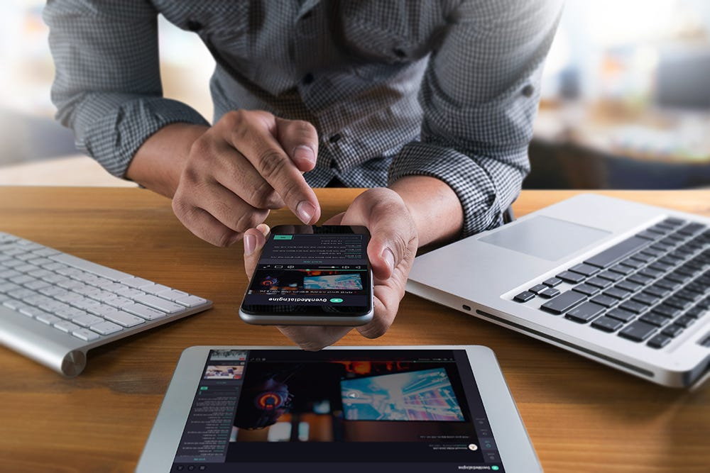
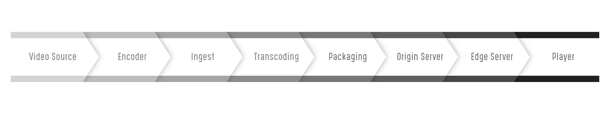
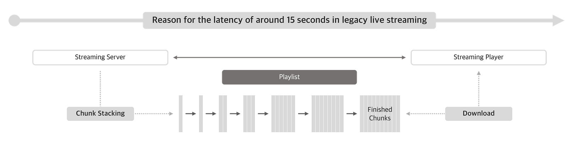
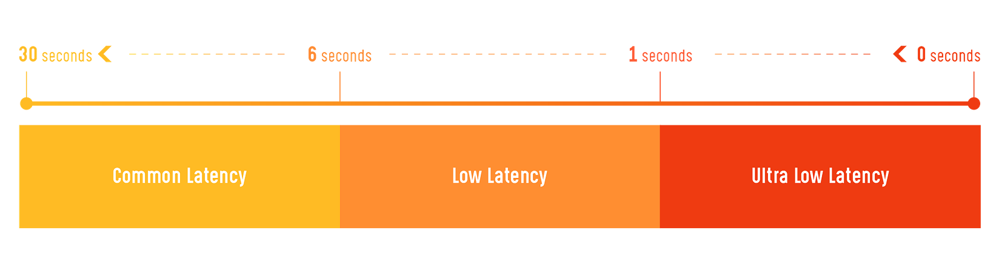
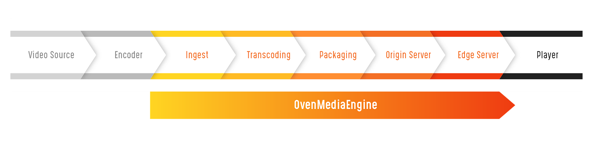
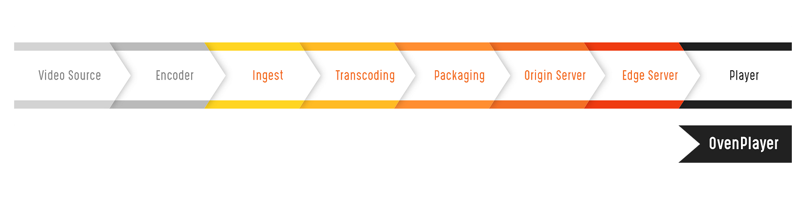

When you watch a live broadcast on the Internet, it usually takes 6 to 20 seconds to view the scenes delivered by the streamer. Even if you send a chat message now to the streamer, you can’t see the streamer’s response unless 6 to 20 seconds have elapsed. Therefore, you should keep watching for 6 to 20 seconds after sending a chat message so that you can communicate with the streamer. The chat message is in text format, sending it immediately, but the streamer responds with a video stream, so it takes 6 to 20 seconds to reach you. This situation is called **Latency**.

{/* truncate */}

Online broadcasting was a one-way broadcast from the content provider to the viewer, so there was no major inconvenience to viewers, and the 6 to 20 seconds latency was not a big deal. However, interactive broadcasting, an increasing trend these days, requires viewers to participate and intervene in broadcasting in near real-time, such as Games, Stocks, etc. If the latency of 6 to 20 seconds, as in existing broadcasting, people suffer from discomfort and will not even use it. So this service cannot keep going.

## Why does latency occur during streaming?

Commonly, Live Streaming works according to the flow. Please refer to the inserted figure.

1. *The video source is the original video, such as your camera or game screen.*
2. *The encoder encodes the original video and transmits it to the Internet. Usually, the protocol used for Encoder Output is RTMP or MPEG-TS / UDP.*
3. *The ingest section receives the video from the encoder.*
4. *The transcoding section converts the video quality by changing the codec or adjusting the bit rate and resolution.*
5. *The packaging section packages the video in a format the player can play. For example, HLS or MPEG-Dash is most often used when playing media on the web or mobile without plug-ins, so it’s usually packaged in TS format and generates TS chunks of N seconds.*
6. *Chunks that has packaged in the packaging section deliver to the Origin Server.*
7. *Go through the Edge server.*
8. *Stream in the Player.*

Video has latency little by little through many sections, but the most significant cause is the length of the chunk created in the Packaging section. Because HLS traditionally has recommended three chunks of about 10 seconds, which is a 6 to 20 seconds latency. Therefore, there is latency as long as the chunk length.

The following big reason is the buffering of devices such as Encoder, Ingest, Transcoding, or Player. Buffering is required to solve frequent transmission interruptions due to network jitter, and latency occurs as much as the buffering time. Therefore, buffering should be minimized in all sections to reduce latency.

## What is Sub-Second Latency?

Chunk-type streaming, such as HLS or MPEG-Dash, has a latency of 6 to 20 seconds or more, but reducing the chunk size while minimizing reliability can reduce latency to about 10 seconds. For this reason, major streaming service providers can support streaming with a latency of 6 to 10 seconds.

Using RTMP or the Smooth Streaming protocol instead of traditional chunks can deliver video with a latency of about 2 or 3 seconds. It’s usually called Low Latency. Moreover, delivering video with less than a second of latency is called Ultra-Low Latency (Sub-Second Latency), which results from a new category according to technological advancement.

## What does it need to use Sub-Second Latency?

Improving the protocol between the Edge and Player sections is the most important to providing Sub-Second Latency Streaming Service. Because the chunk is excessively reduced to implement Low Latency in HLS or MPEG-Dash, a traditional streaming protocol, the Player must frequently request a new chunk list to the Edge server, degrading the quality of service very much. Of course, building up the device's performance and reducing buffering in all sections mentioned above, “Why does latency occur during streaming?” should be preceded.

Recently, the media industry has regarded WebRTC and CMAF as new alternatives. Because WebRTC and CMAF enable Sub-Second Latency of less than 1 second, they are protocols that can playback without plug-ins on most modern browsers.

- WebRTC is a free, open-source project that provides real-time communication from web browsers and mobile applications standardized by W3C and IETF. It’s a P2P (Peer-to-peer) protocol created for direct communication between devices, which can also apply to streaming servers.
- Google and Akamai support CMAF (Common Media Application Format), but it’s a protocol that reconfigured the Chunk format for low latency.

## How can Sub-Second Latency Streaming be created?

Implementing protocols and various features directly for Sub-Second Latency Streaming Services isn't straightforward. Thus, AirenSoft has released [**OvenMediaEngine**](https://github.com/AirenSoft/OvenMediaEngine) (OME), a Sub-Second Latency Streaming Server with Large-Scale and High-Definition, as the Open-Source to contribute to the development of the media industry. OME supports WebRTC, RTSP, SRT, RTMP, MPEG-2 TS as input, and WebRTC, Low Latency HLS (LLHLS) as low latency output, and standard output are also possible such as HLS, MPEG-Dash, and RTMP for legacy streaming. Moreover, we are still actively developing to add various functions necessary for streaming service operation.

OME is implemented as one system from the Ingest to Edge server section. Since the Live transcoder has been included in the streaming server, it’s a streaming server that anyone can use with simple settings without a separate system.

As you can see in [**AirenSoft ‘s GitHub**](https://github.com/airensoft), OvenPlayer has been released like OME. [**OvenPlayer**](https://github.com/AirenSoft/OvenPlayer) is an HTML5 player and one of AirenSoft’s Open Source Projects. It supports WebRTC, Low Latency HLS (LLHLS), HLS, MPEG-DASH, HLS, and RTMP, and you can directly embed the player into your web page only by inserting a few lines of source code.

In the future, We will take a moment to deeply explain WebRTC or other technologies through our blog. Thank you!
