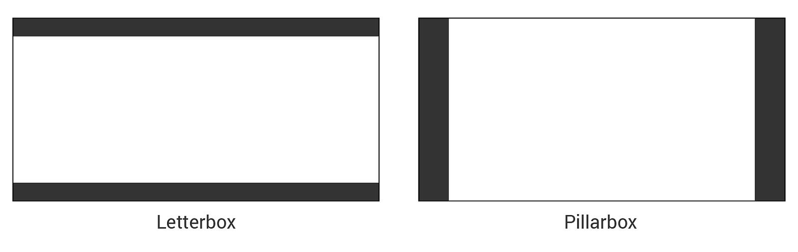
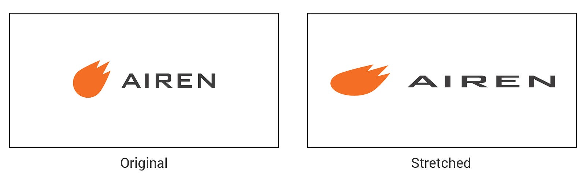
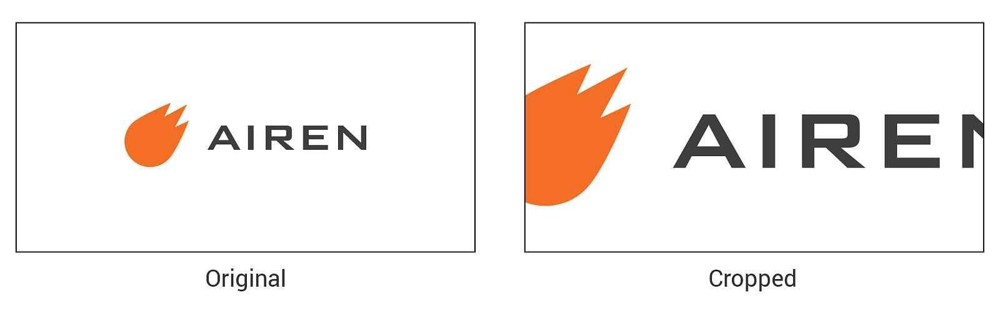
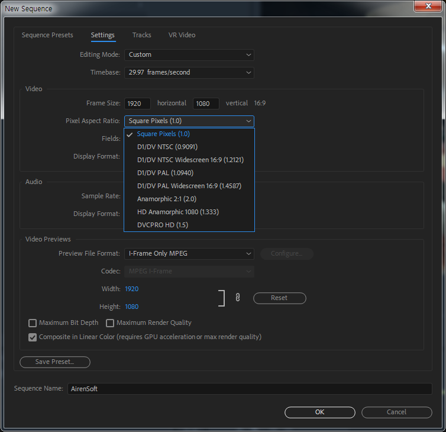
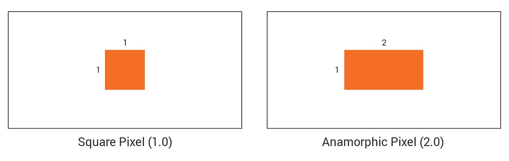

This is the third session of the Metadata series. First, let’s study the **Aspect Ratio**. Aspect Ratio means the **ratio of the screen**. However, the ratio of the screen is a different concept from Frame Size that we learned before. While the Frame Size is the length of the width and height, the Aspect Ratio is the ratio of the width and height based on the size determined by the Frame Size.

{/* truncate */}

If you are editing videos or video effects, you need to be familiar with Premiere Pro, After Effects, or Final Cut Pro. No matter what program you use, you need to set [Frame Size](https://ovenmedia.com/blog/what-is-frame-size), [Frame Rate](https://ovenmedia.com/blog/what-is-frame-rate), and **Aspect Ratio** when creating a new sequence.

## Why is the Aspect Ratio important?

Aspect Ratio is one of the parts most people overlook and neglect, but the ratio is very important on the screen.

Video has a **Letterbox**/**Pillarbox** or **Stretched**/**Cropped** because the video ratio does not match the screen size. In other words, the video looks strange, unlike your intentions.

Letterbox/Pillarbox may be better than Stretched/Cropped because people can watch your video in small sizes.

However, if it is Stretched/Cropped, everybody who expected your video will be disappointed. That’s because you ignored the Aspect Ratio.

## Let’s study Aspect Ratio options!

What programs do you use for video editing or effect? As I have experienced, many software editing videos have different names, but they can set up the Aspect Ratio. So I will explain based on Premiere Pro that I have used just now.

When you create a new sequence in Premiere Pro, there are various ratio options in the setting menu, such as Square Pixels (1.0), NTSC Wide Screen (1.2121), PAL Wide Screen (1.4587), and Anamorphic (2.0). However, we have to pay attention to digits attached to terms such as** (1.0)**, **(1.2121)**, or more.

(1.0) means the ratio of width and height of each pixel that composes the screen. The pixel is a tiny dot that comprises the screen. All videos and images consist of numerous square dots like mosaics, and we call this box Pixel. For example, if the screen size you are viewing is 1920x1080 (1080P, FHD), it is a screen made of 1,920 pixels in width and 1,080 pixels in height.

Therefore, **Square Pixels (1.0)** is a setting in which the screen consists of square boxes with a 1: 1 ratio of width to height. Another example is **Anamorphic (2.0)**. The width-to-height ratio is 2:1, so the width is longer than the screen with Square Pixels. Thus, using the (1.0) ratio option might be better to reduce your mistake.

## Should I use Square Pixel (1.0) only?

The answer to this question is *Nope!* The Aspect Ratio is adjusted based on Frame Size, so Square Pixel (1.0) is not necessarily correct all the time. For example, if you want to play a video of 16:9 viewing on a monitor 4:3 without Letterbox, you need to use Anamorphic (2.0).

Also, you want to make the video with a special ratio of 21:9, as you intend. It would be best if you had options suitable for that. In other words, there can be numerous ratio options depending on equipment, situation, and intention. Moreover, what is most important is your planning and purpose. Please remember that the Aspect Ratio is adjusted based on Frame Size.

Thank you!
