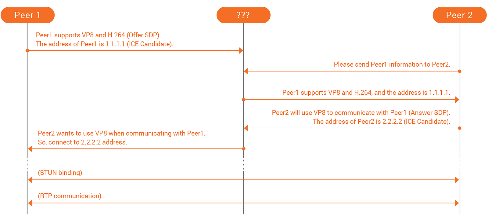
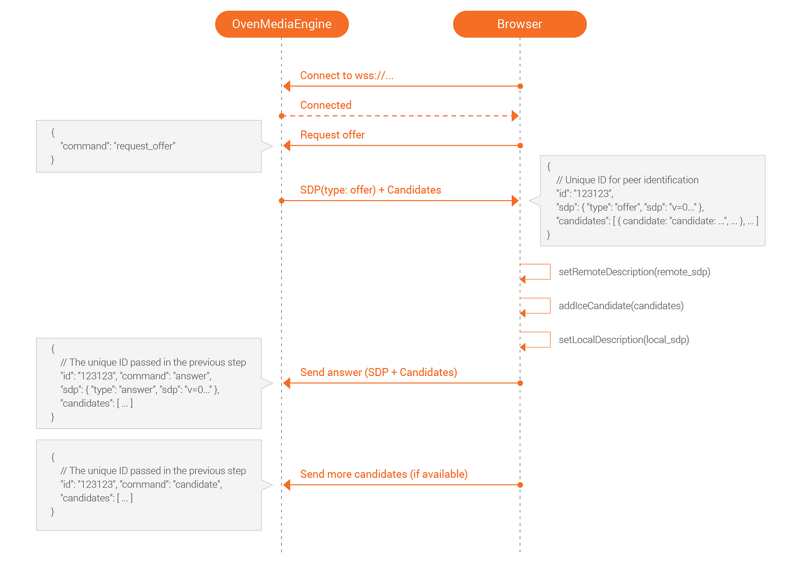
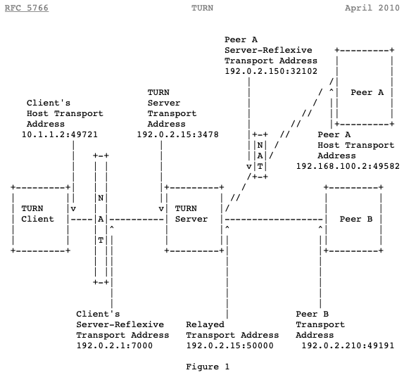

Today, we will explain Web Real-Time Communication (WebRTC) as one of the protocols to achieve and implement Sub-Second Latency Streaming.

{/* truncate */}

## What is WebRTC?

As a web communication specification suggested by World Wide Web Consortium (W3C) in 2011, WebRTC supports Peer to Peer (P2P) in sub-second latency and near real-time without any installation of separate applications like Plug-in in a web browser. So now, in 2018, if you try to implement sub-second latency on the web, WebRTC is your best choice because many modern web browsers support WebRTC.

If you need sub-second latency streaming but have yet to experience it, access [AirenSoft’s GitHub](https://github.com/AirenSoft/) now and use [**OvenMediaEngine**](https://github.com/AirenSoft/OvenMediaEngine) (OME) and [**OvenPlayer**](https://github.com/AirenSoft/OvenPlayer), our open-source projects.

## Current status of WebRTC standardization and browser support.

The API standards necessary for communication on the web through WebRTC have been specified in [*WebRTC 1.0: Real-time Communication Between Browsers*](https://www.w3.org/TR/webrtc/). The standards began to be written as Working Draft on Oct. 27, 2011 and reached the step of Candidate Recommendation through their continuous revision. If you want to know the overall status of WebRTC standardization, go to [*Web Real-Time Communication Current Status*](https://www.w3.org/standards/techs/webrtc#w3c_all). And as described earlier, a variety of the latest web browsers support WebRTC. So, if you want to find the standards implemented in main browsers, see [*Web-Platform-Tests Dashboard*](https://wpt.fyi/results/webrtc).

## What you need to know for using WebRTC.

Thanks to the WebRTC Working Group and browser makers' efforts, we can use WebRTC with JavaScript code with about 20 lines. Unfortunately, if you don’t have enough knowledge about WebRTC, it is hard to write such a short code. However, I never underestimate your ability. I had difficulty writing such a code at the beginning. For this reason, I’d like to tell you what you need to know before using WebRTC.

### #01. HTML5

If you try to use WebRTC, you need to know HTML5 well. That is because WebRTC makes use of most functions in HTML5. So, for example, if you want to transmit your video or voice input data of webcam and microphone to the other person, or if you're going to send the other person’s video/audio to your screen/speaker as output, you need to use a variety of APIs provided by HTML5 for implementation.

### #02. Signaling

What is Signaling? To judge how and where data should be sent between peers over WebRTC, there needs to be an essential prerequisite step called *Signaling*. In this step, the candidate provides information on **Session Description Protocol** (SDP) as to How data should be sent and **Interactive Connectivity Establishment** (ICE) as to Where data should be sent and exchanged. If you only use SDP, it can determine how and where to deliver the data. However, I have explained both SDP and ICE to you because modern browsers use SDP and ICE in combination. So, the below figure is a simple drawing of this process.

Here, there is one problem. Look at the above figure that the [???] part on the central-top. Do you know what that means? This is because the signaling specification has not been standardized and is not even an object. This means that it is induced to be able to implement it in your own way. In other words, it gives you the right to decide to develop it for your situation. For instance, there is nothing wrong if you exchange information through an AJAX or WebSocket server, via e-mail or telephone, or by text message. That is because there is no correct answer. Accordingly, a developer who uses WebRTC needs to think about the Signaling process.

Does something come to your mind? If so, you already have an answer. Otherwise, to give you a tip, I, as a CTO of AirenSoft, will tell you about our story briefly. Our OME includes a Signaling server based on WebSocket and has already determined our signaling specification. Therefore, a player video/audio does signaling according to the standard. Is it too simple? OvenPlayer, our player, already has its standard applied. Please see the below figure.

### #03. Session Traversal Utilities for NAT (STUN)

If you study WebRTC, the term you face most is *STUN*. STUN is the protocol for processing NAT traversal in TCP or UDP. So, it is the protocol most used in P2P. And STUN is comprised of a Server and a Client. So, if the client requests the server to send information, it is possible to obtain the following information:

- *Do I use a NAT network?*
- *What kind of NAT (Full cone/Restricted cone/Symmetric) is used if I'm in a NAT network?*
- *What is my Public IP?*
- *What information is associated with other NAT traversal?*

The information obtained by the client can be used to make such judgments as Direct communication between peers or Communication through Traversal Using Relays around NAT in the ICE of WebRTC. I will explain **Traversal Using Relays around NAT **in the next section.

If you are afraid of building a STUN server, use [*Google STUN Server*](http://stun.l.google.com/). Since many open servers exist, you don’t need to make the server independently. Of course, you can also build a STUN server for your WebRTC service.

### #04. Traversal Using Relays around NAT (TURN)

As I mentioned earlier, I will explain TURN with an example in this section. First, I assume that Peer1 is in a Public network and Peer2 is in a NAT network. According to the network environment discovery of Peer2 through STUN, it is impossible to receive data with Public IP; a type of NAT in use is Symmetric, so Peer2 fails to receive the data sent by Peer1. At this time, a TURN server can work.

Take a look at the example in RFC 5766. Then, you can understand how TURN works. Below, Figure 1 illustrates the communication between the TURN Client in a NAT network, Peer A in a different NAT, and Peer B in another network.

### #05. Transmission Type

This section will briefly explain the main types of Video and Audio transmission WebRTC. WebRTC uses a variety of protocols, including TCP/UDP and Stream Control Transmission Protocol (SCTP). Usually, video or audio is sent over UDP, and the data channel is sent over SCTP. First, let me tell you more details about Video/Audio transmission. Video/Audio data uses Real-Time Protocol (RTP) for information in WebRTC. RTP is the standard protocol for faster data transmission between multiple end-points on the internet. It is the most suitable, given that real-time transmission is essential to WebRTC. However, we generally use UDP-based RTP so that data can be lost during communication. If you don’t come up with any plan for data loss, it is impossible to play Video/Audio data well. But don’t worry about that. Fortunately, WebRTC uses various Forward Error Correction (FEC) mechanisms to minimize the damage made by data loss. For more about FEC standards, check [*WebRTC Forward Error Correction Requirements*](https://tools.ietf.org/id/draft-ietf-rtcweb-fec-08.html).

### #06. Codec

First, I will ask you a question. Let’s assume you developed a 1-to-1 video chatting service using WebRTC APIs provided by a web browser. If two users access your service with the latest web browser that supports WebRTC, is it possible to use it well?

The correct answer is *Yes!* or *No!* Your service will work well if the users have the same OS and web browser. However, your service may not work if one user has iOS Safari and the other has Android Chrome. Why does it happen? That is because iOS Safari supports H.264 only, and Android Chrome supports VP8 only. In other words, if each user's web browser supports the same Codec, the service will work with no problem.

According to the standard, it is possible to use various Codecs worldwide. However, the web browsers we generally use support several kinds of Codecs. For this reason, a few Codecs are actually used. According to my research, the web browsers we mostly use, such as Chrome, Firefox, Opera, and Safari, support either **H.264** or **VP8** as Video Codec and supports **Opus** as Audio Codec. If you want to know more about the Codec supported by your web browser, take a look at the offer SDP created by your web browser. It mostly supports H.264 or VP8 as video and Opus as audio.

Now, how can we solve the problem? First, developers need to think about it. OME solved this problem by using Live Transcoder to convert input video. For instance, if an input video is H.264, it is encoded into VP8. Therefore, the video is played with H.264 on iOS Safari and VP8 on Android Chrome.

I explained it somewhat to help you understand WebRTC. Do you still think that it is complicated? If you use [OME](https://github.com/AirenSoft/OvenMediaEngine) and [OvenPlayer](https://github.com/AirenSoft/OvenPlayer), you don’t need to understand such complex knowledge. But I think developers should understand its operation principles before development. That is the reason why I chose this topic. Next time, I will explain **Security** and **SFU/MCU** and how their main functions work in OME.

Thank you for taking the time to read this long article.
