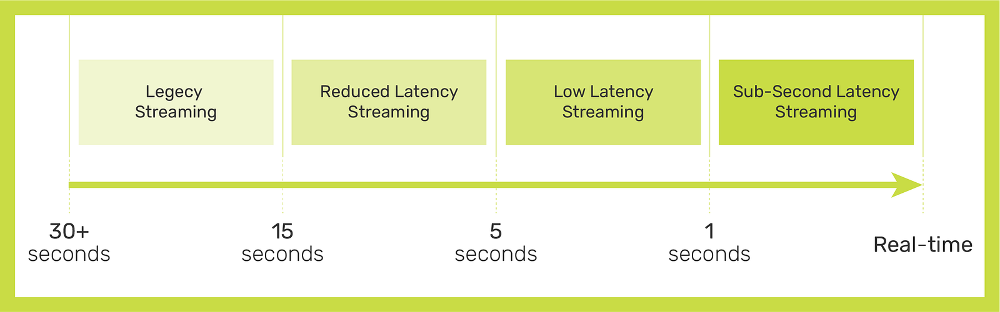
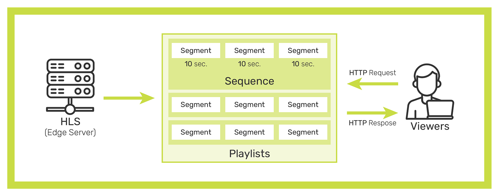
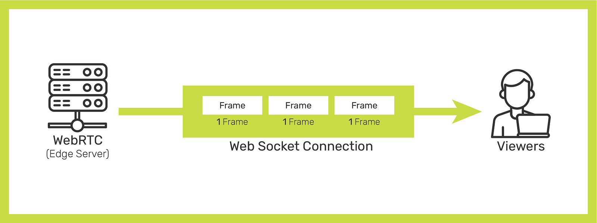
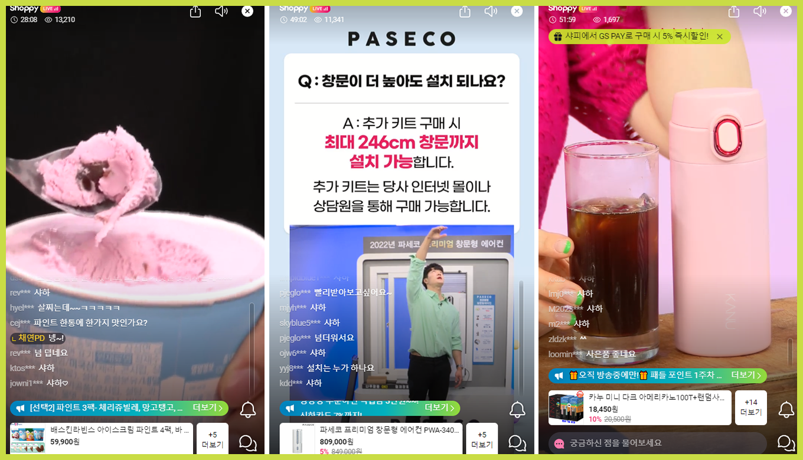

AirenSoft supplied [OvenMediaEngine](https://github.com/AirenSoft/OvenMediaEngine), a Sub-Second Latency Streaming Server with LLHLS and WebRTC, to Korea’s largest CDN company to launch a Sub-Second Latency Live Streaming CDN product.

{/* truncate */}

As a result, Korea’s No.1 live commerce company used this product to launch the first **Live Commerce Service with Sub-Second Latency** in the industry.

Most streaming services use [HLS](https://developer.apple.com/streaming/) (HTTP Live Streaming), an HTTP-based streaming protocol developed by Apple. Since HLS has a duration of 10 seconds per segment, theoretically, a latency of 30 seconds occurs.

Still, many companies optimize this and provide streaming services with a latency of about 15 seconds. In addition, of course, some services offer HLS streaming services with a latency of fewer than 6 seconds due to the development of technology in recent years.

However, they quickly decided that it was impossible to create a mobile live broadcasting service that could communicate and interact with customers in real-time with the existing HLS system.

And they applied OvenMediaEngine to change everything so that the service could operate only with WebRTC. Because OvenMediaEngine is the best alternative, using WebRTC and Low Latency HLS (LLHLS) to deliver high-definition video to hundreds of thousands of viewers in sub-second latency.

They finally launched Korea’s first sub-second latency live commerce service, and the first broadcast ended successfully. In the existing service, the host could not immediately respond to the viewer's request through chat, and the host could not engage the viewer instantly. However, in live commerce combined with OvenMediaEngine, live streaming of less than 1 second was possible reliably, and interesting broadcasts were possible, such as the host improvising the customer’s participation.

As a result, this live commerce service successfully converted from offline to online, and interactions such as **near-real-time reviews** and **communication **between hosts and customers.

Also, their development story is posted on their blog in Korean. It may be the experience you need, so we think it’s worth translating and reading them at least once. If you are interested, please click the link below.

- *#1: *[*[샤피라이브] 1편: WebRTC 기술 적용 스토리 (feat. low-latency)*](https://gsretail.tistory.com/10)
- *#2: *[*[샤피라이브] 2편: WebRTC 정복하기 (Flutter 개발자의WebRTC 개발담)*](https://gsretail.tistory.com/14)

Thanks for reading.
