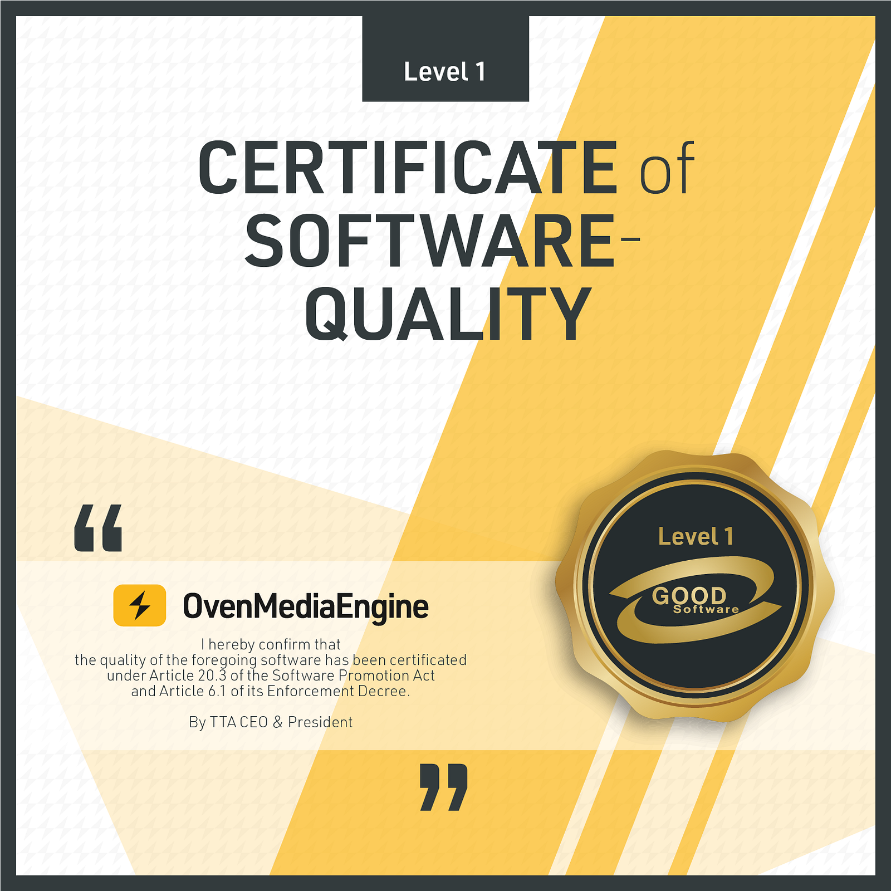
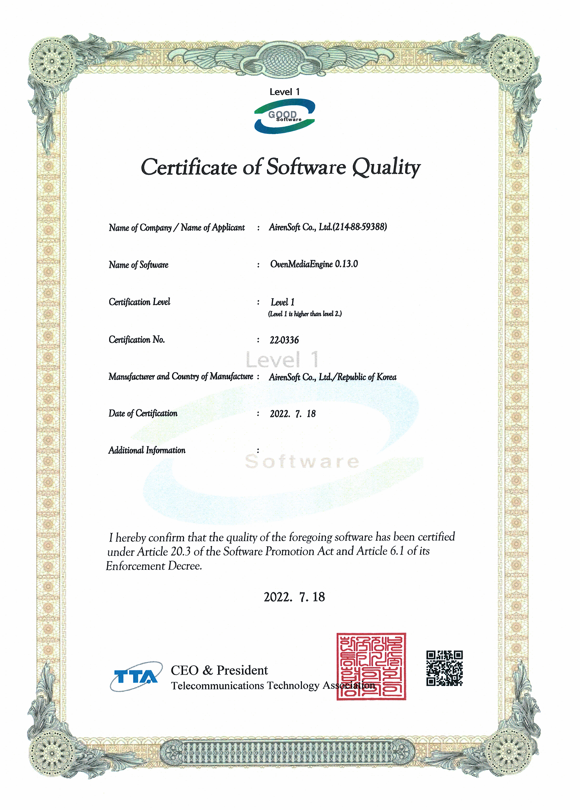

[OvenMediaEngine](https://github.com/airensoft/oOvenMediaEngine), Open-Source Sub-Second Latency Streaming Server using LLHLS and WebRTC, gets Good Software Level 1 certified by the Telecommunications Technology Association (TTA).

{/* truncate */}

The Good Software (GS) Certification began in 2001 in order to improve the quality of software products and promote the spread of high-quality products.​

To certify that it is good quality software, TTA performs systematic testing and evaluates it based on international standards, ISO/IEC 25023, 25051, and 25041.

So, [OvenMediaEngine](https://github.com/airensoft/oOvenMediaEngine) has passed all functional compatibility, performance efficiency, usability, reliability, and security based on international standards. As a result, it has been certified as the highest-quality software.

Thank you!
