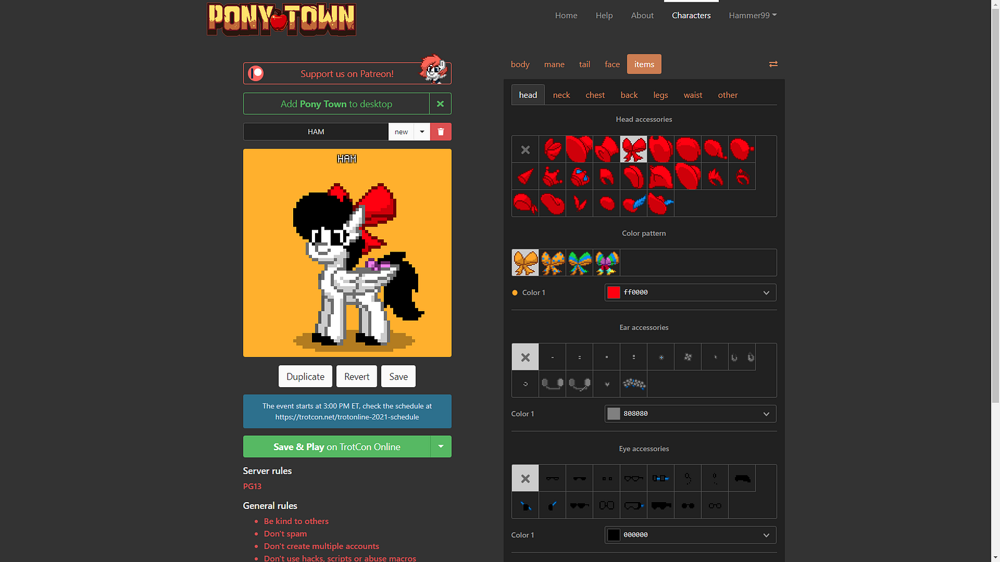
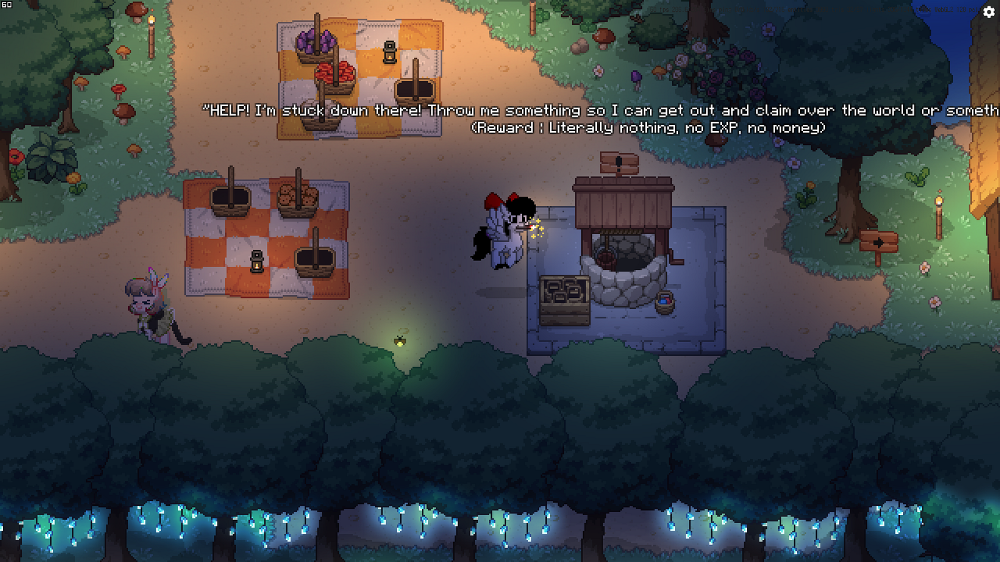
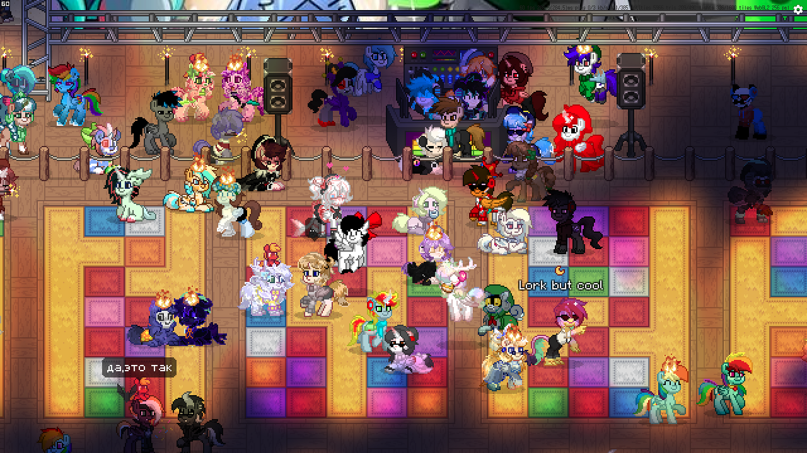
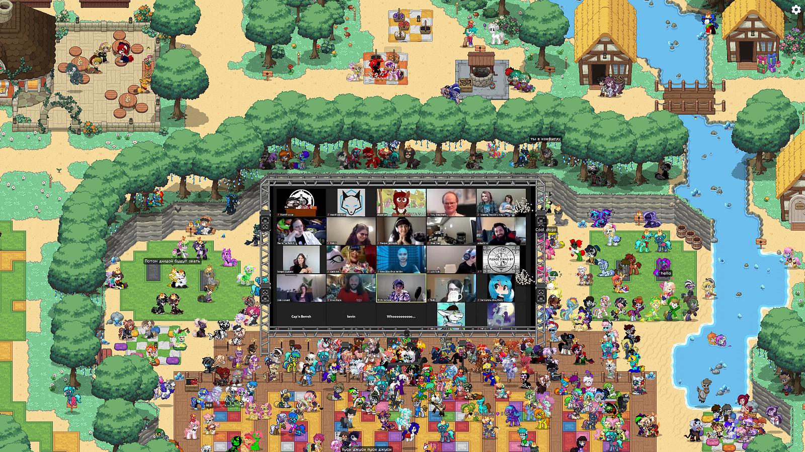
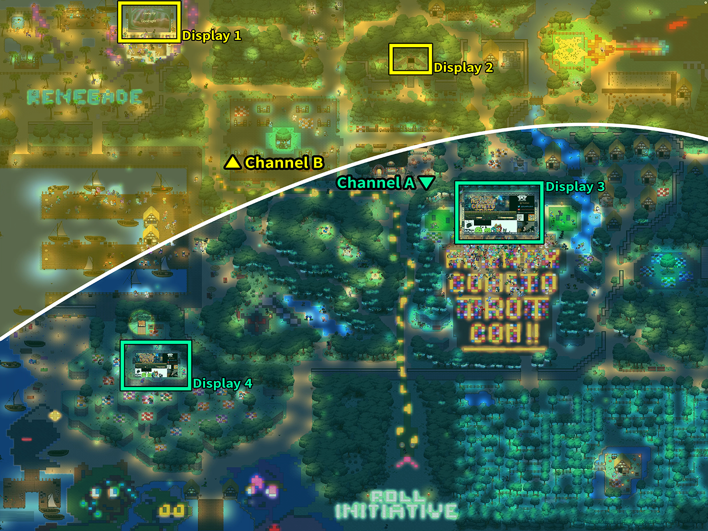
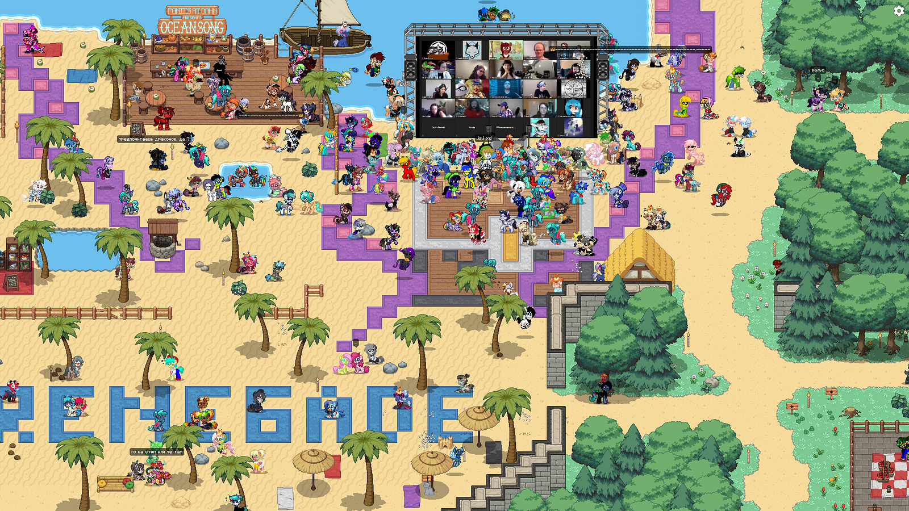

This use case is an excellent **metaverse platform** and **online conference **using Sub-Second Latency Live Streaming.

{/* truncate */}

The project name is [TrotCon](https://trotcon.net/). However, this conference was held online from July 16 to 18, 2021, as it was impossible to hold it offline due to COVID-19. Nevertheless, we felt the meeting methods and ideas they adopted were brilliant.

That’s because this online conference used [Pony Town](https://pony.town/), a massively multiplayer web game about colorful ponies. In addition, it was wise to open and use Pony Town as a separate event only during a specific period so as not to interfere with the existing Pony Town.

We made our pony and walked around every nook and cranny of this conference. This game’s map was larger than we expected, and around 2,000 pony avatars were chatting and dancing while waiting for the online event to start.

The game had an electronic display board with 4 OvenPlayers that looked like a concert or stadium. When this meeting started, OvenMediaEngine (OME) sent a video/audio source to this display with sub-second latency. Like this.

Also, in this conference, two channels were streamed simultaneously, but when a specific location in the game is crossed, the channel we participated in is switched from **#1** to **#2** or from **#2** to **#1**. So then, my character moved near the display included in the channel and could watch streaming. Even if we moved away from this display, we could still hear the audio as long as I belonged to that channel.

When we attended this conference, the maximum number of concurrent pony avatars was about 2–3 thousand, and the cumulative number of viewers was about 32,000. Still, OME showed stable streaming performance with sub-second latency for thousands of people until the event was over.

This conference was conducted by related people and experts, such as the director and voice actors/actresses, so the content was highly reliable and fun. However, what was most surprising was the near real-time communication between experts and fans who participated in this meeting via Pony Town with sub-second latency streaming using OME.

Also, through Pony Town’s vast customization system, everyone who participated was individually showing off his/her personality; we felt like we were participating in an actual conference.

As well as July 2021 TrotCon we monitored, the show continues to run. We think this is a really excellent metaverse platform with ultra-low latency streaming. It’s an honor to have OvenMediaEngine help with such a wonderful project.

And they plan and participate in conferences like this splendidly, smartly, and beautifully. You can see how they gather and enjoy themselves in the Covid-19 situation through [#1](https://twitter.com/FireStrike89/status/1418950353106710539), [#2](https://twitter.com/RainbowDerpyYaY/status/1436398411771752448), [#3](https://twitter.com/Deadshot_Pony/status/1444350232351760384), [#4](https://twitter.com/Dashy_the_Pony/status/1449461045576282113), [#5](https://twitter.com/RainbowDerpyYaY/status/1450285930351316994), [#6](https://twitter.com/Dashy_the_Pony/status/1472471833404452864), [#7](https://twitter.com/VanhooverPE/status/1479924851498438656), and more. If you want to introduce Sub-Second Latency Streaming with Metaverse like this, use [OvenMediaEngine](https://github.com/AirenSoft/OvenMediaEngine), the only **open-source** and **large-scale streaming server** with **sub-second latency**.

Thank you for reading this article.
