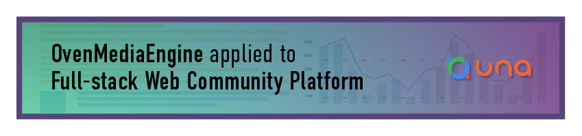
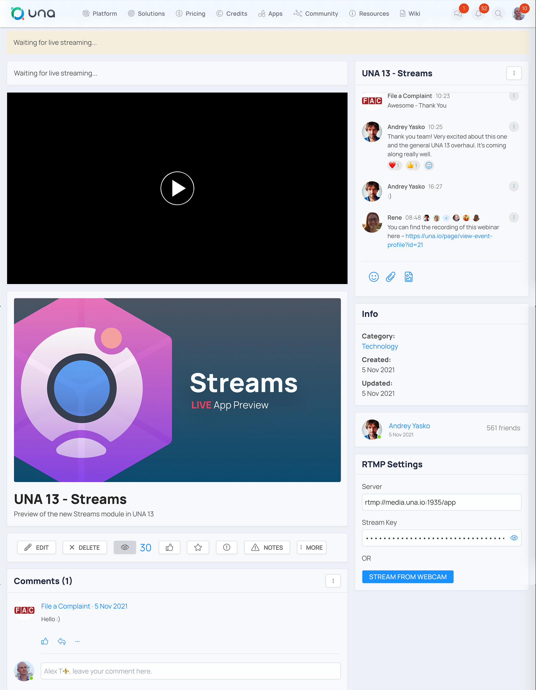
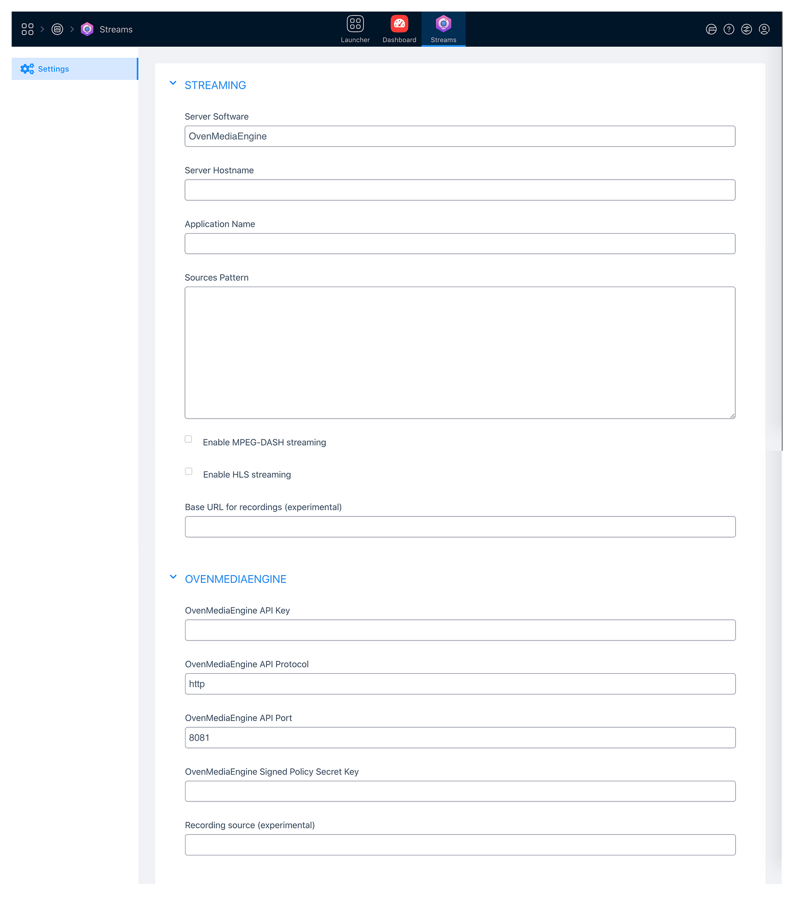

This use case will be interesting if you have or want to have a **unique social website**.

{/* truncate */}

Webmasters, developers, and agencies choose [UNA](https://una.io/), a full-stack web community platform, to build unique social websites and deliver a great community experience. This software/solution enables breakthrough scalability with a variety of modules to meet the needs of more people. Also, it uses OvenMediaEngine to provide live streaming features.

### Q. Why did the UNA team choose OvenMediaEngine?

UNA team always needed low-latency live streaming features. For example, we use [UNA Messenger](https://una.io/view-product/messenger) when live streaming to communicate with our viewers. However, **the text is delivered immediately**, but legacy live streaming has hindered communication with viewers due to latency. As a result, we chose OvenMediaEngine, which **provides sub-second latency live streaming** with WebRTC.

### Q. How is OvenMediaEngine used in UNA?

We integrated OvenMediaEngine for sub-second latency live streaming from the UNA platform, and a separate Streams module was created for this purpose. And we integrated OvenPlayer to show live streaming to end-users and used OvenMediaEngine’s API and the SignedPolicy to allow only particular users to stream.

We also used an experimental recording API to record the current stream and save it in UNA for later publishing in the Videos modules. There is a possibility of streaming from the browser or using external programs like OBS. This functionality is part of UNA 13, which is currently in the Beta testing stage, and a production release is planned in 1–2 months. As soon as we have a production release ready, we will include OvenMediaEngine as part of UNA Cloud.

It’s possible to use streaming on our infrastructure without using UNA Cloud and we created a [GUIDE](https://github.com/unaio/una/wiki/Streams) on setting up OvenMediaEngine to work with UNA.

### Q. Does OvenMediaEngine now apply to UNA?

We already used OvenMediaEngine for our streaming. It worked very well; [HERE](https://una.io/events-home) are some videos from past streaming. Only the first several webinars were created using other solutions, but all recent ones are made using OvenMediaEngine.

The UNA team plans to release a new module for [UNA](https://github.com/unaio/una) as a module for host installation and integration with [OvenMediaEngine](https://github.com/AirenSoft/OvenMediaEngine) that is automatically provisioned on UNA’s cloud servers.

Thanks for reading!
