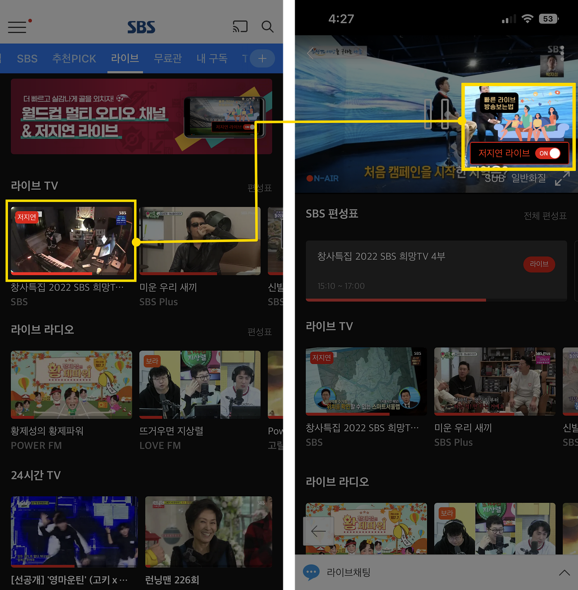

Seoul Broadcasting System (SBS), one of the leading South Korean television and radio broadcasters, introduces [OvenMediaEngine](https://github.com/AirenSoft/OvenMediaEngine) to provide Low-Latency Qatar WorldCup 2022 Live!

{/* truncate */}

SBS provided a service with a latency of about 15 seconds by using HLS as a streaming protocol. Still, applying OvenMediaEngine’s LLHLS reduced latency by more than 10 seconds, enabling real-time access to World Cup matches with minimal delay.

It is the first time in Korea to broadcast the World Cup through low-latency live streaming, and it will be one of the few cases worldwide.

During the World Cup, experience low-latency streaming using the SBS [web](https://www.sbs.co.kr/) and app. If you press Live provided in the SBS web/app and turn on the low-latency switch on the bottom right, it automatically applies to low-latency streaming mode.

Thank you!
