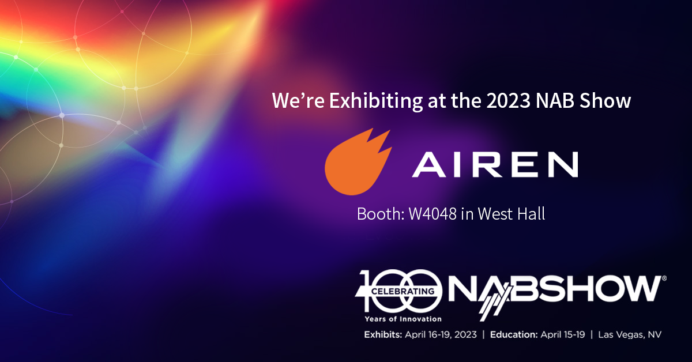

AirenSoft will exhibit at the 2023 NAB Show. This show, taking place at the Las Vegas Convention Center from April 15–19, is an unrivaled exhibition for broadcast, media, and technology.

{/* truncate */}

Our booth is located at [**W4048** in West Hall](https://nab23.mapyourshow.com/8_0/floorplan/?hallID=A&selectedBooth=W4048). If you are thinking of coming to the show, please stop by W4048.

Also, we are preparing to show you [**OvenMediaEngine**](https://github.com/AirenSoft/OvenMediaEngine), a sub-second latency streaming solution using LLHLS and WebRTC, and give you a chance to experience the [OvenMediaEngine Enterprise Demo](https://airensoft.com/enterprise.html).

Finally, if you need to get your [Exhibit Pass](https://registration.experientevent.com/ShowNAB231/Flow/ATT/?#!/registrant//CustomLogin/), register using our FREE code (LV85499) when registering.

Thank you!
