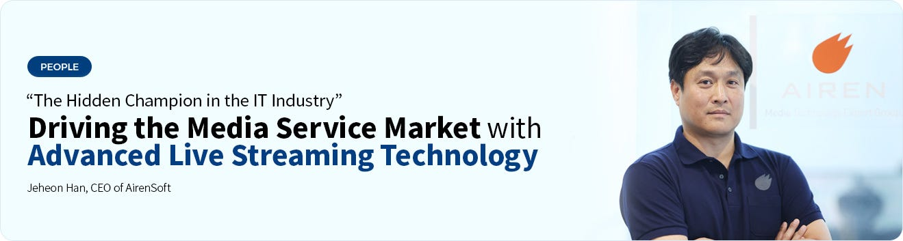
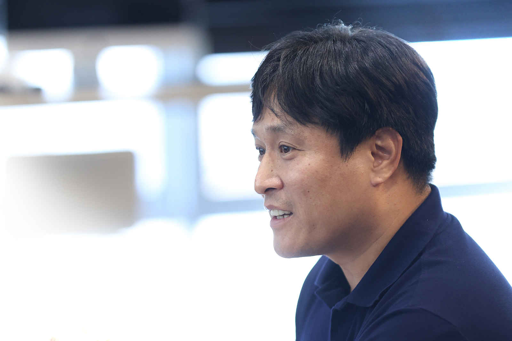
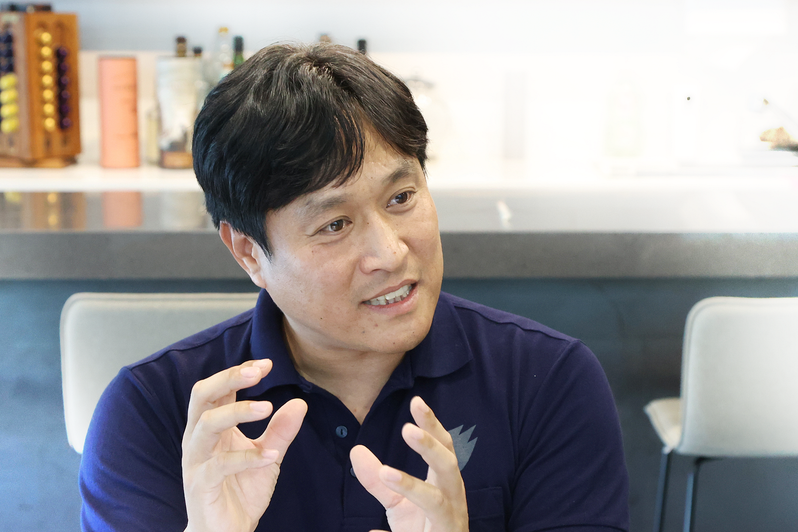
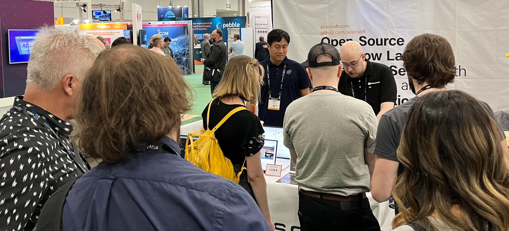
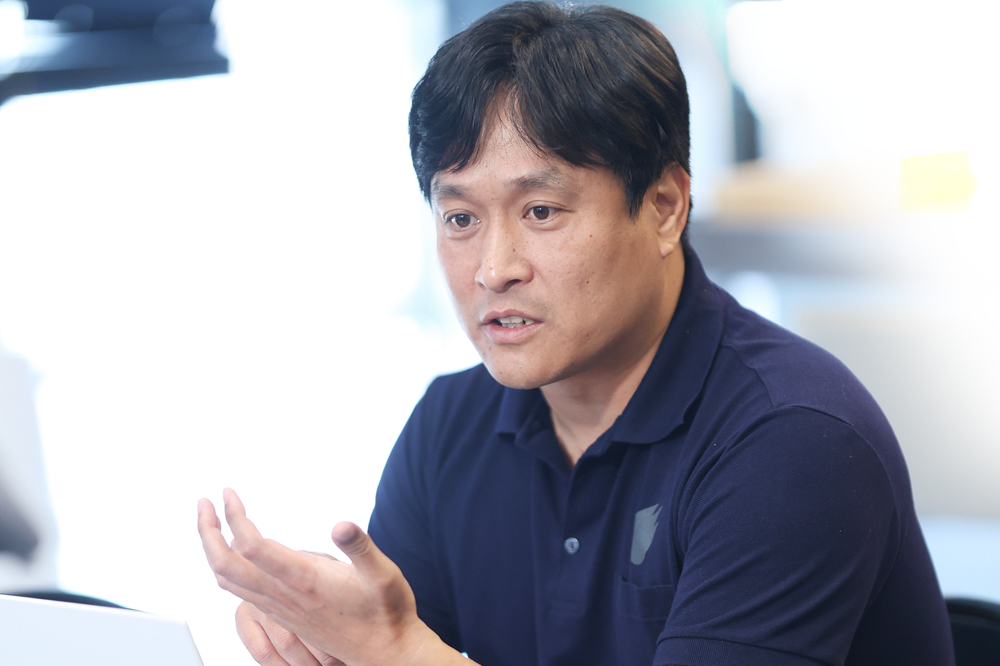
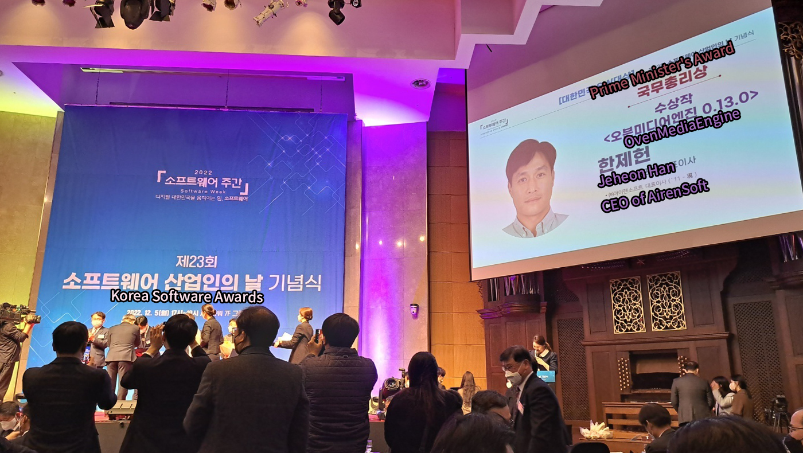

**This article is from Digital 365 (Vol. 20), and we have translated it. If you would like to view the original version, please click **[**HERE**](https://www.fkii.org/webzine/FKII_2305/people01.php)** (Korean).**

{/* truncate */}

IT technology is rapidly transforming the world. In the ever-evolving landscape of the software industry, where global companies transcend national boundaries in endless competition and failure to adapt to technological innovation and market changes leads to obsolescence, there are industry leaders striving to realize a powerful media world by continuously harnessing their potential.

[**AirenSoft**](https://ovenmedia.com/) has developed an **Open-Source Streaming Server with Sub-Second Latency Large-Scale, and High-Definition** to meet the challenges of the dynamic media ecosystem. AirenSoft aims to make complex and demanding media technology more accessible to everyone and has been developed significantly reducing latency in live streaming and enabling stable high-quality broadcasts regardless of viewer growth.

I had the opportunity to meet Jeheon Han, the CEO of AirenSoft, who leads the company with his extensive understanding and experience in streaming, along with his future insights into the field of media technology.

Q. I kindly request an introduction to the company **AirenSoft**, along with an overview of the **Sub-Second Latency** (or Ultra-Low Latency) **Large-Scale Live Streaming Server** and the **OvenMediaEngine**.

A. The company name AirenSoft derives its meaning from the first five letters of “A-I-R-E-N” representing the Air Engine used in hot air balloons. It signifies a company dedicated to researching and developing software as the core driving force behind media services.

OvenMediaEngine is an Open-Source Streaming Server that significantly reduces the latency time from the Broadcaster (or Steamer) to the Viewer to less than one second, compared to the typical delay of over eight to fifteen seconds. It has been successfully applied in notable cases such as the “**2022 FIFA World Cup Mobile Broadcast**” by SBS and the mobile live commerce platform “**Shoppy Live**” by GS Shop. With OvenMediaEngine, viewers can cheer together in real-time during mobile 2022 FIFA World Cup streaming, hearing their neighbors’ cheers simultaneously with the goal scenes. It also enables true bidirectional live broadcasting in live commerce, where hosts can instantly respond to viewers’ chat questions, resolving any product-related inquiries.

*Jeheon Han, CEO of AirenSoft, was happy to be interviewed*

Q. I’m curious about the background and motivation behind the development of these media solutions. And I would like to know about the biggest challenges the company has faced so far and the key insights or turning points that have helped overcome them.

A. Since its establishment in 2010, AirenSoft has quietly grown in the B2B market, developing various core solutions for media, including Media Players, Media Conversion Systems (Transcoder), and Online Video Platforms (OVP). Among them, the ultra-low latency live streaming solution requires high technical expertise and years of media technology experience. Recognizing the opportunity to gain a competitive edge by fully leveraging its capabilities, AirenSoft embarked on research and development in this field in 2018.

The biggest challenge the company faced was the technical issues that arose during the service development process. However, the developers have overcome these challenges through extensive experimentation and research, resolving problems, and accumulating valuable experience. Building on this experience, AirenSoft is dedicated to continuous efforts in developing even better media solutions in the future.

AirenSoft, leveraging its accumulated technical expertise in the media B2B solutions market, launched a B2C service called OvenCloud in 2015, providing personal video storage space in the cloud. The service underwent over a year of research and development and involved significant infrastructure investments. It gained significant popularity, once achieving the top position in downloads on the Google Play Store, by offering services such as converting old VHS videotapes into digital files and automatically recording gameplay screens in League of Legends (LOL) to store in the cloud. However, the service had to be discontinued due to fierce competition from global IT giants like Google, Amazon, Naver, and Baidu, who offered aggressive promotions with free storage space of up to 1TB. This experience became a crucial turning point in identifying our strengths, weaknesses, opportunities, and threats, leading us to refocus on B2B solutions based on our technical capabilities.

Q. Howard Love, an American entrepreneur, has represented the growth model of startups using the J-curve, which consists of six stages — Create, Release, Morph, Model, Scale, and Harvest. AirenSoft, founded in 2010, is currently in which stage?

A. The OvenMediaEngine is currently in the early stage of Model-Optimization. Our partners, while the primary needs for adopting OvenMediaEngine may be similar across different domains, the specific architecture, features, and performance requirements vary. It’s applied to various domains such as Cloud-based CCTV, Content Delivery Networks (CDN), Live Commerce, Sports Broadcasting, Online Gambling, and Live Black-box, and it has been continuously innovated and upgraded to offer a wide range of functionalities and options. The business model has also evolved from simple package sales to include technical support and partnership models, reflecting a shift in business strategy.

*Jeheon Han has explained more about OvenMediaEngine*

Q. I’d love to hear about your strategy and business plan for sustainable growth, and how you’ve overcome the death valleys that startups often face.

A. B2B media solutions like OvenMediaEngine often require fine-tuning and dedicated support to optimize their performance for each specific website or platform they are required to and applied to, so offering a single service alone would limit the potential for growth. To overcome this, we have made significant investments to ensure flexibility in adapting to various environments. We have established partnerships with both domestic and international platform companies, enabling us to effectively collaborate and expand our business. Additionally, to address growth limitations, we have automated and packaged our solutions based on the most common use cases, making them readily available on cloud platforms. This strategy allows us to overcome growth constraints and provide scalable and adaptable solutions to our clients.

Since its inception, AirenSoft has released various media solution products. However, OvenMediaEngine is the product that the company has focused all its capabilities on. AirenSoft did not initially adopt the typical high-risk, high-return strategy commonly associated with startups. Instead, the company chose to develop half of its resources into desired media solution products while undertaking media technology-related service projects for survival. Through accumulated experience in the media technology industry, AirenSoft identified an item with the potential for sustained growth and, after eight years, successfully developed a **sub-second latency streaming solution** that is not easily replicable. As a result, we have not experienced the valley of death typically associated with startups. However, it did take a considerable amount of time for us to reduce the proportion of service projects for the sake of the company’s survival.

Q. When I visit AirenSoft’s website, I will notice that it is primarily focused on the title OvenMediaEngine, with the company introduction divided into three stages — **Original Technology**, **Development**, and **Business**. Could you provide an explanation regarding the content featured on the website?

A. In fact, the field of streaming servers is a highly specialized area that can be challenging for even engineers to understand in detail, let alone the general public. Since our primary customers are developers and engineers in the media industry, it may be difficult for the average person to comprehend the website content easily.

The concept of OvenMediaEngine and its detailed specifications, performance, and features are explained under the category of Original Technology. Through consultations with our clients, we also engage in the task of integrating OvenMediaEngine into their existing systems, which falls under the category of Development. Additionally, our business activities involve establishing partnerships with platform companies and technology/business collaborations, which are covered under the category of Business.

Q. What is the meaning of the company logo and the significance of the orange logo color?

A. As for our company logo, it is a representation of the Air Engine used in hot air balloons and its fire. It symbolizes the Air Engine, while the color orange represents both the color of the engine and passion. Please note that the above explanation provides a general understanding and may not cover all the specific details of AirenSoft’s website and logo.

Q. Even if you have a great business idea and excellent technology, it can be challenging to survive if there is no market response. What differentiating public relations methods and marketing strategies does AirenSoft use both domestically and internationally?

A. Streaming servers are the core software of media services because any failure in the streaming server implies a failure in the entire media service. Therefore, companies strive to adopt highly reliable streaming servers, and to ensure this reliability, they require diverse references and a good reputation. From the beginning, AirenSoft has been focused on open-sourcing the OvenMediaEngine, running a global community, and building its technology and credibility.

Many media services worldwide have adopted and are using the OvenMediaEngine. From the perspective of user companies, open-source offers the advantage of being free and having access to the source code, allowing them to handle the worst-case scenarios independently. However, AirenSoft offers paid technical support to ensure the stability of its services, including long-term support (LTS) packages, rapid bug fix deployment, guaranteed updates for the subscription period, and the provision of RPM or Docker images. And we generate revenue by offering commercial software derived from the OvenMediaEngine.

*NAB Show 2023*

The open-source software and the open-source community, we already have, is the most powerful and differentiating marketing strategy to build trust and showcase our skills. Beyond that, we also regularly attend international exhibitions like NAB and IBC to meet contributors in our community and hear their feedback, all of which are outreach efforts to move us forward.

As part of its marketing and promotion efforts, AirenSoft has been consistently participating in competitions like the Korea Software Awards since last year.

Q. In 2023, there are anticipated to be significant changes in the domestic and international IT industry due to an unprecedented global economic slowdown. What are the trends of competitors in developing streaming services such as OvenMediaEngine in the global market, what are AirenSoft’s comparative advantages and global competitiveness compared to other companies at home and abroad, and what are the strategies for overseas expansion, threats to opportunities, and things to watch out for?

A. Live streaming services are not only essential for platforms like YouTube and Twitch for live broadcasting or Zoom and Google Meet for online meetings but also have a wide range of applications in various fields. For example, recently, there has been a significant rise in the demand for services that stream and monitor the live footage from commercial vehicles’ black boxes, which has legal and insurance implications. We are currently in discussions with top companies in Southeast Asia and Europe regarding related solutions.

The pandemic has brought about significant changes in our lifestyles. Video conferencing and Remote work are no longer unfamiliar experiences. Overseas online zoo startups are collaborating with us to reduce the latency in their live broadcasts.

*Jeheon Han has spoken about the vision and goals of AirenSoft*

In the global market, the size of the ultra-low latency live streaming server market is relatively small, with only a few products available. While there have been numerous server solutions targeting small-scale groups for online conferences, the number of products being developed specifically for **large-scale and high-definition broadcasting** is extremely limited, with less than five options available. In Asia, OvenMediaEngine by AirenSoft stands as one of the few choices, making it nearly unique in the region.

The global economic downturn is expected to reduce the overall market size by dampening investments. However, in the live-streaming industry, competition is already limited due to the scarcity of competing companies. Additionally, AirenSoft, being a small and flexible organization, as well as a specialized development company, is relatively less affected by economic downturns.

The biggest threats to streaming servers are service outages, low reputation regarding stability issues, and compatibility with existing systems. However, OvenMediaEngine, being based on open-source technology, benefits from a global open-source community where users worldwide test it in various environments. This enables rapid improvements in stability and performance, resulting in high reliability. Additionally, open-source solutions have a low entry barrier as they can be adopted during the proof-of-concept stage for media services. Once implemented, commercial media services require technical support and maintenance, which can be incorporated into a viable business model.

Q. Congratulations! OvenMediaEngine won the Grand Prize in the Multimedia S/W category and the Prime Minister’s Award at the 2022 Korea Software Award, hosted by the Ministry of Science and ICT (MSIT) and The Federation of Korean Information Industries (FKII). What is the significance of the award and how does it make you feel, what are the challenges ahead, and do you have any ideas or advice for media technology startups?

A. Winning the Prime Minister’s Award has provided us with the confidence that our direction is on the right track and has boosted our reputation in the business area. While we have received positive feedback from engineers in the open-source community and international exhibitions regarding the technical aspects, receiving significant attention and response from the judges allowed us to showcase our product with even greater confidence, leading to several significant contracts. Going forward, we plan to actively sell paid products and services based on the foundation of the open-source community.

*Korea Software Awards 2022*

As a result of this award, we would like to share industry-specific knowledge with professionals in the same field, both domestically and internationally, and exchange valuable ideas. If needed, we are willing to share and consult on the media technology we possess. We will respond sincerely to any interested companies who reach out to us.

Thank you.
