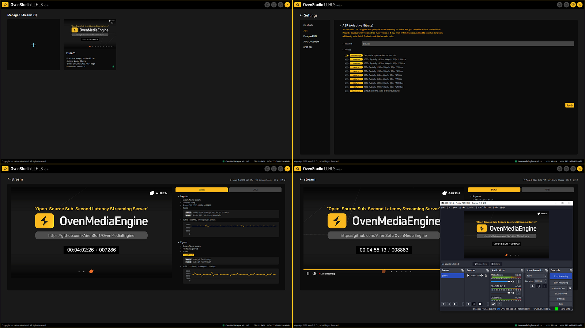

The pandemic has forced people to stay indoors, significantly changing today’s digital content consumption patterns. Many individuals have become aware of the latency issues in traditional streaming services and are now seeking digital content that can provide immediate responses.

{/* truncate */}

Near-real-time events, game streaming, online lectures, and other fields require fast responsiveness and minimal delays. To meet these demands, the Low Latency HTTP Live Streaming (LLHLS) approach has gained attention. In this article, we will explore the concept, importance, implementation, and the OvenStudio LLHLS solution for low-latency streaming.

## What is LLHLS Low-Latency Streaming?

Low-Latency HLS (LLHLS) streaming is an advanced version of Apple’s HTTP Live Streaming (HLS) protocol designed to minimize latency in near-real-time streaming. By significantly reducing the segment length compared to traditional HLS, LLHLS enables the implementation of near-real-time events and content, allowing for interactive services. Viewers can now participate in various online events in near-real-time, such as live commerce, game streaming, and online conferences.

## Why is LLHLS Low-Latency Streaming Needed?

LLHLS streaming plays a crucial role in various platforms and services that require near-real-time content delivery. By reducing the typical 6–15 seconds latency of traditional streaming to approximately **under 3 seconds**, LLHLS allows viewers to actively engage with the live-streamed content in near-real-time.

As a result, LLHLS streaming provides immediate interactivity and a more differentiated experience to a large audience. It caters to users familiar with traditional streaming, offering them unique and valuable content in areas like live commerce, sports broadcasting, game streaming, online education, and gambling. Simultaneously, it attracts new viewers with captivating online experiences.

## How to Implement LLHLS Low-Latency Streaming?

To implement low-latency streaming using LLHLS protocol, it is crucial to faithfully adhere to **Apple’s HLS specifications**. While Legacy HLS could be adequately delivered using a regular HTTP server after segment packaging, LLHLS requires more complex server-side techniques such as **Preload Hint**, **Blocking of Media Downloads**, and **HLS Delivery Directives** for achieving low latency. Therefore, utilizing a dedicated streaming server is highly recommended to ensure successful implementation. If you are interested in detailed information about the LLHLS protocol, please refer to the [Apple Developer Documentation](https://developer.apple.com/documentation/http-live-streaming/enabling-low-latency-http-live-streaming-hls).

[OvenStudio LLHLS](https://aws.amazon.com/marketplace/pp/prodview-66xy6t4xk56xs) (now OvenMediaEngine Enterprise on AWS) seamlessly integrates with existing infrastructures and systems, using **WebRTC**, **WHIP**, **RTMP**, **SRT**, and other ingress protocols to receive media sources. It leverages the **LLHLS** protocol to achieve low-latency transmission. To enhance streaming stability across different browsers, the built-in live transcoder encodes the media sources for low-latency streaming. Moreover, it supports various Output Profiles, allowing you to utilize the **Adaptive Bit-Rate** (ABR) feature as needed.

## Advantages of Using OvenStudio LLHLS:

1. **Interactive Content**: OvenStudio LLHLS leverages low-latency streaming technology to support near-real-time updating content. Whether it’s live commerce, sports broadcasting, game streaming, online education, or gambling, viewers can actively participate in near-real-time events with minimized delays.
2. **Enhanced User Experience**: With OvenStudio LLHLS, you can provide high-quality streaming with reduced latency, offering viewers a remarkable streaming experience.
3. **Differentiated Service**: By offering lower latency compared to other services, OvenStudio LLHLS can deliver unique value to viewers accustomed to traditional streaming. Providing a differentiated service with lower delay can help you gain a competitive edge.
4. **Scalability to Reach More Viewers**: LLHLS low-latency streaming enables you to deliver high-quality near-real-time streaming to a large audience. This is particularly beneficial for scenarios like event broadcasting, large-scale online lectures, and horse racing coverage, where a significant number of viewers tune in simultaneously. LLHLS low-latency streaming can handle massive traffic and accommodate many concurrent viewers.

In summary, OvenStudio LLHLS can help you quickly and easily set up a low-latency streaming server, offering your audience the best streaming experience possible.

### For more information, please refer to the following links:

- OvenStudio LLHLS has been integrated into [OvenMediaEngine Enterprise on AWS](https://aws.amazon.com/marketplace/pp/prodview-66xy6t4xk56xs).
- OvenStudio LLHLS has been integrated into OvenMediaEngine Enterprise on AWS. This guide has been replaced by the [Getting Started on AWS guide](https://ovenmedia.com/docs/ome-enterprise/exclusive/aws-marketplace/getting-started-on-aws).
- [Support and Inquiries](mailto:ovenstudio@ovenmedia.com)

Thank you for taking the time to read this article. If you have any further questions or need more information, feel free to ask.
