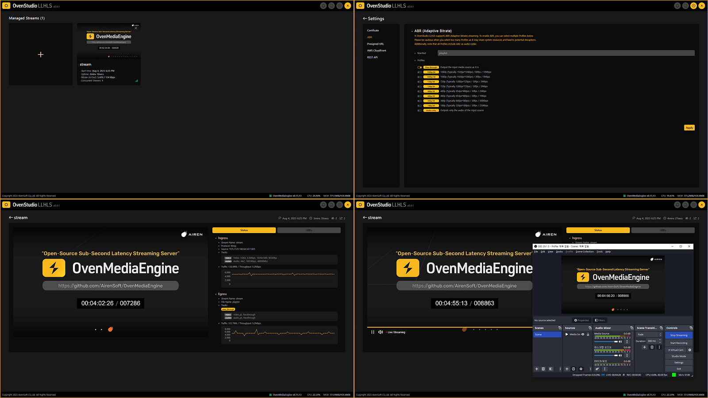

We are living in an era where anyone can easily broadcast content. In the past, broadcasting was limited to television stations, but now, with the power of smartphones and computers, anyone can effortlessly stream their content to the world. Streaming platforms and services have revolutionized the way we consume media, offering creators a convenient and fast way to share their creations with the world.

{/* truncate */}

From YouTubers and streamers to artists and educators, people from various fields are using streaming to share their passions and talents with a global audience. Even businesses have embraced streaming to launch products, host events, and conduct meetings on a global scale.

However, to make all this streaming magic happen, we need **Streaming Servers**. Streaming servers play a crucial role in delivering various types of content, such as videos, music, and events, to viewers in a stable and reliable manner. Without a properly functioning streaming server, streaming platforms and services may encounter difficulties in smooth operations.

Let’s explore more about streaming servers in the following article!

## What is a Streaming Server?

A streaming server plays a crucial role in transmitting media content, such as video and audio (media sources), to users. It enables users to watch (stream) video or audio on web browsers, mobile apps, or other devices.

The most significant role of a streaming server is to deliver media data to users reliably. The technical reliability of the streaming server directly impacts the overall service stability. Additionally, the streaming server efficiently manages internet bandwidth and ensures a consistent streaming experience across various devices and platforms.

## What is LLHLS Streaming Server?

The Low Latency HLS (LLHLS) streaming server is designed for low-latency streaming. LLHLS is an advanced version of the streaming protocol HLS, originally developed by Apple. While conventional HLS typically uses segment lengths of 6 to 10 seconds, LLHLS significantly reduces segment lengths to minimize latency. This enables faster responsiveness, making it ideal for near-real-time interactive applications such as events, game streaming, online conferences, and video meetings.

LLHLS is mainly supported by web-based players and mobile apps. As most modern browsers and devices support LLHLS streaming, users can experience smooth streaming without the need for additional plugins.

## How to Build an LLHLS Streaming Server?

[OvenStudio LLHLS](https://aws.amazon.com/marketplace/pp/prodview-66xy6t4xk56xs) (now OvenMediaEngine Enterprise on AWS) is the best choice for quickly and easily building an LLHLS streaming server. With OvenStudio LLHLS, you can set up a low-latency streaming server in just a few minutes without the need for complex installation processes. The platform offers a user-friendly interface and powerful features, enabling efficient management of your streaming workflow. By choosing OvenStudio LLHLS, you can enhance user engagement and interaction with near-real-time updated content, providing more effective communication and a better user experience.

1. OvenStudio LLHLS enables low-latency streaming with a delay of under 3 seconds. For near-real-time content delivery, minimizing latency is crucial. To achieve this, OvenStudio LLHLS leverages cutting-edge technologies and the LLHLS protocol, providing stable and low-latency streaming.
2. OvenStudio LLHLS supports high-quality media content delivery with low latency. It efficiently handles the resources required for streaming high-quality media sources, ensuring stable delivery. Moreover, with CDN integration and scaling options, it can serve a larger audience with low-latency high-definition content.
3. OvenStudio LLHLS offers Adaptive Bitrate Streaming (ABR) support. This feature automatically adjusts the bitrate of content based on viewers’ network conditions and device capabilities, delivering an optimal viewing experience for each viewer.
4. OvenStudio LLHLS provides valuable statistics and data for analyzing viewers’ watching patterns and behavior. Content creators and service providers can gain insights into viewers’ preferences, identify areas for improvement, and enhance service quality.

OvenStudio LLHLS is designed to deliver and share high-quality media content in near-real-time. By choosing OvenStudio LLHLS on your AWS Cloud, you can operate your streaming platform or service more effectively.

## For more information

- OvenStudio LLHLS has been integrated into [OvenMediaEngine Enterprise on AWS](https://aws.amazon.com/marketplace/pp/prodview-66xy6t4xk56xs).
- OvenStudio LLHLS has been integrated into OvenMediaEngine Enterprise on AWS. This guide has been replaced by the [Getting Started on AWS guide](https://ovenmedia.com/docs/ome-enterprise/exclusive/aws-marketplace/getting-started-on-aws).
