Content creation and sharing industries are evolving at an unprecedented pace, and video/audio streaming has become an integral part of our daily lives.

{/* truncate */}

For content providers, streamers, and businesses utilizing streaming, finding the right tools to seamlessly broadcast media sources is essential. [OvenStudio LLHLS](https://airensoft.com/os.html) supports various ingress protocols such as WebRTC, WHIP, SRT, and RTMP, allowing you to send media sources to [OvenStudio LLHLS](https://airensoft.com/os.html) using **software encoders** like [OvenLiveKit](https://github.com/AirenSoft/OvenLiveKit-Web), [OvenStreamEncoder](https://play.google.com/store/apps/details?id=com.airensoft.ovenstreamencoder.camera&hl=en_US), OBS, Xsplit,

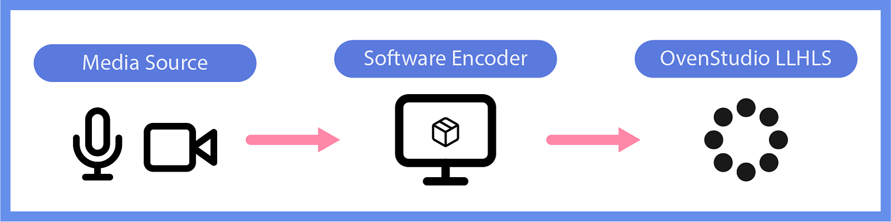

*With Software Encoder*

or even **hardware encoders**.

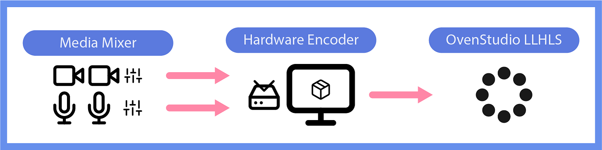

*With Hardware Encoder*

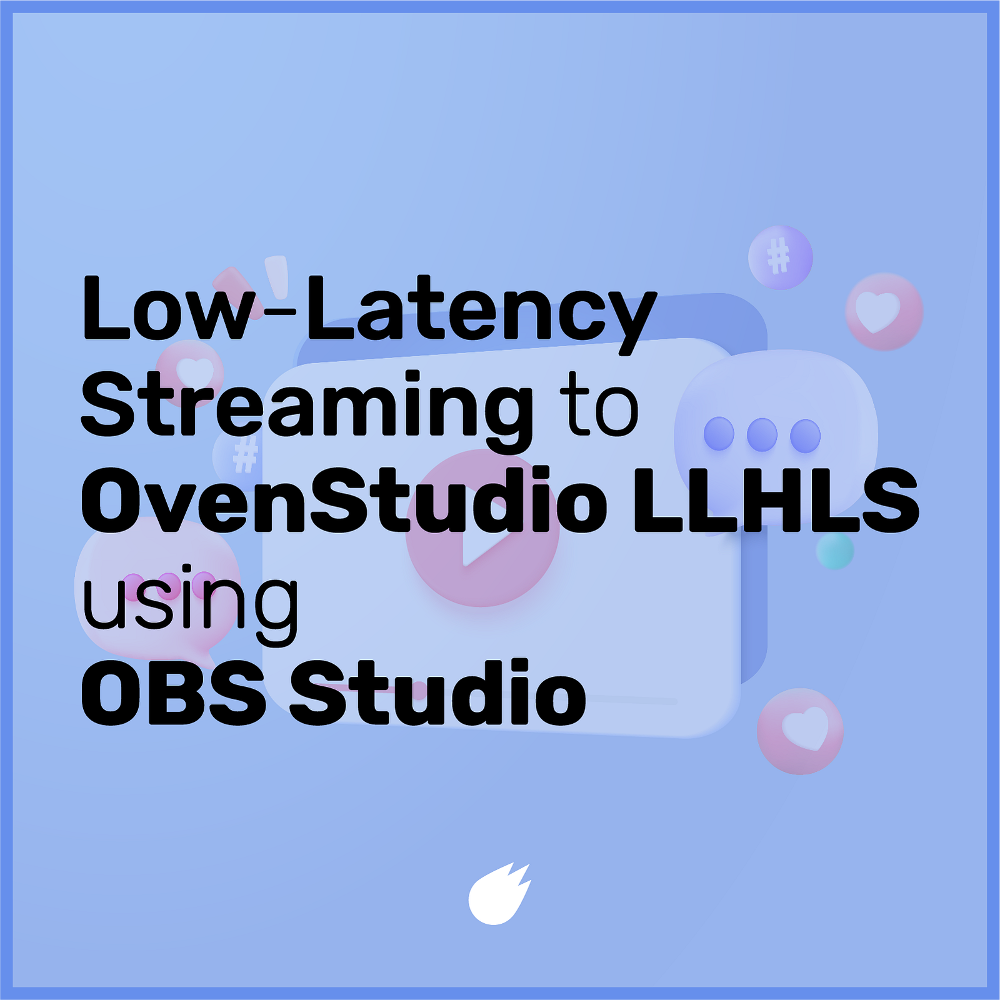

[Open Broadcaster Software](https://obsproject.com/) *(OBS or OBS Studio)* is one of the most popular open-source live encoders globally, favored by creators and streamers alike. These encoders enable content to be streamed to a streaming server using various protocols. When using [OvenStudio LLHLS](https://airensoft.com/os.html) as your streaming server, you can reduce the traditional streaming delay of around 10 seconds to less than 3 seconds, providing an interactive experience for your viewers.

In this guide, we’ll walk you through the process of using OBS to send media sources to [OvenStudio LLHLS](https://airensoft.com/os.html).

## OvenStudio LLHLS?

[OvenStudio LLHLS](https://airensoft.com/os.html) is a **Low-Latency Streaming Server** that operates in a Cloud environment, boasting exceptional performance and scalability. It supports a range of ingress protocols *(WebRTC, WHIP, SRT, RTMP, and more)*, allowing media sources received via these protocols to be streamed as **Low Latency HLS** *(LLHLS)* with a streaming delay of less than 3 seconds. If you want to broadcast various content with minimal delay, [OvenStudio LLHLS](https://airensoft.com/os.html) is your solution.

## Sending Media Sources to OvenStudio LLHLS

The process of sending media sources to [OvenStudio LLHLS](https://airensoft.com/os.html) using OBS is straightforward and can be summarized in the following steps:

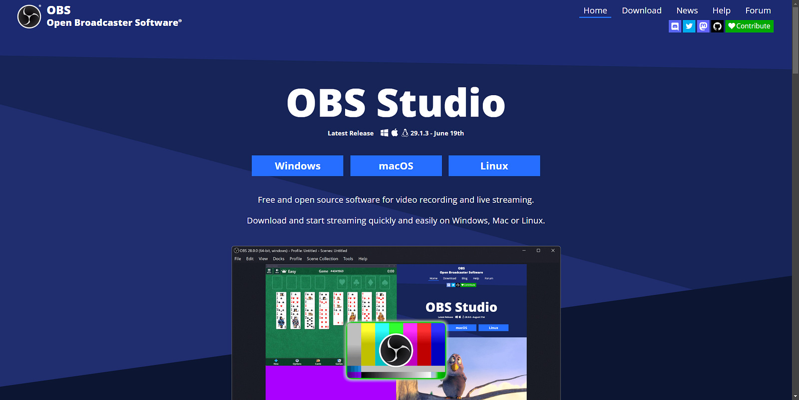

1. **OBS Installation**: Start by downloading the appropriate version of OBS for your operating system from the [official website](https://obsproject.com/) and install it on your computer. Launch OBS and load the media source you want to broadcast.

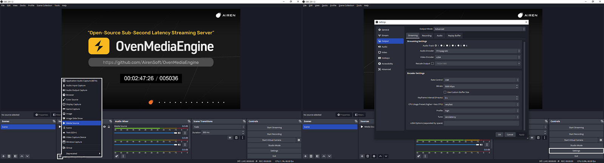

2. **OBS Settings**: Click on the [**Settings**] button in the bottom right corner of OBS. Here, you can select your desired video and audio devices, and adjust basic settings like resolution, framerate, bitrate, and more.

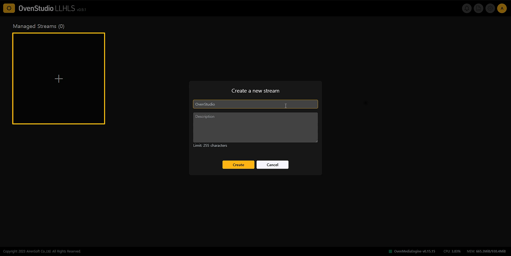

3.** Create a Streaming Box**: After logging into OvenStudio LLHLS, click the [**+**] button on the main page to create a Managed Stream.

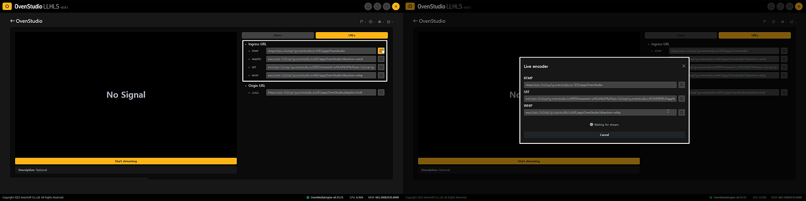

4. **Choose the Appropriate Streaming Protocol**: OBS can transmit a media source with various ingress protocols like WebRTC, WHIP, SRT, and RTMP, among others. Once you’ve created your Managed Stream in OvenStudio LLHLS, click on it to access the details. In the right-hand menu, navigate to the [**URLs**] tab and copy the Ingress URL *(Stream key)* for your chosen protocol. Or, on the same page, press the [**Start streaming**] button at the bottom of the player and select the [**Live Encoder**] tab from the menu that appears. Using the ingress URL that appears afterward works the same way.

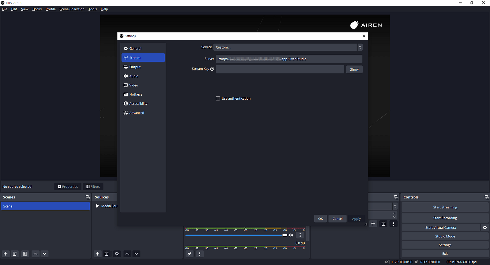

5. **Enter Stream Key**: Return to the OBS settings screen and enter the **Stream key** you copied. Then, close the settings window. Then click the [**OK**] button below to close the settings window.

- **WebRTC — **wss://&#123;domain&#125;:&#123;port&#125;/&#123;app name&#125;/&#123;**stream name?direction=send**&#125;
- **WHIP — **wss://&#123;domain&#125;:&#123;port&#125;/&#123;app name&#125;/&#123;**stream name?direction=whip**&#125;
- **SRT — **srt://&#123;domain&#125;:&#123;port&#125;?streamid=srt%3A%2F%2F&#123;domain&#125;%3A&#123;port&#125;%2F&#123;app name&#125;%2F&#123;**stream name**&#125;
- **RTMP — **rtmp://&#123;domain&#125;:&#123;port&#125;/&#123;app name&#125;/&#123;**stream name**&#125;

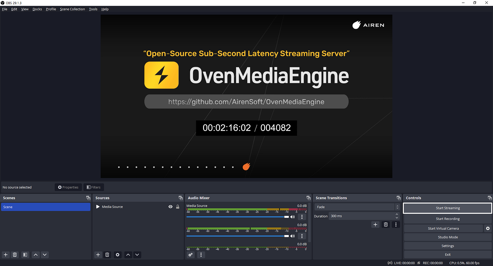

6.** Connect and Start Streaming**: Once you’ve configured OBS, click the [**Start Streaming**] button to begin streaming your video to OvenStudio LLHLS.

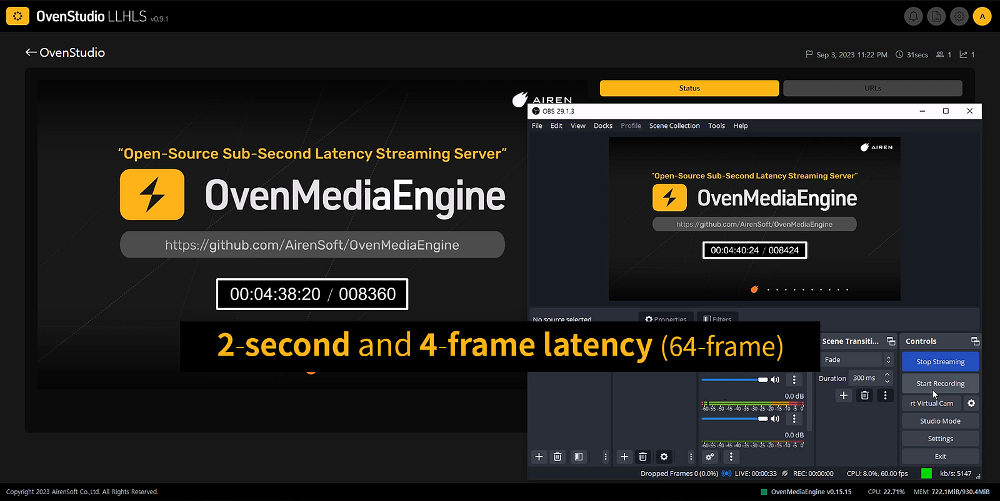

7.** Low-Latency Streaming Monitoring**: If your media source is successfully delivered to OvenStudio LLHLS, you can monitor it using the OvenPlayer within OvenStudio LLHLS. You can also use the Origin URL *(or Edge URL, depending on your settings)* from the [URLs] tab to watch it in LLHLS-compatible players like [OvenPlayer](https://demo.ovenplayer.com/), [THEO Player](https://www.theoplayer.com/test-your-stream-hls-dash-hesp), and others.

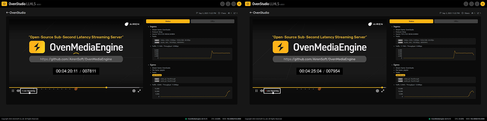

8. **Checking Latency**: To ensure your streaming delay is less than 3 seconds, compare the OBS streaming screen to what you see on OvenStudio LLHLS’s player. If your streaming exceeds 3 seconds, check if the [**Live Streaming**] indicator at the bottom of the OvenStudio LLHLS player is lit in red. If it is, but your streaming delay still exceeds 3 seconds, it might be related to network, system performance, instance location, or instance type issues.

## In Conclusion

[OvenStudio LLHLS](https://airensoft.com/os.html) provides easy scalability and delivers reliable low-latency streaming. It can be employed in various interactive content services, including game streaming, sports streaming, entertainment events, online classes, video conferencing, and more —* *[***What you can do with OvenStudio LLHLS***](https://medium.com/@AirenSoft/what-you-can-do-with-ovenstudio-llhls-86e626341dc5).

The technological advancements and flexibility offered by [OvenStudio LLHLS](https://airensoft.com/os.html) present content creators and streamers with opportunities to utilize streaming in diverse ways, enhancing interactions with viewers. Enjoy a superior streaming experience with [OvenStudio LLHLS](https://airensoft.com/os.html)!

## For more information

- [OvenStudio LLHLS Website](https://airensoft.com/os)
- [OvenStudio LLHLS on AWS Marketplace](https://aws.amazon.com/marketplace/pp/prodview-xwvoj4om6w4ee)
- [OvenStudio LLHLS User Guide](https://ovenstudio.gitbook.io/ovenstudio-llhls)
