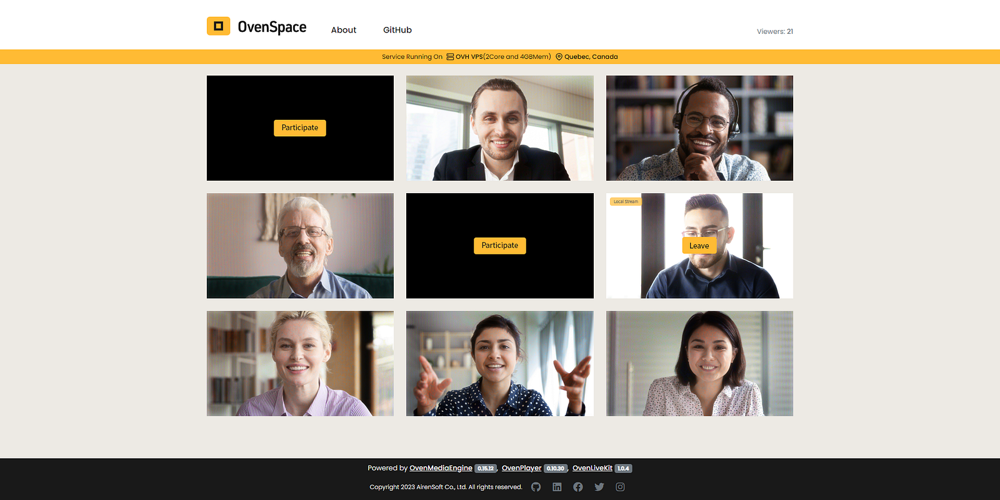
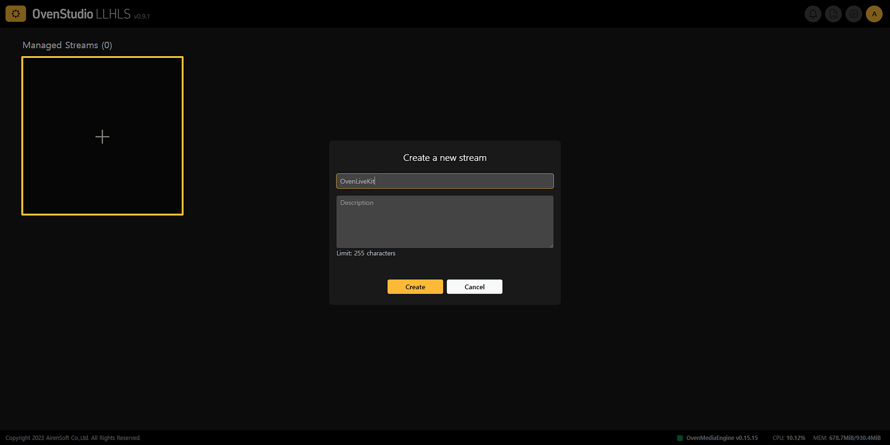
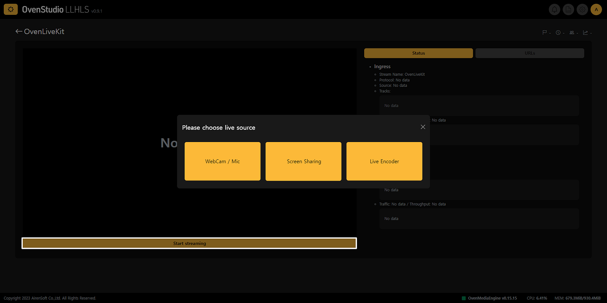
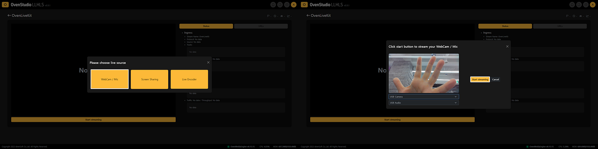
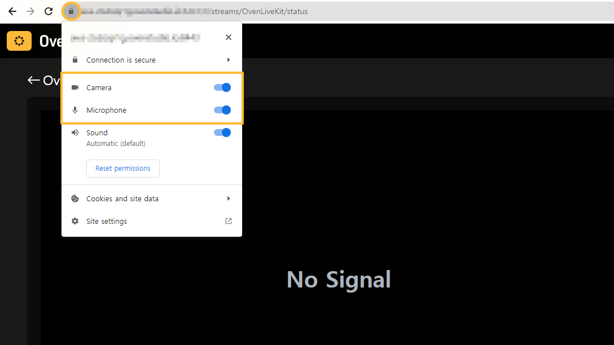
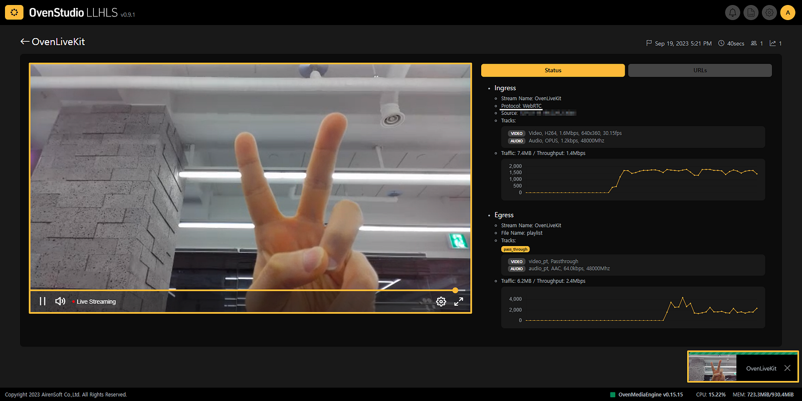
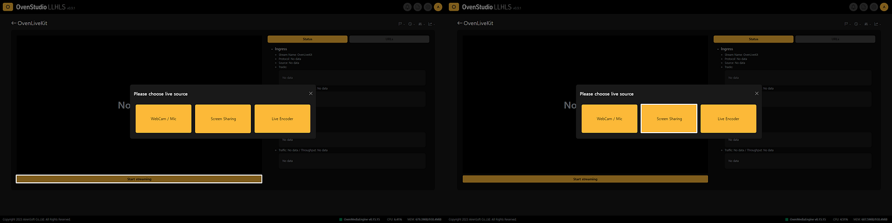
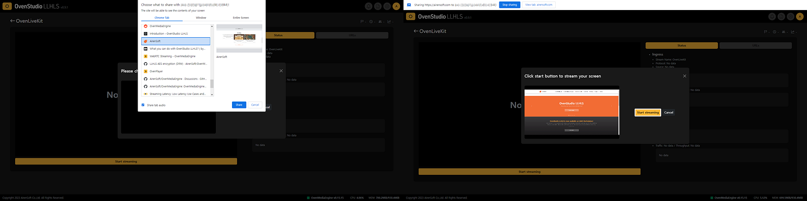
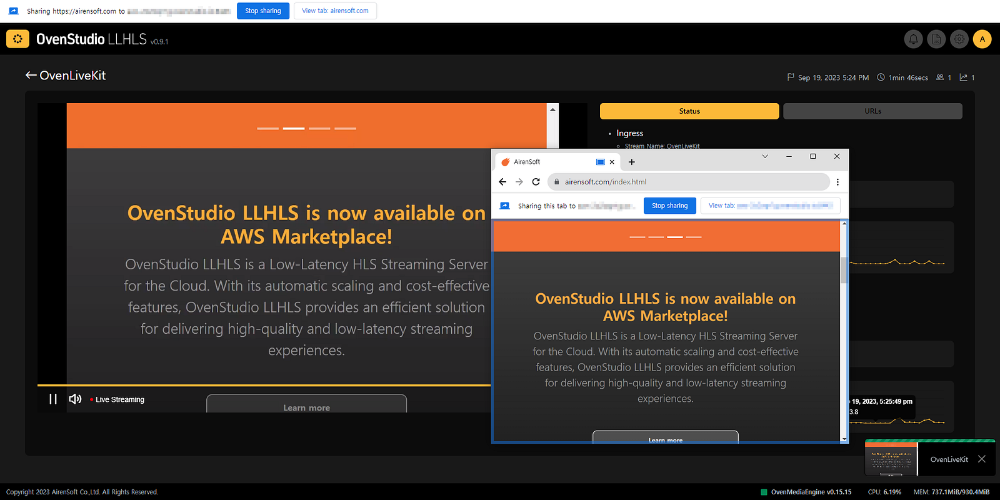

If you want to use streaming with a latency of less than 3 seconds but don’t have separate software or hardware to transmit your media source to [OvenStudio LLHLS](https://aws.amazon.com/marketplace/pp/prodview-66xy6t4xk56xs) (now OvenMediaEngine Enterprise on AWS), don’t worry. It comes with [OvenLiveKit](https://github.com/AirenSoft/OvenLiveKit-Web), which allows you to transmit streams through WebRTC directly from a web browser, without the need for additional software or plugins.

{/* truncate */}

### Key Benefits Using OvenLiveKit

1. **Ease of Use and Accessibility:** There’s no need to install additional software or plugins. Just open your web browser, capture your webcam/microphone or your current screen, and start your live streaming.
2. **Cross-Browser Compatibility:** WebRTC is supported by most major web browsers, making it easy to stream live across various platforms.

In summary, with [OvenLiveKit](https://github.com/AirenSoft/OvenLiveKit-Web), you can broadcast your screen directly from your browser without the hassle of installing extra software or configuring intricate settings. Here’s a basic guide on how to use [OvenLiveKit](https://github.com/AirenSoft/OvenLiveKit-Web) within [OvenStudio LLHLS](https://aws.amazon.com/marketplace/pp/prodview-66xy6t4xk56xs) (now OvenMediaEngine Enterprise on AWS).

## OvenLiveKit?

[OvenLiveKit (for Web)](https://github.com/AirenSoft/OvenLiveKit-Web) is an Open-Source and JavaScript-based Live Streaming Encoder that supports WebRTC optimized for [OvenMediaEngine](https://github.com/AirenSoft/OvenMediaEngine), an Open-Source Sub-Second Latency Streaming Server. However, as you may be aware, [OvenStudio LLHLS](https://aws.amazon.com/marketplace/pp/prodview-66xy6t4xk56xs) (now OvenMediaEngine Enterprise on AWS) is developed with it, which means that [OvenLiveKit](https://github.com/AirenSoft/OvenLiveKit-Web) will seamlessly work in [OvenStudio LLHLS](https://aws.amazon.com/marketplace/pp/prodview-66xy6t4xk56xs) (now OvenMediaEngine Enterprise on AWS).

This kit leverages the browser’s WebRTC API, simplifying the process of sending WebRTC streams directly to [OvenStudio LLHLS](https://aws.amazon.com/marketplace/pp/prodview-66xy6t4xk56xs) (now OvenMediaEngine Enterprise on AWS). If you’re interested in learning more, check out the links below.

- [OvenLiveKit GitHub](https://github.com/AirenSoft/OvenLiveKit-Web)
- [OvenSpace Demo](https://space.ovenplayer.com/)

## Using OvenLiveKit in Your Web Browser

[OvenLiveKit](https://github.com/AirenSoft/OvenLiveKit-Web) is provided along with [OvenStudio LLHLS](https://aws.amazon.com/marketplace/pp/prodview-66xy6t4xk56xs) (now OvenMediaEngine Enterprise on AWS). Follow these steps to start WebRTC streaming with it. This guide used the Chrome browser.

1.** Create a Streaming Box:** Access OvenStudio LLHLS via your web browser and create a streaming box. After that, go to the detailed view page.

2. **Start Streaming:** Under the player section, you’ll find the **[Start Streaming]** button. Click it to send your media source to OvenStudio LLHLS. There are two options:

### **WebCam/Mic**

i) Click on the **[Start Streaming]** button located at the bottom of OvenPlayer and select **[WebCam/Mic]** from the menu that appears.

ii) In the subsequent WebCam/Mic settings screen, choose your video and audio capture devices. Ensure that your video and audio are displaying correctly. Then, click the **[Start Streaming]** button to send your media source to OvenStudio LLHLS.

iii) If you encounter issues capturing your screen in the WebCam/Mic settings screen, please check your browser’s permissions.

iv) In the bottom right, compare the latency between the capturing OvenLiveKit and OvenPlayer on the left. It’s really that simple.

### **Screen Sharing**

i) The process for Screen Sharing is just as straightforward as WebCam/MIC. Once you are in the detailed view, click the **[Start Streaming]** button located at the bottom of OvenPlayer and select **[Screen Sharing]** from the menu that appears.

ii) In the subsequent Screen Sharing settings, choose the screen you wish to broadcast by selecting either **[Select from opened browser tabs — *Chrome Tab*]**, **[Select from running programs — *Window*]**, or **[Select entire screen capture — *Entire Screen*]**. Of course, the displayed tab name may vary depending on the browser. Then, click the **[Start Streaming]** button to send your media source to OvenStudio LLHLS.

iii) Compare the latency between the capturing OvenLiveKit at the bottom right, the selected tab for capture, and OvenPlayer on the left. This option is great for presentations, screen sharing, or demos.

## Going Live with Sub-3-Second Latency

Choose your desired option and configure your capture device settings. You can easily stream your captured screen to [OvenStudio LLHLS](https://aws.amazon.com/marketplace/pp/prodview-66xy6t4xk56xs) (now OvenMediaEngine Enterprise on AWS). It accepts WebRTC streams and provides low-latency HLS (LLHLS) streaming to your viewers, with a delay of less than 3 seconds.

## Conclusion

This guide demonstrates how you can stream your webcam/microphone or screen capture directly to [OvenStudio LLHLS](https://aws.amazon.com/marketplace/pp/prodview-66xy6t4xk56xs) (now OvenMediaEngine Enterprise on AWS) from your web browser. This approach makes web-based live streaming a breeze without the need for additional software or plugins. Try it out to leverage the powerful low-latency streaming capabilities of [OvenStudio LLHLS](https://aws.amazon.com/marketplace/pp/prodview-66xy6t4xk56xs) (now OvenMediaEngine Enterprise on AWS) and enhance your interaction with viewers.

## For more information

- OvenStudio LLHLS has been integrated into [OvenMediaEngine Enterprise on AWS](https://aws.amazon.com/marketplace/pp/prodview-66xy6t4xk56xs).
- OvenStudio LLHLS has been integrated into OvenMediaEngine Enterprise on AWS. This guide has been replaced by the [Getting Started on AWS guide](https://ovenmedia.com/docs/ome-enterprise/exclusive/aws-marketplace/getting-started-on-aws).
