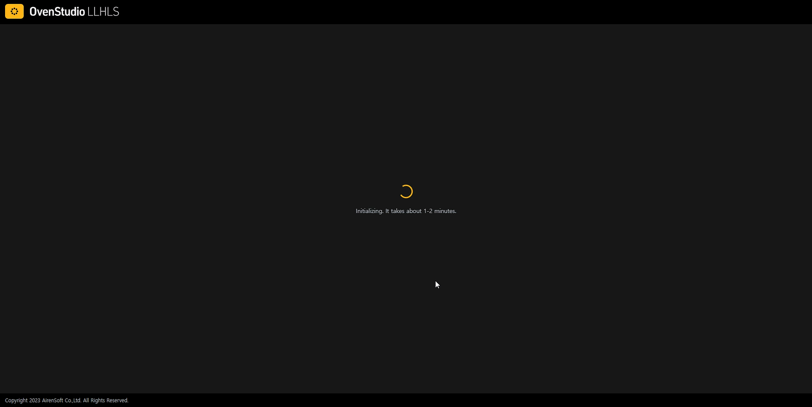
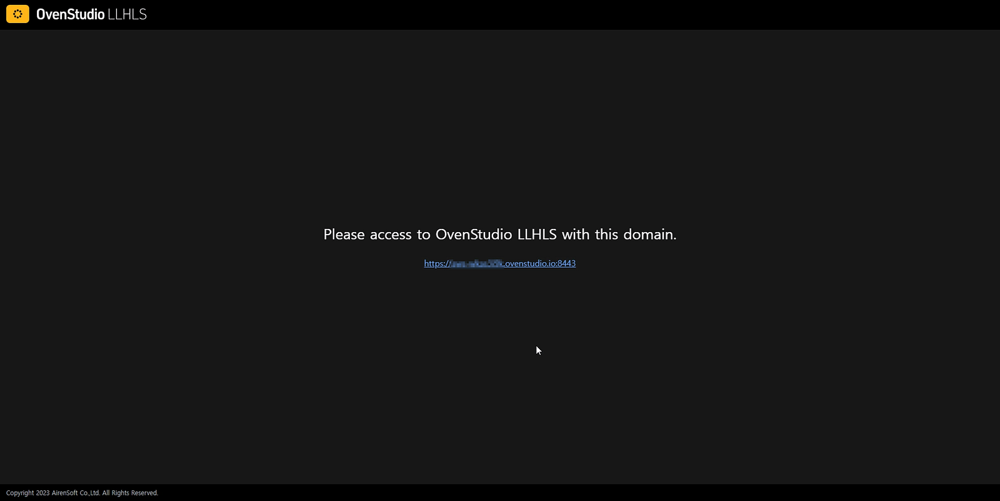

Live streaming is rapidly becoming a key component of modern communication and entertainment. However, setting up and operating a streaming server can come with numerous challenges, including security, authentication, and complex configurations.

{/* truncate */}

Now, with [OvenStudio LLHLS](https://airensoft.com/os.html), you can address these issues effectively. [OvenStudio LLHLS](https://airensoft.com/os.html) automatically provides users with a free TLS *(Transport Layer Security)* certificate and domain upon their initial connection, simplifying streaming security settings. This policy represents a significant upgrade in terms of security and accessibility, and while there are multiple reasons for issuing TLS, today we’ll explain it in connection with WebRTC Ingress.

## Why is TLS Needed for WebRTC Ingress?

WebRTC *(Web Real-Time Communication) *is a protocol that supports real-time audio, video, and data communication over the web. It is used for implementing applications like voice calls, video chats, video conferencing, and file sharing without the need for plugins in web browsers. Real-time communication via web browsers is a matter of security concern, and the reasons for using TLS in WebRTC are as follows:

- **Enhanced Security**: TLS strengthens communication security. WebRTC supports peer-to-peer (P2P) communication between devices, potentially transmitting sensitive information without one’s knowledge. TLS encrypts data, preventing third parties from intercepting or eavesdropping on the communication.
- **Authentication and Trust**: TLS provides mutual authentication between the server and the client, enabling web applications to verify that they are communicating with the actual server. This helps prevent man-in-the-middle attacks (MitM).
- **Data Integrity**: TLS ensures data integrity by preventing data from being tampered with during transmission, preserving the accuracy of the data.
- **Browser Security Policy Compliance**: Most web browsers require web applications using WebRTC to use TLS, and non-compliance may lead to restrictions or blocking of the web application.
- **Regulatory Compliance**: Web applications handling sensitive personal information, such as medical records or financial data, must adhere to security regulations and compliance requirements. Using TLS helps meet these regulatory requirements.

In summary, using TLS in WebRTC enhances communication security, protects privacy, maintains data integrity, and ensures compliance with browser policies and regulations. Therefore, it has to use TLS when implementing WebRTC.

[OvenStudio LLHLS](https://airensoft.com/os.html) minimizes the complexity of settings, providing an authentication certificate and domain issuance upon the initial connection, enabling anyone to easily set up and deliver low-latency streaming.

For installation and usage instructions, please refer to the [**Quick Start Guide for OvenStudio LLHLS**](https://ovenstudio.gitbook.io/ovenstudio-llhls/ovenstudio-llhls/getting-started).

## Why Automatic TLS and Domain Setup on Initial Connection in OvenStudio LLHLS?

[OvenStudio LLHLS](https://airensoft.com/os.html) is a streaming server that allows streaming with less than 3 seconds of latency. When users transmit media sources through [OvenStudio LLHLS](https://airensoft.com/os.html), they may be using WebRTC *(if you’re curious about how to Ingress media sources with WebRTC in OvenStudio LLHLS, please refer to our *[***previous post***](/blog/webrtc-to-llhls-streaming-with-ovenstudio-llhls-using-ovenlivekit)*)*. Therefore, on the initial connection, [OvenStudio LLHLS](https://airensoft.com/os.html) automatically issues TLS certificates and sets up a domain to enhance security, ensure compliance with regulations, and simplify the process by replacing complex IP addresses with user-friendly domains.

To further enhance usability in the future, we plan to add a custom domain feature that allows users to configure certificates and domains directly. This feature not only serves as a branding element but also streamlines usability since [OvenStudio LLHLS](https://airensoft.com/os.html) utilizes the server’s domain for Streaming URLs and Stream Keys. When this feature is released, we anticipate it will make the setup more concise and user-friendly.

## The Advantages of OvenStudio LLHLS’s TLS and Automatic Domain Issuance Policy

- **Simplified Security Configuration**: OvenStudio LLHLS streamlines the setup of TLS, providing an automated process for the issuance of free TLS certificates and domains. There’s no need to worry about complex TLS settings.
- **Increased Reliability**: By employing TLS, OvenStudio LLHLS ensures the secure transmission of streaming, contributing to a higher level of overall service reliability.
- **Regulatory Compliance**: The TLS and automatic domain issuance policy helps OvenStudio LLHLS adhere to regulatory standards for Browsers, offering a straightforward approach to compliance.

## Conclusion

Automatically setting up free TLS certificates and domains using [OvenStudio LLHLS](https://airensoft.com/os.html) is a crucial step in providing users with enhanced security and increasing the reliability of the streaming server. Through these policies, viewers can enjoy safe and stable streaming, and service providers can meet compliance and security requirements. Elevate your streaming security and deliver a better service to your users with OvenStudio LLHLS. Also, stay tuned for the upcoming custom domain feature in future updates.

## For more information

- [OvenStudio LLHLS Website](https://airensoft.com/os)
- [OvenStudio LLHLS on AWS Marketplace](https://aws.amazon.com/marketplace/pp/prodview-xwvoj4om6w4ee)
- [OvenStudio LLHLS User Guide](https://ovenstudio.gitbook.io/ovenstudio-llhls)
