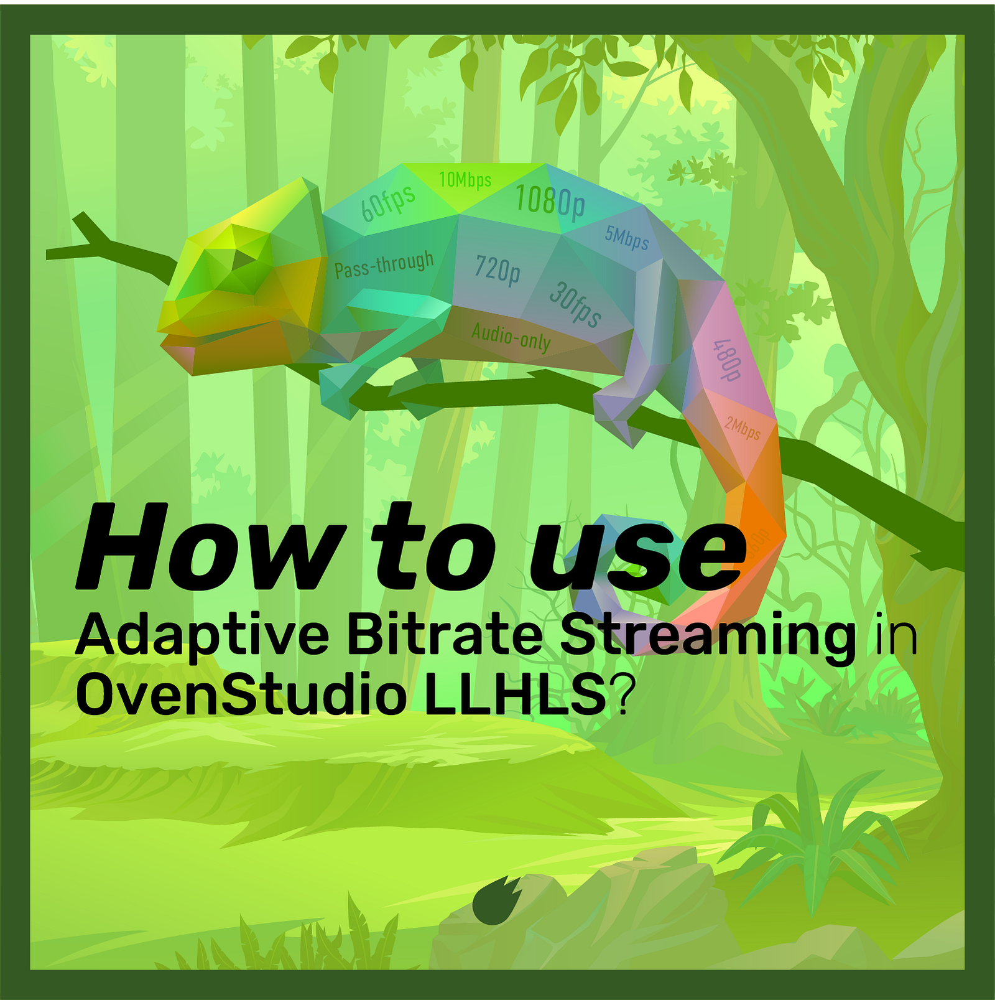
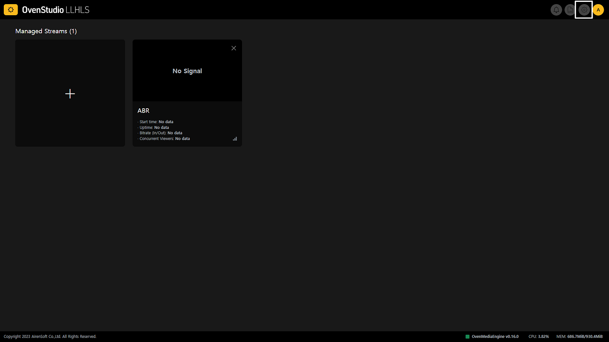
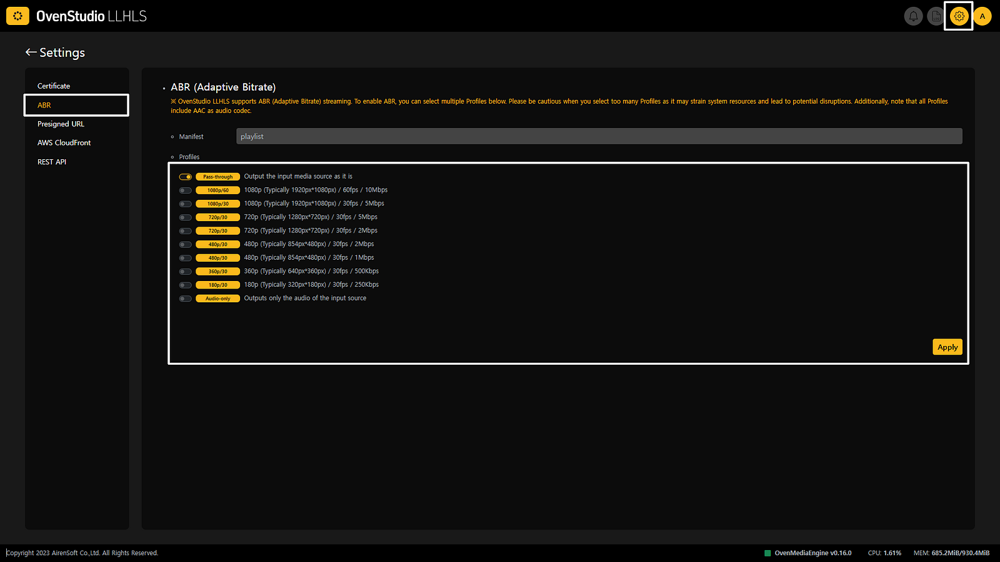
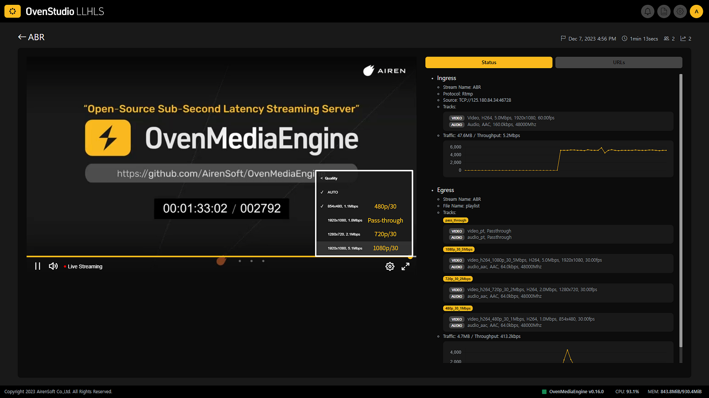

Live streaming has grown rapidly to the point where it has become a part of many people’s daily lives. This growth is further accelerated due to the increasing demand for online media consumption by users.

{/* truncate */}

Consequently, streaming service providers are striving to understand the diverse viewing environments of viewers worldwide in order to provide the best viewing experience while efficiently utilizing bandwidth to reduce server load through technological solutions.

**ABR (*Adaptive Bitrate*)** **Streaming **is one of the responses to these challenges, dynamically adjusting bitrate, resolution, and framerate considering network conditions and user device performance. This allows viewers to experience uninterrupted streaming in any environment while streaming service providers efficiently use bandwidth to cut costs.

## Advantages of ABR

- **Improved User Experience**: ABR provides stable streaming tailored to network changes and viewer device performance, offering users a high-quality experience.
- **Traffic Efficiency**: ABR efficiently utilizes bandwidth, optimizing network traffic.
- **Reaching a Larger Audience**: ABR enables streaming in diverse environments, allowing streamed content to reach a broader audience.

## Where Can ABR Be Applied?

ABR becomes highly valuable when one or more streamers need to stream to an unspecified large audience within a single session. This is because the streaming environments of numerous viewers can vary significantly. Conditions and variables such as location, weather, network, devices, and browsers are more diverse than you might think.

## How Does OvenStudio LLHLS Provide ABR?

- **Embedded Live Transcoder**: [OvenStudio LLHLS](https://airensoft.com/os.html) has embedded a live transcoder that allows encoding of the same media source into various bitrates, resolutions, and frame rates.
- **ABR Profiles**: [OvenStudio LLHLS](https://airensoft.com/os.html) users can choose from multiple encoding presets to enable ABR. These profiles offer presets ranging from low bitrates and resolutions to high bandwidth options, based on collecting various user data. You can easily adjust the viewer experience by selecting the desired presets with just a few clicks.
- **Dynamic Streaming**: [OvenStudio LLHLS](https://airensoft.com/os.html) real-time transforms the media source based on the configured profiles, sending the required LLHLS segments for streaming. If you use OvenPlayer, it continuously monitors viewer network conditions and device performance, requesting the appropriate profile from OvenStudio LLHLS.
- **Automatic Profile Switching**: When changes are detected in network speed and stability, [OvenPlayer](https://github.com/AirenSoft/OvenPlayer) automatically switches profiles to ensure uninterrupted streaming. Of course, viewers can also select resolutions directly in [OvenPlayer](https://github.com/AirenSoft/OvenPlayer).

In summary, [OvenStudio LLHLS](https://airensoft.com/os.html) provides ABR functionality, dynamically adjusting bitrate and resolution based on network conditions and device performance to offer uninterrupted high-quality streaming. We recommend using [OvenPlayer](https://github.com/AirenSoft/OvenPlayer), optimized for [OvenStudio LLHLS](https://airensoft.com/os.html), to provide a smoother streaming experience.

## Can’t use ABR with Low-Latency Streaming?

**Not at all**.

Some users have had concerns that using ABR to deliver multiple profiles could make streaming heavier and prevent low-latency streaming. While this might be the case for some lower-quality streaming servers, [OvenStudio LLHLS](https://airensoft.com/os.html) smoothly delivers ABR with a latency of less than 3 seconds. [OvenStudio LLHLS](https://airensoft.com/os.html)’ ABR feature encodes media sources into multiple bitrates and resolutions, dynamically providing the appropriate profile based on viewer network conditions and device performance. This enhances streaming stability and quality, especially in slow or unstable network environments.

[OvenStudio LLHLS](https://airensoft.com/os.html)’ low-latency streaming minimizes the typical 6–10 seconds of delay found in most live streaming to **less than 3 seconds**. This allows viewers to enjoy high-quality media streaming while experiencing low-latency live streaming.

In other words, ABR optimizes quality by adjusting resolution, bitrate, frame rate, etc., based on network conditions, while low-latency streaming provides an interactive streaming experience. Therefore, using both technologies together allows you to deliver flexible media quickly. Let’s configure ABR in [OvenStudio LLHLS](https://airensoft.com/os.html) now!

## Configuring ABR in OvenStudio LLHLS

To provide ABR functionality, [OvenStudio LLHLS](https://airensoft.com/os.html) has the embedded live transcoder, using video codecs such as VP8, H.264, Pass-through, and audio codecs like Opus, AAC, and Pass-through. Higher-spec instances may be required when using ABR. Here are the steps to configure ABR in OvenStudio LLHLS:

- After logging in to OvenStudio LLHLS, click the **[Settings]** icon in the top right corner of the dashboard to go to the OvenStudio LLHLS settings page.

- From there, select the **[ABR] **tab in the left menu to access the ABR settings page.

- On the ABR settings page, choose the encoding presets you want to use from the** [Profiles]** section. You need to select at least two profiles to enable ABR functionality.
- After selecting all the profiles you want to use, please press the** [Apply]** button to save the settings. Please note that the OvenMediaEngine (streaming engine) being used in OvenStudio LLHLS will restart, so don’t be alarmed if the streaming is momentarily interrupted.

## Using ABR in OvenStudio LLHLS

- After configuring ABR, use OvenLiveKit, OBS, or other tools to send your media source to OvenStudio LLHLS for streaming. If you’re not sure how to stream, you can refer to this [**previous post (***Low-Latency Streaming to OvenStudio LLHLS using OBS Studio*)](https://medium.com/@AirenSoft/low-latency-streaming-to-ovenstudio-llhls-using-obs-studio-65fc78873779) for guidance.

- If the streaming appears correctly in OvenStudio LLHLS, hover your mouse over the OvenPlayer provided on the detailed view page. Click on the** [Settings] **icon on the right side of the controller bar that appears.
- Afterward, try clicking on each profile to check if it plays smoothly. You can also use external players like [**OvenPlayer Demo**](https://demo.ovenplayer.com/). Give it a try now!

## Conclusion

Don’t worry about concerns that delivering multiple profiles will prevent low-latency streaming. [OvenStudio LLHLS](https://airensoft.com/os.html) delivers ABR efficiently, providing streaming with a latency of less than 3 seconds while supporting all these benefits. [OvenStudio LLHLS](https://airensoft.com/os.html) is the perfect tool for this. If you have any further questions or need additional information, please feel free to ask about [OvenStudio LLHLS](https://airensoft.com/os.html).

## For more information

- [OvenStudio LLHLS Website](https://airensoft.com/os)
- [OvenStudio LLHLS on AWS Marketplace](https://aws.amazon.com/marketplace/pp/prodview-xwvoj4om6w4ee)
- [OvenStudio LLHLS User Guide](https://ovenstudio.gitbook.io/ovenstudio-llhls)
