**Do you want to provide stable and low-latency streaming to hundreds of thousands of viewers?** Or perhaps, **do you wish to share your low-latency stream only with authorized viewers?**

{/* truncate */}

These concerns can be addressed by seamlessly integrating [OvenStudio LLHLS](https://airensoft.com/os.html) with **AWS CloudFront **(CDN)** **and **Signed URL**. While traditionally, connecting a streaming server with a CDN requires complexity and specialized knowledge, using [OvenStudio LLHLS](https://airensoft.com/os.html) automates the entire process.


In this blog post, we provide step-by-step instructions on how to effortlessly set up integration with AWS CloudFront in just a few clicks. We also guide you on utilizing features such as the Signed URL, allowing you to share or restrict access as needed. Explore how [OvenStudio LLHLS](https://airensoft.com/os.html) simplifies the integration with AWS CloudFront, making it a breeze.

## What is AWS CloudFront?

AWS CloudFront, part of Amazon Web Services (AWS), serves as a Content Delivery Network (CDN) designed to deliver web content rapidly and reliably worldwide. OvenStudio LLHLS currently leverages AWS services (with future support for platforms like Azure), providing an option for expanding your streaming service or distributing traffic efficiently through CDN.

### *What is CDN (Content Delivery Network)?*

A Content Delivery Network (CDN) is a system that efficiently transmits content globally by utilizing servers distributed across different geographical locations. The purpose is to provide users with fast and reliable service by dispersing and distributing web content, be it static (scripts, images) or dynamic (streaming videos, audio).

### Advantages of CDN:

- **Swift Transmission**: Caching content at edge locations facilitates rapid content delivery.
- **Scalability**: Easily scales servers to accommodate increased traffic, suitable for large-scale streaming services.
- **Security**: Supports encryption via SSL/TLS, ensuring secure data transmission.
- **Cost-Efficiency**: Efficiently utilizes bandwidth and resources, resulting in cost savings.

### Why CDN in Streaming Servers?

CDNs play a crucial role in delivering a consistent, high-quality streaming experience globally. Leveraging CDN services, especially for dynamic content like streaming, ensures users receive a seamless experience regardless of their location. Additionally, content providers can easily respond to increasing traffic through CDN expansion, enabling stable service provision.

In our upcoming blog post, we provide a step-by-step guide on effortlessly integrating [OvenStudio LLHLS](https://airensoft.com/os.html) with AWS CloudFront. Whether you’re looking to enhance your streaming delivery or explore advanced features, [OvenStudio LLHLS](https://airensoft.com/os.html) makes the process user-friendly, saving you time and effort. Stay tuned for our comprehensive guide, and feel free to reach out with any further inquiries.

*※ Note: This guide will be updated to accommodate integration with other CDNs besides AWS CloudFront in the future.*

## What is a Signed URL?

A Signed URL in [OvenStudio LLHLS](https://airensoft.com/os.html) encrypts the URL used for media transmission between the streaming server and the viewer during streaming. This URL is valid for a specific period, and only authenticated users with the appropriate permissions can access the streaming via this URL.

OvenStudio LLHLS administrators can share encrypted URLs valid for a specified time, preventing unauthorized access to the streaming media source and safeguarding against leaks.

### Additionally, Using the Signed URL in OvenStudio LLHLS:

Even with expert knowledge, integrating CDN services into a streaming service and managing the associated procedures can be cumbersome and complex. OvenStudio LLHLS simplifies these intricate processes with just a few clicks. You can seamlessly integrate AWS CloudFront (CDN) with OvenStudio LLHLS and leverage its features. Of course, if you wish to integrate other CDNs besides AWS CloudFront, OvenStudio LLHLS makes that possible too. Details will be provided in a future guide update.

### How to Utilize the Signed URL Feature?

- **Closed Live Streaming Service**: With the Signed URL, content providers can grant access to video streams exclusively to subscribers, allowing the implementation of a subscription model.
- **Copyright Protection**: Signed URL prevents unauthorized copying and distribution of content, providing a safeguard for copyright protection.
- Activities such as Online courses, Live forums, Webinars, Sports broadcasts, Online auctions, Internal previews, and more can benefit from these functionalities.

## Setting Up Signed URL in OvenStudio LLHLS:

[OvenStudio LLHLS](https://airensoft.com/os.html) makes it incredibly simple to configure and use the Signed URL feature with AWS CloudFront. Follow these steps:

### **Connect with AWS CloudFront (Signed URL):**

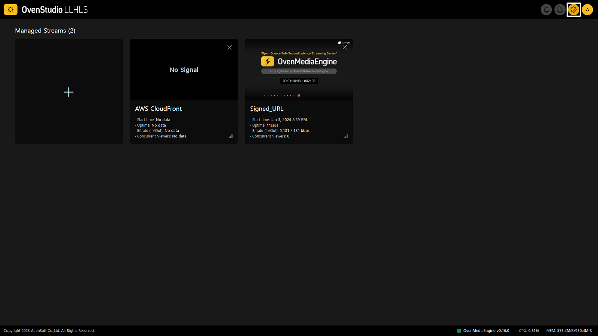

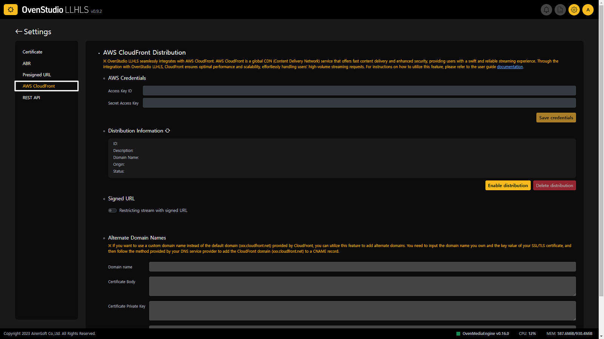

- Click the **[Settings]** icon in the top right corner of OvenStudio LLHLS and select **[AWS CloudFront]** from the left menu to navigate to the AWS Credentials setup page.

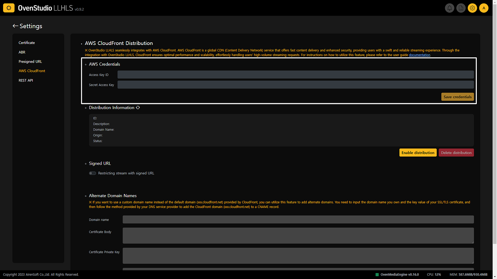

- Enter the issued Access Key ID and Secret Access Key into **[AWS Credentials]** and click **[Save Credentials]** to apply. Learn how to obtain Access Key ID and Secret Access Key — [*AWS Identity and Access Management User Guide*](https://docs.aws.amazon.com/IAM/latest/UserGuide/id_credentials_access-keys.html#Using_CreateAccessKey).

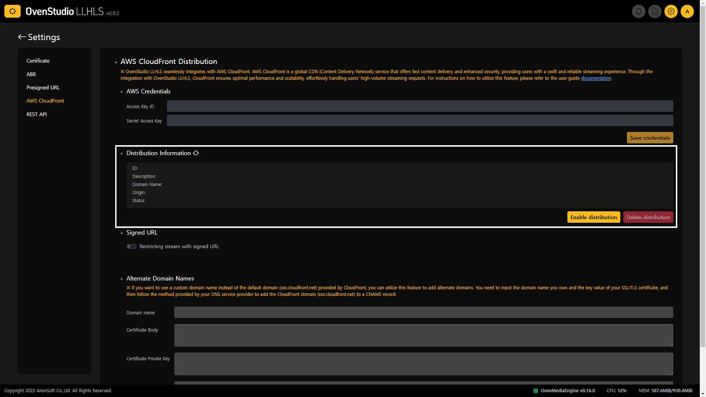

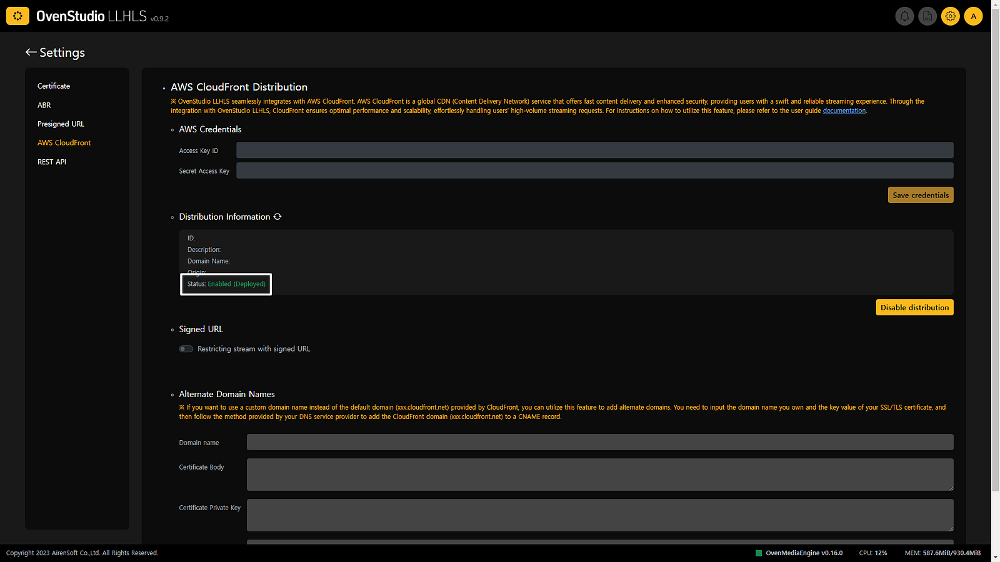

- In the **[Distribution Information]** section on the same page, click the **[Refresh]** icon to verify and load your AWS CloudFront information. To apply this to the OvenStudio LLHLS system, click **[Enable Distribution]**. Upon successful connection, the status item will change to ‘Enabled’.

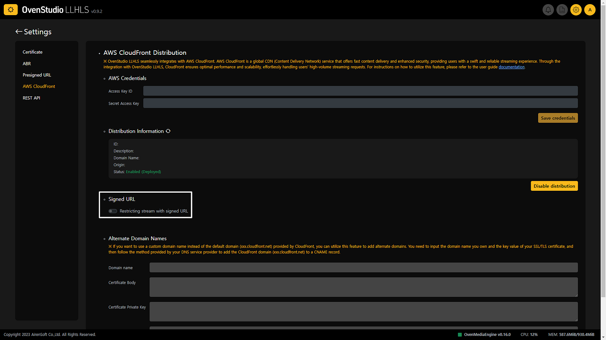


- Finally, on the same page, activate the **[Signed URL]** toggle to transition streaming URLs deployed through OvenStudio LLHLS to Secure URLs.

## Renewing Signed URL in Case of Leakage

Signed URLs are valid for a specific period (e.g., 1 hour). Once this period expires, the URL becomes invalid. However, if a URL is leaked while still valid, follow these steps to renew it:

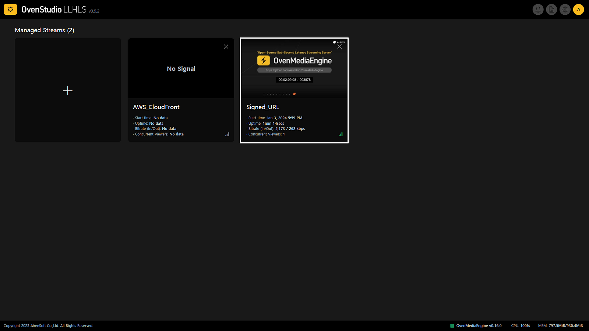

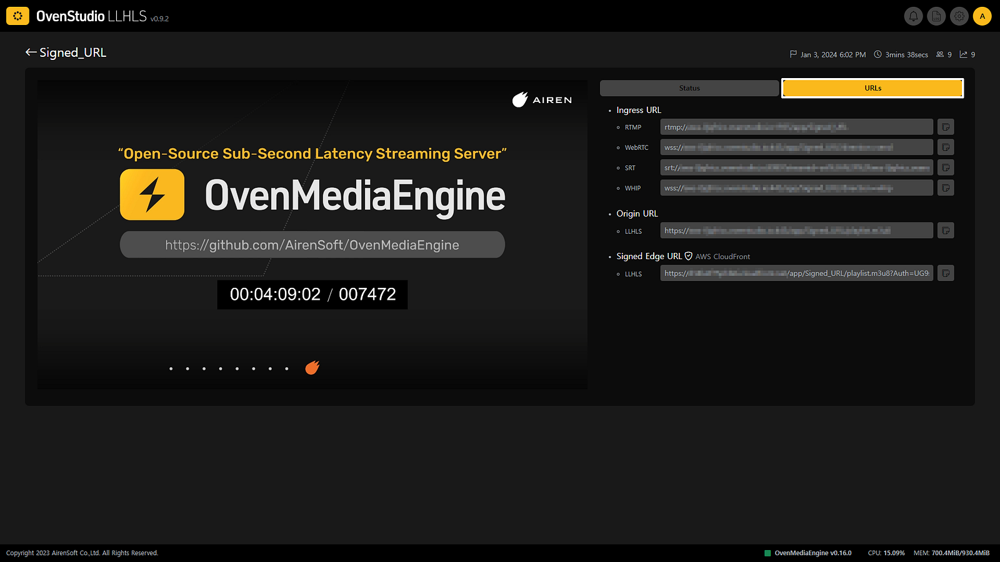

- On the main page of OvenStudio LLHLS, click on the streaming box to enter the streaming details view. Then, click on the **[URLs]** tab.

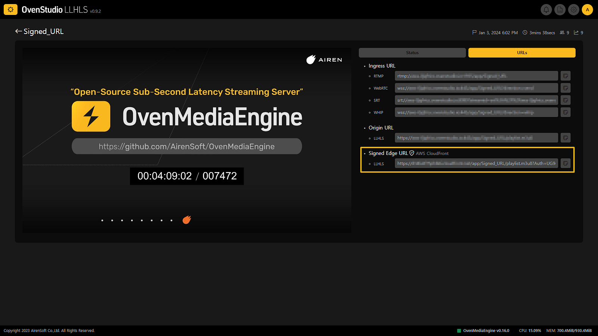

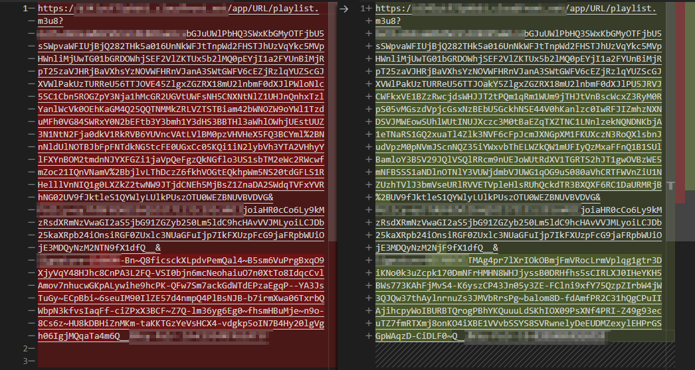

*When comparing the URL before and after refreshing, you can observe a change in the Auth syntax of the Signed Edge URL.*

- **[Refresh]** your browser to update the Signed Edge URL.

*※ Note: The default expiration time of the Signed URL may be subject to change based on user needs and behavior in the future.*

## Using the Signed URL via API

You can utilize an API to apply detailed options for individual streaming units with the Signed URL —For more information, please refer to the [**Access Token**](https://ovenstudio.gitbook.io/ovenstudio-llhls/rest-api/access-token) in the OvenStudio LLHLS’s User Guide. :

### **Issuing Access Tokens:**


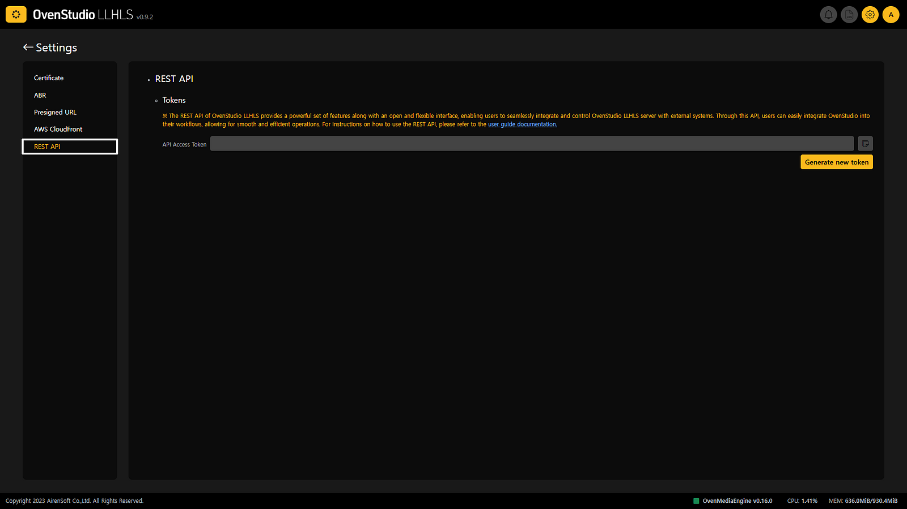

- First, access OvenStudio LLHLS, enter the** [Settings]** screen, and select **[REST API]** from the left menu.

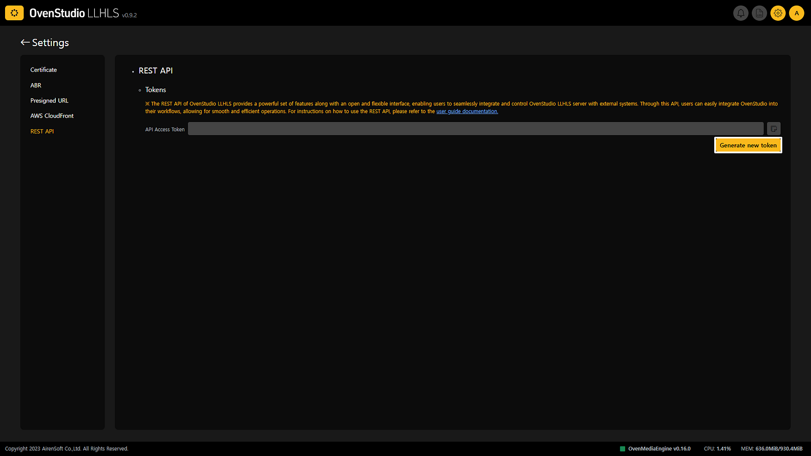

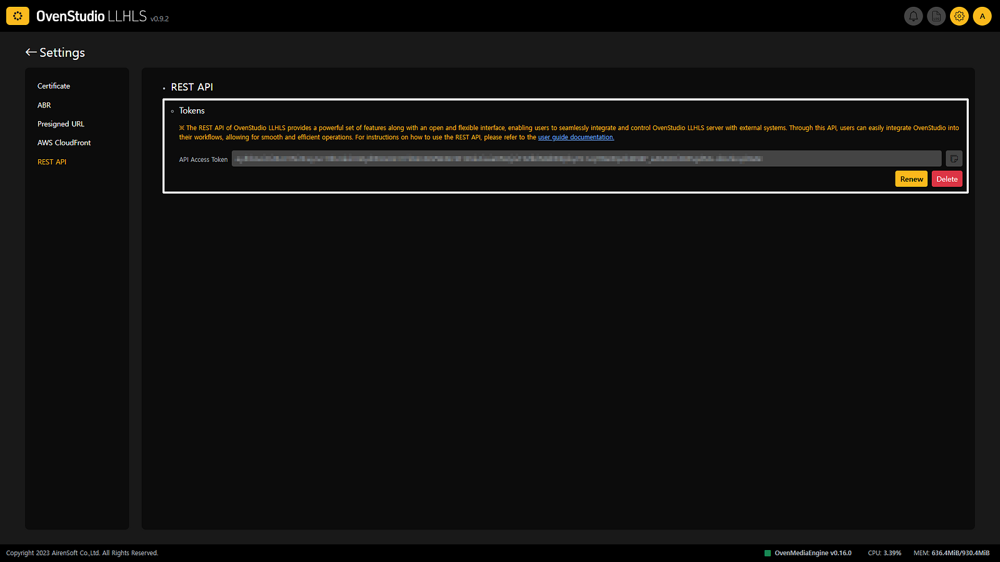

- Under** [REST API]**, in the **[Tokens] **section, click **[Generate new token]** to acquire an access token.

### **Parameter Descriptions:**

The Signed URL API is straightforwardly configured — In the OvenStudio LLHLS’s User Guide, detailed content is covered in the section labeled [**Body Parameters** of Signed URL](https://ovenstudio.gitbook.io/ovenstudio-llhls/v1/signed-url#body-parameters).”

- **“stream_name”** requires the name of the streaming box for which the Signed URL is generated.
- **“date_less_than”** ensures the URL is valid until a specified date and time, and this parameter is mandatory.
- **“date_grater_than”** makes the URL valid from a specified date and time.

### [Examples](https://ovenstudio.gitbook.io/ovenstudio-llhls/v1/signed-url#examples):

- To create a Signed URL for the streaming named OvenStudio, valid until January 1, 2024, 00:00:00 (UTC).

```json
{
 "stream": {
  "stream_name": "OvenStudio"
 },
 "policy": {
  "date_less_than": "2024-01-01T00:00:00Z"
 }
}
```

- To create a Signed URL for the streaming named OvenStudio_Xmas, valid from December 24, 2023, 00:00:00 to December 26, 2023, 00:00:00 (UTC).

```json
{
 "stream": {
  "stream_name": "OvenStudio_Xmas"
 },
 "policy": {
  "date_less_than": "2023-12-26T00:00:00Z",
  "date_greater_than": "2023-12-24T00:00:00Z"
 }
}
```

“date_greater_than” is a directive that defines the URL’s validity starting from the specified time. When used as in the example, the URL can be accessed from December 24, 2023, 00:00:00 UTC onwards.

You can find comprehensive details in the OvenStudio LLHLS’s User Guide under the [**Signed URL**](https://ovenstudio.gitbook.io/ovenstudio-llhls/v1/signed-url) section.

## Conclusion

[OvenStudio LLHLS](https://airensoft.com/os.html) minimizes cumbersome processes to alleviate your concerns. If you need to distribute your streaming to a wider audience, simply integrate with AWS CloudFront with just a few clicks — [OvenStudio LLHLS](https://airensoft.com/os.html) makes it possible.

Moreover, if you wish to share your streaming with specific individuals only, activate the toggle button to enable the Signed URL. It provides security and flexibility for streaming service providers, enhancing service efficiency by protecting content and allowing access only to valid users.

Always, [OvenStudio LLHLS](https://airensoft.com/os.html) offers the easiest and most effective options to support seamless, secure, and low-latency streaming in your service — Elevate your service with the easiest and most effective options, enabling larger audiences to enjoy a seamless, secure, and low-latency streaming experience. Join us in the future of low-latency streaming with [OvenStudio LLHLS](https://airensoft.com/os.html).

## For more information

- [OvenStudio LLHLS Website](https://airensoft.com/os)
- [OvenStudio LLHLS on AWS Marketplace](https://aws.amazon.com/marketplace/pp/prodview-xwvoj4om6w4ee)
- [OvenStudio LLHLS User Guide](https://ovenstudio.gitbook.io/ovenstudio-llhls)
