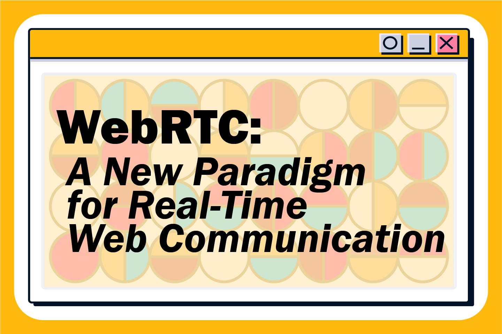
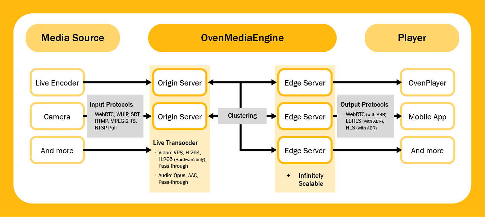
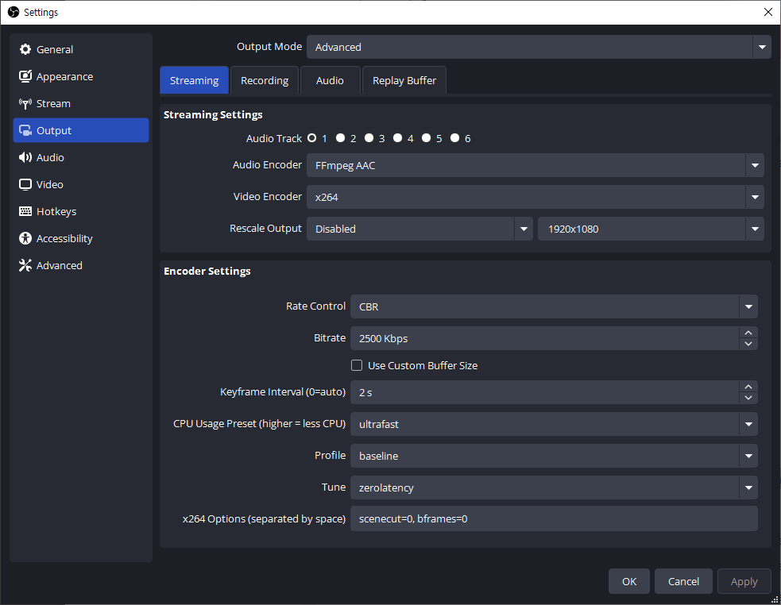
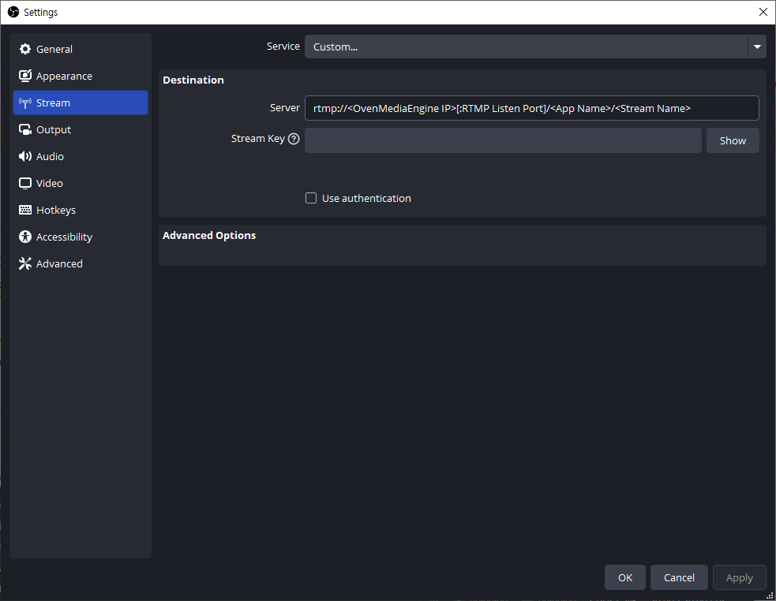
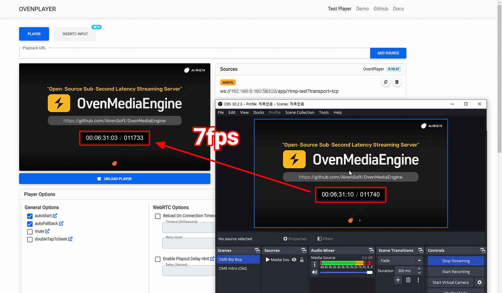
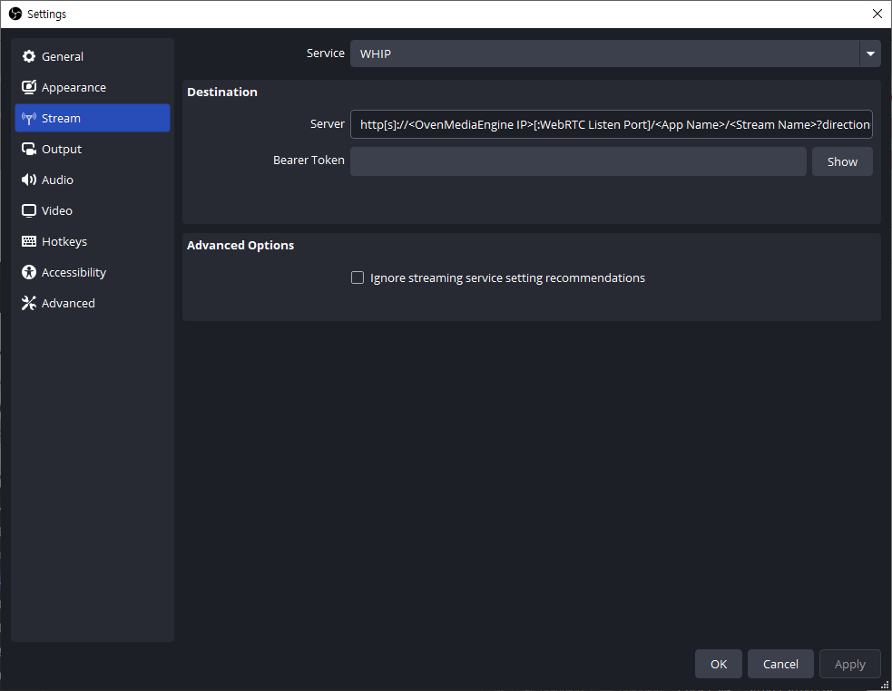
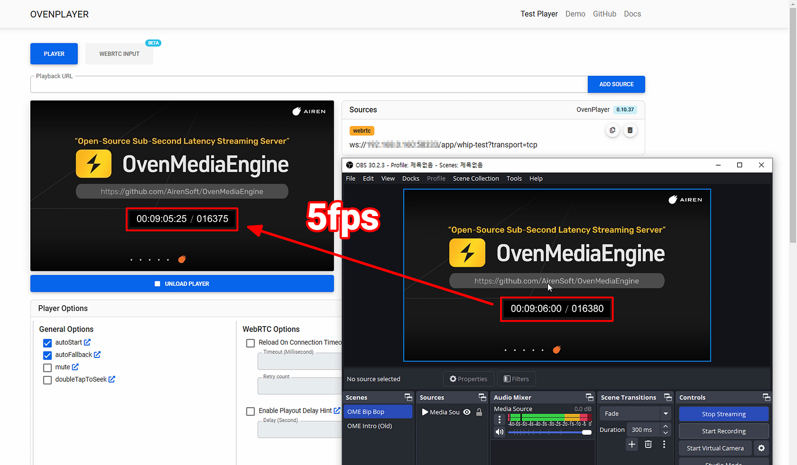

In this blog series, we’ll explore how [**OvenMediaEngine**](https://github.com/AirenSoft/OvenMediaEngine) enables faster, more stable streaming experiences. Many of you have asked about the core egress protocols that make this possible, so we’ll be diving into WebRTC, Low Latency HLS (LL-HLS), and Legacy HLS. Whether you’re curious about sub-second latency or optimizing streaming for large audiences, this series will provide the insights you’re looking for.

{/* truncate */}

- [**[Part1] WebRTC: A New Paradigm for Real-Time Web Communication**](https://medium.com/@OvenMediaEngine/webrtc-a-new-paradigm-for-real-time-web-communication-1642a884a4c1)
- [[Part2] HLS: IS it Possible to Achieve Low-Latency Streaming with HLS?](https://medium.com/@OvenMediaEngine/rethinking-hls-is-it-possible-to-achieve-low-latency-streaming-with-hls-9d00512b3e61)
- [[Part3] Low-Latency HLS: The Era of Flexible Low-Latency Streaming](https://medium.com/@OvenMediaEngine/low-latency-hls-the-era-of-flexible-low-latency-streaming-ec675aa61378)

Join us as we break down the essentials of modern streaming technology!

## What is WebRTC?

As web technologies continue to evolve, our online experiences are constantly being redefined. One such groundbreaking technology is **WebRTC** (Web Real-Time Communication), which allows web browsers to communicate directly in real-time, without needing plugins.

Launched as an open-source project by Google in 2011, this technology enables direct **Peer-to-Peer** (P2P) communication for video, audio, and data transfer, reshaping online experiences by supporting video conferencing, live chatting, and remote collaboration with ease. With its seamless real-time transmission capabilities, WebRTC has redefined real-time web communication, making immediate and immersive interactions more accessible.

## Components of WebRTC

While WebRTC is a powerful and versatile technology, its complexity is carefully structured into key components. Understanding these will allow you to grasp the true capabilities of WebRTC.

- **WebRTC API**: The primary tool for developers, featuring APIs like `getUserMedia`, `RTCPeerConnection`, and `RTCDataChannel`, which facilitate camera and microphone access, establish connections and enable data transfer.
- **SDP (Session Description Protocol)**: The ‘Blueprint’ for WebRTC connections, SDP negotiates and decides on formats, codecs, and encryption methods for communication, ensuring compatibility across different systems.
- **Audio Engine**: Centered on the **Opus codec**, WebRTC’s audio engine delivers high-quality sound with low latency, efficiently adapting to various bitrates.
- **Video Engine**: Supporting diverse codecs such as **H.264, VP8, VP9**, and **AV1**, the video engine reduces CPU usage and conserves battery by using hardware acceleration for video processing.
- **Transport Layer**: Combining SRTP, DTLS, ICE, STUN, TURN, and FEC protocols, this layer ensures secure and fast data transmission even in challenging network conditions.

## Pros and Cons of WebRTC

WebRTC is a revolutionary web communication technology that aims to deliver data for sub-second latency. Here’s a closer look at WebRTC’s strengths and limitations:

### **Pros:**

- **Real-Time Communication**: WebRTC inherently supports bidirectional communication, making it a significant advantage for real-time interaction applications.
- **Broad Browser Support**: Most major browsers, including Chrome and Firefox, support WebRTC natively, eliminating the need for plugins.

### **Cons:**

- **Scalability**: Since WebRTC is P2P-based, additional architecture design may be required for sending a large stream to a large audience, such as in live streaming.
- **Firewall/NAT Issues**: Establishing connections in some network environments can be challenging due to the need for complex mechanisms like ICE, STUN, and TURN.

While WebRTC’s strengths make it excellent for **small-scale real-time communication**, its limitations are apparent when applied to large-scale streaming scenarios.

## WebRTC Implementation in OvenMediaEngine

[OvenMediaEngine](https://github.com/AirenSoft/OvenMediaEngine) takes WebRTC’s limitations in stride, applying a range of technical innovations to overcome them and deliver stable, sub-second latency streaming for large audiences. [OvenMediaEngine](https://github.com/AirenSoft/OvenMediaEngine) effectively preserves WebRTC’s real-time capabilities while enabling it to scale.

And, to achieve scalable WebRTC-based streaming, [OvenMediaEngine](https://github.com/AirenSoft/OvenMediaEngine) offers a suite of sophisticated features designed to support stability, scalability, and seamless user experience in large-scale environments.

### **Sub-Second Latency Streaming**

- By leveraging WebRTC’s real-time capabilities, [OvenMediaEngine](https://github.com/AirenSoft/OvenMediaEngine) enables sub-second latency streaming suitable for live commerce, sports broadcasts, gambling, and other applications where immediate interaction is essential.

### **Various Protocol Input Support**

- In addition to WebRTC, [OvenMediaEngine](https://github.com/AirenSoft/OvenMediaEngine) supports input protocols such as **WebRTC**, **WebRTC/TCP**, **WHIP**, **SRT**, **RTMP**, **MPEG-2 TS**, and **RTSP-Push**. This makes it simple to integrate with existing streaming infrastructures, allowing different content sources to be repackaged into WebRTC and streamed in real-time to large audiences.

### **Embedded Live Transcoder**

- [OvenMediaEngine](https://github.com/AirenSoft/OvenMediaEngine) seamlessly ingests various input protocols and converts them to WebRTC, enabling sub-second latency streaming with ease. While WebRTC does not support AAC codec, OvenMediaEngine’s live transcoder automatically encodes audio to Opus for full WebRTC compatibility.
- Simulcast is a technology where the source (e.g., video encoder, device) sends multiple streams of different quality to the server. The server then chooses and forwards a stream to viewers based on their network conditions. While this approach can reduce server resource usage, it heavily relies on the source device’s resources and bandwidth, making it unsuitable or unstable in some cases. To address this, OvenMediaEngine’s live transcoder generates multiple quality streams directly on the server. This allows viewers to receive optimized streams based on their network conditions, even if the source device or encoder sends only a single video stream. This results in a more efficient and stable server-side ABR experience.

### **Adaptive Bitrate Streaming (ABR)**

- ABR dynamically adjusts stream quality according to network conditions, enabling smooth streaming across a wide range of devices and networks. This is especially beneficial for mobile viewers or those with unstable internet connections.

### **TCP and UDP Transmission**

- While WebRTC typically uses UDP for low latency, [OvenMediaEngine](https://github.com/AirenSoft/OvenMediaEngine) also supports TCP transport for scenarios where UDP is restricted, maintaining stable connectivity in challenging network environments.

### **Scalability**

- For large-scale viewership, [OvenMediaEngine](https://github.com/AirenSoft/OvenMediaEngine) distributes traffic across multiple servers using load balancing, reducing individual server load and enhancing stability. This allows [OvenMediaEngine](https://github.com/AirenSoft/OvenMediaEngine) to scale horizontally, serving high viewer numbers without compromising on quality or latency.

[OvenMediaEngine](https://github.com/AirenSoft/OvenMediaEngine) brings out the best in WebRTC by addressing its core limitations and transforming it into a powerful tool for large-scale, high-definition, and sub-second latency streaming. [OvenMediaEngine](https://github.com/AirenSoft/OvenMediaEngine) has turned WebRTC from a peer-to-peer technology into a scalable streaming solution capable of serving massive audiences with real-time precision.

## Optimized WebRTC Testing on OvenMediaEngine

We conducted tests in two scenarios to evaluate the WebRTC performance of [OvenMediaEngine](https://github.com/AirenSoft/OvenMediaEngine). The test results clearly demonstrate the real-world performance and efficiency of [OvenMediaEngine](https://github.com/AirenSoft/OvenMediaEngine).

For the test, we used OBS Studio (Open Broadcaster Software), the most widely used open-source live encoder. In both the RTMP and WHIP transmitting scenarios, we applied the same Output Streaming Settings across each setup.

- **Audio Encoder**: FFmpeg AAC
- **Video Encoder**: x264
- **Rate Control**: CBR
- **Bitrate**: 2500 Kbps
- **FPS**: 30
- **Keyframe Interval**: 2s
- **CPU Usage Preset**: ultrafast
- **Profile**: Baseline
- **Tune**: zerolatency
- **x264 Options**: scenecut=0, bframes=0

### #01. RTMP to WebRTC using OBS and OvenMediaEngine

The first test scenario involved streaming RTMP input to WebRTC output.

- **RTMP Ingress URL: **`rtmp://&lt;OvenMediaEngine IP>[:RTMP Listen Port]/&lt;App Name>/&lt;Stream Name>`
- **Configure OvenMediaEngine: **Encode media sources ingested into OvenMediaEngine to **Opus** via the embedded live transcoder.

- **Result**: 7 frames (0.234 seconds) latency

The notable result of this test is the very low latency of **0.234 seconds**, equivalent to 7 frames of 30fps video. This is highly suitable for real-time communication. Achieving sub-second latency with RTMP input demonstrates OvenMediaEngine’s efficient transcoding and WebRTC implementation.

### #02. WHIP to WebRTC using OBS and OvenMediaEngine

The second test involved streaming WHIP (WebRTC-HTTP Ingestion Protocol) input to a WebRTC output. To transmit media sources via WHIP in OBS, you need to change the ‘**Service**’ option in Stream Settings to WHIP.

- **WHIP Ingress URL: **`http[s://&lt;OvenMediaEngine IP>[:WebRTC Listen Port]/&lt;App Name>/&lt;Stream Name>?direction=whip`
- **Configure OvenMediaEngine: **When you select WHIP in OBS, the media source is sent to Opus, so there is no need to set it up separately in OvenMediaEngine.

- **Result**: 5 frames (0.167 seconds) latency

This test showed even more impressive results, with a latency of 0.167 seconds, which is lower than the first test. At 5 frames of 30fps video, it is close to real-time latency. Using WHIP allows WebRTC to be used right at the input stage, reducing overall latency.

These tests demonstrate OvenMediaEngine’s ability to deliver sub-second latency streaming, regardless of the input protocol.

## Conclusion

WebRTC delivers outstanding sub-second latency, making it one of the best protocols for real-time streaming. However, when it comes to large-scale and high-definition streaming, WebRTC’s peer-to-peer nature presents inherent scalability challenges that make it difficult to support a vast audience. This is where [OvenMediaEngine](https://github.com/AirenSoft/OvenMediaEngine) truly excels, offering a scalable solution that provides stable, sub-second latency even in large-scale and high-definition streaming environments.

However, WebRTC doesn’t integrate seamlessly with existing infrastructure, particularly Content Delivery Networks (CDNs), which are often optimized for HTTP-based protocols like HLS (HTTP Live Streaming). For this reason, most CDNs have not yet adopted WebRTC as part of their streaming infrastructure, as it lacks compatibility with current caching and distribution strategies. Consequently, alternative approaches, like Low Latency HLS (LL-HLS), are often recommended for scalable, low-latency streaming.

To understand LL-HLS, we’ll first need to look at how HLS works and the reasons it has become the standard for content distribution. In our next article, we’ll explore the structure and benefits of traditional HLS and reveal how much delay — *typically around 10 to 15 seconds *— can be reduced through optimization to support low-latency needs.

Stay tuned for a closer look at HLS, LL-HLS, and the steps to optimize for a latency-optimized streaming experience!

## For more information

- [OvenMediaEngine Website](https://airensoft.com/ome.html)
- [OvenMediaEngine GitHub](https://github.com/AirenSoft/OvenMediaEngine)
- [OvenMediaEngine User Guide](https://airensoft.gitbook.io/ovenmediaengine)
