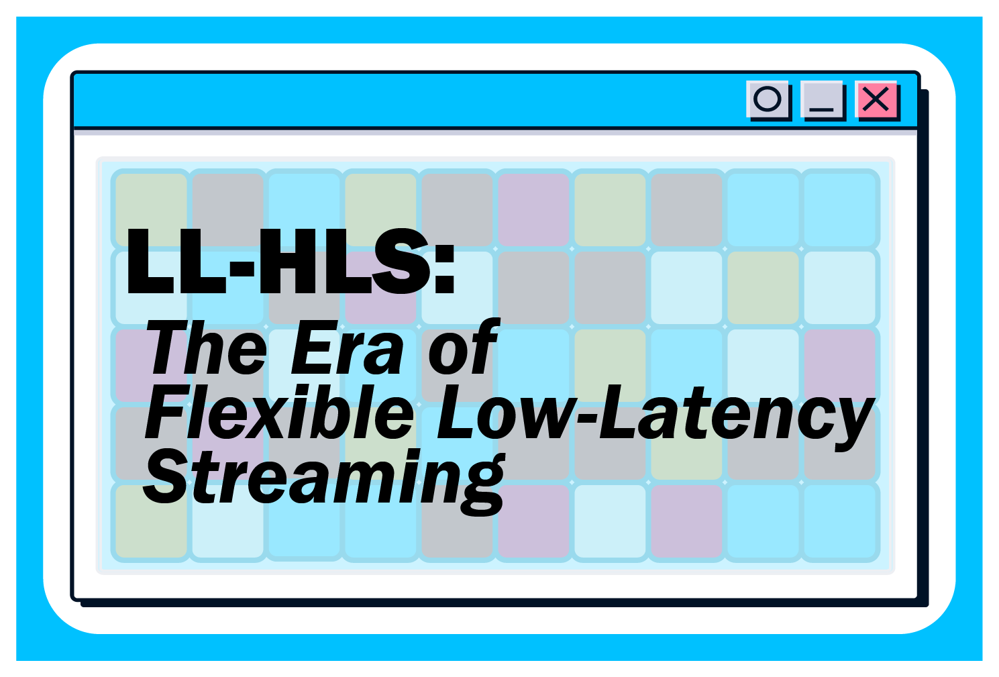
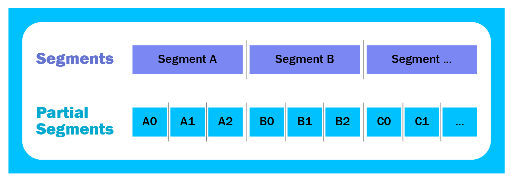
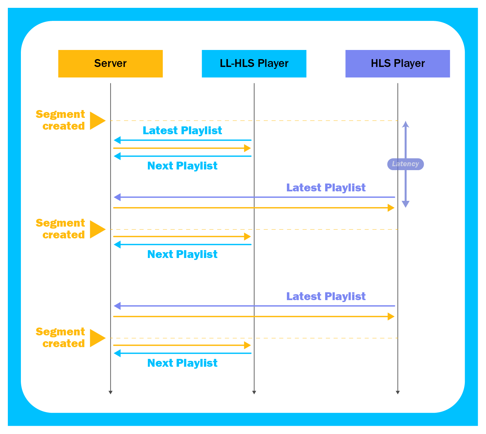
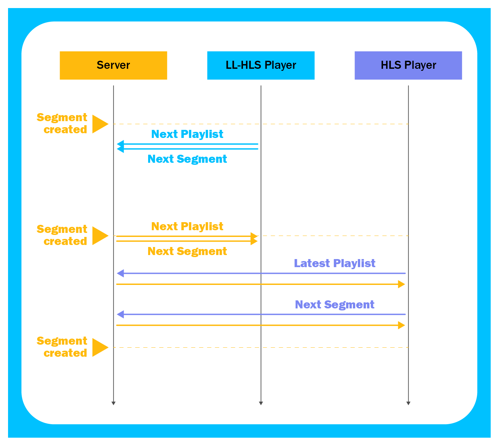
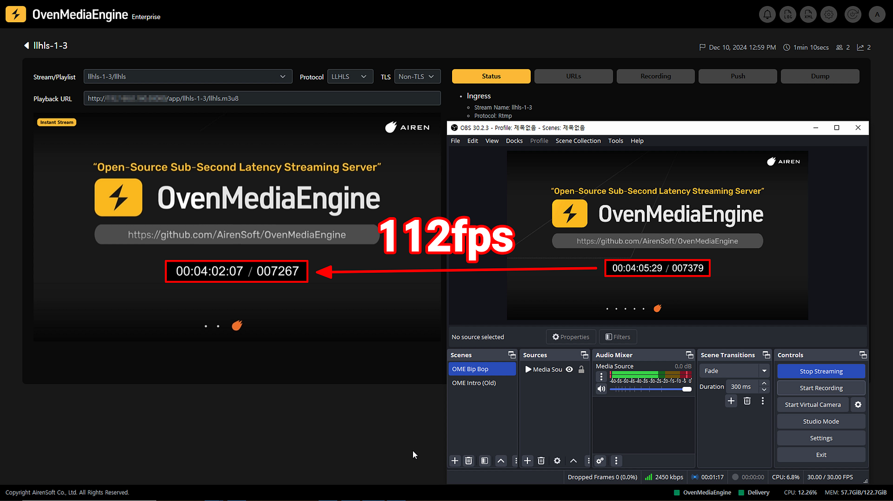
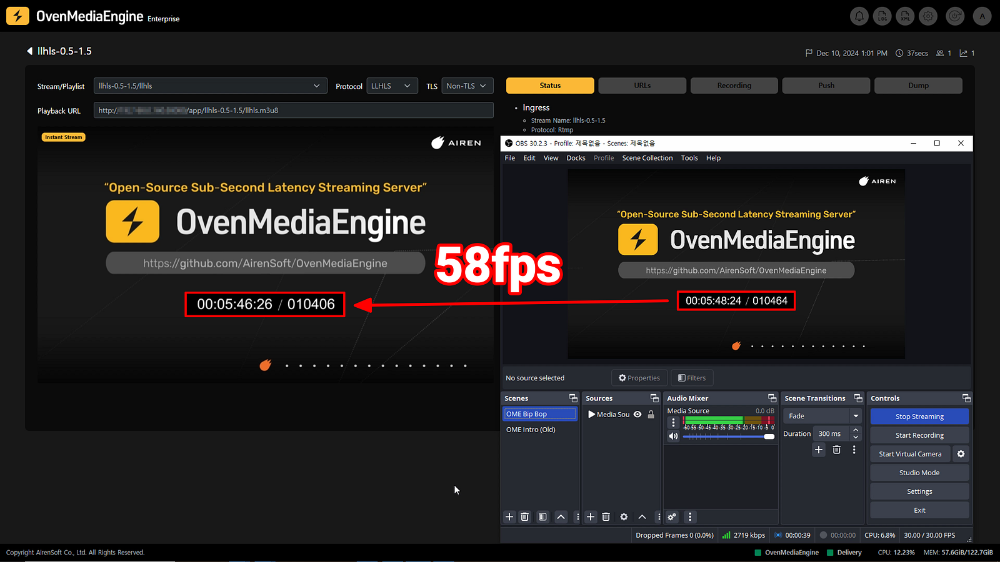
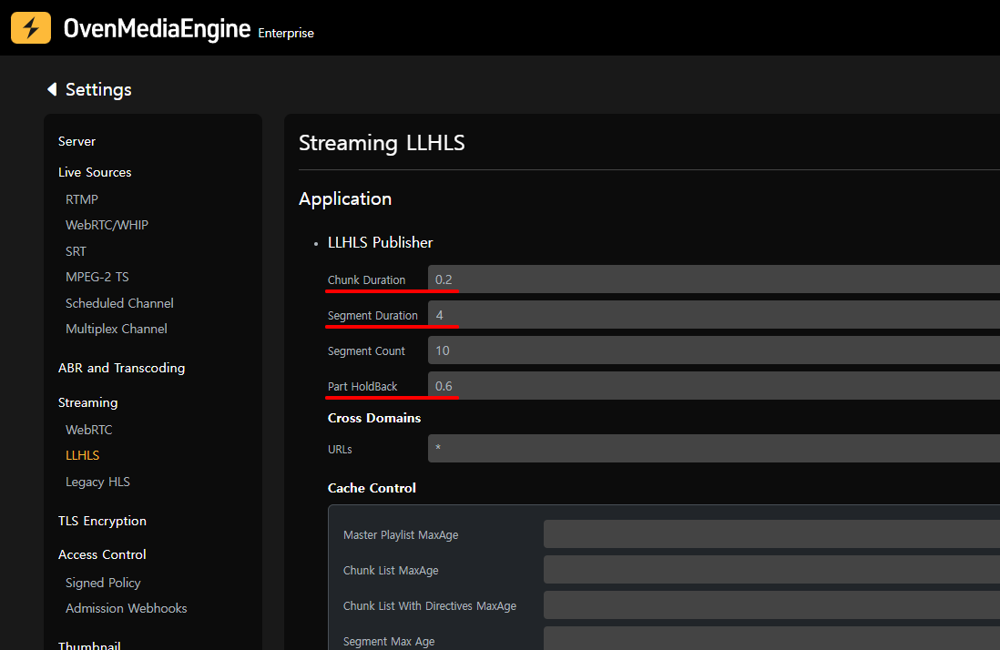
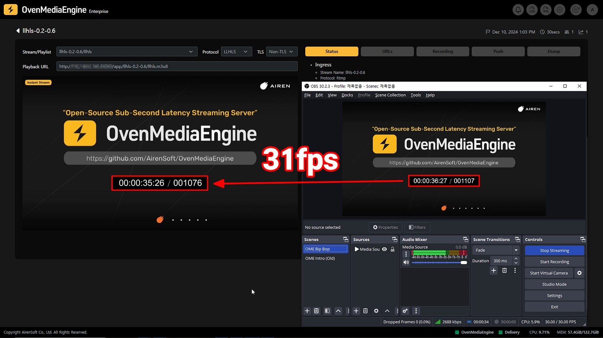

Through this three-part series, we will explore ultra-low latency streaming with WebRTC in Part 1, various tests with HLS in Part 2, and finally, Low-Latency HLS in the last part.

{/* truncate */}

- [[Part1] WebRTC: A New Paradigm for Real-Time Web Communication](/blog/webrtc-a-new-paradigm-for-real-time-web-communication)
- [[Part2] HLS: IS it Possible to Achieve Low-Latency Streaming with HLS?](/blog/rethinking-hls-is-it-possible-to-achieve-low-latency-streaming-with-hls)
- [**[Part3] Low-Latency HLS: The Era of Flexible Low-Latency Streaming**](/blog/low-latency-hls-the-era-of-flexible-low-latency-streaming)



In a previous post, we explored various ways to achieve low-latency streaming in HTTP Live Streaming (HLS) while maintaining stability and quality, such as adjusting the Segment Duration, examining the impact of Keyframe Interval on quality, and more. While we were able to reach impressive low-latency levels numerically, we concluded that commercializing this approach presents significant challenges. Today, we will dive into Low-Latency HLS *(often abbreviated as LL-HLS, though we will refer to it as Low-Latency HLS)* and examine how it achieves low-latency streaming while maintaining stability and scalability.

Additionally, using OvenMediaEngine, we focused on the stability, balance, and latency of Low-Latency HLS, achieving a latency of approximately 1 to 4 seconds. In this post, we share the testing process and results.

## What is Low-Latency HLS?

Low-Latency HLS is an extension of the HLS protocol that enables low-latency video streaming while maintaining scalability and stability.

### Backward Compatibility of HLS

Since Low-Latency extensions are additions rather than replacements, servers should be prepared to support regular-latency playback of HLS to allow clients to fall back to standard playback if they determine that low-latency requirements are not met.

Therefore, it provides backward compatibility, and the usage notes of each version are as follows —

[About the EXT-X-VERSION tag | Apple Developer Documentation](https://developer.apple.com/documentation/http-live-streaming/about-the-ext-x-version-tag)

- You must use an #EXT-X-VERSION:3 or higher if you have floating point #EXTINF duration values.
- You must use an #EXT-X-VERSION:6 or higher if you have #EXT-X-MAP in a Media Playlist that does not contain #EXT-X-I-FRAMES-ONLY.
- You must use an #EXT-X-VERSION:9 or higher if you have #EXT-X-SKIP.
- You must use an #EXT-X-VERSION:10 or higher if you have #EXT-X-SERVER-CONTROL, #EXT-X-PART-INF, #EXT-X-PRELOAD-HINT, #EXT-X-RENDITION-REPORT, and more for Low-Latency.

Although it is officially stated that HLS supports low-latency streaming starting from version 10, Low-Latency HLS has been researched and extended over a long period, so there may be versions other than version 10 that support low-latency streaming depending on the method used.

## How Does Low-Latency HLS Reduce Latency?

To achieve low-latency stream playback, backend production tools and content delivery systems must adopt updated protocols and implement additional rules. This article explores the core concepts and mechanisms that enable Low-Latency HLS to achieve reduced latency:

## Partial Segments



Low-Latency HLS provides a parallel channel for distributing media at the live edge of the Media Playlist, which divides the media into a larger number of smaller files, such as CMAF Chunks. These smaller files are called HLS Partial Segments. Because each Partial Segment has a short duration, it can be packaged, published, and added to the Media Playlist much earlier than its Parent Segment —

[Enabling Low-Latency HTTP Live Streaming (HLS) | Apple Developer Documentation](https://developer.apple.com/documentation/http-live-streaming/enabling-low-latency-http-live-streaming-hls#Generate-Partial-Media-Segments)

**How It Works**:

- Partial Segments are created and sent to the Media Playlist shortly after being generated. This means they can reach the viewer much faster than waiting for a full segment to complete.
- Moreover, they break away from the traditional rule that HLS segments must always start with a keyframe. If a Partial Segment is marked with the INDEPENDENT=YES tag, playback can begin from that point.
- To reduce the bloat of the Playlist, the server removes Partial Segments from the Media Playlist once they’re greater (older) than three target durations from the live edge.

**Container**: The MPEG-4 Fragment is specified in the ISO Base Media File Format (ISOBMFF), and RFC8216bis provides a detailed definition of Fragmented MP4 (fMP4) as one of the Supported Media Segment Formats. The Common Media Application Format (CMAF) header meets all these requirements. Additionally, according to the RFC8216bis specification, not only CMAF but also MPEG-2 TS can be used for Partial Segments —

[HTTP Live Streaming 2nd Edition](https://datatracker.ietf.org/doc/html/draft-pantos-hls-rfc8216bis-16#section-3.1)

**Tags and Attributes**:

- **#EXT-X-PART-INF**: The EXT-X-PART-INF tag provides information about the Partial Segments in the Playlist.
- **PART-TARGET**: PART-TARGET indicates the Part Target Duration.
- **#EXT-X-PART**: The EXT-X-PART tag identifies a Partial Segment.
- **URI**: The value is a quoted-string containing the URI for the Partial Segment.
- **DURATION**: The value is the duration of the Partial Segment.
- **INDEPENDENT**: The value is YES if the Partial Segment contains an independent frame.
- **#EXT-X-SERVER-CONTROL**: The EXT-X-SERVER-CONTROL tag allows the Server to indicate support for Delivery Directives.
- **PART-HOLD-BACK**: The value indicates the server-recommended minimum distance from the end of the Playlist at which clients should begin to play or to which they should seek when playing in Low-Latency Mode. Its value must be at least twice the Part Target Duration. Its value should be at least three times the Part Target Duration. If different Renditions have different Part Target Durations then PART-HOLD-BACK should be at least three times the maximum Part Target Duration.

**For example:**

```javascript
#EXTM3U
#EXT-X-VERSION:10
#EXT-X-TARGETDURATION:6
#EXT-X-SERVER-CONTROL:CAN-BLOCK-RELOAD=YES,PART-HOLD-BACK=1.500000
#EXT-X-PART-INF:PART-TARGET=0.500000
...
#EXT-X-PART:DURATION=0.500,URI="part_1_31_0_video_vXjbEtmq_llhls.m4s?session=23_0Ec5agfl",INDEPENDENT=YES
#EXT-X-PART:DURATION=0.500,URI="part_1_31_1_video_vXjbEtmq_llhls.m4s?session=23_0Ec5agfl",INDEPENDENT=YES
#EXT-X-PART:DURATION=0.500,URI="part_1_31_2_video_vXjbEtmq_llhls.m4s?session=23_0Ec5agfl"
#EXT-X-PART:DURATION=0.500,URI="part_1_31_3_video_vXjbEtmq_llhls.m4s?session=23_0Ec5agfl",INDEPENDENT=YES
#EXT-X-PART:DURATION=0.500,URI="part_1_31_4_video_vXjbEtmq_llhls.m4s?session=23_0Ec5agfl"
...
```

## Playlist Delta Updates

Clients transfer playlists more frequently with Low-Latency HLS. They can request and servers can provide Playlist Delta Updates, which reduce this transfer cost. These updates replace a considerable portion of the Playlist that the client already has with the new #EXT-X-SKIP tag —

[Enabling Low-Latency HTTP Live Streaming (HLS) | Apple Developer Documentation](https://developer.apple.com/documentation/http-live-streaming/enabling-low-latency-http-live-streaming-hls#Provide-Playlist-Delta-Updates)

## Blocking Playlist Reloads



The Low-Latency HLS Player initially requests the latest Playlist from the Server and subsequently uses special query parameters called Delivery Directives to request specific Playlists containing future Segments. The server then holds onto the request (blocks) until a version of the Playlist containing that segment is available. Because the Server responds immediately after the Playlist is updated, the data is buffered more quickly on the Player side. This mechanism, known as Blocking Playlist Reloads, eliminates the need for Playlist polling and enables efficient client notification of new Media Segments and Partial Segments —

[Enabling Low-Latency HTTP Live Streaming (HLS) | Apple Developer Documentation](https://developer.apple.com/documentation/http-live-streaming/enabling-low-latency-http-live-streaming-hls#Blocking-Playlist-reloads)

**Tags and Attributes**:

- **#EXT-X-SERVER-CONTROL**: The EXT-X-SERVER-CONTROL tag allows the Server to indicate support for Delivery Directives.
- **CAN-BLOCK-RELOAD**: The value is YES if the server supports Blocking Playlist Reload.

**For example**:

```javascript
#EXTM3U
#EXT-X-VERSION:10
#EXT-X-TARGETDURATION:6
#EXT-X-SERVER-CONTROL:CAN-BLOCK-RELOAD=YES,PART-HOLD-BACK=1.5
#EXT-X-PART-INF:PART-TARGET=0.500000
#EXT-X-MEDIA-SEQUENCEa:24
…
```

## Preload Hints and Blocking of Media Downloads



The Low-Latency HLS Player receives the next Playlist from the Server and uses the #EXT-X-PRELOAD-HINT tag to pre-request upcoming Partial Segments or Media Initialization Sections. A client can issue a GET request for a hinted resource in advance, and the Server holds the request, responding immediately when the media becomes available. This mechanism eliminates unnecessary round trips and supports the delivery of low-latency streams at a global scale, making it particularly effective when playlist download speeds are slow —

[Enabling Low-Latency HTTP Live Streaming (HLS) | Apple Developer Documentation](https://developer.apple.com/documentation/http-live-streaming/enabling-low-latency-http-live-streaming-hls#Provide-Preload-Hints-and-Blocking-of-Media-Downloads)

**Tags and Attributes**:

- **#EXT-X-PRELOAD-HINT**: The EXT-X-PRELOAD-HINT tag allows a Client loading media from a live stream to reduce the time to obtain a resource from the Server by issuing its request before the resource is available to be delivered. The server will hold onto the request (“block”) until it can respond.
- **TYPE**: The value is the type of the hinted resource. If the value is PART, the resource is a Partial Segment.
- **URI**: The value is a quoted-string containing a URI identifying the hinted resource.

**For example**:

```javascript
…
#EXT-X-PART-INF:PART-TARGET=0.500000
…
#EXT-X-PART:DURATION=0.500,URI="part_1_31_7_video_vXjbEtmq_llhls.m4s?session=23_0Ec5agfl",INDEPENDENT=YES
#EXT-X-PART:DURATION=0.500,URI="part_1_31_8_video_vXjbEtmq_llhls.m4s?session=23_0Ec5agfl",INDEPENDENT=YES
#EXT-X-PART:DURATION=0.500,URI="part_1_31_9_video_vXjbEtmq_llhls.m4s?session=23_0Ec5agfl"
#EXT-X-PRELOAD-HINT:TYPE=PART,URI="part_1_31_10_video_vXjbEtmq_llhls.m4s?session=23_0Ec5agfl"
…
```

## Rendition Reports

The Rendition Reports feature allows the Player to efficiently switch between renditions by providing direct information about the current playback position in other renditions. Normally, the Player would need to request the Multivariant Playlist (e.g., chunklist_0_video_llhls.m3u8), find the correct playback position, and determine the appropriate _HLS_msn and _HLS_part parameters to request the next Segment or Partial Segment. With Rendition Reports, the #EXT-X-RENDITION-REPORT tag provides the last Media Sequence Number (_HLS_msn) and Partial Segment Number (_HLS_part) for each rendition, allowing the Player to request the required Chunklist and media directly. This streamlines the switch renditions with a minimum number of round trips and minimizes latency during playback transitions —

[Enabling Low-Latency HTTP Live Streaming (HLS) | Apple Developer Documentation](https://developer.apple.com/documentation/http-live-streaming/enabling-low-latency-http-live-streaming-hls#Provide-Rendition-Reports)

**Tags and Attributes**:

- **#EXT-X-RENDITION-REPORT**: The EXT-X-RENDITION-REPORT tag carries information about an associated Rendition that is as up-to-date as the Playlist that contains it.
- **URI**: The value is a quoted-string containing the URI for the Media Playlist of the specified Rendition.
- **LAST-MSN**: The value specifies the Media SequenceNumber of the last Media Segment currently in the specified Rendition.
- **LAST-PART**: The value indicates the Part Index of the last Partial Segment currently in the specified Rendition whose Media Sequence Number is equal to the LAST-MSN attribute value.

**For Example**:

```javascript
…
#EXT-X-PART:DURATION=0.500,URI="part_1_33_6_video_vXjbEtmq_llhls.m4s?session=23_0Ec5agfl"
#EXT-X-PART:DURATION=0.500,URI="part_1_33_7_video_vXjbEtmq_llhls.m4s?session=23_0Ec5agfl",INDEPENDENT=YES
#EXT-X-PRELOAD-HINT:TYPE=PART,URI="part_1_33_8_video_vXjbEtmq_llhls.m4s?session=23_0Ec5agfl"
#EXT-X-RENDITION-REPORT:URI="chunklist_0_video_llhls.m3u8?session=23_0Ec5agfl",LAST-MSN=33,LAST-PART=8
#EXT-X-RENDITION-REPORT:URI="chunklist_2_video_llhls.m3u8?session=23_0Ec5agfl",LAST-MSN=33,LAST-PART=8
#EXT-X-RENDITION-REPORT:URI="chunklist_3_video_llhls.m3u8?session=23_0Ec5agfl",LAST-MSN=33,LAST-PART=8
```

## Delivery Directives

A server may provide a set of services to its clients by implementing support for Delivery Directives. These Delivery Directives include —

[HTTP Live Streaming 2nd Edition](https://datatracker.ietf.org/doc/html/draft-pantos-hls-rfc8216bis-16#section-6.2.5)

**Tags and Attributes**:

- **_HLS_msn=&lt;M>**: Indicates that the server must hold the request until a Playlist contains a Media Segment with Media Sequence Number of M or later.
- **_HLS_part=&lt;N>**: Indicates, in combination with _HLS_msn, that the server must hold the request until a Playlist contains Partial Segment N of Media Sequence Number M or later.

**For example**:

```javascript
[Latest Playlist]
https://domain/app/stream1/chunklist_1_video_llhls.m3u8

[Future Playlist]
https://domain/app/stream1/chunklist_1_video_llhls.m3u8?_HLS_msn=31&_HLS_part=3
```

## Low-Latency HLS Optimization and Performance Analysis in OvenMediaEngine

You can configure OvenMediaEngine for Low-Latency HLS to achieve stability, balance, or low latency according to your environment, situation, and objectives. The OvenMediaEngine team conducted various performance tests for Low-Latency HLS by adjusting key parameters —

[Low-Latency HLS | OvenMediaEngine](/docs/ome/streaming/low-latency-hls#configuration)

### OvenMediaEngine LLHLS Configuration

- **Partial Segment Duration**: This is represented as &lt;ChunkDuration> in the OvenMediaEngine settings. In the tests below, it was set to 0.2–1 seconds.
- **Segment Duration**: This refers to the length of a Segment and is represented as &lt;SegmentDuration> in the OvenMediaEngine settings. While Apple recommends 6 seconds, the tests below used a value of 4 seconds.
- **Segment Count**: This indicates the number of Segments listed in the Playlist and is represented as &lt;SegmentCount> in the OvenMediaEngine settings. This value has little effect on Low-Latency HLS players, so the tests followed Apple’s recommendation of 10 segments. Do not set below 3. It can only be used for experimentation.
- **Part Hold Back**: This is represented as &lt;PartHoldBack> in the OvenMediaEngine settings and refers to the additional buffer time a Low-Latency HLS player must hold before playback to ensure streaming stability. The Part Hold Back value must be at least 2–3 times the Part Target Duration according to the rules. Based on this, the configuration below was set to 0.6–3 seconds, which is three times the already configured Partial Segment Duration of 0.2–1 seconds.

## #01. Configuration — Focus on Stability


**Configuration**:

- **Partial Segment Duration **(&lt;ChunkDuration>): 1 second
- **Segment Duration **(&lt;SegmentDuration>): 4 seconds
- **Segment Count** (&lt;SegmentCount>): 10
- **Part Hold Back **(&lt;PartHoldBack>): 3 seconds



This configuration prioritizes stability in environments with high network instability. The longer Part Hold Back time reduces buffering risk but results in increased overall latency.

- **Result**: 112 frames (3.734 seconds) latency
- **Server Buffer**: 0.1 to 0.9 seconds
- **Part Hold Back**: 3 seconds
- **Other factors **(Encoder, Ingest, Package, A/V gap, etc.): 0.2 seconds

## #02. Configuration — Focus on Balance


**Configuration**:

- **Partial Segment Duration **(&lt;ChunkDuration>): 0.5 seconds
- **Segment Duration **(&lt;SegmentDuration>): 4 seconds
- **Segment Count** (&lt;SegmentCount>): 10
- **Part Hold Back **(&lt;PartHoldBack>): 1.5 second



This balanced configuration aims to achieve moderate streaming stability and low latency, making it suitable for most low-latency streaming services.

- **Result**: 58 frames (1.934 seconds) latency
- **Server Buffer**: 0.1 to 0.5 seconds
- **Part Hold Back**: 1.5 seconds
- **Other factors **(Encoder, Ingest, Package, A/V gap, etc.): 0.2 seconds

## #03. Configuration — Focus on Low-Latency



**Configuration**:

- **Partial Segment Duration **(&lt;ChunkDuration>): 0.2 seconds
- **Segment Duration **(&lt;SegmentDuration>): 4 seconds
- **Segment Count** (&lt;SegmentCount>): 10
- **Part Hold Back **(&lt;PartHoldBack>): 0.6 seconds



This low-latency configuration achieves the lowest possible latency but increases the risk of buffering in unstable network conditions or under high server load. It may not be suitable for most streaming services where stability is crucial.

- **Result**: 31 frames (1.034 seconds) latency
- **Server Buffer**: 0.1 to 0.2 seconds
- **Part Hold Back**: 0.6 seconds
- **Other factors **(Encoder, Ingest, Package, A/V gap, etc.): 0.2 seconds

### Analysis and Insights

- Reducing the &lt;ChunkDuration> from 1 second to 0.2 seconds significantly decreased total latency from 3.734 seconds to 1.034 seconds. This is a key benefit of Low-Latency HLS, as it allows the transmission of smaller units of segments.
- Reducing the Part Hold Back value decreases latency, but values that are too small can increase the risk of buffering.

## Optimal Configuration Selection

Based on the test results, OvenMediaEngine recommends the following Low-Latency HLS settings.

- **Partial Segment Duration**: 0.5 seconds
- **Segment Duration**: 4 to 6 seconds
- **Segment Count**: 10
- **Part Hold Back**: 1.5 seconds

This configuration provides a low latency of 2 to 3 seconds while enabling stable low-latency streaming. From a user experience perspective, if a service can provide streaming in less than 3 seconds, it can be perceived as having sufficiently low latency and can enable interactivity in streaming.

## Conclusion

Today, we conducted various tests using Low-Latency HLS with OvenMediaEngine, and as a result, we successfully achieved low latency easily, streaming stably at under 3 seconds (or approximately 3 seconds).

Low-Latency HLS is an extension of HLS designed to address inherent latency challenges while preserving its core strengths of scalability, universality, and compatibility by utilizing features such as Partial Segments, Blocking Playlist Reloads, Preload Hints, Rendition Reports, and more. Notably, Low-Latency HLS does not require replacing existing infrastructure or deploying entirely new servers, as it can utilize the existing infrastructure and CDNs already used with HLS, making it a practical and cost-effective protocol.

OvenMediaEngine leverages Low-Latency HLS to deliver large-scale, high-quality, low-latency streaming suitable for various use cases. As a streaming server, it provides an effective low-latency streaming solution tailored to the needs of modern streaming services. The OvenMediaEngine team is committed to advancing low-latency streaming technology and continually enhancing the streaming experience.

Thank you!

## For more information

- [OvenMediaEngine Website](https://airensoft.com/ome.html)
- [OvenMediaEngine GitHub](https://github.com/AirenSoft/OvenMediaEngine)
- [OvenMediaEngine User Guide](/docs/ome)
