While new technologies continue to emerge, HTTP Live Streaming (HLS) remains a stable, universal, and widely supported streaming protocol across the digital ecosystem because HLS was designed with a focus on stability to deliver media on a global scale. This required some level of buffering and latency to ensure a seamless viewing experience. However, with the increasing demand for two-way media services, the need for low-latency streaming has grown significantly.

{/* truncate */}

So then, can low latency be achieved using HLS? Through our tests, we discovered that the minimum achievable latency with HLS, while maintaining quality and stability, is approximately 6 seconds. In this post, media technology experts at OvenMediaEngine explain the experimental process that led us to this conclusion. In Part 3, we will describe how Low-Latnecy HLS reduces latency. Please check out the series below.

- [[Part1] WebRTC: A New Paradigm for Real-Time Web Communication](/blog/webrtc-a-new-paradigm-for-real-time-web-communication)
- [**[Part2] HLS: IS it Possible to Achieve Low-Latency Streaming with HLS?**](/blog/rethinking-hls-is-it-possible-to-achieve-low-latency-streaming-with-hls)
- [[Part3] Low-Latency HLS: The Era of Flexible Low-Latency Streaming](/blog/low-latency-hls-the-era-of-flexible-low-latency-streaming)

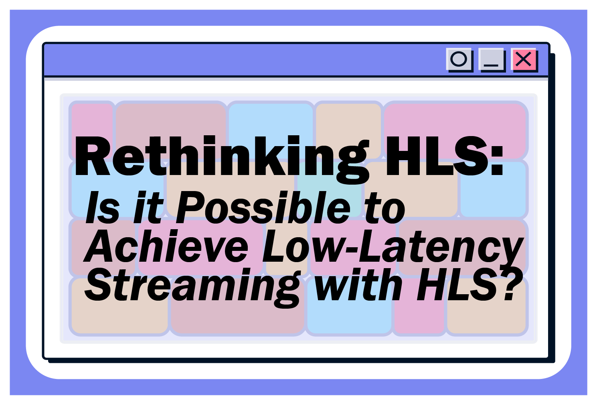

## Why Does HLS Remain Widely Used in Modern Streaming?

HLS is one of the most widely used streaming protocols in the modern digital ecosystem. HLS delivers audio and video over HTTP, it enables playback on a wide range of devices and platforms. This universality supports stable playback across desktops, mobile devices, smart TVs, and even IoT devices. Also, HLS uses the same protocol that powers the web, allowing content to be distributed through web servers and Content Delivery Networks (CDN). These qualities make it a reliable and widely adopted choice for streaming providers worldwide.

## Reducing Latency in HLS: Understanding and Adjusting Segment Duration

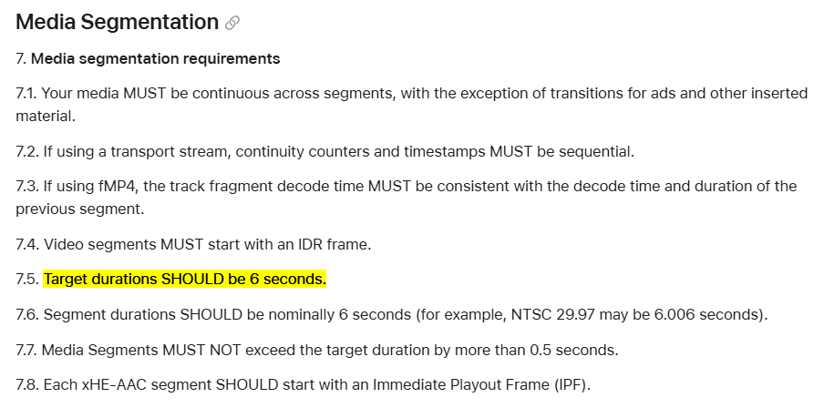

Apple recommends a segment duration of 6 seconds for HLS streaming, as outlined in their documentation. This recommendation highlights HLS’s primary focus on stability streaming and playback —

[HTTP Live Streaming (HLS) authoring specification for Apple devices | Apple Developer Documentation](https://developer.apple.com/documentation/http-live-streaming/hls-authoring-specification-for-apple-devices#Media-Segmentation)

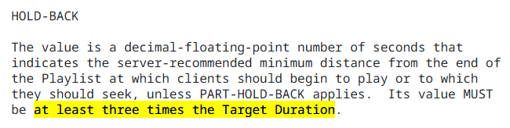

According to RFC8216bis-16 (HLS2) 4.4.3.8. EXT-X-SERVER-CONTROL, the HOLD-BACK value must be at least three times the Target Duration *(referred to as Segment Duration)*. As a result, with the Apple-recommended Target Duration of 6 seconds, the minimum delay inherently starts at 18 seconds —

[HTTP Live Streaming 2nd Edition](https://datatracker.ietf.org/doc/html/draft-pantos-hls-rfc8216bis#section-4.4.3.8)

Before conducting our tests, we referred to these references to better understand the causes of HLS’s long latency and discovered that following the recommended guidelines results in a minimum delay of 18 seconds. With this understanding, we hypothesized that reducing the segment duration would naturally decrease latency. Based on this assumption, we decided to adjust the relevant parameters to test its impact on real-time streaming performance.

### HLS Tags Used in This Test

- **#EXT-X-TARGETDURATION**: The EXT-X-TARGETDURATION tag specifies the maximum Media Segment duration. It applies to the entire Playlist file.
- **#EXT-X-SERVER-CONTROL**: The EXT-X-SERVER-CONTROL tag allows the Server to indicate support for Delivery Directives. Delivery Directives are transmitted by the Client to the Server as Query Parameters in the Playlist request URIs.
- **HOLD-BACK**: HOLD-BACK is an optional attribute of EXT-X-SERVER-CONTROL. This indicates the server-recommended minimum distance from the end of the Playlist at which clients should begin to play or to which they should seek, unless PART-HOLD-BACK applies. Its value must be at least three times the Target Duration. It may appear in any Media Playlist.
- **#EXT-X-START**: The EXT-X-START tag indicates a preferred point at which to start playing a Playlist. By default, clients should start playback at this point when beginning a playback session.
- **TIME-OFFSET**: TIME-OFFSET is a required attribute of EXT-X-START. In TIME-OFFSET, a positive number indicates a time offset from the beginning of the Playlist. A negative number indicates a negative time offset from the end of the last Media Segment in the Playlist. The absolute value of TIME-OFFSET should not be larger than the Playlist duration.

### Explaining the Test Options: Live Encoder and Streaming Server Settings

In this test, below is a breakdown of specific configurations for the live encoder (OBS) and streaming server (OvenMediaEngine) and their roles:

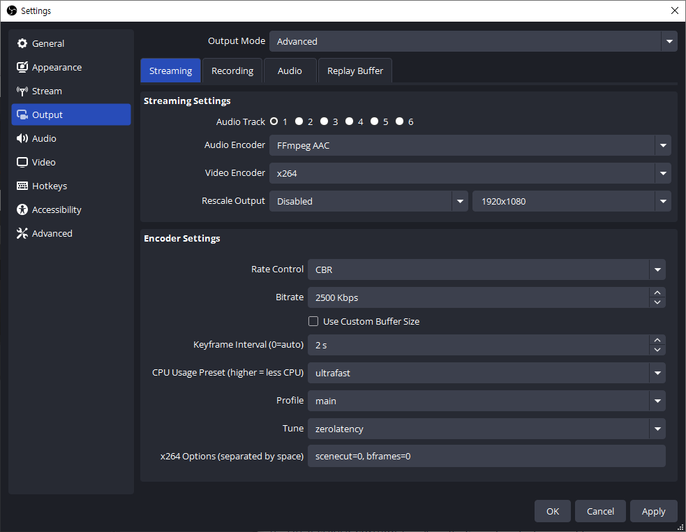

**In Live Encoder (OBS) Settings,**

- **Rate Control **(CBR)**: **CBR can send a consistent bitrate throughout the stream, which is suitable for live streaming.
- **Bitrate **(2500 Kbps): This specifies the data rate at which the video is streamed.
- **FPS **(30): 30 frames per second provides smooth motion for most streaming while keeping processing and bandwidth requirements manageable.
- **Keyframe Interval **(1 or 2): Keyframe intervals dictate how often a full video frame (I-frame) is encoded.
- **CPU Usage Preset **(ultrafast): The ‘ultrafast’ preset minimizes CPU usage by prioritizing encoding speed over compression efficiency.
- **Profile **(Main): The ‘Main’ profile balances compatibility and quality, making it suitable for most streaming.
- **Tune **(zerolatency): This tuning option optimizes the encoder for low-latency streaming, reducing buffering and improving performance by prioritizing speed over compression.
- **x264 Options **(scenecut=0, bframes=(0, 1, or 2)): Disables scene-cut detection (scenecut=0), enabling more predictable keyframe placement. And controls the number of B-frames (bframes=0, 1, or2) used in the compression for encoding.

**In Streaming Server (OvenMediaEngine) Settings,**

- **Video **(Pass-through; H264): The server directly forwards the H264-encoded video stream from the encoder without transcoding.
- **Audio **(Pass-through; AAC): Similar to video, the AAC-encoded audio is forwarded without transcoding.

### #01. When Setting the Segment Duration to 1 Second to Reduce Latency

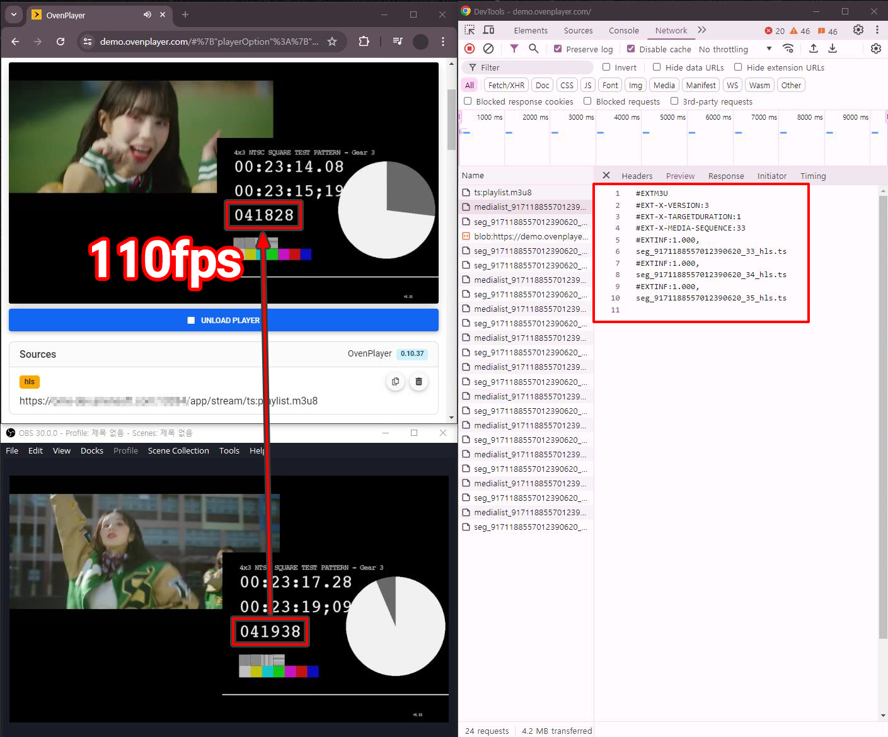

**Configuration**:

- **Segment Duration **(#EXT-X-TARGETDURATION): 1 second
- **Hold Back **(#EXT-X-SERVER-CONTROL:HOLD-BACK): 3 seconds
- **Keyframe Interval**: 1 second
- **x264 Options**: scenecut=0, bframes=0

We conducted tests based on the hypothesis that a shorter Segment Duration would naturally reduce streaming latency. Applying the rule that the Hold Back must be at least three times the Segment Duration, we achieved a result of approximately 3.667 seconds. Since the latency of 3 to 5 seconds is commonly referred to as ‘low latency,’ we confirmed that numerical low latency is achievable by adjusting HLS tags.

- **Result**: 110 frames (3.667 seconds) latency
- **Server Buffer**: 0.1 to 0.9 seconds (time required to create a new segment)
- **Player Hold-Back**: 3 seconds
- **Other factors **(Encoder, Ingest, Package, A/V gap, etc.): 0.2 seconds

### #02. When Setting a Negative Time Offset to Further Reduce Latency

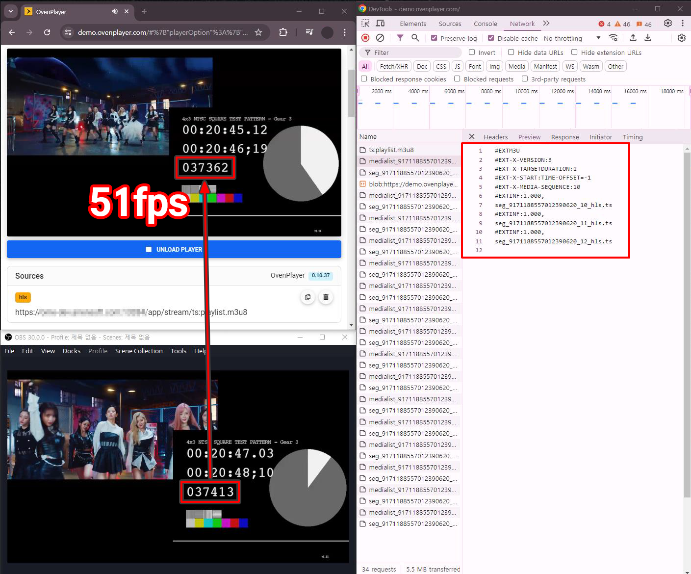

**Configuration**:

- **Segment Duration **(#EXT-X-TARGETDURATION): 1 seconds
- **Hold Back **(#EXT-X-SERVER-CONTROL:HOLD-BACK): 3 seconds
- **Time Offset **(#EXT-X-START:TIME-OFFSET): -1 seconds
- **Keyframe Interval**: 1 seconds
- **x264 Options**: scenecut=0, bframes=0

We previously achieved an impressive result of 3.667 seconds in the test as #01, using HLS with TARGETDURATION:1. Building on that result, we adjusted the START:TIME-OFFSET to a negative value, equal to the Segment Duration, to further reduce latency. This adjustment created a negative offset from the end of the last Media Segment in the Playlist, allowing us to achieve an even more remarkable result of 1.7 seconds. However, this approach violates the HOLD-BACK rule, rendering it incompatible with iOS and Safari.

- **Result**: 51 frames (1.7 seconds) latency
- **Server Buffer**: 0.1 to 0.9 seconds (time required to create a new segment)
- **Player Hold-Back**: 3 seconds
- **START:TIME-OFFSET**: -1 seconds
- **Other factors **(Encoder, Ingest, Package, A/V gap, etc.): 0.2 seconds

## Reducing Latency in HLS: Achieving Low Latency in HLS Without Compromising Stability and Quality

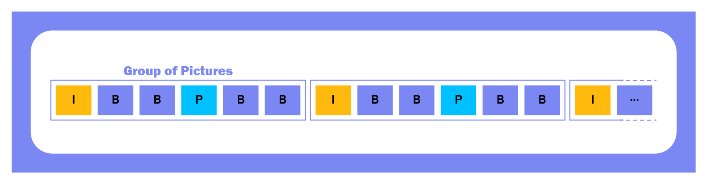

In the previous test, we achieved numerically low-latency streaming using HLS but found significant room for improvement in terms of quality. For example, test #01, which used a 1-second Keyframe Interval, resulted in degraded video quality, making it unsuitable for real-world use. Similarly, test #02, where the Time Offset was set to the negative value of the Segment Duration, violated guidelines, rendering it incompatible with iOS and Safari. Even with latency under 2 seconds, a streaming service cannot compromise on critical aspects like video quality and playback stability.

This led us to focus on how the Keyframe Interval, given that HLS segments always start with a keyframe, impacts video quality. While longer Keyframe Intervals generally improve video quality, we could not set this value to something extreme like 10 seconds since our primary goal was to test latency reduction using HLS. To address this, we referred to Video Multimethod Assessment Fusion (VMAF), a video quality evaluation method used by Netflix. According to VMAF, a difference of about 3 or more points is considered a valid threshold for humans to distinguish streaming quality.

**References**:

- THEO Blog Post — How to Optimize LL-HLS for Low Latency Streaming

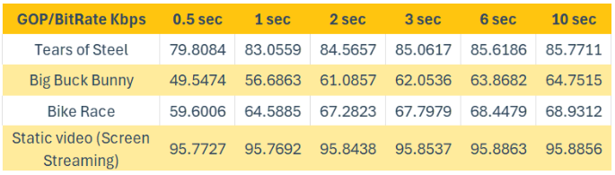

[How to Optimize LL-HLS for Low Latency Streaming](https://www.theoplayer.com/blog/how-to-optimize-ll-hls-for-low-latency-streaming)

- Apple Documentation — HTTP Live Streaming (HLS) Authoring Specification for Apple Devices (Section 1.13)

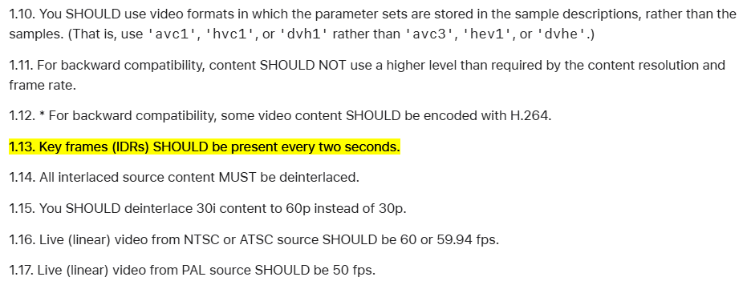

[HTTP Live Streaming (HLS) authoring specification for Apple devices | Apple Developer Documentation](https://developer.apple.com/documentation/http-live-streaming/hls-authoring-specification-for-apple-devices)

After reviewing various research findings, we discovered that a Keyframe Interval of 2 seconds strikes the best balance between quality and stability. Below are the results of our tests using this configuration.

### #03. When Setting the Keyframe Interval to 2 Seconds for Quality

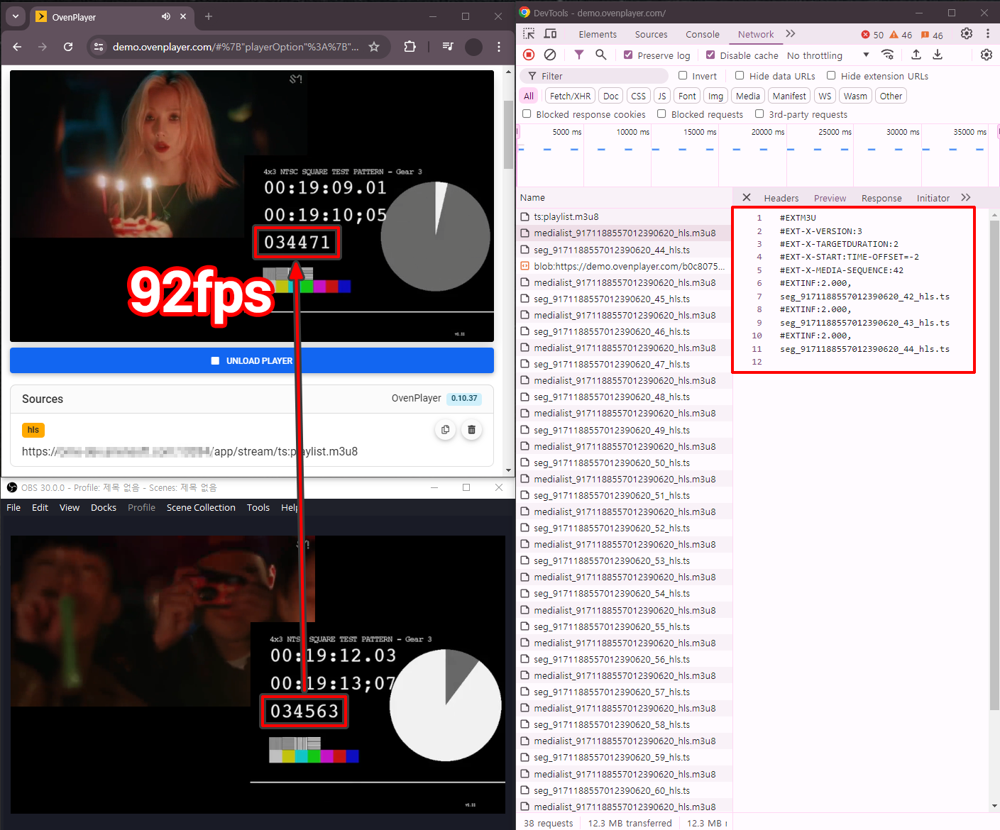

**Configuration**:

- **Segment Duration **(#EXT-X-TARGETDURATION): 2 seconds
- **Hold Back **(#EXT-X-SERVER-CONTROL:HOLD-BACK): 6 seconds
- **Time Offset **(#EXT-X-START:TIME-OFFSET): -2 seconds
- **Keyframe Interval**: 2 seconds
- **x264 Options**: scenecut=0, bframes=0

Informed by reference materials and recommendations, we learned that a keyframe interval of 2 seconds maintains a reasonable level of quality. The previous tests (#01 and #02), which focused solely on reducing streaming latency, resulted in degraded quality, making them unusable for real-world applications. To address this, we conducted a new test by setting the Keyframe Interval to 2 seconds, which naturally aligned the Segment Duration to 2 seconds. This is because the Segment Duration cannot be smaller than the Keyframe Interval since each segment requires at least one complete Keyframe. We also adjusted the Time Offset to -2 for consistent configuration. This setup achieved an excellent result of 3.067 seconds.

- **Result**: 92 frames (3.067 seconds) latency
- **Server Buffer**: 0.1 to 1.9 seconds (time required to create a new segment)
- **Player Hold-Back**: 6 seconds
- **START:TIME-OFFSET**: -2 seconds
- **Other factors **(Encoder, Ingest, Package, A/V gap, etc.): 0.2 seconds

## How much do B-Frames affect streaming quality?

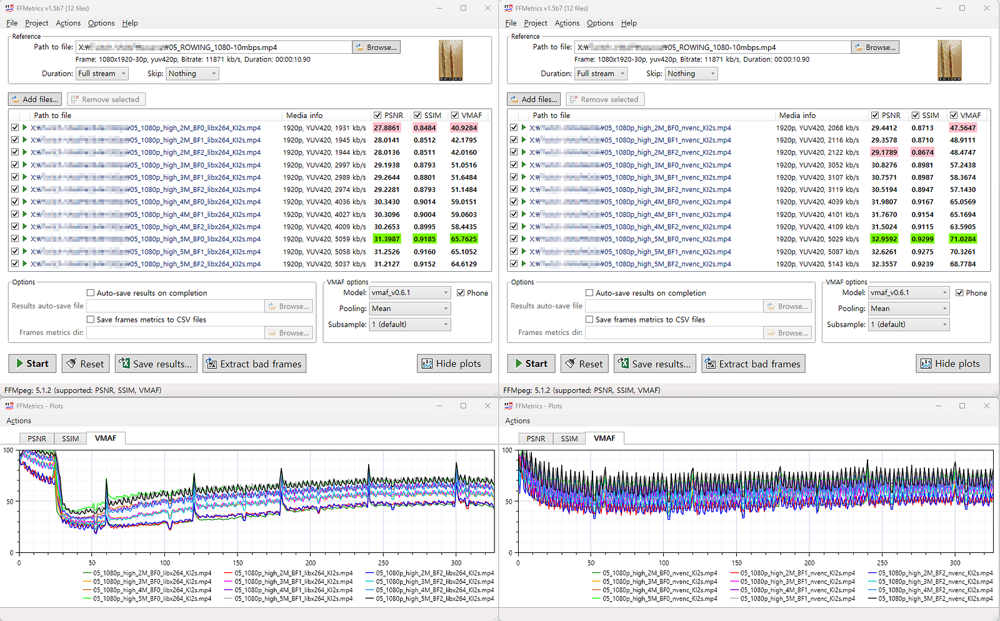

- **On the left**: $ ffmpeg-iinput.mp4-b:v2M-bf1-x264optskeyint=60:min-keyint=60:scenecut=-1-profile:vhigh-g60-r30output.mp4
- **On the right:** $ ffmpeg-iinput.mp4-b:v2M-bf1-codech264_nvenc-profile:vhigh-g60-r30output.mp4

Another factor often mentioned to affect quality is the B-Frame setting, so we conducted a test to verify this. We prepared the same video at bitrates of 2Mbps, 3Mbps, and 5Mbps and inserted B-Frames set to 0, 1, and 2 for each bitrate. The results showed that the highest VMAF score was achieved at 2Mbps with a B-Frame setting of 1, while at 5Mbps, the highest VMAF score was obtained with a B-Frame setting of 0. These results differ from the commonly accepted understanding, indicating that B-Frames do not necessarily guarantee a quality improvement.

### #04. When Setting the B-Frame Value to 2 for Quality

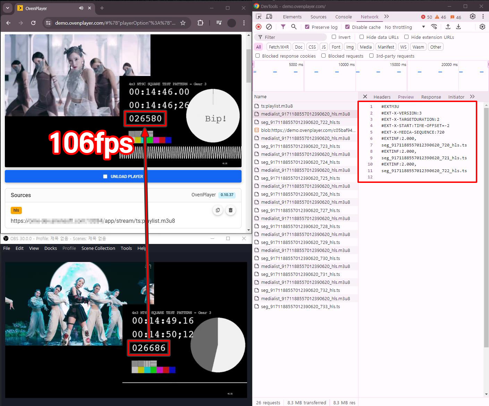

**Configuration**:

- **Segment Duration **(#EXT-X-TARGETDURATION): 2 seconds
- **Hold Back **(#EXT-X-SERVER-CONTROL:HOLD-BACK): 6 seconds
- **Time Offset **(#EXT-X-START:TIME-OFFSET): -2 seconds
- **Keyframe Interval**: 2 seconds
- **x264 Options**: scenecut=0, bframes=2

However, we didn’t stop testing and wanted to gather more conclusive data by comparing it with test #03 (which achieved a latency of 3.067 seconds). Using the same configuration as test #03, we only added the B-Frame setting to 2. As a result, the encoding and decoding of B-Frames introduced additional latency, resulting in a measured latency of 3.534 seconds, checking that B-Frames do impact latency.

From this, we confirmed again that B-Frames do not guarantee quality improvement. Moreover, since B-Frames increased latency, we concluded that there is no reason to use the B-Frame option when the goal is to minimize latency while maintaining a reasonable level of quality. Of course, if the quality had been noticeably better despite the slight increase in latency, we might have considered using the B-Frame option in real-world scenarios. However, that was not the case in our tests.

- **Result**: 106 frames (3.534 seconds) latency
- **Server Buffer**: 0.1 to 1.9 seconds (time required to create a new segment)
- **Player Hold-Back**: 6 seconds
- **START:TIME-OFFSET**: -2 seconds
- **B-frame Encoding/Decoding:** 0.2 seconds
- **Other factors **(Encoder, Ingest, Package, A/V gap, etc.): 0.2 seconds

## Stability Issues Discovered with Negative Time Offset

Additionally, in all tests except for test #01, we aimed to reduce latency as much as possible by setting the negative absolute value of the Segment Duration as the Time Offset. However, this approach revealed the following stability issues during testing.

### Player Instability

The player reloads the Playlist immediately after the playback of the last Segment ends, downloads the new Segment, and then plays the next Segment. During this process, if the timing of the Playlist Reload and Segment Download is not synchronized, a Jitter may occur.

- **Playlist Reload?** Playlist Reload is the process in HLS (HTTP Live Streaming) where the player periodically re-requests the Playlist file to fetch new segments for playback. The player can fetch the most recent segments in a live stream to keep playback continuous. Without reloading the Playlist, the player would not be aware of new segments, causing playback to stall or freeze during live streaming — [https://datatracker.ietf.org/doc/html/draft-pantos-hls-rfc8216bis#section-6.3.4](https://datatracker.ietf.org/doc/html/draft-pantos-hls-rfc8216bis#section-6.3.4).

### Server Instability

The server’s allowable Jitter range varies depending on the player’s connection timing. For players that request the server 1 second after a new Segment is created, up to 1 second of Jitter is allowed. However, for players that request immediately after the new Segment is created, no Jitter is allowed, and the Playlist must be updated within 2 seconds. If this synchronization process is not properly managed, the streaming experience may degrade.

### Factors That Can Cause Jitter

There are many factors that can cause jitter, as shown below:

- **Variations in Keyframe Interval**: Changes in Keyframe Interval due to factors such as Scenecut options or encoder performance.
- **Frame Drops Issues:** Jitter may occur in any situation where frames are dropped.
- **Issues with Video Sources **(Encoder): Problems with video sources, such as encoder performance or configuration issues, can lead to jitter.
- **Server Transcoding Performance Issues**: Insufficient server performance for processing video data may cause jitter.
- **Network Jitter Between Video Sources and Servers**: Instability in the network connection between video sources and servers can significantly contribute to jitter.
- **Server Performance While Handling Multiple Player Requests**: All players must complete Playlist Reload and Segment Download within the Jitter Buffer time, as players receiving data at the end are more likely to experience buffering, which significantly impacts the number of concurrent players the server can handle efficiently.

Of course, setting the Time Offset to a negative value violates the guidelines for iOS and Safari, meaning it would not function properly. Moreover, it poses a broader threat to the stability of HLS in global-scale streaming, making it unsuitable for real-world applications.

## Reducing Latency in HLS: Finding Optimal Configuration

### #05. When Configured for Quality and Stability

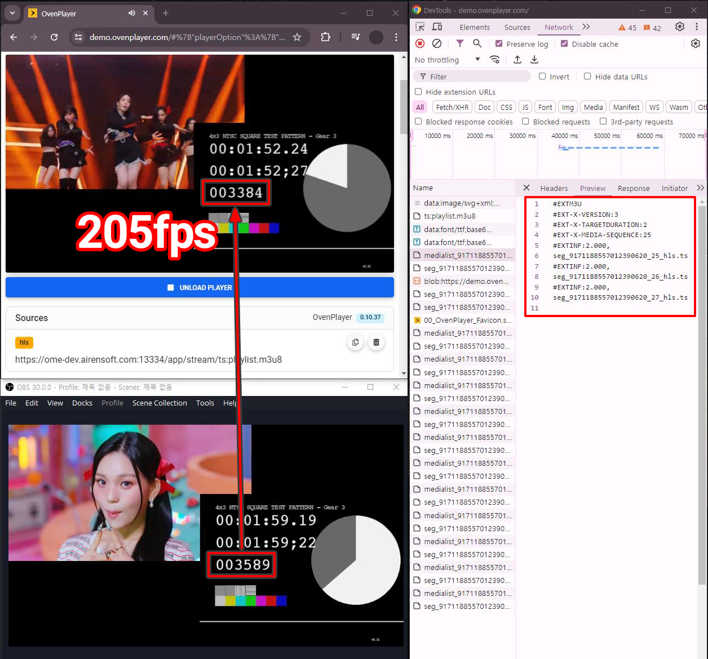

**Configuration**:

- **Segment Duration **(#EXT-X-TARGETDURATION): 2 seconds
- **Hold Back **(#EXT-X-SERVER-CONTROL:HOLD-BACK): 6 seconds
- **Keyframe Interval**: 2 seconds
- **x264 Options**: scenecut=0, bframes=0

Through various tests, we gained an understanding that the rules defined in HLS, such as the Hold Back being three times the Segment Duration, the absolute value of the Time Offset not exceeding the Playlist Duration, and more, are grounded in ensuring quality and stability. Additionally, we aimed to test based on these rules to achieve optimal results. As a result, we achieved a latency of approximately 6.834 seconds, striking a balance that delivers both quality and stability for a reliable streaming experience.

- **Result**: 205 frames (6.834 seconds) latency
- **Server Buffer**: 0.1 to 1.9 seconds (time required to create a new segment)
- **Player Hold-Back**: 6 seconds
- **Other factors **(Encoder, Ingest, Package, A/V gap, etc.): 0.2 seconds

## Conclusion

Through this test, we explored various factors to achieve low-latency streaming using HLS. While we observed measurable successes, we found that significantly reducing latency while maintaining HLS’s core strengths of stability, universality, and scalability was not achievable.

To address these limitations, HLS has extended into Low-Latency HLS. Low-Latency HLS offers a new possibility by fulfilling the demands for low-latency streaming while preserving the strengths of HLS. In the upcoming article, we will dive deeper into Low-Latency HLS and explore its key innovations, such as Partial Segments, Blocking Playlist Reloads, Preload Hints, Blocking of Media Downloads, and Rendition Reports. These mechanisms not only achieve low latency but also enhance the overall streaming experience. Through this, we will gain a deeper understanding of how Low-Latency HLS overcomes the limitations of HLS while preserving its strengths.

Thank you!

## For more information

- [OvenMediaEngine Website](https://airensoft.com/ome.html)
- [OvenMediaEngine GitHub](https://github.com/AirenSoft/OvenMediaEngine)
- [OvenMediaEngine User Guide](https://airensoft.gitbook.io/ovenmediaengine)
