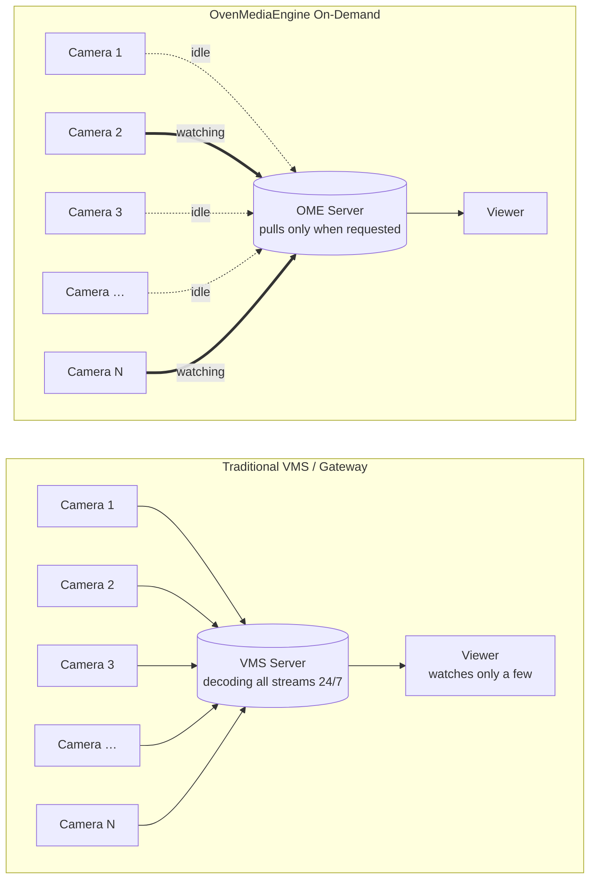
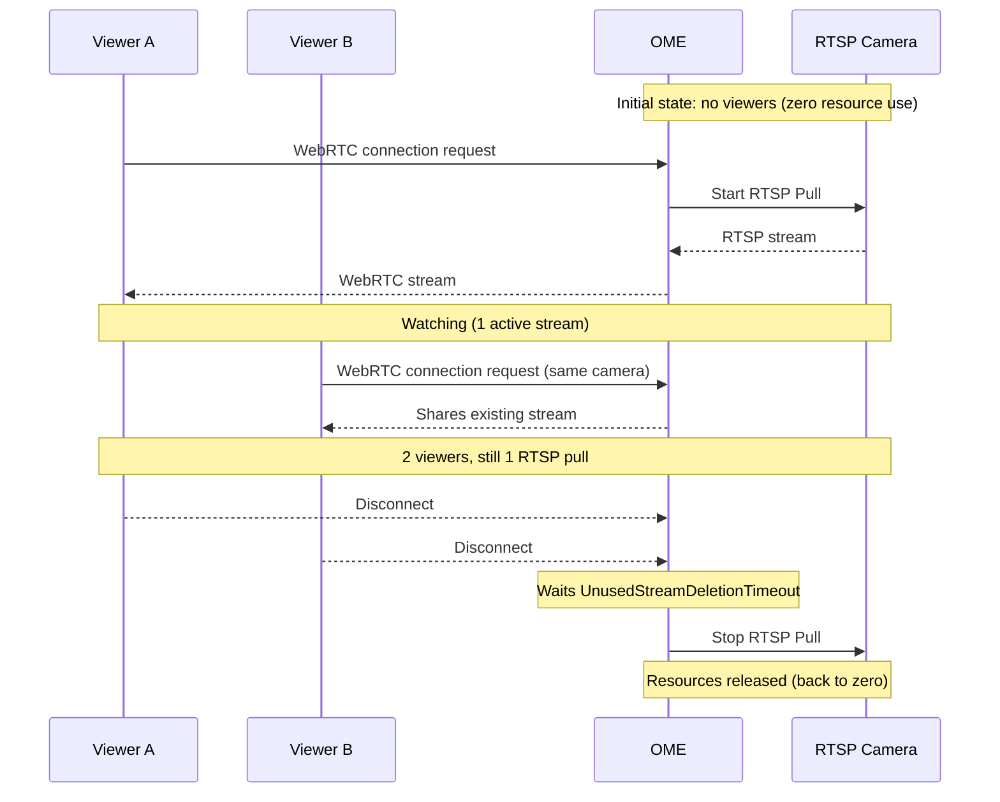
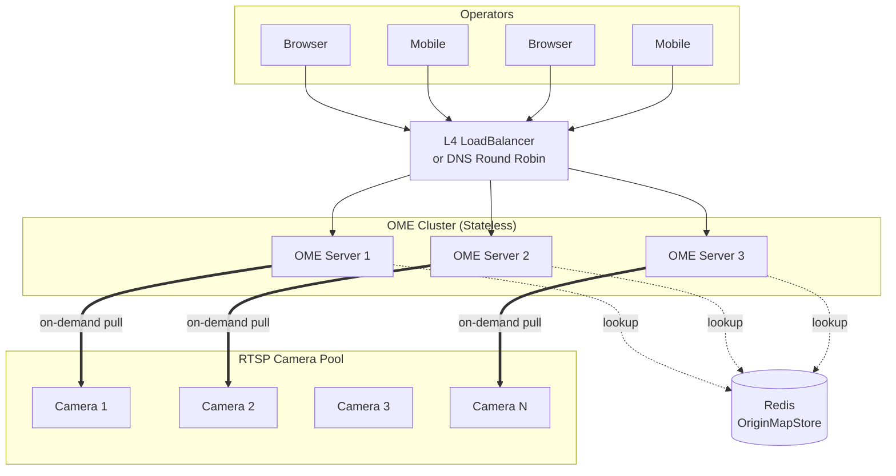

RTSP has been the de facto protocol for IP cameras for over two decades. Almost every CCTV, IP camera, and network video device on the market speaks RTSP natively. It works well on dedicated NVR appliances and desktop clients. But the moment you try to bring those streams into a modern web or mobile dashboard, the cracks start to show.

{/* truncate */}



## The Hidden Cost of Always-On Streaming

Browsers do not speak RTSP. Neither do mobile devices. To make an RTSP feed playable on a web page, you need to convert it. The most efficient way to do that, with sub-second latency and no plugins, is **WebRTC**.

So far, so straightforward. The real problem starts when you scale.

A typical surveillance deployment has hundreds, sometimes thousands of cameras. A traditional VMS or media gateway pulls every single RTSP stream the moment the server boots, decodes them, and keeps them flowing, whether anyone is watching or not. Multiply that by a few hundred cameras, and you are looking at racks of servers just to keep streams *available*, not even being viewed.

But here is the truth about surveillance: **operators rarely watch every camera at once.** They watch a wall of four, sixteen, maybe thirty-two tiles. The rest of the cameras are sitting idle, consuming CPU, RAM, and bandwidth for no one.

That waste is what On-Demand Live streaming eliminates.

## How On-Demand Live Works

OvenMediaEngine (OME) works differently. Instead of pulling every RTSP stream continuously, **OME pulls a camera only when someone asks to watch it.**

- When a viewer requests a WebRTC stream for a specific camera, OME pulls the RTSP feed from that camera.
- While viewers are connected, OME re-encodes and forwards the stream over WebRTC with sub-second latency.
- When the last viewer disconnects, OME stops pulling. The RTSP connection is closed. The resources are released.
- If a second viewer joins while the stream is already running, OME serves them from the existing stream. No duplicate pull, no extra CPU.

The result: idle cameras cost nothing. You can register hundreds of cameras on a single OME Origin server, and the actual load on the server is determined by **how many cameras are being watched right now**, not how many exist in your catalog.

For a real surveillance workload, where operators watch a small subset at any given time, this changes the infrastructure economics entirely.



## Three Ways to Configure On-Demand Live RTSP

OME provides three ways to define the mapping between a WebRTC stream URL and the underlying RTSP camera. Pick the one that fits how your camera inventory is managed.

| Method                   | When to use                                                       |
| ------------------------ | ----------------------------------------------------------------- |
| **OriginMap** (Server.xml)    | Small, static deployments where cameras rarely change            |
| **OriginMapStore** (Redis)    | Dynamic deployments where cameras are added or modified frequently |
| **REST API**                  | Integration with an existing camera management system or VMS    |

### 1. OriginMap: static configuration in Server.xml

The simplest option. Define each camera as an `<Origin>` entry inside your VirtualHost:

```xml title="Server.xml"
<VirtualHosts>
  <VirtualHost>
    <Origins>
      <Properties>
        <NoInputFailoverTimeout>3000</NoInputFailoverTimeout>
        <UnusedStreamDeletionTimeout>60000</UnusedStreamDeletionTimeout>
      </Properties>
      <Origin>
        <Location>/app/rtsp_camera1</Location>
        <Pass>
          <Scheme>rtsp</Scheme>
          <Urls><Url>cctv1.com:9000/camera</Url></Urls>
          <ForwardQueryParams>true</ForwardQueryParams>
        </Pass>
      </Origin>
      <Origin>
        <Location>/app/rtsp_camera2</Location>
        <Pass>
          <Scheme>rtsp</Scheme>
          <Urls><Url>cctv2.com:9000/camera</Url></Urls>
          <ForwardQueryParams>true</ForwardQueryParams>
        </Pass>
      </Origin>
    </Origins>
  </VirtualHost>
</VirtualHosts>
```

Two properties worth noting:

- `NoInputFailoverTimeout` — how long OME waits for input before declaring the source unavailable.
- `UnusedStreamDeletionTimeout` — how long OME keeps an idle stream alive after the last viewer disconnects. **This is what makes On-Demand Live work.** Once the timeout passes with no viewers, the stream is torn down and resources are released.

When a client connects to `wss://ome.server.com:3334/app/rtsp_camera1`, OME pulls from the configured RTSP URL on demand and streams it back over WebRTC.

Full configuration options are available in the [Clustering documentation](/docs/ome/origin-edge-clustering).

### 2. OriginMapStore: dynamic mapping with Redis

If your camera list changes often, hardcoding URLs in Server.xml is not practical. OriginMapStore lets you keep the mappings in a Redis server, where OME looks them up at request time.

```xml title="Server.xml"
<VirtualHost>
  ...
  <OriginMapStore>
    <RedisServer>
      <Host>192.168.0.160:6379</Host>
      <Auth><your-redis-password></Auth>
    </RedisServer>
  </OriginMapStore>
  ...
</VirtualHost>
```

Register cameras as Redis keys, where the key is the stream path and the value is the RTSP URL:

```bash
127.0.0.1:6379> set app/rtsp_camera1 rtsp://cctv1.com:9000/camera
OK
127.0.0.1:6379> get app/rtsp_camera1
"rtsp://cctv1.com:9000/camera"
```

Adding, updating, or removing a camera is now a one-line Redis operation. No OME restart required.

### 3. REST API: integration with external systems

If you already have a camera management platform, VMS, or asset inventory, the REST API is the cleanest path. Create streams programmatically:

```http
POST https://ome-server.com/v1/vhosts/default/apps/app/streams

{
  "name": "rtsp_camera1",
  "urls": ["rtsp://192.168.0.160:553/app/stream"],
  "properties": {
    "persistent": false,
    "noInputFailoverTimeoutMs": 3000,
    "unusedStreamDeletionTimeoutMs": 60000,
    "ignoreRtcpSRTimestamp": false
  }
}
```

The `"persistent": false` setting is the key. It tells OME to release resources when no one is watching, exactly the On-Demand Live behavior we want. Set it to `true` only if you genuinely need the stream to be always-on (for recording or relay purposes).

## Beyond a Single Server

A single OME Origin can handle a very large camera catalog, because idle cameras cost nothing. But **concurrent viewers** are a different story. WebRTC sessions are real connections with real CPU and bandwidth cost.

When the number of operators viewing streams grows beyond what one server can handle, OME scales horizontally without architectural change. Place multiple OME servers behind an L4 load balancer or DNS round-robin, and each incoming WebRTC request lands on one of them. Whichever server receives the request will pull the RTSP feed and serve the client. The same OriginMap, OriginMapStore, or REST API configuration works across all of them.

Servers are stateless, and cameras are pulled only when needed. No central state to coordinate, no message bus to operate.



## What Else You Get for Free

Because OME ingests RTSP through its full media pipeline, every other OME feature works on these streams out of the box:

- **ABR (Adaptive Bitrate)** — transcode each camera into multiple resolutions, so a tablet on cellular and a 4K control room display get the appropriate quality without changing the camera.
- **Codec conversion** — cameras often output H.264 profiles or audio settings that are not WebRTC-friendly. OME normalizes them automatically.
- **Video-only or audio-only profiles** — strip audio for bandwidth-sensitive deployments, or vice versa.
- **Access control & authorization** — [SignedPolicy](/docs/ome/access-control/signedpolicy) and [AdmissionWebhooks](/docs/ome/access-control/admission-webhooks) let you decide which operator can view which camera, on a per-request basis.

None of this requires extra components. It is the same pipeline.

## Closing the Loop

Surveillance has always been about scale: more cameras, more sites, more operators. The traditional answer was to throw more servers at the problem. On-Demand Live streaming flips the equation. You stop paying for what you are not watching, and the size of your camera inventory stops driving the size of your infrastructure.

OvenMediaEngine makes this practical with a few lines of configuration and the same WebRTC pipeline that already serves sub-second latency to browsers and mobile devices worldwide.

## For Mission-Critical Surveillance

Surveillance is an environment where streams cannot drop. Running hundreds of cameras unattended requires GUI-based management, and anomalies must reach operators instantly. SI projects and solution deployments also need to clear the licensing question.

**OvenMediaEngine Enterprise** is built for these operational requirements.

- **Web Console** — a GUI dashboard to monitor and manage hundreds of cameras and streams at a glance. Operators no longer need to edit configuration files or hit APIs for routine tasks.
- **Enhanced Alert** — stream and system anomalies are detected with configurable rules and sent to external monitoring systems via HTTP callbacks in real time.
- **Commercial License** — no AGPLv3 source disclosure obligation. Free to use in SI projects, solution deliverables, and proprietary services.
- **Pre-Built Package** — verified LTS builds available as DEB, RPM, and Docker images for fast deployment. Suitable for air-gapped and on-premise environments.
- **Direct-to-Engineer Support** — technical support directly from OvenMediaEngine's core engineers.

If you are evaluating Enterprise for your deployment, reach out at [contact@ovenmedia.com](mailto:contact@ovenmedia.com) or learn more on the [OvenMediaEngine Enterprise page](/ome-enterprise).

### Want to test first?

You can launch OvenMediaEngine Enterprise from [AWS Marketplace](https://aws.amazon.com/marketplace/pp/prodview-okn5l63yxarwm) starting at $0.19 per hour, suitable for validation before full deployment.

Detailed configuration and operations guides are available in the [OME Enterprise documentation](/docs/ome-enterprise) and the [OME open-source documentation](/docs/ome).
