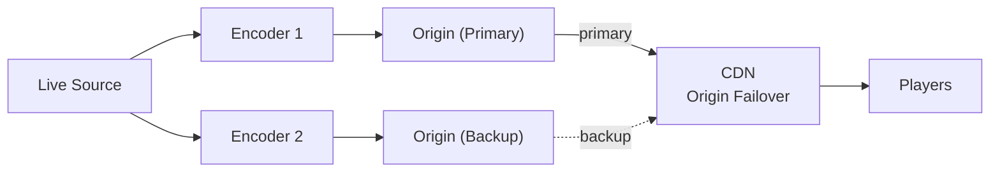
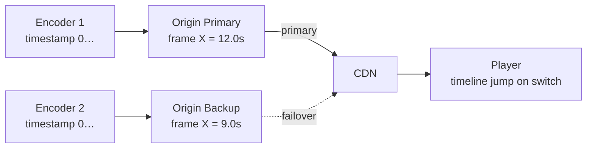
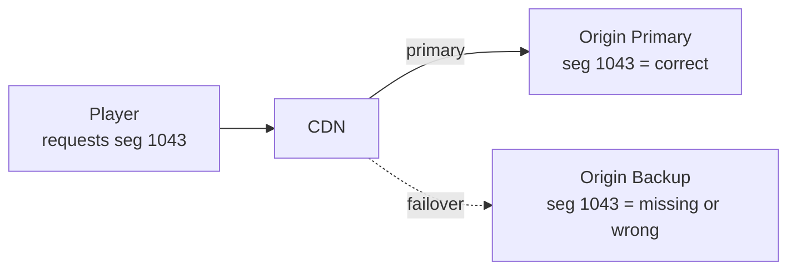

Making a live channel redundant comes down to one thing: keeping the output of the two Origins behind your CDN, Primary and Backup, synchronized so that the player can switch between them at any time and keep playing without interruption.

With VOD this is easy. The files are pre-rendered and static, so any Origin serves the exact same bytes, and putting Primary/Backup behind a CDN is all it takes. Live is different. Each Origin cuts the stream into segments in real time, so even when both receive the same broadcast, their output does not line up on its own.

This post covers what has to line up to make a live channel truly redundant, and in particular how to synchronize the encoder-origin path.

{/* truncate */}

## Demo: CloudFront Origin Failover

This is a recording of what happens when the Primary is force-killed, with Primary and Backup Origins behind Amazon CloudFront serving LL-HLS. Playback switches to the Backup with no stall or buffering, and returns to the Primary once it recovers.

{/* TODO: embed demo video (Amazon CloudFront Origin Failover). e.g. <iframe src="..." width="100%" height="480" allowfullscreen></iframe> or <video controls src="..." style={{width: '100%'}} /> */}

> 🎬 Demo video placeholder (coming soon)

The rest of this post covers what makes that possible and how to configure it.

## The hard part is the encoder-origin path

A live LL-HLS / HLS channel has no second chance. Once it drops, that moment is gone, and every viewer watching is cut off at the same time. So channels that cannot afford to go down, such as large broadcasts or revenue-critical live commerce, run two of everything, encoder and Origin alike. The ideal setup looks like this.



In this picture, the part that is actually hard to get right is the path from Encoder to Origin. The Edge that delivers video to viewers is already spread across many servers by the CDN, so if one Edge dies another takes over. The weak link is the stage in front of it, the **encoder-origin path**, where synchronizing the two Origins is far from trivial. That is where redundancy succeeds or fails.

A CDN's Origin Failover reroutes traffic to the Backup when the Primary goes down. For that to be seamless, the player has to keep playing as it crosses from Primary to Backup, which means the two Origins, Primary and Backup, have to be emitting output the player can continue from.

One thing to be clear about: you cannot make the two Origins' live segments byte-for-byte identical, because each one encodes and packages in real time. What you align is not the bytes but the **segment boundaries, the numbering, and the timeline**. Get those three right and the two Origins become interchangeable.

## What it takes to make two Origins interchangeable

So what exactly has to line up? Three things: **the timeline, the segment numbering, and continuity after recovery.** None of them line up on their own in live, so let's go through them one at a time.

### 1. The two Origins must share a timeline

HLS and LL-HLS cut video into segments based on the stream's timestamp (PTS). So for two Origins to be interchangeable, both have to cut the video on the same timeline.

The best case is an encoder that stamps timestamps from wall-clock time. Then whichever Origin receives it sees the same "this frame is at 12.0s." But most real encoders (OBS and many hardware encoders) start counting from 0 the moment the connection opens. Especially with two encoders as in the diagram above, each counts from its own 0, so the two Origins' timelines diverge significantly: the same frame ends up at 12.0s on the Primary and 9.0s on the Backup.

When the CDN switches Origins while the timelines are misaligned like this, the player gets a sudden jump in time and stalls. (Note that the two encoders' video does not need to match frame-for-frame; players handle that small a difference fine. What needs to line up is the timeline at a coarse level.)



### 2. The segment numbers must match

HLS and LL-HLS are protocols that cut video into short segments and advertise which segments exist in a playlist. In live, that playlist is not fixed: each new segment is appended to the end, old ones drop off, and every segment carries an ever-increasing sequence number. The player re-fetches the playlist periodically and requests the next segment by number.

So the Primary and Backup have to assign the same number to the same point in the stream. If the numbers differ, then right after a failover the player asks the Backup for the number it was holding (say 1043), and on the Backup that number may point to a different point or not exist at all. Only when both Origins number the same point identically does the player's requested number point to the same video on either side.



### 3. Numbering and timeline must continue after recovery

The last requirement is the hardest. Even if you bring both Origins up at the same instant and align their timeline and numbering at the start, the moment one dies and comes back, that Origin starts receiving the stream from scratch: its timestamps reset to 0 and its segment numbers start over.

That is why failing over from a dead Primary to the Backup once (a fallback) is relatively easy. The hard part is what comes next. For a recovered Primary to rejoin, or for traffic to move back from Backup to Primary, the recovered Origin has to resume producing the same numbers and timeline as the one that stayed alive. Going beyond a one-time fallback to a true failover, where servers can die, recover, and hand off freely, requires this continuity.

## Configuring it with OvenMediaEngine Enterprise

The three conditions above (timeline, segment numbering, continuity after recovery) are very hard to satisfy by hand. OvenMediaEngine (OME) Enterprise's Origin Redundancy is built to satisfy all three with a few lines of configuration.

### Aligning the timeline (`TimestampMode`)

Whether the encoder starts from 0 or uses wall-clock time, OME aligns the reference for you. Use `Original` if the encoder uses wall-clock time, or `SystemClock` if it starts from 0. With `SystemClock`, OME re-bases the timeline on the server's system clock (synced via NTP/PTP). So even if the two Origins started receiving the stream at different moments, or one of them restarted, they align their timelines on the same time reference.

```xml title="Server.xml (Providers)"
<RTMP>
  <TimestampMode>SystemClock</TimestampMode>
</RTMP>
```

:::tip
With `SystemClock`, each Origin derives timestamps from its own system clock, so the two servers' clocks must be tightly synced via NTP/PTP. If you are not sure how your encoder generates timestamps, `SystemClock` is the safe default.
:::

### Matching segment numbers (`ServerTimeBasedSegmentNumbering` + `OriginMode`)

This numbers segments based on the **server's current time** rather than when the stream started. Because the reference is absolute system time, an Origin that dies and comes back hours later resumes the same numbers as the other Origin. That is what makes a true failover, not just a one-time fallback, possible.

You can see it clearly in practice. Below is an LL-HLS playlist fetched the instant a stream started.

```text title="chunklist.m3u8 (right after stream start)"
#EXTM3U
#EXT-X-VERSION:6
#EXT-X-TARGETDURATION:4
#EXT-X-SERVER-CONTROL:CAN-BLOCK-RELOAD=YES,PART-HOLD-BACK=3.006000
#EXT-X-PART-INF:PART-TARGET=1.000000
#EXT-X-MEDIA-SEQUENCE:445253885
#EXT-X-MAP:URI="init_2_video_7930408358254892257_llhls.m4s"
#EXT-X-PROGRAM-DATE-TIME:2026-06-09T23:32:19.041+09:00
#EXT-X-PART:DURATION=1.000000,URI="part_2_445253885_0_video_7930408358254892257_llhls.m4s",INDEPENDENT=YES
#EXT-X-PART:DURATION=1.000000,URI="part_2_445253885_1_video_7930408358254892257_llhls.m4s",INDEPENDENT=YES
#EXT-X-PART:DURATION=1.000000,URI="part_2_445253885_2_video_7930408358254892257_llhls.m4s",INDEPENDENT=YES
#EXT-X-PART:DURATION=1.000000,URI="part_2_445253885_3_video_7930408358254892257_llhls.m4s",INDEPENDENT=YES
#EXTINF:4.000000,
seg_2_445253885_video_7930408358254892257_llhls.m4s
#EXT-X-PROGRAM-DATE-TIME:2026-06-09T23:32:23.041+09:00
#EXT-X-PART:DURATION=1.000000,URI="part_2_445253886_0_video_7930408358254892257_llhls.m4s",INDEPENDENT=YES
#EXT-X-PART:DURATION=1.000000,URI="part_2_445253886_1_video_7930408358254892257_llhls.m4s",INDEPENDENT=YES
#EXT-X-PRELOAD-HINT:TYPE=PART,URI="part_2_445253886_2_video_7930408358254892257_llhls.m4s"
#EXT-X-RENDITION-REPORT:URI="chunklist_1_audio_7930408358254892257_llhls.m3u8",LAST-MSN=445253886,LAST-PART=1
```

This stream just started, yet `#EXT-X-MEDIA-SEQUENCE` is `445253885`, not `0`. Multiply that number by the segment duration (4 seconds here) and you get about 1.78 billion, which is the current Unix time in seconds. The segment number is simply "current time / segment duration." So as long as the clocks are in sync, the Primary and the Backup compute the same number, and the two Origins' playlists line up naturally.

Turning on `OriginMode` also stops per-session key issuance and serves every viewer the same URL and playlist, which is what lets the CDN cache the data and fail over cleanly. (Keep `ChunkDuration`, `SegmentDuration`, `SegmentCount`, FPS, and keyframe interval identical on both servers.)

```xml title="Server.xml (Publishers)"
<LLHLS>
  <OriginMode>true</OriginMode>
  <ServerTimeBasedSegmentNumbering>true</ServerTimeBasedSegmentNumbering>
  <ChunkDuration>1</ChunkDuration>
  <SegmentDuration>6</SegmentDuration>
  <SegmentCount>10</SegmentCount>
</LLHLS>
```

### Signaling failure to the CDN (`PacketSilenceTimeoutMs`)

Normally, when an encoder dies or the network drops, the Origin detects the broken connection, terminates the stream, and returns `404` to subsequent requests; the CDN sees the `404` and moves to the Backup. The problem is the case where that does not happen. If the encoder keeps the connection open but stops sending packets, the Origin assumes the stream is still alive and keeps returning `200 OK`, and the CDN never notices the failure.

With `PacketSilenceTimeoutMs` set, OME tears the stream down on its own and returns an HTTP error when no packets arrive for the configured time. The CDN sees that signal and immediately reroutes traffic to the Backup.

```xml title="Server.xml (Providers)"
<RTMP>
  <PacketSilenceTimeoutMs>1000</PacketSilenceTimeoutMs>
</RTMP>
```

## A complete Server.xml example

Here is an Origin server configuration with all of the key settings (`TimestampMode`, `OriginMode`, `ServerTimeBasedSegmentNumbering`, `PacketSilenceTimeoutMs`) in one place. The Primary and Backup servers share this same spec.

```xml title="Server.xml"
<?xml version="1.0" encoding="UTF-8"?>
<Server version="8">
    <Name>OvenMediaEngine</Name>

    <Bind>
        <Managers>
            <API>
                <Port>8081</Port>
            </API>
        </Managers>
        <Providers>
            <RTMP>
                <Port>1935</Port>
            </RTMP>
            <SRT>
                <Port>9999</Port>
            </SRT>
        </Providers>
        <Publishers>
            <LLHLS>
                <Port>3333</Port>
            </LLHLS>
        </Publishers>
    </Bind>

    <VirtualHosts>
        <VirtualHost>
            <Name>default</Name>
            <Host>
                <Names>
                    <Name>*</Name>
                </Names>
            </Host>

            <Applications>
                <Application>
                    <Name>app</Name>
                    <Type>live</Type>

                    <Providers>
                        <RTMP>
                            <TimestampMode>SystemClock</TimestampMode>
                            <PacketSilenceTimeoutMs>1000</PacketSilenceTimeoutMs>
                        </RTMP>
                        <SRT>
                            <TimestampMode>SystemClock</TimestampMode>
                            <PacketSilenceTimeoutMs>1000</PacketSilenceTimeoutMs>
                        </SRT>
                    </Providers>

                    <OutputProfiles>
                        <OutputProfile>
                            <Name>bypass</Name>
                            <OutputStreamName>${OriginStreamName}</OutputStreamName>
                            <Encodes>
                                <Video><Bypass>true</Bypass></Video>
                                <Audio><Bypass>true</Bypass></Audio>
                            </Encodes>
                        </OutputProfile>
                    </OutputProfiles>

                    <Publishers>
                        <LLHLS>
                            <OriginMode>true</OriginMode>
                            <ServerTimeBasedSegmentNumbering>true</ServerTimeBasedSegmentNumbering>
                            <ChunkDuration>1</ChunkDuration>
                            <PartHoldBack>3</PartHoldBack>
                            <SegmentDuration>6</SegmentDuration>
                            <SegmentCount>10</SegmentCount>
                        </LLHLS>
                    </Publishers>
                </Application>
            </Applications>
        </VirtualHost>
    </VirtualHosts>
</Server>
```

:::warning[Things to watch when applying this]

1. **Clock sync (NTP/PTP)**: `SystemClock` and `ServerTimeBasedSegmentNumbering` assume the two Origin servers' clocks agree down to the millisecond. Both servers must keep their clocks synced to a time server with `ntpd`, `chrony`, or similar.
2. **Identical encoding profile**: keep the encoding profile (FPS, keyframe interval, and so on) of the video reaching both servers identical. That said, you cannot force the two Origins to cut segments at exactly the same point. The goal is not to cut the boundaries identically but to align the segment numbers and timeline with `ServerTimeBasedSegmentNumbering` so the two channels stay interchangeable.

:::

## Summary

The seamless switch in the demo at the top comes from getting the encoder-origin path right, not the distribution layer. The Edge that delivers video to viewers is a problem CDNs solved long ago; the part you actually have to take care of is the encoder-origin path. Making it properly redundant means keeping the two Origins aligned on timeline and segment numbering so they stay interchangeable.

OvenMediaEngine Enterprise's Origin Redundancy (0.18.3.0+) provides this alignment as a built-in feature. You can find detailed configuration in the [Origin Redundancy docs](/docs/ome-enterprise/features/high-availability/origin-redundancy), and if you want to try it yourself, you can launch it from [AWS Marketplace](https://aws.amazon.com/marketplace/pp/prodview-okn5l63yxarwm) starting at $0.19/hour.
