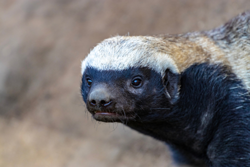

import flameLogo from './flame-logo.png';
import honeyBadgerLogo from './honey-badger-logo.png';
import logoDraw from './logo-draw.png';

{/* TODO: add ./hero.png before publishing (social/RSS thumbnail) */}

### From AirenSoft to OvenMedia Labs
We have changed our company name and our logo. Our new symbol is a honey badger. It is a name that has been with us for a long time, and an animal that reflects who we are today.

To explain why, we need to go back a little further than 2010.

{/* truncate */}

## 2010: An Engine for the Air

We founded AirenSoft in 2010. The name "Airen" came from the first five letters of **Air Engine**. We wanted to build the engine at the heart of our customers' services, helping their ideas rise higher. That is why our original symbol was a flame. It was the flame of a hot-air balloon burner.

At the time, AirenSoft was not solely a media technology company. We built many different kinds of software to keep the company moving forward. The flame represented the ambition we had when we first started. But the name "Osori" had been with us even before that.

## The Name Osori

Before founding the company, we used to gather at a government-funded shared office for aspiring founders. We were a small group of people who loved programming and hoped to start a company of our own someday.

Nearby, there was a restaurant called **Osori**. Osori means "badger" in Korean. It was the cheapest place within walking distance. We did not have much money, so we went there often. Most of what we called "meetings" took place around one of its tables. We were short on money and overflowing with ideas.

Whenever we talk about those days, that restaurant inevitably becomes part of the story. It was more than a place to find a cheap, filling meal. It was where we sat together and talked about what we might build someday.

The name stayed with us. We used it for internal projects, too: Osori Project 1, Osori Project 2. Over time, Osori became something like an old code word that only we fully understood.

## Sixteen Years to Our First Goal

We began developing OvenMediaEngine in 2018. At first, it was one project among many. In 2020, we began actively supporting its open-source community. More people started using it. Developers from around the world began sending code, ideas, questions, and feedback. Then, in 2026, we became a company focused entirely on OvenMediaEngine.

This was what we had wanted to do from the beginning: to pour our engineering ability into one product and keep making it better. But keeping a company alive meant taking on many different kinds of work. Building only what we loved, while also making a living from it, took much longer than we expected.

It took us sixteen years to reach our first goal: to become a company that could make what it loved and live by it. We have finally reached that point, and this is where the next chapter begins.

That is why we changed our name to **OvenMedia Labs.**

For the first time, our company name and our product name point in the same direction.

Once the name had changed, the symbol had to change as well. The flame of the hot-air balloon engine represented the dream we had when we started the company, but it no longer fully explained what we build, how we work, or what kind of company we have become. We needed a new symbol.

## The Animal We See Ourselves In

A honey badger weighs only around ten kilograms. It is small, but remarkably tough. It has thick, loose skin, powerful claws, and a reputation for standing its ground even against animals far larger than itself. It hunts venomous snakes. When it finds a beehive, it tears its way in despite the stings. If something it wants is on the other side of an obstacle, it does not stop simply because the obstacle is painful.

That is why the honey badger has become a symbol of fearlessness and tenacity. In the English-speaking world, it is also famous for an internet meme:

> Honey badger don't care.

The phrase became widely known in 2011. It came to represent someone who keeps going, regardless of what stands in the way. Small, fast, tough, and persistent. It does not stop because the opponent is bigger.

That is the kind of company we want to be. It is also, in many ways, the kind of company we have already had to become.

## Removing the Pain from Streaming

Our goal is to build a streaming server that is agile, resilient, and dependable. Live streaming has a habit of getting in the way of what people actually want to build. Costs rise faster than expected. Latency refuses to come down. Every protocol and codec introduces another layer to understand. As the audience grows, scaling and operations become harder. Solve one problem, and another appears.

OvenMediaEngine was created to remove those obstacles. It receives streams through protocols such as RTMP, SRT, WHIP, and MPEG-TS, then delivers them through WebRTC and LL-HLS. When a new protocol is needed, we find a way to connect it. When an audience grows, the system should be able to grow with it. Streaming technology should not limit what a service can become.

For several years, we have used the following line to describe what we are trying to do:

> Empowering you to build your ideal live streaming services without the pain.

We want people with a service to build to keep moving forward, rather than being stopped by the complexity of live streaming. That is what **without the pain** means to us. Just as a honey badger does not stop at the beehive, we keep working through the technical obstacles standing between people and the live streaming services they want to create.

## Why the Honey Badger

When we began discussing a new symbol, Osori was already part of us. It was not a name invented for a branding exercise. It had been with us since before the company existed. It carried memories of lean years, ambitious conversations, and projects that began around a restaurant table.

And when we looked back at the sixteen years it took to reach this point, the honey badger felt unexpectedly familiar. It reflected how we had survived. It reflected how we work. And it reflected the company we want to become from here.

That is why the honey badger became our new symbol.

The flame represented the dream that started the company. The honey badger represents how we have pursued that dream, and how we intend to keep going.

## What Changes, and What Does Not

More than our name and logo has changed. OvenMediaEngine is no longer one project among many. We are now putting the company's focus behind OvenMediaEngine and the people who build with it. Our work will center on making a better streaming server, providing more dependable enterprise products and services, and continuing to develop the project together with its open-source community.

Some things will not change. OvenMediaEngine's open-source license, roadmap, and contribution process remain the same. Our company has a new name and a new symbol, but our commitment to developing the project in the open and moving it forward with its community has not changed.

This rebrand is not about turning OvenMediaEngine into something else. It is the result of choosing to focus on it completely.

When people ask us why we chose a honey badger, we will probably begin with the story of that restaurant, long before we begin talking about technology.
