## What a streaming operator wants to know at 3 a.m.

Many operators keep a player running and watch the broadcast to decide whether the service is healthy.
That is necessary work, but a player shows only the one rendition currently selected out of the several quality levels generated for the same broadcast.
All it tells you is that this one rendition looks fine over the network you happen to be using.
It cannot tell you whether only the transcoding step that produces 360p on the server is falling behind, whether only viewers in another region are buffering, or whether a backlog inside the server is accumulating into seconds of latency for viewers.
**By the time something looks wrong in the player, viewer complaints have already come in.**

While a broadcast is running, there are three things an operator actually wants to know.

1. Is the service healthy right now?
2. If it is not, what is wrong?
3. Is it an ingest problem (the direction from the encoder into the server), a server problem, or a problem for only some viewers?

Answering all three means seeing, in one place, the state of the input streams, the server's internal processing, and the traffic going out to viewers.

{/* truncate */}

### The screen you need

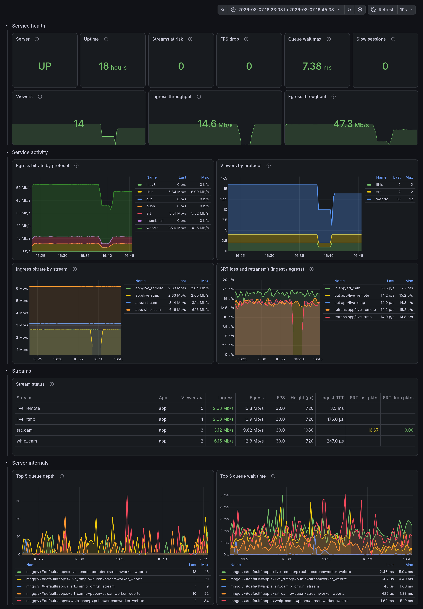

The third question, "ingest, server, or viewer", cannot be answered by any single panel.
What this screen does is put those three segments together in one place.
To take a closer look at a stream this screen flags, you open the separate detail screen ([2.4](#24-why-drilling-into-a-single-stream)).

The table below starts from the common symptoms and shows where each one appears first across the two screens.

| Symptom                                  | What appears on the screen                                                                                                                    | Section                                                |
| ---------------------------------------- | --------------------------------------------------------------------------------------------------------------------------------------------- | ------------------------------------------------------ |
| Nothing plays at all                     | That stream's row disappears from the `Stream status` table, or `Ingress` turns red                                                           | [Case 1](#31-case-1-ingest-stops)                      |
| Motion looks choppy                      | The top `FPS drop` tile moves off `0`, and `FPS` in the table reads lower than usual                                                          | [Case 2](#32-case-2-ingest-is-alive-but-quality-drops) |
| Several viewers see stalls and artifacts | `SRT drop pkt/s` in the `Stream status` table turns red, and `dropped` in `SRT ingest packet loss / drop` on the detail screen moves off `0`  | [Case 3](#33-case-3-the-network-path-degrades)         |
| Only one viewer sees growing latency     | The top `Slow sessions` moves off `0`, and only that session's `RTT (tcp/rtcp)` cell is colored in the `Sessions` table on the detail screen  | [Case 4](#34-case-4-one-slow-viewer-or-all-of-them)    |
| Latency on the sending side grows        | In `Ingest RTT: tcp - tcp_min (queuing delay)` on the detail screen, the gap stays wider than that stream's usual for several minutes or more | [Case 5](#35-case-5-same-path-rising-latency)          |
| Playback keeps falling further behind    | The top `Queue wait max` tile turns red, and the queue panels at the bottom show which stage backed up                                        | [Case 6](#36-case-6-a-backlog-inside-the-server)       |
| Latency is higher than viewers expect    | When only one stage is backed up, the top `Queue wait max` tile shows the server-side latency beyond the protocol and the segment length                                 | [2.1](#21-is-it-healthy-right-now-the-nine-top-tiles)  |

[Chapter 1](#1-live-streaming-what-do-you-judge-it-by) and [chapter 2](#2-what-this-screen-tells-an-operator) cover the metrics and their layout, and [chapter 3](#3-how-an-operator-actually-reads-this-screen) reads the six cases in the table above off the screen one at a time.
[Chapter 4](#4-what-watches-the-screen-when-you-are-away) covers the alerts that watch while you are away, and how to build the screen is in [appendix A](#appendix-a-how-to-build-this-screen).
The panel queries, the full alert rules, and the procedure for reproducing the demo are collected in [appendix B](#appendix-b-queries-rules-and-the-demo-setup).

This screen was built for the demo environment of this article.
It runs four channels around the clock, with SRT ingest in the mix, and transcodes with ABR for WebRTC and LL-HLS delivery.
With a different setup, both the tiles and the thresholds will need to change.
What we chose and why is explained in [chapter 2](#2-what-this-screen-tells-an-operator), and how to rearrange the panels and reset the thresholds for your own environment is in [Lay the dashboard out in question order](#lay-the-dashboard-out-in-question-order) in appendix A.

### What it is built on

The screen in this article is built with [OvenMediaEngine Enterprise](https://ovenmedia.com/docs/ome-enterprise) (OME from here on), [Prometheus](https://prometheus.io/), and [Grafana](https://grafana.com/).
OME exposes its internal state as metrics, Prometheus scrapes and stores them every 15 seconds, and Grafana visualizes what is stored.

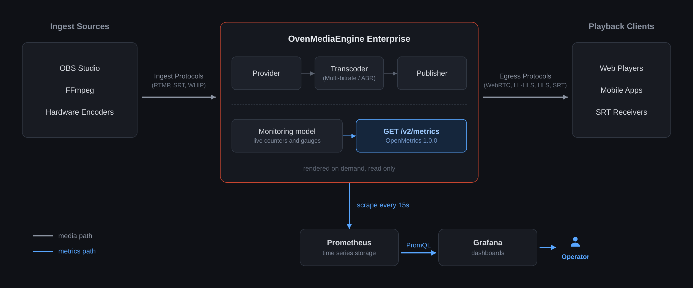

The path the media travels (gray) and the path the metrics travel (blue) are separate, so exporting metrics does not affect media processing.
How to configure it is covered in [appendix A](#appendix-a-how-to-build-this-screen).

## 1. Live streaming: what do you judge it by?

You judge a broadcast's health from numbers, but collecting more of them does not produce an answer by itself.
The same report of "the video keeps stalling" points to a completely different place to look depending on whether the cause is the sending side, the server, or that viewer's own network.
So this article groups the metrics into three segments: ingest, server, and viewers.
That is the same order media flows in, and whichever segment's numbers move sharply is where the cause is.

These are the ingest and playback protocols that come up throughout the article.

| Name   | What it is                                                                                                                                              |
| ------ | ------------------------------------------------------------------------------------------------------------------------------------------------------- |
| RTMP   | The most widely used ingest protocol. Latency is usually 1 second or less.                                                                              |
| SRT    | An ingest and playback protocol that fills in lost packets by retransmission on top of UDP. Latency equals the configured `latency` (120ms by default). |
| WebRTC | The lowest-latency of the web standards. Latency is usually 0.5 to 1 second or less.                                                                    |
| WHIP   | Signaling that standardizes WebRTC ingest. Usable directly from [OBS](https://obsproject.com/) 30 and later.                                            |
| HLS    | The most broadly compatible playback method. Latency is usually around 10 seconds.                                                                      |
| LL-HLS | A low-latency extension of HLS. Latency is usually around 2 to 5 seconds.                                                                               |

### 1.1 Ingest: is the input alive?

This is the segment where you confirm that the video the sending side transmits is arriving correctly.

| Metric                  | What it measures                                                    | What viewers see if it degrades                                                            | Where the cause is if it degraded                                                                                                               |
| ----------------------- | ------------------------------------------------------------------- | ------------------------------------------------------------------------------------------ | ----------------------------------------------------------------------------------------------------------------------------------------------- |
| Input bitrate           | Media the server took in per second                                 | WebRTC viewers stall immediately, the HLS family stalls once the buffered segments run out | If only that stream disappeared, the encoder or its network link; if several disappeared at once, the server or a shared uplink                 |
| Frame rate              | Video frames that arrived per second                                | The picture looks choppy                                                                   | The encoder. Not enough CPU, or its settings                                                                                                    |
| B-frames present or not | Whether frames that reference earlier and later frames are mixed in | Playback judders on WebRTC. The HLS family plays normally                                  | The sending encoder's settings. Leave it at `0` for a stream delivered over WebRTC                                                              |
| Ingest RTT              | Round-trip time between the server and the encoder                  | No immediate impact. If it grows, the input becomes unstable                               | The path or the encoder. Read it as the gap from that connection's floor, not as an absolute value ([3.5](#35-case-5-same-path-rising-latency)) |
| SRT ingest loss / drop  | Packets lost in SRT transport, and those that failed to recover     | When drops rise, frames go missing and the picture stays smeared until the next keyframe   | The network on the sending side. While drops stay at `0`, SRT is still filling the gaps by retransmission                                       |

Input bitrate is the first value to look at.
When ingest stops and the stream is removed from the server, the value does not fall to `0`: the line itself disappears ([3.1](#31-case-1-ingest-stops)).
When the connection stays up but almost no data comes in, the line remains and the value falls to a few tens of kb/s ([2.3](#23-which-stream-is-the-problem-the-stream-status-table)).
If the input numbers look normal and viewers are still having trouble, that is when you look at the remaining metrics.

If the line was never drawn at all, nothing disappeared: the connection never succeeded in the first place.

SRT's `latency` is the time it waits for packets that arrive late through retransmission.
Raising it improves the odds of recovering losses, at the cost of adding that same amount to broadcast latency.
What to set this value to is covered in [3.3](#33-case-3-the-network-path-degrades).

### 1.2 Server: is it keeping up inside?

This is the segment that converts the incoming video into several qualities (transcoding) and packages it per protocol for delivery.
If the server cannot keep up with the incoming rate, a backlog builds in this segment.

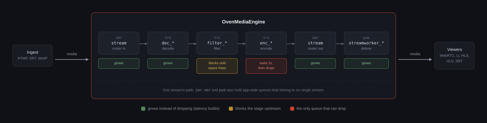

There is one queue between each pair of stages, and a backlog means messages piling up in one of those queues.

| Metric                | What it measures                                              | What viewers see if it degrades                                   | Where the cause is if it degraded                                                                          |
| --------------------- | ------------------------------------------------------------- | ----------------------------------------------------------------- | ---------------------------------------------------------------------------------------------------------- |
| Queue backlog         | How many messages are waiting their turn to be processed      | No impact if it is brief, but playback stalls if it keeps growing | Inside the server. A brief pile-up is within the normal range                                              |
| Queue wait time       | Exponential moving average of the time waited at that stage   | Playback slips back by however long it waited                     | Inside the server. Values in seconds that keep appearing mean that stage lacks throughput                  |
| Bitrate per rendition | The actual bitrate of each transcoded quality being delivered | Only viewers on that rendition see quality drop                   | Compare against the input. If the input is unchanged and only that quality dropped, it is transcoding load |

**Most of OME's internal queues do not discard data even when they fill up.**
In the queue stage diagram above, the only point that can discard anything is the encoding stage input, and the rest either stall the stage upstream of them or simply keep piling up.
Because those queues do not discard, a backlog on the server does not corrupt the viewer's picture.
Instead, viewers receive data more slowly than real time, so playback stalls and then resumes at a point as far behind as the backlog was.

A backlog only means that stage is under high load; to know whether the impact reached viewers, you have to check the wait time.
Because normal values are in milliseconds, seeing seconds at all is rare, and a single spike of a few seconds clears on its own.
So you judge wait time by how long it lasted, not by how high it rose.
In the history collected for this demo, wait time was above 1 second for 19 minutes, and above 5 seconds for 6 of those minutes.
Once you split that time into contiguous stretches, the only stretch longer than 2 minutes was a 5-minute one, and that one was the real incident.

Which queue it happened in determines how far the impact spreads.
Queue names include the stage, which means that the name of the queue whose wait time rose tells you which stage is backed up.
Queues only exist down to the stream or application level, though, so queue metrics cannot pin down an individual viewer.

- If it is the decoding or filter stage (`dec_*`, `filter_*`), every rendition that re-encodes the same track is delayed together.
  A pass-through rendition that delivers the original as is does not go through this path, so it is unaffected.
- The encoding stage (`enc_*`) discards frames once the wait exceeds 1 second, so viewers who chose that rendition see a stuttering picture rather than a delayed one.
- If it is the egress stage, every viewer watching the affected stream over that protocol is delayed together.
- For an application-level queue, which shows no stream name, every stream in that application is affected together ([2.5](#25-is-the-server-keeping-up)).

### 1.3 Viewers: is it getting through?

This is the segment delivered from the server to viewers.
When something goes wrong in this segment, you start by working out whether the cause is on the server side or in that viewer's own network.

| Metric                                  | What it measures                                    | What viewers see if it degrades                            | Where the cause is if it degraded                                                                        |
| --------------------------------------- | --------------------------------------------------- | ---------------------------------------------------------- | -------------------------------------------------------------------------------------------------------- |
| Concurrent viewers                      | Number of playback sessions currently connected     | A sharp drop means many have already left                  | Tell it apart by whether it moved together with egress bitrate. Do not judge it on its own               |
| Egress bitrate                          | Media sent to viewers per second                    | If it falls while the viewer count holds, everyone buffers | A path outside the server (network, links, CDN) or a backlog inside it. Queue wait time tells them apart |
| Egress bitrate per session              | The rate actually going out to a single viewer      | Only that viewer sees lower quality or buffering           | If one line alone is bad, that viewer's network; if several are, the server or a shared path             |
| Session RTT                             | Round-trip time between a viewer and the server     | Latency grows by that much                                 | If one line alone is high, that viewer's path; if several are high together, the server or a shared path |
| SRT egress loss / retransmission / drop | Loss and recovery among the packets sent to viewers | When drops rise, that viewer's picture breaks up           | That viewer's network                                                                                    |

The first two rows are metrics you read as a single value for the whole server.
Concurrent viewers and egress bitrate only tell the cases apart when read together, and if both fall at once the broadcast is winding down or viewers are simply leaving.
If the viewer count holds while only egress bitrate falls, that is where you start narrowing down the cause, and that judgment needs three values including the input ([1.4](#14-relationships-between-values-not-single-values)).

The remaining three rows are metrics you read one viewer at a time.
Of those, what session RTT measures is latency, not bandwidth.
The HLS family runs over TCP, though, where throughput depends on RTT, so in that case a rising RTT drags the receive rate down with it.

### 1.4 Relationships between values, not single values

As the metric tables in [1.1](#11-ingest-is-the-input-alive) through [1.3](#13-viewers-is-it-getting-through) show, most metrics cannot be judged from a single value, and what you actually watch in operation is the relationship between two or three values.

**Loss and drop.**
A transport like SRT makes up for lost packets with retransmission, so a rising loss count on its own is not yet grounds for calling it a failure.
The viewer's picture only breaks up once the count of packets discarded after failed recovery rises along with it.

**Input, viewer count, egress bitrate.**
Putting the three values side by side tells you whether a drop in traffic means viewers left, the input fell, or the delivery path is blocked.
Two values are not enough to tell them apart.
ABR (adaptive bitrate) has the player adjust renditions automatically to match the viewer's network conditions, so the same shape appears even when nothing is wrong.
When viewers shift to a lower quality, the session count holds while only egress bitrate falls.
The graph looks exactly the same when the input bitrate fell first, so a bend in egress bitrate alone does not separate the causes.
So you rule out the input and the viewer count first.
If both values hold while only egress bitrate bends, it is either a delivery path failure or a backlog inside the server, and queue wait time is the criterion that separates the two ([3.6](#36-case-6-a-backlog-inside-the-server)).

**The latency you have right now and the path's minimum latency.**
You read the round-trip time the connection is currently seeing together with the lowest value recently observed on that path.
If both values rose together the path changed, and if the minimum holds while only the gap widens, a backlog is building inside that connection.
This comparison is used on TCP connections, where the kernel keeps the minimum separately, and WHIP looks the same as RTMP when the procedure that decides the connection path (ICE) selects TCP.

## 2. What this screen tells an operator

We built the dashboard as two screens.
One reads the overall state of the service, and the other is a detail screen for taking a close look at the single stream that has a problem.
This chapter covers only where the metrics from chapter 1 sit on the screen and what threshold each value is judged against.

The service status screen, the first of the two, is divided into four zones.
The top three zones show how the service looks from the outside, narrowing in scope as you go down, and the single zone at the bottom answers whether the cause is inside the server.

| Zone                    | What you look at                                                                                                                                   | What it tells you                                                               |
| ----------------------- | -------------------------------------------------------------------------------------------------------------------------------------------------- | ------------------------------------------------------------------------------- |
| The nine top tiles      | Server liveness, uptime, number of streams at risk, frame rate drops, queue wait time, number of slow sessions, viewers, ingress/egress throughput | Is it healthy right now ([2.1](#21-is-it-healthy-right-now-the-nine-top-tiles)) |
| Service overview graphs | Egress bitrate and session count per delivery protocol, input per stream, the trend in SRT loss                                                    | Whether you lost viewers or lost delivery                                       |
| `Stream status` table   | Eight values in one row per stream. Viewers, input and egress bitrate, FPS, resolution, ingest RTT, SRT loss and drop                              | Which stream is the problem                                                     |
| Server internal state   | Queue backlog and wait time                                                                                                                        | An outside problem, or the server failing to keep up                            |

**Most of the values on the screen are "how much per second".**
Bytes and packets are counters that only ever climb, so you get a per-second figure by subtracting two samples and dividing by the time between them.
[PromQL](https://prometheus.io/docs/prometheus/latest/querying/basics/), Prometheus's query language, calls this calculation `rate`, and the time span it divides by is called the window.
Whatever you set the window to shows up directly on the screen, and this demo uses a 1-minute window on the tiles and tables that carry color thresholds, so a brief spike is buried in the average and a value that has just disappeared lingers for a while ([the queries in appendix B](#queries-by-panel)).

**The numbers on the screen are not real time.**
A 15-second scrape interval, plus a 3-second server-side response cache and the dashboard refresh period, means that in this demo even the newest value on the screen can be about a minute old.
On top of that the 1-minute window flattens the figures out, so a problem takes roughly two minutes to show up on the screen in full.

### 2.1 Is it healthy right now? The nine top tiles

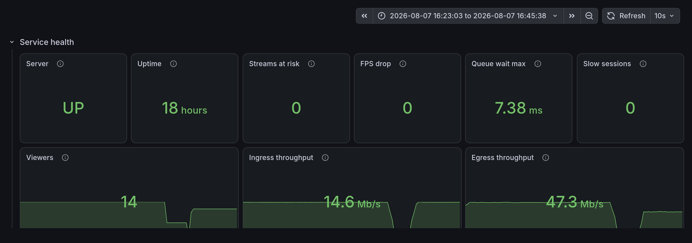

The six tiles in the top row are the ones to check every time you look.
If any one of `Server`, `Uptime`, `Streams at risk`, `FPS drop`, `Queue wait max`, or `Slow sessions` lights up, start with that tile.
The tiles that change color are gathered in the top row, so instead of memorizing which tiles have thresholds, you only need to check "is the top row all green".
The three in the bottom row never change color; you judge them by the shape of the small trend line (sparkline) drawn inside each tile.
If both rows look fine and nobody has reported anything, there is no need to open the remaining panels right away.

| Tile                 | What it is                                                                                                                                         |
| -------------------- | -------------------------------------------------------------------------------------------------------------------------------------------------- |
| `Server`             | Whether Prometheus collected this server's metrics on its most recent scrape.                                                                      |
| `Uptime`             | How long the OME process has been running.                                                                                                         |
| `Streams at risk`    | The number of streams that currently have a red cell in the `Stream status` table (ingest below `100kb/s`, SRT drops at `0.2` per second or more). |
| `FPS drop`           | The number of input streams that have fallen below `50%` of their own peak frame rate recorded over the last 10 minutes.                           |
| `Queue wait max`     | The largest of the average wait times across the server's internal queues.                                                                         |
| `Slow sessions`      | The number of viewer sessions whose round-trip time (RTT) has stayed above `200ms` for `3 minutes` or longer.                                      |
| `Viewers`            | The number of playback sessions currently connected.                                                                                               |
| `Ingress throughput` | How much media is being received per second (bps).                                                                                                 |
| `Egress throughput`  | How much media is being sent out over the network per second (bps).                                                                                |

<details>
<summary>Tile by tile, in detail</summary>

- **`Server`**
  Because the values from several servers are combined with `min()`, the tile reads `DOWN` even when only one of them stops.
  While no server is being scraped at all, the other eight stop updating, which leaves nothing to judge by.
- **`Uptime`**
  If the value suddenly drops, the process was restarted.
  Like `Server`, it is a value combined with `min()`, so the figure goes down even when only one of several servers restarts.
  Which server it was can be found from the `OmeRestarted` alert in appendix B.
  It turns orange below `15 minutes`, the same window that alert uses.
- **`Streams at risk`**
  Even when the channel count grows into the dozens and the problem row is pushed out of the visible area, this tile still shows you the signal.
  Yellow cells, however, are not counted.
  When a stream has disappeared entirely there is nothing left to count, so the tile stays at `0`.
- **`FPS drop`**
  Normal frame rate differs from channel to channel, which makes a single absolute threshold hard to apply, so we designed it to compare against each channel's own recent figures.
  A lit tile does not immediately mean an outage, though, so we left it as a reference signal to read together with the `FPS` column in the table.
  When the input has stopped completely, on the other hand, the frame rate figure freezes at its last value.
  A live connection with the data stopped is caught by the `Ingress` column in the table, and a disconnected encoder by the `StreamMissing` alert.
  If the drop lasts more than 10 minutes the baseline sinks to that same value and the tile turns green again, so this tile answers "did it just drop", not "is it low".
- **`Queue wait max`**
  Every millisecond spent waiting adds directly to the latency the viewer sees.
  Because it is an average, a short but severe stall shows up smaller than it really is.
  It is red from `5 seconds` up, and we did not set a yellow level.
  A figure that spikes once for a few seconds clears on its own ([1.2](#12-server-is-it-keeping-up-inside)), so we left filtering values like that to the alert rules in [chapter 4](#4-what-watches-the-screen-when-you-are-away).
  Which queue it is can be found in the queue panels at the very bottom of the screen, and we look at what this metric catches through a real incident in [3.6](#36-case-6-a-backlog-inside-the-server).
- **`Slow sessions`**
  It is the same threshold that turns the RTT column red in the session list on the detail screen ([2.4](#24-why-drilling-into-a-single-stream)).
  Judging by the instant value would make it blink red every 15 seconds, so only sessions that last `3 minutes` or longer are counted.
  Sessions that have already ended are excluded; only the ones still open count.
  In this demo the viewers are on the same network as the server and RTT is in microseconds, so this tile is **`0` under normal conditions**.
- **`Viewers`**
  It counts sessions rather than people; one person with two tabs open makes it 2.
  Recording (`file`), push publishing (`push`), thumbnail (`thumbnail`), and edge relay (`ovt`) are not viewers, so we excluded them from the count.
- **`Ingress throughput`**
  Because it is a server-wide total, a failure on one stream does not move it enough to warrant a threshold; that is why we left it without colors, and you read only the step shape of the sparkline.
  Per-stream judgment happens in the `Streams at risk` tile.
- **`Egress throughput`**
  It includes not only viewer delivery but also push publishing (`push`) and edge relay (`ovt`).
  Like `Ingress throughput`, it counts media data only and leaves out protocol and socket overhead, so it is normal for it to read lower than the server's NIC counters.

</details>

The figures on the tiles are 14 playback sessions, 14.6Mb/s of ingest, and 47.3Mb/s of egress.
Four input streams produced these figures (two RTMP, one SRT, one WHIP), and each of them appears as its own row in the table in [2.3](#23-which-stream-is-the-problem-the-stream-status-table).

### 2.2 What dropped? The service overview graphs

:::note
**`protocol` on the screen is `publisher` in the queries.**
OME uses the `publisher` label for the module that sends to viewers, but in the industry publisher generally means the sending side, which reads as the exact opposite, so the screen says protocol instead.
The `publisher` label has eight values, but only four of them, `webrtc`, `llhls`, `hlsv3`, and `srt`, deliver to viewers, so every panel needs a filter.
The queries are in appendix B.
:::

The two rows below the tiles are where you check trends.

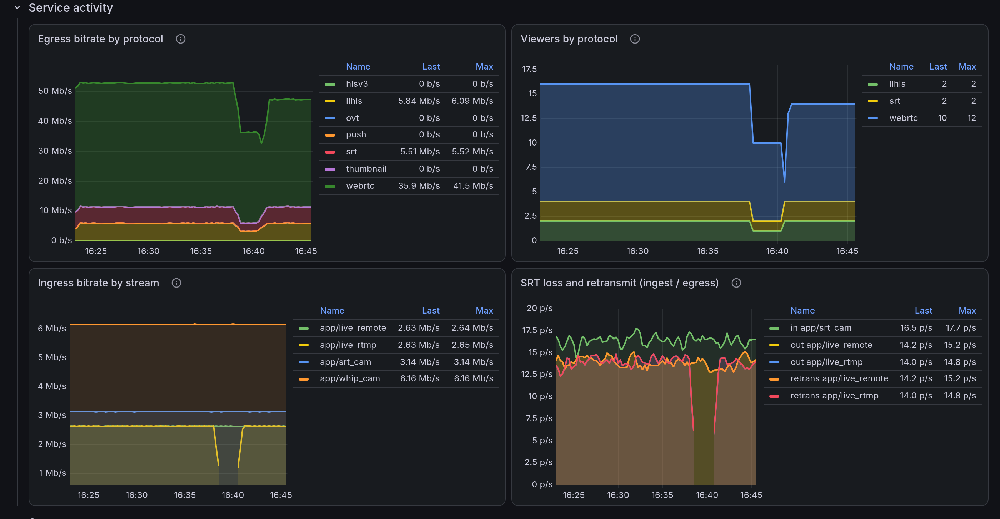

`Egress bitrate by protocol` and `Viewers by protocol` are placed side by side, so comparing the shapes of the two graphs answers the question from chapter 1, "did the viewers leave or is the delivery blocked".
Both panels are broken out by protocol, so you can also see whether only WebRTC dropped or everything dropped.
For a service that uses ABR, though, these two panels alone cannot tell them apart, so you have to judge all three together, including the input ([1.4](#14-relationships-between-values-not-single-values)).
The panel that shows that input is `Ingress bitrate by stream` on the left of the next row; it is the last of the "input, viewer count, egress bitrate" trio mentioned in chapter 1.
Next to it, `SRT loss and retransmit (ingest / egress)` is the loss trend for the streams and sessions that use SRT.
In the legend `in` is the ingest side, `out` is the egress side, and `retrans` is how much the egress side made up for with retransmission ([2.4](#24-why-drilling-into-a-single-stream)).
Even for a stream received over RTMP, values appear on the `out` side if there is a viewer watching it over SRT.

The step near 16:38 in the figure above is the ingest outage window reproduced in [3.1](#31-case-1-ingest-stops).
Egress bitrate and viewer count stepping down together and then climbing back up is the textbook case of "the viewers left".
Only some of the disconnected players reconnected, though, so the viewer count settled at 14 rather than returning to 16.

### 2.3 Which stream is the problem? The `Stream status` table

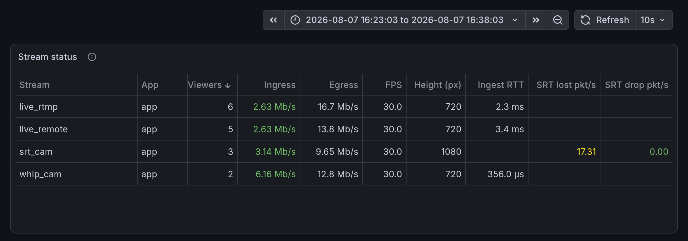

This is the panel you end up looking at the longest on the service status screen.
After the stream name and the app name come eight values, and only three of those columns are colored: `Ingress`, `SRT lost pkt/s`, and `SRT drop pkt/s`.

| Column           | What it is                                                                                                                                                                                                                     |
| ---------------- | ------------------------------------------------------------------------------------------------------------------------------------------------------------------------------------------------------------------------------ |
| `Viewers`        | The number of playback sessions watching this stream                                                                                                                                                                           |
| `Ingress`        | How much media this stream takes in per second                                                                                                                                                                                 |
| `Egress`         | How much this stream sends out over the network per second. Push publishing and edge relay are included                                                                                                                      |
| `FPS`            | Frames per second of the input video. With more than one video track this is the **minimum**. Aggregating with `max` would let a healthy track mask the value when only one track has collapsed, so the problem never surfaces |
| `Height (px)`    | Vertical resolution of the input video                                                                                                                                                                                         |
| `Ingest RTT`     | Round-trip time between the server and the encoder. It carries not only the path delay but also the encoder's own response delay (never compare across rows, see [3.5](#35-case-5-same-path-rising-latency))                                                          |
| `SRT lost pkt/s` | Packets per second judged lost on the SRT ingest (pkt/s is packets per second)                                                                                                                                                 |
| `SRT drop pkt/s` | Of those, the packets discarded because retransmission could not recover them. When this value rises, viewers really have lost something                                                                                   |

Of these, the red on `Ingress` and `SRT drop pkt/s` feeds straight into the `Streams at risk` tile at the top, while the yellow on `SRT lost pkt/s` shows up only in the table.

Of the color thresholds below, the two SRT columns are set to match this demo's 3.13Mb/s SRT input.

<details>
<summary>Color thresholds, column by column</summary>

- `Ingress` turns red below `100kb/s`: it means almost no data is coming in.
  If ingest stops completely the stream is removed from the server, which makes the row itself disappear.
  The red flags the case where the connection is still up but no data is arriving.
- **We did not apply any color to `FPS`.**
  Every channel has a different normal frame rate, which makes a single absolute threshold hard to apply.
  The judgment is made by the `FPS drop` tile at the top ([2.1](#21-is-it-healthy-right-now-the-nine-top-tiles)).
  This cell is there to tell you which stream dropped and by how much, once that tile lights up.
- `SRT lost pkt/s` turns yellow at `0.5` or above: it means packets are not arriving in order on the ingest path, which may be real loss or may be reordering.
  This `0.5` is an absolute count rather than a ratio, so on this demo's SRT input (about 298 packets per second) it corresponds to a loss rate of 0.17%.
  To convert it into a loss rate, estimate the packets per second with `rate(ome_receive_bytes_total{...}) / 1316` and divide by that value (1316 bytes is SRT's default payload size).
  Loss is a trend figure that rises on even a slight degradation of the network, so we did not apply red to this column.
- `SRT drop pkt/s` turns red at `0.2` or above: these are packets discarded because retransmission could not recover them, so by this point the loss has already reached the viewer's screen.
  We deliberately aligned the number that turns the screen red with the number that pages someone, so the `SrtIngestDropping` alert in [chapter 4](#4-what-watches-the-screen-when-you-are-away) uses the same `>= 0.2` over the same 2-minute window.
  Even on the SRT input that produced loss the whole time, this cell reads `0` under normal conditions.
  The only times it met this condition came within the 57 minutes of network degradation we induced on purpose.

</details>

In the figure above all four streams are at 30fps, only `srt_cam`'s `SRT lost pkt/s` of 17.31 is marked yellow, and its `SRT drop pkt/s` is `0`.
Since not a single cell is red, the `Streams at risk` tile at the top is also `0`.

The `Ingest RTT` column is **not a value to weigh row against row, but one you read against the same stream's own normal level**.
Each protocol measures it differently; the magnitudes are not comparable to begin with.
Because it is also a sample from a single scrape, one stream keeps swinging between 0.59ms and 13.6ms within the same 15-minute window.
Why it swings like this is covered in [3.5](#35-case-5-same-path-rising-latency).
If you do not have a normal value to compare against yet, judge by the trend in the `Ingest RTT by method` graph on the detail screen instead of this cell.

As with `FPS`, **we applied no color thresholds** to the `Egress` column.
If this column reads `0` while there are viewers, the delivery path may be broken, so the judgment comes from reading it together with `Viewers` rather than from a color.

**The per-second values in the table are computed over a fixed window that does not stretch when you widen the screen's time range** (2 minutes for `SRT drop pkt/s` alone, to match the alert, and 1 minute for the rest).
If the window widened along with the range, the value of a stream that just stopped would be buried in the average of a long window and show green as if healthy.
In the stop experiment in [3.1](#31-case-1-ingest-stops), reading the same instant just after the stop, the stopped stream measured 568kb/s over a 2-minute window and 2.22Mb/s over a 10-minute window.
The 0.97Mb/s low quoted there is a reading from a different moment on the 1-minute window.

### 2.4 Why? Drilling into a single stream

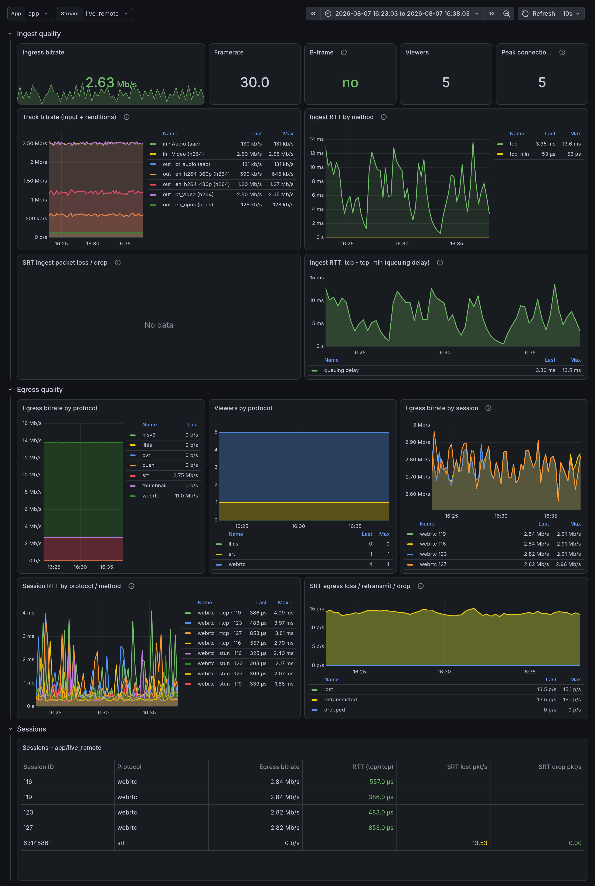

From here on you look at only the one stream you decided has a problem.
The screen is made up of three sections: `Ingest quality`, `Egress quality`, and `Sessions`.

#### Ingest quality

The top row consists of five tiles: `Ingress bitrate`, `Framerate`, `B-frame`, `Viewers`, and `Peak connections`.
The first four are the metrics from [1.1](#11-ingest-is-the-input-alive) and [1.3](#13-viewers-is-it-getting-through) carried over unchanged, and only `Peak connections` appears here for the first time.
It is the highest concurrent connection count since that stream started, and because no viewer filter is applied it counts recording and push publishing connections as well.

<details>
<summary>How to read <code>B-frame</code> and <code>Track bitrate</code></summary>

`B-frame` shows `no` in green and `yes` in orange.
WebRTC's mandatory-to-implement H.264 profile is Constrained Baseline (RFC 7742), which has no B-frames, so **sending a track that contains B-frames to WebRTC without transcoding makes playback unstable.**
If you are delivering that stream over WebRTC, this orange is a failure signal, and the place to fix it is the sending encoder.
In OBS, that is `bframes=0`.
If you deliver only over the HLS family, playback still works and only the latency increases.
`Framerate` is the minimum across the video tracks, for the same reason as in the `Stream status` table ([2.3](#23-which-stream-is-the-problem-the-stream-status-table)).

The `Track bitrate (input + renditions)` panel overlays the input tracks and the output renditions on one graph, so the case described in chapter 1, "the input is unchanged but one rendition drops", is visible at a glance.
In the legend, `in ·` is the original input, `out · pt_` is what goes out without transcoding (pass-through), and `out · en_` is a newly encoded rendition ([the queries in appendix B](#queries-by-panel)).
The input is drawn as a dotted line because its value is normally identical to that of the pass-through rendition and would sit hidden under the solid line.
When the dotted line and the solid line separate, the pass-through path alone is falling behind.

</details>

The stream in the figure above was sent over RTMP from a machine other than the server, so `Ingest RTT by method` recorded a real network value.

#### Egress quality

`Egress bitrate by protocol` and `Viewers by protocol` show the distribution within this stream, and `Egress bitrate by session` shows the rate of each individual viewer.
This panel shows only the 20 worst sessions ([the queries in appendix B](#queries-by-panel)).
`Session RTT by protocol / method` is the round-trip time per session, and `SRT egress loss / retransmit / drop` is the loss on the delivery side toward viewers watching over SRT.
Instead of applying color thresholds, this RTT panel sorts its legend table by `Max` in descending order, so the worst session is always on the top row.

#### Session list

The `Sessions - $app/$stream` table at the bottom is the last step, the one that goes down to the individual viewer.
One session is one row, and the egress bitrate and the RTT sit side by side, so you can tell at once whether "only this person is slow, or everyone is".

The four session panels on this detail screen (the `Sessions` table, `Egress bitrate by session`, `Session RTT by protocol / method`, and `SRT egress loss / retransmit / drop`) require the `session` metrics to be enabled.
If they are not enabled, the stream-level `Egress bitrate by protocol` only lets you tell whether an entire protocol is in trouble ([appendix A](#choosing-what-to-collect-and-how-much)).
If the table is empty even with the metrics enabled, first check whether the stream has disappeared from the server, or whether nobody is watching it.

On the screen above, all four WebRTC sessions are being delivered evenly at 2.82 to 2.84Mb/s, which confirms that this is not one viewer's problem.
The RTTs also run between 386us and 853us and are all shown in green.

What the `Sessions` table has that the `Stream status` table does not is the `RTT (tcp/rtcp)` column.
It turns orange at `80ms` or above and red at `200ms` or above.
The two SRT columns use the same thresholds as the earlier table, so red appears only when `SRT drop pkt/s` is `0.2` or above.

<details>
<summary>Why the SRT loss cell lights up in this demo</summary>

The loss cell of the SRT session lights up in this demo because we applied the same loss on the playback side as well.
On the same screen, `SRT egress loss / retransmit / drop` shows both `lost` and `retransmitted` at 13.5 per second.
That means retransmission is making up for exactly as much as was lost.
`dropped` staying at `0` means nothing was discarded from the send buffer, so nothing was actually lost.
In production, this loss cell lighting up is a signal to go check that viewer's network, and does not by itself mean a failure.

</details>

Open the same screen on an SRT ingest stream and `SRT ingest packet loss / drop` shows the network quality as well.

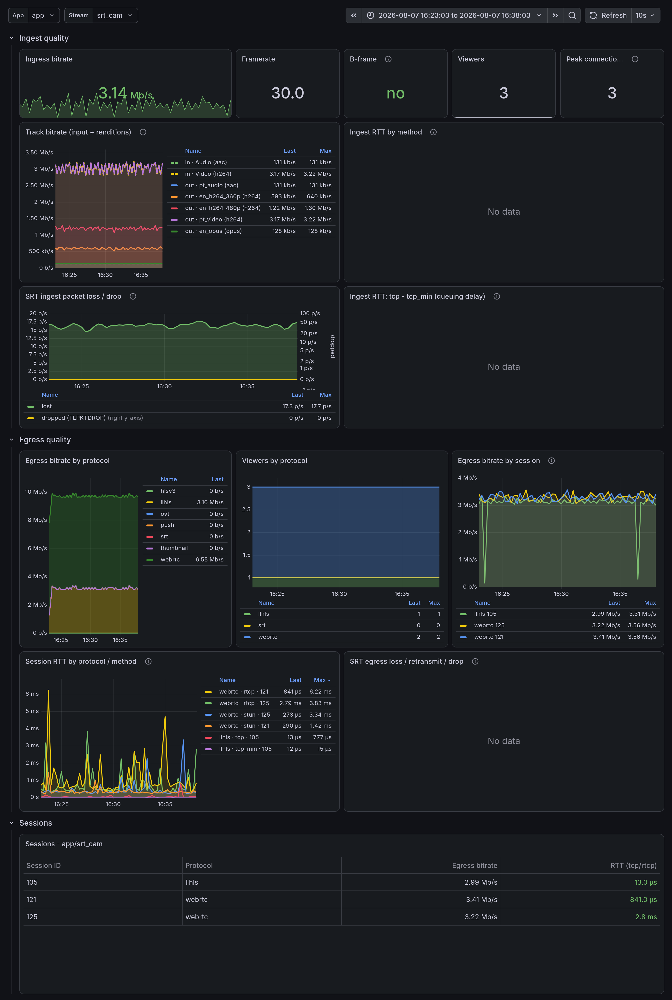

A WHIP input is recorded as `stun` in the same RTT panel.
It measures the round trip of ICE connectivity check packets rather than of media, so even in the same column it is not the same as RTMP's `tcp`.

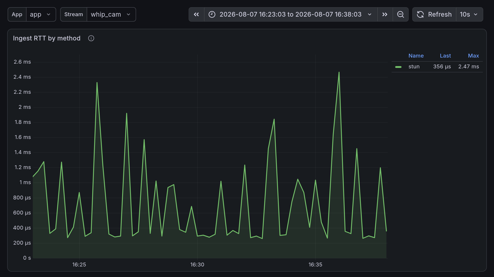

### 2.5 Is the server keeping up?

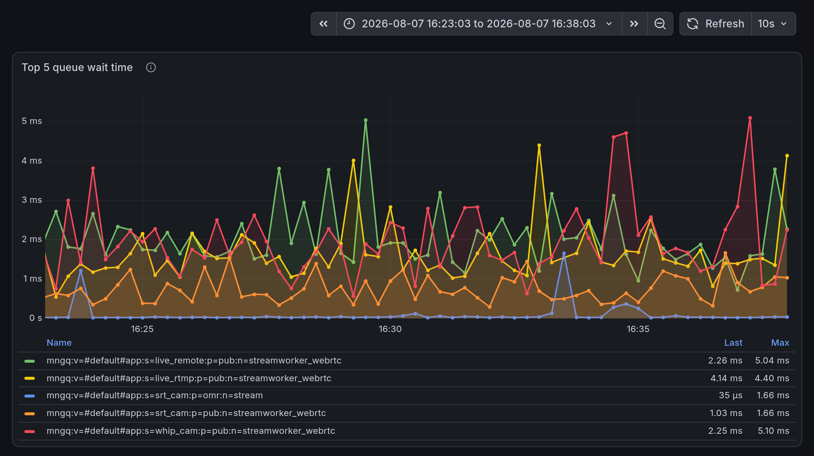

The four sections before this one stayed outside the server; this one looks inside it.
The managed queues inside OME sit in front of each stage: routing, transcoding (decoding, filtering, encoding), and egress.
Which queue is backing up tells you immediately which stage is the bottleneck ([1.2](#12-server-is-it-keeping-up-inside)).

With dozens of queues in play, showing all of them is not an option, so both panels show only the top 5.
`Top 5 queue depth` picks the queues with the largest backlog, and `Top 5 queue wait time` in the figure above picks the queues with the longest wait time.
The two panels sit side by side in the bottom row of the service status screen.

Read the backlog and the wait time together ([1.2](#12-server-is-it-keeping-up-inside)).
In normal operation the wait time in this demo is in the millisecond range, and no queue exceeds 5.1ms.

The wait time value itself is an exponential moving average that updates on every dequeue, so it is insensitive to sudden swings.
If a queue is fully blocked and dequeuing stops, the updates stop with it, so the value freezes at whatever it last read.
A value frozen below `5 seconds` also leaves `QueueWaitHigh` in chapter 4 silent, so a fully blocked queue is not something that rule catches.
A value that is not rising is therefore not by itself evidence that it is healthy.

The `p=` in a queue name is the stage that queue belongs to.
`pvd` is ingest, `imr` is the input side of the media router, `omr` is the output side, `trs` is transcoding, and `pub` is egress ([1.2](#12-server-is-it-keeping-up-inside)).

<details>
<summary>How to read a queue name</summary>

```
mngq:v=#default#app:s=srt_cam:p=imr:n=stream
     |              |         |     |
     |              |         |     +-- queue name
     |              |         +-------- stage
     |              +------------------ stream
     +--------------------------------- vhost and app
```

After `v=` come the vhost and the app, each prefixed with `#`.
Some names have no `s=`, and those queues are not tied to a single stream but serve the whole app.

`n=` spells out what the queue does, as in `dec_H264_t0` (decoding), `filter_video` (filtering), and `enc_OPUS_t4` (encoding).

You may see several queues sharing the same name.
A filter is created for each input-track/output-track pair, so there are two `filter_video` queues per stream.
The only thing that tells the two apart is the `queue_id` label.

When several queues rise at once, compare the `p=` values in their queue names.
If `p=` is identical even across different streams, the backlog sits at that one stage.
If different `p=` values rise together, an earlier stage may be backing up behind a later one, so start from the last stage.

</details>

## 3. How an operator actually reads this screen

The usefulness of a dashboard comes down to whether failures actually surface on it.
Of the six cases, the first four are failures we induced directly during a live broadcast.
The fifth, ingest latency, is the screen as it looked during normal operation, and the last, a backlog inside the server, is an incident that really happened here.
Each case was captured at a different moment, so values can only be compared with others inside the same section.

The `Uptime` tile tells you **whether the process restarted just before**, and if you have set up deploy markers, they appear alongside it ([appendix A](#collection-prometheus)).
A good share of the failures that hit overnight come from someone changing something the evening before, so these two facts are the context for everything else on the screen.

### 3.1 Case 1. Ingest stops

Ingest stopping can be normal behavior (the sending side ending the broadcast), or it can be a failure.
This section assumes a channel that must not stop, that is, one that sends 24 hours a day ([4.1](#41-what-becomes-an-alert-rule)).

We picked one of the four streams and stopped its RTMP send for 2 minutes.
Cleanup and re-registration add to that, so the graph shows a gap of a little over 2 minutes.

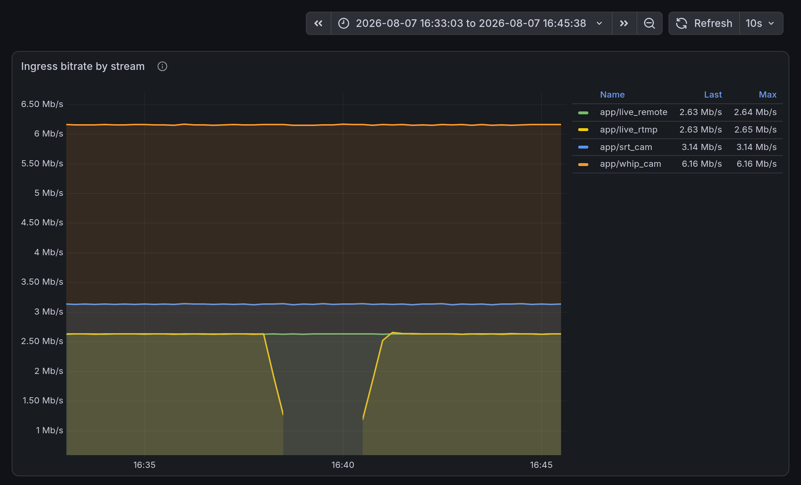

**When ingest stops, that stream's line does not drop to `0`; it disappears from the graph entirely.**
In the figure above, only the `app/live_rtmp` line breaks off around 16:38 and reappears at 16:41, while the other three streams are unchanged.
The green line that appears during the interruption is `app/live_remote`, which had been hidden underneath the yellow line and is now exposed.
This pattern is easy to miss when you are looking for a `0`, which is what the `StreamMissing` alert in [chapter 4](#4-what-watches-the-screen-when-you-are-away) is for, but its window is 10 minutes, so an outage that recovers in 2 minutes like this one is caught neither on the screen nor by an alert.

If only one stream disappeared, check the sending side first, and if several disappeared together, check the server or the shared uplink first.
Other panels from the same moment back up that judgment.

- `Viewers by protocol`: sessions are cleaned up as the stream goes away, so the count falls off in steps.
- `Stream status` table: you would expect the `Ingress` cell to turn red here, but it does not.
  In this experiment, `live_rtmp`'s `Ingress` bottomed out at 0.97Mb/s on the 1-minute window and never fell to the `100kb/s` red threshold; instead of dropping to `0`, **the entire row disappeared.**

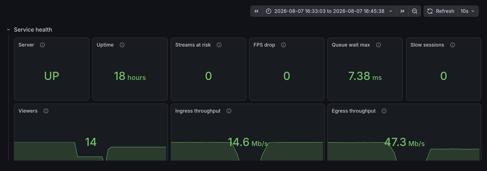

`Streams at risk` stayed at `0` for the whole experiment.
Once a stream is gone from the server, there is nothing left for the cell to count.
This is exactly the blind spot mentioned in [2.1](#21-is-it-healthy-right-now-the-nine-top-tiles).
The top tiles show only the current state; the only history on this screen is in the three tiles with sparklines (`Viewers`, `Ingress throughput`, `Egress throughput`) and the graph panels below the tiles.

Reading these three values together tells the causes apart.

- If `Ingress throughput` dropped at the same time, the input for that stream has stopped.
  That is the situation we are looking at here.
- If `Ingress throughput` holds steady and only `Egress throughput` drops, every viewer is buffering at the same time.
  The candidates are the server's network bandwidth, the line out to the internet, and the CDN in front; a backlog inside the server looks exactly the same, so you have to tell the two apart with `Queue wait max`.

**When `Viewers` and `Egress throughput` fall together while `Ingress throughput` is normal, you cannot conclude it is a "natural drop-off".**
Viewers leaving as a broadcast nears its end looks like this, but so does anything that cuts viewers off: an expired certificate, a failing load balancer health check, a broken WebRTC connection path, a failed CDN origin lookup, or a bad player deployment.
`Viewers by protocol` is what separates a natural drop-off from viewers being cut off.
If only one protocol fell, it is not that the viewers left but that the path is blocked, and if the protocol mix stays the same while all of them fall together, the metrics alone cannot narrow it down any further.
The broadcast schedule, the certificate expiration date, and the 5xx counts from the load balancer and the CDN in front are values that live outside this screen.

### 3.2 Case 2. Ingest is alive but quality drops

The more common case in practice is not the input line disappearing but **the values getting worse while the line stays there**.
When the sending device overheats, when the encoder cannot get enough CPU, or when a wireless link degrades, the frame rate is the first thing to drop.
That said, a frame rate drop by itself does not mean a failure.
During stretches where the picture is nearly still, the encoder has no frames to send and lowers its own frame rate sharply, and with WebRTC the reduction is especially large.
If an input's frame rate is variable by nature, the reasoning in this section does not hold for it, so exclude those channels from the `FPS drop` tile and the `FramerateDropped` rule and judge them by the input-stopped and line-loss signals instead.

Without stopping the `live_rtmp` send, we cut the frame rate to 1/4.
An input that had been arriving at 30fps drops to 7.5fps.

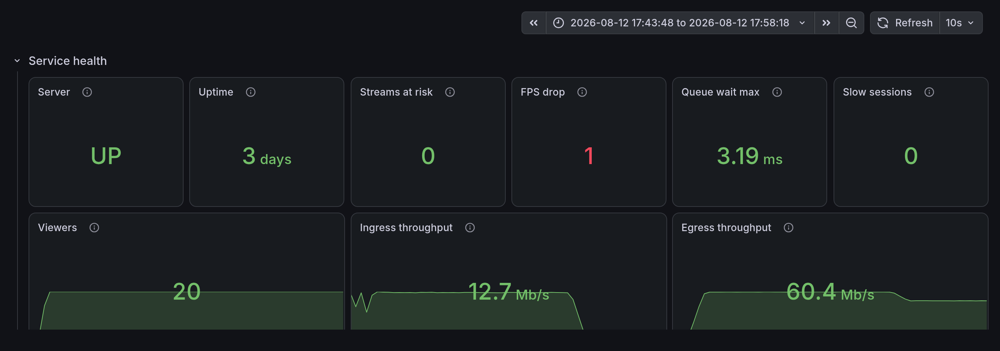

`FPS drop` reads `1` and has turned red.
The other five tiles in the top row stay green, and `Viewers` holds at 20.
`Ingress throughput` fell slightly from 14.5Mb/s to 12.7Mb/s, but this tile has no color coding, so it does not catch your eye unless you look at the sparkline.
Because the input never stopped, **an alert conditioned on ingest stopping does not detect this state.**

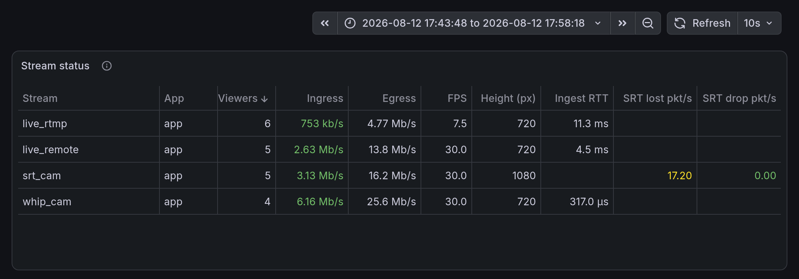

`FPS` on the `live_rtmp` row reads 7.5 (why we did not color this column is explained in [2.3](#23-which-stream-is-the-problem-the-stream-status-table)).
`Viewers` on the same row is 6, and the viewers in those six sessions are watching choppy video right now.

**This stream's `Ingress` fell along with the frame rate, from 2.63Mb/s to 0.75Mb/s.**
That said, depending on the encoder settings, the bitrate can also hold steady.
Even then the frame rate moves, so **the `FPS` column catches** a state the bitrate column alone does not reveal ([1.4](#14-relationships-between-values-not-single-values)).

The encoder in this demo sets the keyframe interval as a frame count (`-g 60`), so when the frame rate falls, that same interval stretches out in wall-clock time.
`ffprobe` showed the keyframe interval in this window had grown from the usual 2 seconds to between 6.1 and 6.4 seconds.
The 2-second LL-HLS segments grow by that same amount, so both playback startup and quality switching get slower.
The keyframe interval is not shown on this screen, so this effect does not surface in any panel.

**Re-encoded renditions hold at 30fps because the transcoder fills in the missing frames.**
`en_h264_480p` and `en_h264_360p` read 30 throughout this window, and only `pt_video`, which passes the original through unchanged, follows the input down to 7.5.
We applied an input-track condition to the `FPS` column of the table so that this cell reports **the state of the input**, not of a rendition.

The cause is on the encoder outside this screen, and the server cannot produce better quality than what came in.

### 3.3 Case 3. The network path degrades

We placed a relay in the middle of the SRT ingest path and had it continuously drop 5% of all packets passing through.
With that in place, we raised **the time the relay holds a packet** in three steps.
For each packet it picks a random value between 0 and 3ms, 0 and 150ms, or 0 and 400ms, and delays the packet by that amount.
The goal is to make packets that were sent in order arrive out of order.

<details>
<summary>Why 3ms, 150ms, and 400ms</summary>

The reference point is the 200ms SRT `latency` configured on the sending side.
If retransmission recovers a packet within that time the viewer notices nothing, but past that time the packet is discarded.
3ms is far below that threshold, 150ms comes close to it, and 400ms is twice that.
The relay applies the same delay to the return path as well, so in step 3 ACK and NAK are delayed by up to 400ms too.
Retransmission requires a round trip, so the later the response arrives, the less room there is to recover within 200ms.

We kept the connection up the whole time and never disconnected.
SRT restarts its counters from `0` on reconnect, so if we had dropped the connection there would be no way to compare before and after in the figure below.

</details>

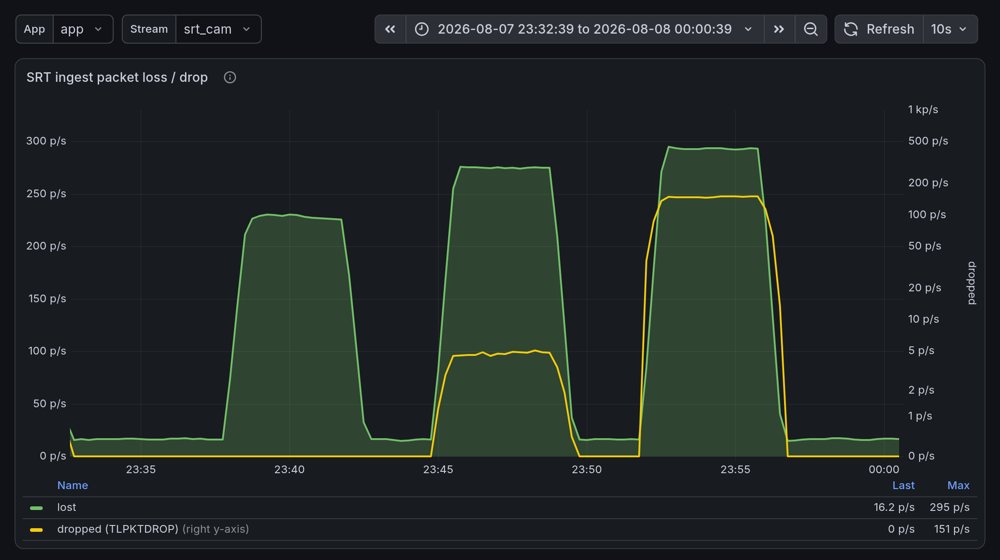

Even where `dropped` starts to move off `0`, it is tens of times smaller than `lost`, so it uses a separate right-hand axis: the two lines are not there to be compared by height, only to show whether each one has left `0`.

- `lost`: packets the receiving side judged lost after seeing a gap in the sequence numbers.
- `dropped (TLPKTDROP)`: packets that did not arrive within the time limit even with retransmission and were discarded.

**Normal.** `lost` is 16 per second and `dropped` is `0`.
The relay discards about 15 media packets per second, so the loss count reflects the actual loss almost exactly.
The link is losing 5%, but SRT recovers all of it by retransmission, so nothing is missing from the data delivered to viewers.

**Step 1.** The delay varies up to 3ms.
`lost` rises fourteenfold to 230 per second.
But `dropped` is `0`, and the received bitrate holds at 3.13Mb/s.
The relay statistics show that the entire increase is retransmission: one retransmission occurred for each packet counted as lost, and all of them arrived in time.
libsrt defaults its reordering tolerance (`SRTO_LOSSMAXTTL`) to `0` and declares a loss the moment it sees a gap, so mere reordering inflates the `lost` figure this much.

**Step 2.** The delay varies up to 150ms.
`lost` edges up to 276 per second, and this time **`dropped` leaves `0` at 5 per second.**
Packets that fail to arrive within the sending side's 200ms SRT `latency` have started to appear.
The received bitrate also falls from 3.13Mb/s to 2.62Mb/s, down to 84% of normal.

<details>
<summary>What <code>dropped</code> counts and what it does not</summary>

**`dropped` also includes what the sending side reported as discarded.**
Neither `lost` nor `dropped` includes what the encoder never managed to send in the first place, and that shows up only in how far the received bitrate falls.
Whether it was discarded or never arrived at all, it reaches viewers as missing data.
So `lost` is only slightly higher than in step 1, yet the viewer's picture actually starts to break from step 2 on.

</details>

In this window, **`SRT drop pkt/s` in the `Stream status` table turns red.**
The value is more than twenty times the red threshold of `0.2`, and the top `Streams at risk` tile, which counts the red cells in this column, goes to `1` ([2.1](#21-is-it-healthy-right-now-the-nine-top-tiles)).
The other metrics on the same row, however, show no change.
`Ingress` at 2.62Mb/s is still well clear of the red threshold.
`FPS` stays between 21 and 27, so it never trips the `FPS drop` tile, whose threshold is half the recent peak.
The alert that stands in when nobody is in front of the screen is also slow here.
`SrtIngestDropping` in chapter 4 does detect this state, but its `for: 5m` condition delays it: the degradation ended at the 4-minute mark and the alert fired 1 minute 21 seconds after that.
It fired at all only because the 2-minute window held the condition true past the last drop.

**This is exactly why we based this column on failed recovery rather than on loss.**
Had we used `lost`, the cell would already have been red in step 1 and would never have worked as a signal.
`SRT drop pkt/s` is the one thing on this screen that detects a state where the broadcast keeps running and ingest and frame rate look normal while only the viewer's picture breaks.

**Step 3.** The delay varies up to 400ms.
`lost` rises to 293 per second, and now `dropped` climbs along with it to 148 per second (the `Max` of 151 in the figure legend is a momentary peak within this window).

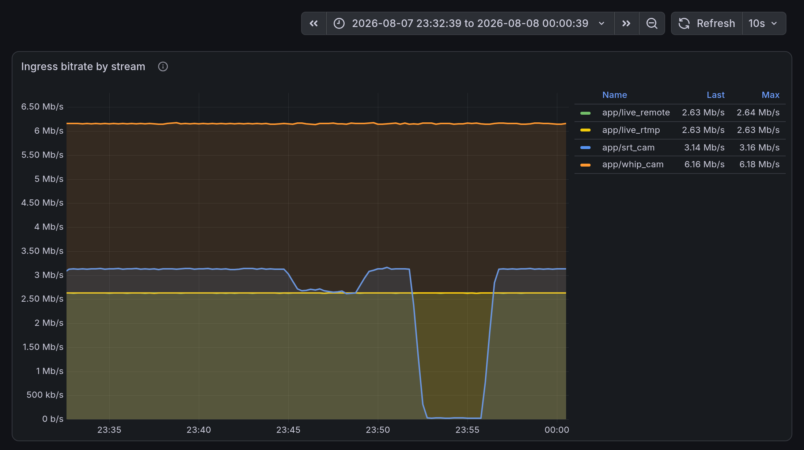

In this window the stream effectively stops.
The received bitrate falls to 22kb/s, 0.7% of normal, and only 2 media packets per second arrive.
In the figure above only the `srt_cam` line drops to the floor while the other three streams are unchanged, so the problem is confined to this one sending link.
The return path carried the same delay, pushing the effective round-trip time to 800ms, so the retransmissions themselves could not arrive in time.
`Ingress` falls below `100kb/s`, which turns that cell in the table red as well, and the input frame rate plunges to 0.25fps, taking the top `FPS drop` tile to `1`.
By this stage the failure is visible on the case 1 and case 2 screens even if you know nothing about the SRT metrics.

The three steps each mean something different.

| `lost` | `dropped`             | What is happening                                                                                           |
| ------ | --------------------- | ----------------------------------------------------------------------------------------------------------- |
| Rising | `0`                   | Reordering only, nothing actually lost. The tile stays green                                                |
| Rising | `0.2` per second or more | Some of it failed to recover. `SRT drop pkt/s` turns red and `Streams at risk` goes to 1. Ingest and frame rate are normal |
| Rising | Rising sharply        | The stream collapses. `Ingress` turns red and `FPS drop` rises too                                          |

<details>
<summary>Setting this threshold in your own environment</summary>

`dropped` depends on the link condition and `latency` together, so the usual SRT starting point is **`latency` at three or four times the round-trip time**.
Go higher when the loss rate is high, and on a nearly lossless path such as a wired link you can go under that multiplier to cut latency.
If the viewer's picture breaks while `dropped` is `0`, the loss is not the kind this counter tallies, so the cause is somewhere else.
The likely candidates are latency added by a burst of retransmissions, or an undersized buffer on the sending side.

The egress side has metrics with the same names.
On the ingest side `lost` is what OME detected itself, as the receiver, while on the egress side `lost` is what the viewer reported missing via NAK.
A rise on the ingest side therefore points to the sending link, and a rise on the egress side points to that viewer's link.

</details>

### 3.4 Case 4. One slow viewer or all of them

We played the same stream over several protocols at once and looked at how round-trip time is recorded differently across sessions (as in [2.4](#24-why-drilling-into-a-single-stream), the `session` metrics have to be enabled).

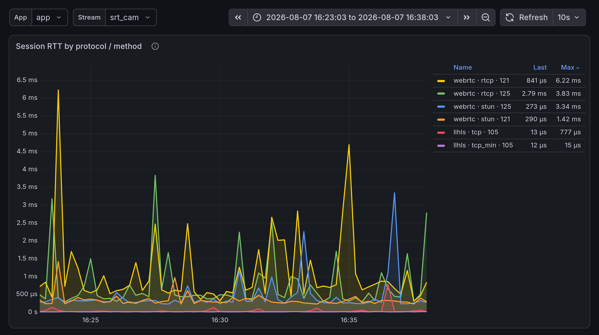

RTT is broken out by measurement method through the `method` label.

| method    | What it measures                                       | Applies to                      |
| --------- | ------------------------------------------------------ | ------------------------------- |
| `rtcp`    | Based on RTCP Receiver Reports, the media path         | WebRTC                          |
| `stun`    | ICE STUN binding request/response time                 | WebRTC                          |
| `tcp`     | The smoothed RTT (SRTT) computed by the kernel         | HLS/LL-HLS, ICE-over-TCP WebRTC |
| `tcp_min` | The minimum RTT the kernel observed in a recent window | Same as above                   |

Each session is measured with the method that suits its protocol, so `rtcp`/`stun` in the legend of the figure above are WebRTC sessions and `tcp`/`tcp_min` are LL-HLS sessions.
These are numbers from different viewers, not several series coming out of one session.

This panel is therefore not for comparing series within a single session but for **comparing sessions against each other at the same moment**.

- `stun`/`rtcp` on a WebRTC session spikes while `tcp` on an LL-HLS session at the same moment does not move: the two viewers sit on different paths, or jitter is occurring only on the UDP path.
  The two viewers in this demo are on the same network as the server, though, so the gap in the figure above (`rtcp` up to 6.22ms, `stun` 3.34ms, `tcp` 777us, `tcp_min` 15us) comes from the difference in measurement method rather than a difference in path.
  In a real service these settle in the tens of milliseconds and only the troubled session spikes above that, but the way you tell which side is spiking is the same.
- Several sessions spike together at the same moment: conditions at individual viewers cannot explain that, so start with the server and everything in front of it.
  If those viewers share the same ISP or the same region, though, that path may be the cause.

You get to that judgment faster if you read the `Sessions` table and `Egress bitrate by session` together.
For a viewer who has selected a lower rendition under ABR, though, egress bitrate reads low even in a healthy state ([1.4](#14-relationships-between-values-not-single-values)), so it is not a value you can judge by its absolute number.

#### The one-slow-viewer experiment

Session RTT in this demo is at the microsecond level, so the `Slow sessions` tile normally never moves off `0`.
We applied a 250ms delay to the playback path of exactly one LL-HLS viewer watching `live_rtmp` and held it for 5 minutes.

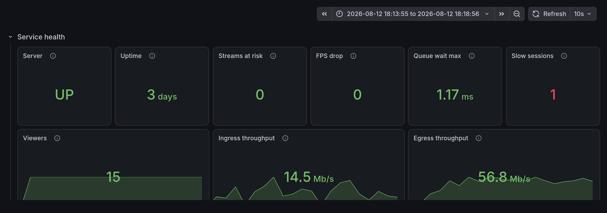

**`Slow sessions` alone reads `1`, and the other eight are normal.**
`Viewers` holds at 15, `Ingress throughput` reads 14.5Mb/s, `Egress throughput` 56.8Mb/s, and `Streams at risk` and `FPS drop` are `0`.
Only one viewer out of 15 is slow, so nothing changes in the stream-level metrics.

Once the tile tells you there is one slow viewer, the detail screen tells you which session it is.

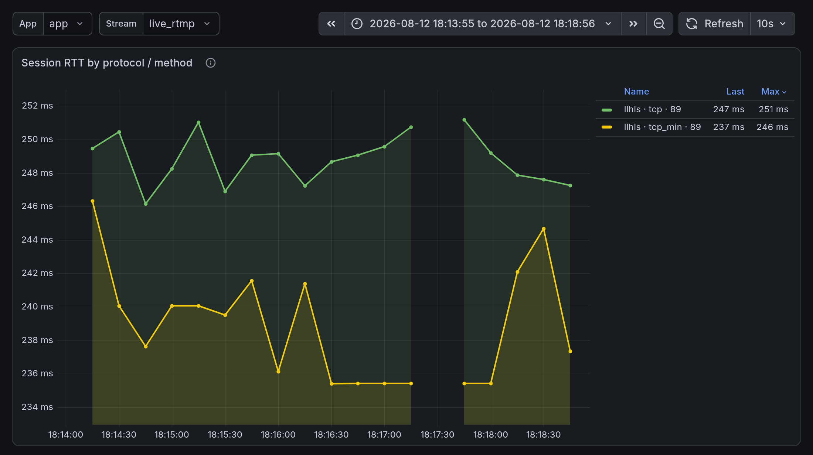

`tcp` for that session reads 247ms.
`tcp_min` rose with it to 237ms, so the path itself is longer, which makes this a different pattern from queuing delay ([3.5](#35-case-5-same-path-rising-latency)).
This panel covers a single stream only, so just the two series for that session appear here, and at the same moment viewers on other streams read 2.53ms for `rtcp` and 320us for `stun`, the same as usual.

After we removed the delay, `Slow sessions` took just over 1 minute to return to `0`.
The condition is a `min_over_time`, so one sample below the threshold anywhere in the window makes it false without waiting for the window to empty ([2.1](#21-is-it-healthy-right-now-the-nine-top-tiles)).

There are a few things to watch out for with the session RTT panel.

- **The graph shows only the 20 worst time series.**
  Even in a state that is effectively healthy the screen can read as "every session shown is bad", so check the total session count against the `Sessions` table row count and the `Viewers` tile.
- **`0` does not mean "best"; it means "unknown".**
  A value recorded as `0` has not been measured even once yet, so for a session that connected only moments ago the value fills in shortly.
- **A flat line does not mean stable.**
  `rtcp` and `stun` update only when the peer sends a packet, so if the peer stops sending, the last value stays in place and the line goes flat.
  If `Egress bitrate by session` for that session has also flatlined, the session is effectively dead.

### 3.5 Case 5. Same path, rising latency

The ingest RTT panel shows the round-trip time of the sending connection, broken out by the `method` label.

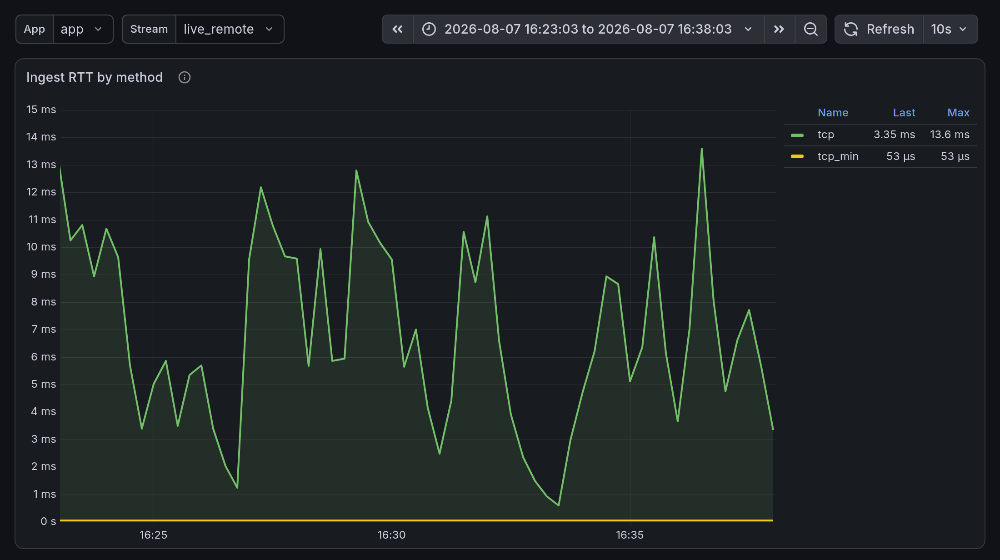

RTMP is recorded as `tcp` and `tcp_min`, and WHIP is recorded with those same two methods if ICE was established over TCP, or as `stun` if it was established over UDP.

`tcp_min` is the smallest value observed in a recent window, so we read it as the floor for that path.
Linux computes this minimum over an observation window of roughly 5 minutes, so if congestion lasts longer than that, `tcp_min` rises along with it to a new floor.

In this demo `tcp_min` is pinned at 53us and hugs the bottom of the axis, while `tcp` mostly hovers around a few milliseconds and peaks at 13.6ms.
Both values are measured on the same socket at the same moment, so this gap is not the result of comparing two different connections.
`tcp_min` did not move, so we judge that the path itself did not change and that the round-trip time on this connection has risen above its floor.

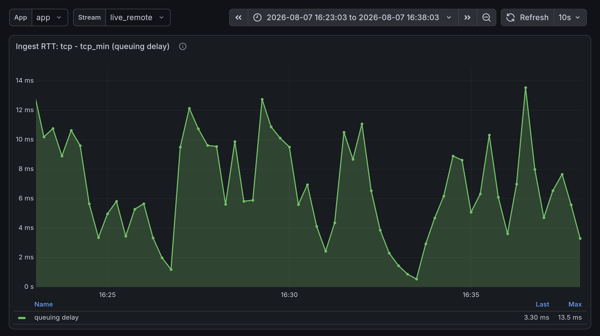

This panel shows the difference between the two values on its own.
The round-trip time of the path itself cancels out, leaving only the amount added inside that connection, which is the queuing delay.

If `tcp_min` rose along with `tcp`, the path changed, which makes it a routing or bandwidth problem.
If `tcp_min` is unchanged and only the gap widens, a buffer somewhere on that connection is backing up, and the candidates are the encoder's upload bandwidth or its processing load.
To narrow these two candidates down, you also need to check whether the input bitrate at the same moment moves along with the gap.

While the gap is widening, the buffer on the sending side absorbs it first, so the viewer's picture does not break right away.
This is exactly the point at which you can still act.
Queuing delay is a noisy number, so we use it for reading the trend by eye rather than as an alert.

- **You must not read it as an absolute value.**
  On ingest the server sends almost nothing, so samples for `tcp` are sparse, and even those samples depend on conditions on the encoder side.
  In this demo we therefore judged it by **how far it has widened relative to that stream's usual level**.
  For an always-on channel whose sending location is fixed, setting a threshold on the absolute value is also an option.
- **If it lasts a long time, the gap disappears.**
  If congestion lasts 5 minutes or more, `tcp_min` rises along with `tcp`, so the subtraction returns to `0`.
- **It is a round-trip figure.**
  Media travels in one direction only, so this number does not add to video latency one-for-one.

The two panels have nearly the same shape because the sending side is on the same network as the server.
`tcp_min` is 53us, so there is almost nothing to subtract, which makes the `tcp` maximum of 13.6ms and the queuing-delay maximum of 13.5ms effectively identical.
In a real environment where the sending side is far away and the path itself is tens of milliseconds, only the RTT panel shifts up by that much overall, while the queuing-delay panel stays near zero.

### 3.6 Case 6. A backlog inside the server

The previous five cases all occurred on a path outside the server; this one occurred inside it.

The input is unchanged, but **only the egress processing slows down.**

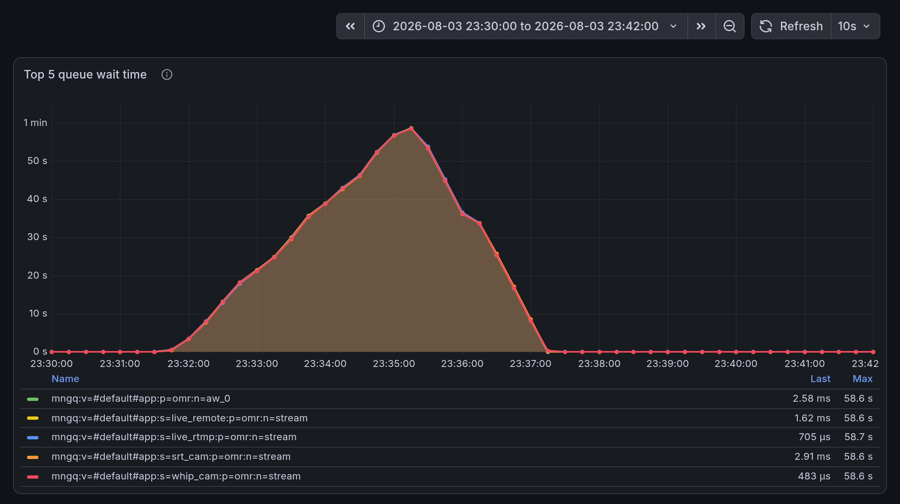

This is `Top 5 queue wait time` over the incident window.
Over a little more than 5 minutes it climbs from 0 to 58.6 seconds and then falls back to 0.

**All five series names end in `p=omr`.**
They are four routing output queues from four streams, plus one app-level queue at the same stage ([2.5](#25-is-the-server-keeping-up)).
It is not that five different points rose together, but that a single stage has five backed-up queues.

**That one stage was the only place with a backlog.**
Over the same window, the maximum wait time of the input-side routing queues (`p=imr`) was 0.06 seconds and that of the egress worker queues (`p=pub`) was 0.01 seconds.
Ingest also held steady at 14.5Mb/s, and viewer sessions stayed at 9.

**Egress bitrate and the queues moved together.**
While egress fell from 34.2Mb/s to a low of 23.0Mb/s, the most backed-up queue grew from 0 to 44,000 items.
On recovery the egress bitrate swung the other way, up to 54.2Mb/s, about 1.6 times its usual level.
That is the accumulated backlog being delivered all at once.

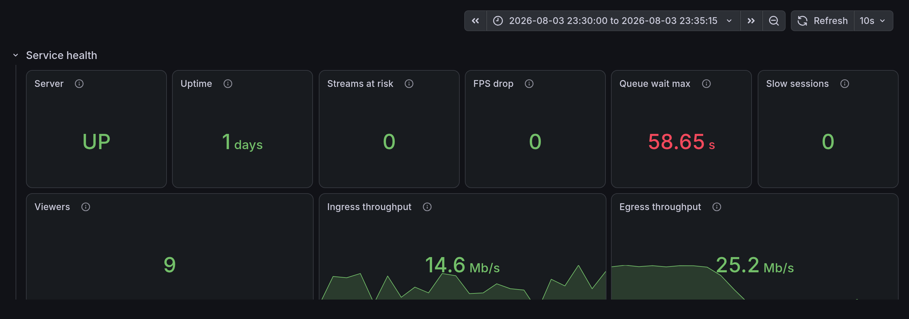

These are the tiles at the moment of the longest wait time in the same incident.
**Only `Queue wait max` is red, and the other five in the top row are green.**
For an operator who checks only the service status screen, this tile was the sole signal for those 5 minutes.

This pattern, ingest steady while only egress drops, looks exactly the same when the fault is on the viewer-side network.
What separates inside from outside is **which stage the backlog formed at**.
If the path out to viewers were blocked, the backlog would have started at the egress worker queue closest to the socket (`p=pub`), but what actually backed up was `p=omr`, the stage before it.
The viewer side was not failing to receive; the server had slowed down in handing data to the next stage.

All of these queues keep accumulating instead of dropping data when they back up, so viewers did not see broken video ([1.2](#12-server-is-it-keeping-up-inside)).
Instead, for the 3 minutes that egress was down, every protocol delivered only 70% of its usual volume.
Live viewers fall behind by the amount by which delivery lags real time.
Since only one stage backed up, the wait in that queue is the added viewing latency, and after playback stops the viewer receives everything at once during the recovery window and resumes at a point 58.6 seconds behind.

`QueueWaitHigh` in appendix B also catches this window.
The rule fires when the wait stays above `5 seconds` for 2 minutes or more, so in this 5-minute window it fired 2 minutes 15 seconds after the condition became true.
Of all the backlogs that occurred in the demo, this is the only one that matches this rule.

We produced these screenshots by pinning the past window to absolute times and querying it again, and that method, together with the queries that compute the incident window as numbers, is in [Reopening a past window in appendix B](#reopening-a-past-window).

## 4. What watches the screen when you are away

That covers what you check on the screen.
At 3 a.m. nobody is sitting in front of it, so some of the judgments you have been making by eye are better handed to rules.

We will use **alert** for what Prometheus produces when it evaluates a condition, and **notification** for what [Alertmanager](https://prometheus.io/docs/alerting/latest/alertmanager/) delivers to a person.
The two live in different configuration files and expose different values to tune.

This chapter covers only the parts that have to be written differently because this is live streaming.
The full rules, the Alertmanager configuration, and general operational items such as severity-based notification routing and silences are collected in [Full alert rules and notification setup](#full-alert-rules-and-notification-setup) in appendix B.

### 4.1 What becomes an alert rule?

Of the six cases in chapter 3, four translate directly into rules: ingest stopping (`IngestStalled`, `StreamMissing`), frame rate dropping (`FramerateDropped`), SRT failing to recover (`SrtIngestDropping`), and a backlog inside the server (`QueueWaitHigh`).
Cases 4 and 5 are judgments that require comparing several sessions against each other or reading a trend, so we did not move them into rules.
Delivery collapsing is caught per protocol by `EgressStalledByProtocol`.
To these we add push publishing failures (`PushFailing`), which the screen does not cover, and `ScrapeNearTimeout`, which catches the scrape itself falling behind.

You need two things first in order to read the rule excerpts, here and in appendix B.
An alert fires only when the condition stays true for as long as the time given in `for`.
`output_stream=""` is the condition that drops the output rendition rows and leaves only the input ([the queries in appendix B](#queries-by-panel)).

<details>
<summary>The <code>IngestStalled</code> and <code>StreamMissing</code> excerpt</summary>

```yaml
groups:
  - name: ovenmediaengine
    rules:
      # A threshold, not `== 0`. When the sending side cuts out, OME tears the stream down,
      # so the whole time series disappears and the value 0 is never left behind at all.
      # What actually has to be caught is a live connection with almost no data arriving.
      # 100kb/s is the same value as the red Ingress threshold in the Stream status table.
      # The dashboard annotation is attached only to rules that pin down a specific stream,
      # since it helps only if the recipient can open that stream's detail screen at once.
      - alert: IngestStalled
        expr: |
          sum by (instance, vhost, app, stream) (
            rate(ome_receive_bytes_total{output_stream=""}[1m])
          ) * 8 < 100000
        for: 1m
        labels: { severity: critical, component: ingest }
        annotations:
          summary: "Ingest nearly stopped on {{ $labels.app }}/{{ $labels.stream }}"
          dashboard: "https://grafana.example.com/d/ome-qos/ome?var-app={{ $labels.app }}&var-stream={{ $labels.stream }}&from=now-1h&to=now"

      # Make sure to change the stream name to your actual channel.
      # If you leave a name that never existed, the rule fires on the very next evaluation.
      - alert: StreamMissing
        expr: absent_over_time(
                ome_receive_bytes_total{vhost="default", app="app",
                                        stream="live_rtmp", output_stream=""}[10m])
        for: 0m
        labels: { severity: critical, component: ingest }
        annotations:
          summary: "live_rtmp has been absent from the server for 10 minutes"
```

</details>

The complete YAML for the other six rules named above, for the server itself (`OmeDown`, `OmeRestarted`), and for the monitoring system's own `Watchdog` is all in appendix B.

<details>
<summary>What we weighed when writing the rules</summary>

- **It is better to avoid making `0` itself the condition.**
  In streaming metrics, the value `0` rarely appears in the first place.
  Not one sample in this demo recorded the ingest bitrate as exactly `0`, and in the stretch where we blocked it completely for 2 minutes there were no samples at all.
  There were, on the other hand, three stretches where the connection held but the data stopped, and their values ran between 21 and 37kb/s, so a rule written as `== 0` would have missed all of them.
- **A threshold just above `0` is no easier to work with.**
  A few SRT drops on a momentary burst are normal, so `> 0` fires an alert on a single packet.
  It is safer to put the threshold above the range the normal values fall in, and since 99% of this demo's normal values are under 0.02 per second, `0.2` is ten times that.
  On a wired segment that has no loss to begin with, or a dedicated line that requires none, a single occurrence can be treated as a failure.
- **We deliberately matched the thresholds to the screen colors.**
  The `0.2` in `SrtIngestDropping` is the same value that turns that cell red in the `Stream status` table, and the `0.5` in `FramerateDropped` matches the threshold on the top `FPS drop` tile.
  If the two differ, you get stretches where the screen is green but the alert fires anyway.
- **There are cases where `for` does not filter out one-off events.**
  A condition that uses a window, such as `increase(...[5m])`, stays true for the next 5 minutes after even a single event, so a `for` shorter than the window filters nothing out.
  Matching it to the window makes the `for` timer expire at the same moment the window empties, so whether the alert fires comes down to evaluation timing.
  So the rules in this article keep the window short and delegate the duration test to `for` (`SrtIngestDropping` uses `rate(...[2m])` + `for: 5m`).
  For `StreamMissing`, `PushFailing`, and `OmeRestarted`, where the window is itself the duration test, we left `for` at `0` to avoid doubling the delay, and `IngestStalled`, whose condition stays true until recovery once it becomes true, has no boundary problem, so its window and `for` are both 1 minute.
- **Detecting only that a value has gotten worse may not be enough.**
  If the time series disappears even once, the `for` timer restarts from the beginning; when an SRT connection drops and reconnects, the time series itself disappears and is recreated.
  This is why `IngestStalled` and `StreamMissing` are set up as a pair.
  The former catches the case where the stream is still on the server but the data has all but stopped, the same shape as stage 3 of [3.3](#33-case-3-the-network-path-degrades), and the latter uses `absent_over_time()` to catch the case where the stream itself is gone and there is nothing left to evaluate.
  Using `absent_over_time(...[10m])` instead of `absent()` keeps a single failed scrape from firing the alert.
  It does require naming the stream directly in the rule, so it suits an always-on 24-hour channel, and for a stream where going on and off air is normal you can enable the rule only during scheduled hours or set a silence at the end time.
  If you have too many channels to name one by one, you can make the condition a per-app stream count falling below what you expect.
  One rule then covers every channel and nothing needs touching when a stream is renamed, but it needs a `for` of `1 minute` or more so one failed scrape does not fire it (`count by (app) (ome_receive_bytes_total{output_stream=""}) < 4`).
- **Frame rate is judged with `min`, the same as on the screen** ([2.3](#23-which-stream-is-the-problem-the-stream-status-table)).
  With `max`, no alert fires when only one track collapses.
  In a measured drop from 30fps to 7.5fps, the condition became true at the next scrape 15 seconds later, and once `for: 2m` was satisfied the alert fired 2 minutes 15 seconds after the drop began.
  Because the rule compares the frame rate at that instant rather than a value aggregated over a window, the condition also went false 15 seconds after the frames recovered.

</details>

### 4.2 How long until the notification arrives?

**You can route notifications down different paths based on alert severity.**
Only `severity: critical` goes to a path that delivers immediately, and the rest are collected into a chat channel.
Alertmanager can integrate with Slack, PagerDuty, Opsgenie, or a webhook, whichever you use.

**How long a notification takes to arrive depends heavily on how the stream broke.**
The scrape interval, the `rate` window in the expression, the time given in `for`, the wait until the next rule evaluation, and Alertmanager's `group_wait` accumulate one after another.
In this article's configuration the scrape interval and the evaluation wait are at most 15 seconds each, and `group_wait` is 30 seconds.

`IngestStalled` catches the case where the encoder stalls: the socket stays open, but no data comes in.
The window and `for` are both 1 minute, so adding it all up gives **roughly 3 minutes**.
If the sending side cuts out completely, on the other hand, the time series itself disappears and `IngestStalled` never fires.
Only `StreamMissing` catches that, and since its window is 10 minutes it takes **about 10 and a half minutes**.
In a separate test where we left the ingest blocked for more than 10 minutes, the alert fired at 10 minutes 2 seconds and the notification arrived at 10 minutes 32 seconds, 30 seconds of `group_wait` later.
These values were measured with the scraper configured the same as in [appendix A](#collection-prometheus).
**Which of the two you quote in an SLA answer depends on which kind of failure is frequent in your environment.**
If the socket also drops often, 10 and a half minutes is the figure; if the connection usually holds while only the data stops, it is 3 minutes.
If you want to know sooner, you have to shorten the window and `for`.
A window that aggregates samples the way `rate` does has a floor of 4 times the scrape interval (1 minute at a 15-second interval), so there is usually more room to cut on the `for` side, but for `StreamMissing`, whose `for` is `0`, shortening the window is the only option.

**If Prometheus or Alertmanager itself stops, both the screen and the notifications go quiet, and that quiet is indistinguishable from a healthy state.**
The rules in appendix B therefore include `Watchdog`.
Its condition is `vector(1)`, so it is always true, which means this alert is healthy only while it is firing.
You must pair it with an external monitoring service (a heartbeat) that raises a notification in the opposite direction when the signal fails to arrive at the expected interval.
If you send the `Watchdog` notification to that service every minute, the service notifies you over a separate path when the signal stops.
The `Server` tile is the same: it reads `DOWN` when OME stops, but if Prometheus stops even that tile is no longer updated.

**Deciding when it is over.**
An alert clears the moment its condition goes false, but the notification does not arrive right away.
Alertmanager sends on the `group_interval` cycle, so it is delayed by that cycle (5 minutes in this article's configuration).
The screen is no different, so even after ingest recovers it takes a while longer for `Ingress throughput` to return to its usual value and for all the colors in the `Stream status` table to clear.

## Wrapping up

The old approach of leaving one player running and watching it fell short not for lack of effort but for lack of visibility.
The dashboard screens in this article are the result of filling that gap with data.

A correct read of what is happening comes from the relationships between metrics, not from a single number ([1.4](#14-relationships-between-values-not-single-values)).
Even when SRT `lost` goes above 200 per second, no data is actually lost as long as `dropped` is `0`, and when the queue wait time rose to 58.6 seconds, ingest and the viewer count did not move.
All six cases in chapter 3 show this.

To pair metrics meaningfully, you first have to understand how they are collected.
SRT counters reset on reconnect, `lost` treats reordering as loss too, and session metrics cannot be queried for the past unless they were enabled in advance.
Only once you know what each value measures can you set up the right comparison.

`/v2/metrics` in OvenMediaEngine Enterprise connects the media server directly to your existing monitoring stack.
You can adopt it without a separate exporter, and control resource-heavy metrics per stream ([appendix A](#choosing-what-to-collect-and-how-much)).
The metric set continues to expand, so treat the dashboard layout here as a starting point and rearrange it around your service's priorities.

The OvenMediaEngine Enterprise [Web Console](https://ovenmedia.com/docs/ome-enterprise/exclusive/web-console/getting-started-with-web-console) has monitoring screens of its own.
You can narrow from the whole server to a stream and then to that stream's quality, and more values will be added to these screens over time.

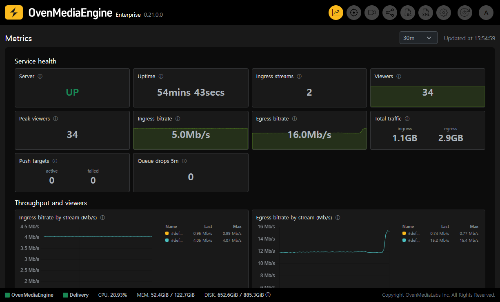

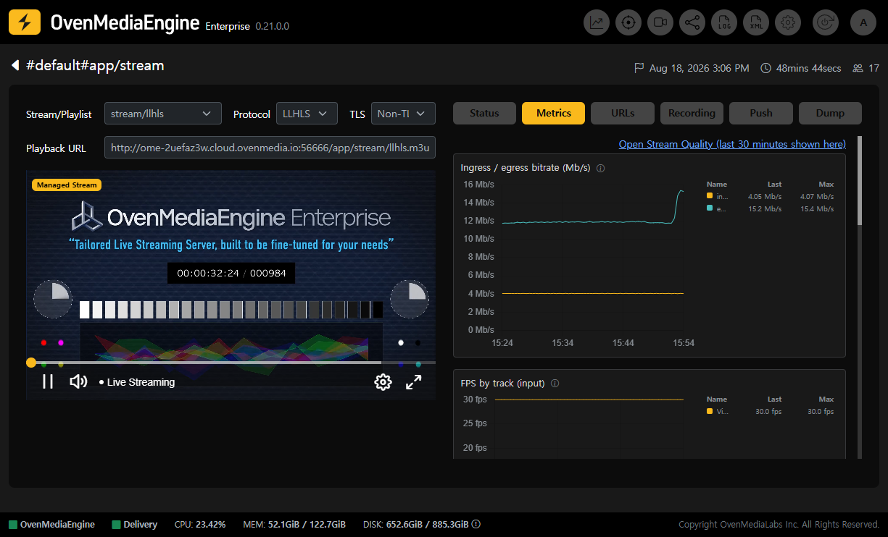

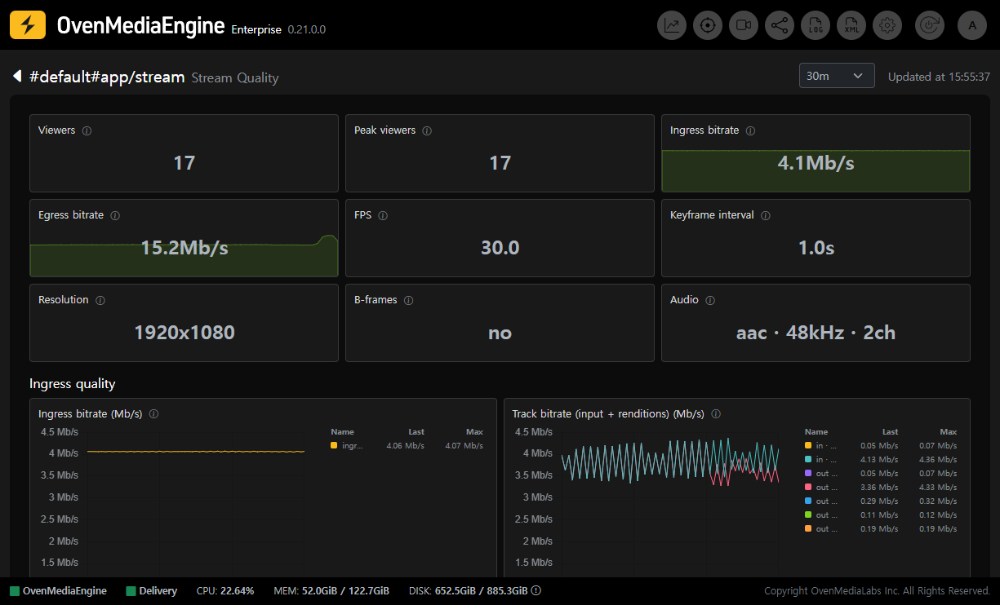

There is nothing an operator has to set up.
Connect to the server and you can see right away what does not look right.

Whichever screen you use, what this article set out to convey is not a fixed layout but a basis for deciding **what to check first and which values to compare together**.
The next step is to look at the values on your own production server.
Open the Web Console, or enable `/v2/metrics` and let a day or so of baseline data build up.
The key metrics to put on the dashboard and the basis for your thresholds emerge naturally from those numbers.

## Appendix A. How to build this screen

To build the screen you have seen so far, you need to edit the server configuration file and the scraper configuration yourself.
If you only want to look at a screen that is already built, you can skip this appendix.

Three pieces are required.
You need the server to export its own state as numbers, a store to accumulate those numbers, and a screen to query the accumulated values.
[The architecture diagram earlier](#what-it-is-built-on) maps those three onto the setup used in this article.

The first one, exporting metrics, is something OvenMediaEngine Enterprise already provides.
At `/v2/metrics` it exposes the values the server holds, as is, in the [OpenMetrics 1.0.0](https://github.com/OpenObservability/OpenMetrics/blob/main/specification/OpenMetrics.md) format.
Because that specification standardizes the Prometheus exposition format, it is not tied to any one product, and any tool that reads this format receives the same data with the same labels.

`/v2/metrics` reads the current state and renders it as text on every request.
Generating the response costs CPU, though, so when you have many streams and sessions and scrape often, the response cache is what keeps that in check.

The other two are the **Prometheus** and **Grafana** at the bottom of the architecture diagram.
A single instant value cannot answer "is this lower than usual", so you need a separate place to accumulate and compare the values `/v2/metrics` exports.
Prometheus reads this endpoint every 15 seconds and stores the result as time series, and Grafana queries those values and lays them out on the screen the operator watches.
Both are widely used open-source projects.
This article is written against OvenMediaEngine Enterprise, Prometheus 3.x, and Grafana 13.

### OME: turning the endpoint on

If the API manager is enabled, `/v2/metrics` is already running, and it uses the same host, the same port, and the same authentication as the REST API.

You enable the API manager in the configuration file `/usr/share/ovenmediaengine/conf/Server.xml` (the same path inside the container if you run Docker).
The configuration is split across two places, though, which is where people often get stuck.
**The port goes in `<Bind><Managers><API><Port>`, and the authentication and OpenMetrics options go in `<Managers><API>`.**
If you configure only `<Managers>` and leave out the port on the `<Bind>` side, `curl` returns nothing but connection refused.

The example below shows both locations together.
`<Port>` under `<Bind>` and `<AccessToken>` are required, and you only need to add the `<OpenMetrics>` block when you want to adjust the response cache.
The cache is enabled by default with a lifetime of 3 seconds, so you can leave it as it is.

<details>
<summary>The <code>Server.xml</code> example</summary>

```xml
<Server>
    <Bind>
        <Managers>
            <API>
                <Port>8081</Port>
            </API>
        </Managers>
    </Bind>

    <Managers>
        <API>
            <AccessToken>ome:secret</AccessToken>

            <OpenMetrics>
                <Cache>
                    <Enable>true</Enable>
                    <DurationMs>3000</DurationMs>
                </Cache>
            </OpenMetrics>
        </API>
    </Managers>
</Server>
```

</details>

**Keep the cache lifetime (`DurationMs` in the example) comfortably below the scrape interval.**
If the cache lifetime is at or above the scrape interval, the same value is recorded twice at two different timestamps, so the counter takes on a staircase shape that stalls for one interval and then rises twice as much in the next.

`<AccessToken>` is used directly as the HTTP Basic credential.
This value is also written in plain text into the scraper configuration file in [Collection: Prometheus](#collection-prometheus).

```bash
curl -u 'ome:secret' http://<ome-host>:8081/v2/metrics
```

The response looks like this.

```text
# HELP ome_receive_bytes_total Total media bytes received from the provider for this stream (excludes protocol and socket overhead).
# TYPE ome_receive_bytes_total counter
ome_receive_bytes_total{vhost="default",app="app",stream="live_rtmp"} 18294602
# HELP ome_connections Current number of connected sessions, by publisher.
# TYPE ome_connections gauge
ome_connections{vhost="default",app="app",stream="live_rtmp",publisher="llhls"} 2
...
# EOF
```

### Choosing what to collect and how much

Metrics are grouped into collectors the same way [node_exporter](https://github.com/prometheus/node_exporter) groups them, so you can fetch them selectively.
A collector here is not a scraper but the name of a bundle of metrics that OME exports.

| collector    | Contents                                                     | Default          |
| ------------ | ------------------------------------------------------------ | ---------------- |
| `core`       | Build information, process start time                        | Always (not selectable) |
| `traffic`    | Received/sent byte counters                                  | Included         |
| `connection` | Current number of connections                                | Included         |
| `stream`     | Track properties, input timestamps, ingest RTT, SRT ingest loss | Included       |
| `queue`      | State of the internal managed queues                         | Included         |
| `push`       | Push publishing state                                      | Included         |
| `session`    | Per-session bytes/bitrate/RTT, SRT egress loss               | Not included     |

```bash
# Only what you want
curl -u 'ome:secret' 'http://<host>:8081/v2/metrics?collect[]=traffic&collect[]=stream'

# Only what you want to leave out
curl -u 'ome:secret' 'http://<host>:8081/v2/metrics?exclude[]=queue'
```

Specifying `collect[]` and `exclude[]` together returns `400`, so use only one of them at a time.
There is one more case that returns `400`: naming `core` in `collect[]`, since the table marks it as not selectable.

The reason `session` is left out of the default set is cardinality.
The number of active time series drives memory usage, and on top of that **how often time series are created and discarded** (churn) adds index cost.
Per-session metrics are expensive on both counts.
A single viewer produces several time series, and every time that viewer reconnects, all of them are replaced.

Per-stream metrics are not entirely free either.
A stream is given a `stream_id` label, and that value is created anew on every reconnect.
If the encoder drops and reconnects several times a day, each reconnect leaves another set of time series behind.

To see what drives the cost of generating a response, we measured three things while varying the collection scope on a separate setup with two input streams and seven playback sessions attached.

| What is collected            | Response time (median) | Response size | Time series |
| ---------------------------- | ---------------------- | ------------- | ----------- |
| Default (no `session`)       | 1.0ms                  | 62.1KB        | 379         |
| Default + `session`          | 1.1ms                  | 70.7KB        | 408         |
| `traffic`+`connection` only  | 1.0ms                  | 12.2KB        | 74          |

The sizes above are uncompressed, and since Prometheus receives them gzipped, the amount that goes over the wire is far smaller.

Each session adds 4.1 time series and 1.2KB of response.
At 500 concurrent viewers that is a little over 2,000 time series, which is no burden, but at 5,000 it grows to a little over 20,000 time series and around 6MB of response.
If those 5,000 stay for an average of 5 minutes, that amounts to 250,000 series created and destroyed per hour.
Destroyed time series remain on disk until the retention period ends, so at this scale it is worth sizing storage capacity separately.

Response generation time almost never reaches `scrape_timeout`.
In the demo environment for this article, a little over 700 time series were exported in a median of 4.6ms, and even the maximum among successful scrapes stayed under 100ms.
Even if the response grows to 6MB as in the 5,000-viewer case above, what comes under strain first is storage and transfer, not generation time.

That said, when the server is under heavy load, response generation slows down along with it.
If the scrape times out at that point, `up` becomes `0` and **it is indistinguishable from the server being down.**
The actual elapsed time is recorded in `scrape_duration_seconds`, so you can watch it climb before it reaches that point.
Once that value approaches the timeout, `ScrapeNearTimeout` in chapter 4 fires first.

Note, though, that when a dashboard has panels drawing one line per session, as this article's does, Grafana slows down before Prometheus does.
For that reason we capped `Egress bitrate by session` and `Session RTT by protocol / method` to show only the worst 20.

If turning session metrics on all the time is too much, you can narrow the collection scope by path.

```
/v2/metrics                                                 the whole server
/v2/metrics/vhosts/{vhost}                                  one virtual host
/v2/metrics/vhosts/{vhost}/apps/{app}                       one application
/v2/metrics/vhosts/{vhost}/apps/{app}/streams/{stream}      one stream
/v2/metrics/vhosts/{vhost}/apps/{app}/streams/{stream}/sessions   + sessions as well
```

The path only limits what is exported, and every label is applied the same way on every path.
Even when you fetch a single stream, `vhost`/`app`/`stream` are all included, so there is no need to change your queries.

One approach is to exclude sessions from the job that collects everything, and run a separate job that covers only a few important channels through the session path.
If the two jobs do not filter metrics, however, the same stream is collected twice and the totals come out doubled.
The filtering configuration is in [Running a separate session job](#running-a-separate-session-job) in appendix B.
`OmeDown` in appendix B matches `job="ovenmediaengine"` exactly, so it does not fire when the session job stops, and you can add a separate `up` alert dedicated to that job.
What remains is deciding which channels belong in that job.
Session metrics only accumulate from the moment you turn them on, so switching them on after a complaint comes in leaves you no history to look back at.
If selecting channels in advance is difficult, there is also the **compromise of keeping every channel as a target and lengthening the scrape interval**.

The `push` collector is in the default set, but push publishing fails silently, so it is hard to notice if you are only watching the server screen.
Instead of putting the `push` collector values on the screen, we catch these failures with the `PushFailing` alert in appendix B.
The selector in that rule has an unfamiliar shape, so it is worth explaining once.
`ome_push_state` is a stateset that creates one time series for each of six states (`ready`, `connecting`, `pushing`, `stopping`, `stopped`, `error`).
Per the OpenMetrics specification, **the state label carries the same name as the metric.**
So the selector becomes `ome_push_state{ome_push_state="error"} == 1`, and writing `state="error"` matches nothing.

### Collection: Prometheus

Prometheus is the most widely used scraper.
It pulls values from the target server at regular intervals and stores each one with labels attached.
A query language called PromQL computes values such as a total per delivery protocol or the increase over the last 5 minutes, all at query time, and alert rules are written in the same language.

If you do not have Prometheus and Grafana running yet, there is a docker compose file in [Minimal reproduction](#minimal-reproduction) in appendix B.
Write the configuration file below first, then start the two services.

The Prometheus configuration file is usually `/etc/prometheus/prometheus.yml`, and adding the block below is all it takes.
The default for `metrics_path` is `/metrics`, so make sure to change it to `/v2/metrics`.

<details>
<summary>The <code>prometheus.yml</code> example</summary>

```yaml
global:
  scrape_interval: 15s
  scrape_timeout: 10s
  evaluation_interval: 15s

scrape_configs:
  - job_name: ovenmediaengine
    metrics_path: /v2/metrics
    scheme: http

    basic_auth:
      username: ome
      password: secret

    static_configs:
      - targets: ["ome-01.example.com:8081"]
        labels:
          instance: ome-01

    # We left session on to fill the session panels in this article.
    # We do not recommend turning it on server-wide in production. See Choosing what to collect and how much.
    params:
      "collect[]": [traffic, connection, stream, queue, push, session]
```

</details>

The `password` field in the example is the plaintext value after the colon in `<AccessToken>`, entered as is.
To keep it in a separate file, use `password_file` instead of `password`.

**When you add a server, do not simply add a line to `targets`.**
The `labels` in a `static_configs` entry apply identically to every target in that block.
If two servers end up with the same `instance` value, their time series collapse into one and overwrite each other, so `OmeDown` may not fire even when one of them goes down.
Split the block per target as shown below, or leave `instance` out of `labels` and let Prometheus set it.

```yaml
    static_configs:
      - targets: ["ome-01.example.com:8081"]
        labels: { instance: ome-01 }
      - targets: ["ome-02.example.com:8081"]
        labels: { instance: ome-02 }
```

Because OME emits OpenMetrics text as is, there is no need to place an exporter in between, and the `info` and `stateset` types are collected without parse errors.
If you use `ome_build_info` from these collected values as a Grafana annotation, the deploy markers described at the start of chapter 3 appear on top of the graphs.

Once the configuration is applied, you can check the state under Status > Target health in Prometheus.
The screen below is from 3.x, and in 2.x the menu is named Status > Targets.

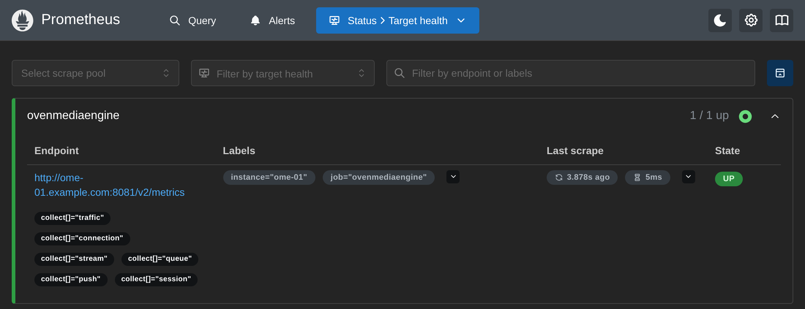

It does not have to be Prometheus: any scraper that understands this format will do.
VictoriaMetrics, OpenTelemetry Collector, Vector, Telegraf, and SaaS agents such as Datadog or Grafana Cloud all work the same way.
Thanos and Mimir, which come up alongside them, are long-term storage layers that receive data over `remote_write` rather than scraping it themselves, so they are not candidates for the scraper role this section is choosing ([retention and turning it off in appendix B](#retention-and-turning-it-off)).

### Lay the dashboard out in question order

The screens in this article are built in Grafana, with a single data source connected.
The principles below are the same if you use Perses or the dashboard feature of a SaaS monitoring product.

In any tool, though, pinning the `rate()` window to something like `[1m]` causes a problem worth knowing about.
When you widen the time range to a day or a week, spikes fall out of the samples and **it looks like "everything was fine back then."**
So a reasonable default is `$__rate_interval` for dashboard queries, which Grafana sizes to match the width of the screen, and a fixed window for alert rules.
There are two places where a fixed window suits a dashboard as well.
On a wall-monitor screen that you always view at the same time range, values are more stable if the dashboard uses a fixed window too.
Instant-value tiles and tables that answer only "is anything wrong right now" miss what they are meant to catch if the window widens along with the range, so this article uses a fixed window for them ([2.3](#23-which-stream-is-the-problem-the-stream-status-table)).

If you plot every metric you have and end up with around 40 panels, you will not know where to look when an incident actually happens.

The order described in chapter 2 is the layout principle.
The service status screen has four zones: is it healthy right now, what dropped, which stream is the problem, and is the server keeping up.
Only "why" is split out into a separate detail screen.
When you are about to add one more panel, working out first which of these five questions it answers tells you what belongs on the screen and what should be split off for post-incident analysis.

Because the scrape interval is 15 seconds, we set the refresh to 30 seconds.

<details>
<summary>What this setup assumes</summary>

The tiles and thresholds shown so far are derived from this demo environment.
If any of the assumptions below differ for you, start by resetting the values tied to those rows.

| Assumption      | This demo                            | If yours differs                                                                                                                                                               |
| --------------- | ------------------------------------ | ------------------------------------------------------------------------------------------------------------------------------------------------------------------------------ |
| Channel life    | Always on, 24 hours                  | If broadcasts turn on and off in your service, streams disappearing is normal ([4.1](#41-what-becomes-an-alert-rule))                                                          |
| Channel count   | Four                                 | With hundreds, `Streams at risk` and `FPS drop` easily reach 1 or more. That is because a single bad channel is counted. At that scale you should switch to a ratio or a top-N |
| Frame rate      | Differs per channel and is not fixed | If your service always runs at the same fps, an absolute threshold is better, and if the input varies in frame rate by nature, it is better to leave `FPS drop` out            |
| GOP             | Not on this screen                   | If GOP is directly tied to your service quality, you can promote `ome_track_keyframe_interval_seconds` to a primary metric                                                     |
| Transcoding     | ABR transcoding                      | If you use pass-through only, there is no transcoding-stage queue. What `Queue wait max` covers is then only the routing and egress queues                                     |
| Ingest          | RTMP, SRT, WHIP                      | You can pick the table columns to match the protocols you use                                                                                                                  |
| Ingest bitrate  | Multi-Mb/s video                     | An audio-only or low-bitrate channel can sit permanently below the `100kb/s` red threshold, so lower that value or leave those channels out                                       |
| Viewer location | Same network as the server           | If viewers are far away, RTT is tens to hundreds of milliseconds by nature. Leaving `Slow sessions` at `200ms` makes it permanently red                                        |
| Server count    | One                                  | With more than one, you must add `by (instance, ...)` to the `Stream status` table and the queue panels. [Questions that come up first in practice](#questions-that-come-up-first-in-practice) covers this       |

The surest way to set a threshold is to measure the normal values and their distribution in your own environment first.
The `5 seconds` for `Queue wait max` in this article was chosen after confirming that only three cases exceeded 5 seconds and that just one of them, a real incident, lasted more than 2 minutes, and the `0.2` for `SRT drop pkt/s` was set at ten times the normal level ([4.1](#41-what-becomes-an-alert-rule)).

Easiest of all is to leave it as it is for a day and watch.
Going through each cell that changed color during that time and rechecking whether it really needed a response tells you where to move the threshold.

</details>

### Questions that come up first in practice

**What do I do when there are several servers?**
Add one more block to `scrape_configs`, but as explained in [Collection: Prometheus](#collection-prometheus), you should not list the targets in the same block.
You can keep the tiles that show overall totals as they are, but in the `Stream status` table and the queue panels, streams with the same name silently merge into one row unless you add `by (instance, ...)`.
`Streams at risk` and `FPS drop`, which count entries, also count 1 rather than 2 when streams with the same name go bad on two servers at once.
Alert rules likewise have to keep `instance` for the notification to show which server it is.

The same thing happens within a single server.
The `Stream status` table joins several queries on the single `stream` label.
So if streams with the same name live in different apps, the `main` of each app merges into one row and unrelated bitrates appear mixed together.
If you have several apps or several servers, build a single join key and use that.

```promql
sum by (key) (
  label_join(ome_connections{output_stream="", publisher!~"file|push|thumbnail|ovt|hlsv3"}, "key", "/", "instance", "app", "stream")
)
```

You can apply the same treatment to every query in the table, and set `joinByField` to match on `key`.
If you use several virtual hosts, also add `vhost` to the label list in `label_join`.

If your servers are split into origin and edge, adding `instance` is not enough on its own.
The same stream exists on both sides, so the same name appears several times in the `Stream status` table, and the origin's `Egress` counts the volume relayed to the edge rather than viewer traffic.
If you assign a role label to each server in `scrape_configs`, you can look at the two roles separately.
Filtering the service status screen down to the edge and building a separate screen for the origin leaves less room for confusion.

**What if this screen is all green but viewers cannot watch?**
This screen shows only as far as the point where OME writes to the socket, so everything past it (the CDN cache, the reverse proxy, certificate expiry, DNS, player deployment) does not appear here.
If `Egress throughput` and `Viewers` look the same as usual but complaints come in, check the path downstream of the server before the server itself.

**What does it take to adopt?**
`/v2/metrics` is an OvenMediaEngine Enterprise feature, and Prometheus and Grafana are open source.
Building the screens takes time as well.
The dashboards in this article are examples, not a downloadable package, so to build the same screens you have to recreate the panels from the queries in appendix B.
A convenient order is to start with the nine top tiles and the `Stream status` table, then add the rest one at a time as you need them.

---

## Appendix B. Queries, rules, and the demo setup

```
OvenMediaEngine Enterprise   API 8081 (AccessToken ome:secret)
                             RTMP 1935, SRT in 9999, SRT out 9998
                             LLHLS 3333, WebRTC signaling 3333
Prometheus                   localhost:9090
Grafana                      localhost:3000
```

The ports are the values from the example configuration in the OvenMediaEngine open-source distribution (`misc/conf_examples/Server.xml`).
The Enterprise distribution's example sets everything, including LLHLS and WebRTC signaling, to 80 (TLS 443).
HLS (v3) defaults to 80 in both, and we did not enable it in this demo.
The application uses an ABR profile that adds 480p and 360p renditions and Opus audio on top of the source bypass.

### Queries by panel

`$app` and `$stream` are Grafana dashboard variables.
Create both as the Query type under Dashboard settings > Variables.
`app` is `label_values(ome_receive_bytes_total, app)`, and `stream` builds on it as `label_values(ome_receive_bytes_total{app="$app"}, stream)`.
If you name the variables `app` and `stream`, you can also set them from the URL as `&var-app=...&var-stream=...`.
`label_values` passes the dashboard's time range through to Prometheus as is.
A stopped stream therefore stays in the dropdown as long as it has a value inside that range.
You need to set the variable's Refresh to `On time range change` for the list to refresh along with the range as you move it.
A stream that falls outside the range disappears from the list; when that happens, enter it directly in the URL.

:::note
**`$app` and `$stream` are placeholders that Grafana substitutes.**
If you paste the queries below without creating the variables, the two placeholders stay literal and the query returns nothing.
:::

#### Applies to every query

- **A value ending in `_total` is a counter that keeps accumulating.**
  It therefore only means something once `rate()` turns it into a per-second increase, and byte values need `* 8` to become bps.
- **`$__rate_interval` and `$__range` are variables Grafana provides.**
  The first is a window sized to the screen width, and the second is the entire time range currently on screen.
  Outside Grafana you have to change them to a fixed window such as `[1m]`.
- **`up` is not a value OME exports; it is a metric Prometheus records itself to say whether a scrape succeeded.**
- **`output_stream=""` is the condition that selects everything that is not an output rendition.**
  OME does not attach this label to input rows, and in PromQL `label=""` matches time series that do not have that label.
  `ome_connections` and `ome_transmit_bytes_total` are produced on the input row and on the output stream rows alike, so without this condition they are over-counted by the number of output streams.
  With a single output profile that means double, no matter how many renditions it contains.
  For `ome_track_*` this is not duplication: the output tracks really are added, so the figure is input tracks plus output tracks.
  In this demo `ome_track_framerate_fps` came out four times too high and `ome_track_bitrate_bps` 3.5 times.
  `ome_stream_rtt_seconds` and the SRT ingest loss series exist only on the input, so the result is the same without this condition.
  `ome_receive_bytes_total` also produces one extra time series with a value of `0` on the output stream side, so the sum does not change but `count()` doubles.
  It is safer, though, to keep the selector uniform across the metrics that carry this label, and you do not need it on metrics that do not, such as the queue metrics.
- **Table panels are instant queries.**
- **If you have more than one server, add `instance` to `by (...)`.**
  The queries below assume a single server.

#### Top tiles

The server-alive and uptime tiles:

```promql
min(up{job="ovenmediaengine"}) or vector(0)
min(time() - process_start_time_seconds{job="ovenmediaengine"})
```

<details>
<summary>The remaining top tiles</summary>

```promql
# Number of streams past the red threshold (Streams at risk)
count(
    (sum by (app, stream) (rate(ome_receive_bytes_total{output_stream=""}[1m])) * 8 < 100000)
 or (sum by (app, stream) (rate(ome_stream_srt_dropped_packets_total[2m])) >= 0.2)
) or (0 * count(ome_receive_bytes_total{output_stream=""}))

# Number of input streams that fell below half their own recent peak (FPS drop)
count(
  min by (app, stream) (
    ome_track_framerate_fps{output_stream=""}
      / max_over_time(ome_track_framerate_fps{output_stream=""}[10m])
  ) < 0.5
) or (0 * count(ome_track_framerate_fps{output_stream=""}))

# The longest-waiting queue (Queue wait max)
max(ome_queue_waiting_seconds)

# Number of viewer sessions that held RTT above 200ms for more than 3 minutes (Slow sessions)
count(
  count by (instance, session) (
    (min_over_time(ome_session_rtt_seconds{method=~"rtcp|tcp"}[3m]) > 0.2)
    and (count_over_time(ome_session_rtt_seconds{method=~"rtcp|tcp"}[3m]) >= 11)
    and ome_session_rtt_seconds{method=~"rtcp|tcp"}
  )
) or (0 * count(ome_session_rtt_seconds{method=~"rtcp|tcp"}))

# Number of playback sessions
sum(ome_connections{output_stream="", publisher!~"file|push|thumbnail|ovt|hlsv3"})

# Receive / egress bitrate
sum(rate(ome_receive_bytes_total{output_stream=""}[$__rate_interval])) * 8
sum(rate(ome_transmit_bytes_total{output_stream="", publisher!="file"}[$__rate_interval])) * 8
```

</details>

There are six places that use a fixed window rather than following the screen's time range.
`Streams at risk` uses `[1m]` and `[2m]`, `FPS drop` uses `[10m]`, `Slow sessions` uses `[3m]`, the `Stream status` table uses `[1m]` and `[2m]`, and `Ingress bitrate` and the `Sessions` table on the detail screen use `[1m]`.
If the window widened along with the time range, a short outage would be absorbed into the average.
We therefore fixed the window on every instant-value panel that has color thresholds applied.
Only the `[10m]` on `FPS drop` is there for a different reason: it is not an average but the window that forms the comparison baseline, so narrowing the time range lowers the baseline too, and a stream that has already dropped shows as healthy.

`Slow sessions` counts a session only after `>= 11` samples: at a 15-second interval a 3-minute window holds 12 samples, so the condition tolerates one missed scrape.

`or vector(0)` and `or (0 * count(...))` both show `0` instead of a blank when no time series matches, but `vector(0)` is a constant, so **it returns `0` even when the server has stopped and there is no value at all.**
So if you use `vector(0)` on a tile that counts violations, that tile alone stays a green `0` while every other tile goes to `No data`.
`or (0 * count(...))` multiplies the number of time series that exist by `0`, so it still shows "no violations" as `0` and goes to `No data` once there is nothing left to aggregate.

This pattern only holds when the left side is a single value with no labels.
Changing it to `sum by (app, stream)` or `max by (app, stream)` adds labels on the left, and since the right side has none, the two sides no longer pair up.
`or` passes an unpaired right-hand time series straight through, so a `0` series of unclear origin is always included.
Remove this pattern if you are going to break the view down per stream.

If you change `rate()` to `increase()` to get an interval total, as with a drop count, the result does not come out as a whole number.
That is because the result is extrapolated from just the two values at the ends of the interval.
A single drop comes out as 0.8 or 1.4, so when you need an exact count, do not round: leave the decimals visible.

#### Service overview graphs

Trend graphs:

```promql
# Egress bitrate and session count by delivery protocol (publisher is OME's label name)
# The two lines use different filters on purpose.
# Egress bitrate should cover everything leaving over the network, so we exclude only file, which writes to disk.
# The session count counts viewers, so we exclude ovt, where one edge receives on behalf of many viewers.
# In an origin-edge setup, if you only want to see viewer traffic, exclude ovt on the egress bitrate side too.
sum by (publisher) (rate(ome_transmit_bytes_total{output_stream="", publisher!="file"}[$__rate_interval])) * 8
sum by (publisher) (ome_connections{output_stream="", publisher!~"file|push|thumbnail|ovt|hlsv3"})

# Receive bitrate by stream
sum by (app, stream) (rate(ome_receive_bytes_total{output_stream=""}[$__rate_interval])) * 8
```

You may be tempted to exclude series with a value of `0` using `> 0`, but then the line disappears at exactly the moment delivery collapses.
To trim the legend, you can use Grafana's series hiding feature rather than the query.

SRT loss trend. The ingest side, the egress side, and retransmissions are overlaid on a single graph.

```promql
sum by (app, stream) (rate(ome_stream_srt_lost_packets_total[$__rate_interval]))
sum by (app, stream) (rate(ome_session_srt_lost_packets_total[$__rate_interval]))
sum by (app, stream) (rate(ome_session_srt_retransmitted_packets_total[$__rate_interval]))
```

#### `Stream status` table

The `Stream status` table. The eight queries below map, in order, to the `Viewers`, `Ingress`, `Egress`, `FPS`, `Height (px)`, `Ingest RTT`, `SRT lost pkt/s`, and `SRT drop pkt/s` columns.

```promql
sum by (app, stream) (ome_connections{output_stream="", publisher!~"file|push|thumbnail|ovt|hlsv3"})
sum by (app, stream) (rate(ome_receive_bytes_total{output_stream=""}[1m])) * 8
sum by (app, stream) (rate(ome_transmit_bytes_total{output_stream="", publisher!="file"}[1m])) * 8
min by (app, stream) (ome_track_framerate_fps{output_stream=""})
max by (app, stream) (ome_track_height{output_stream=""})
max by (app, stream) (ome_stream_rtt_seconds{output_stream="", method=~"tcp|stun"})
sum by (app, stream) (rate(ome_stream_srt_lost_packets_total[1m]))
sum by (app, stream) (rate(ome_stream_srt_dropped_packets_total[2m]))
```

Pasting the queries in is not enough to produce this table.
You have to set up five more things on the Grafana side.

1. Set each query to Format `Table` and Type `Instant`.
   Without this setting you get a graph with a time axis.
2. Join them with `Join by field` under Transformations.
   The field to join on is `stream`, but if you have several apps, use a key built with `label_join` as described in [appendix A](#questions-that-come-up-first-in-practice).
3. Use `Organize fields by name` to rename `Value #A` through `Value #H` to the column names and to hide the duplicated `app` and `Time` columns.
4. Set the unit separately for each column.
   Choose `bits/sec(SI)` for the bitrate columns and `seconds (s)` for the `Ingest RTT` column, which is what makes it render in ms as shown in the screenshot.
5. Set the color thresholds as per-column overrides, using the values listed in [2.3](#23-which-stream-is-the-problem-the-stream-status-table).

For the frame rate we select `min`, as explained in [2.3](#23-which-stream-is-the-problem-the-stream-status-table).
For RTT we select `tcp` and `stun`.
Unless a single ingest emits several methods at once, this aggregates to one value per stream.
A WHIP ingest that negotiated ICE over TCP produces both values, and in that case `max` picks the larger of the two.
`tcp_min` is the floor of the path and barely moves, so if you select it, this column cannot tell you whether latency has risen.
That said, this column mixes values measured by different methods, so do not compare rows against each other, as noted in [2.3](#23-which-stream-is-the-problem-the-stream-status-table).

#### Detail screen

The five values at the top of the detail screen. They cover only the single stream selected with `$app` and `$stream`.

```promql
sum(rate(ome_receive_bytes_total{app="$app", stream="$stream", output_stream=""}[1m])) * 8
min(ome_track_framerate_fps{app="$app", stream="$stream", output_stream=""})
max(ome_track_has_bframes{app="$app", stream="$stream", output_stream=""})
sum(ome_connections{app="$app", stream="$stream", output_stream="", publisher!~"file|push|thumbnail|ovt|hlsv3"})
max(ome_connections_max{app="$app", stream="$stream", output_stream=""})
```

`ome_track_has_bframes` is `0` or `1`, so we display it as `no`/`yes` through a Grafana value mapping.
`ome_connections_max` is the peak of the total concurrent connection count for that stream.
It is not broken down by protocol, so it has no `publisher` label.
The viewer filter applied to the other panels therefore does not work here, and recording, push publishing, thumbnail, and edge relay connections are all counted.
That is why the tile is named `Peak connections` rather than `Viewers`.
The `max()` in the query does not pick the largest value across protocols; there is only one time series per stream, so it serves only to strip the labels.
Its reference window is everything since the stream started, so narrowing the time range on the dashboard does not bring this value down with it.
To find the peak viewer count within the window shown on screen, you can use `max_over_time(sum(ome_connections{app="$app", stream="$stream", output_stream="", publisher!~"file|push|thumbnail|ovt|hlsv3"})[$__range:])`.
Note that the frame rate uses the same `min` as the `Stream status` table.
If the two screens used different aggregations, the table could show red while the detail screen you opened to find the cause showed green.

Ingest RTT and SRT ingest loss. These are the panels covered in case 5 and case 3 respectively.

```promql
# Ingest RTT by method
max by (method) (ome_stream_rtt_seconds{app="$app", stream="$stream", output_stream=""})

# SRT ingest loss and drops
sum(rate(ome_stream_srt_lost_packets_total{app="$app", stream="$stream"}[$__rate_interval]))
sum(rate(ome_stream_srt_dropped_packets_total{app="$app", stream="$stream"}[$__rate_interval]))
```

The breakdown by delivery protocol for a single stream. It differs from the server-wide query only in the selector.

```promql
sum by (publisher) (rate(ome_transmit_bytes_total{app="$app", stream="$stream", output_stream="", publisher!="file"}[$__rate_interval])) * 8
sum by (publisher) (ome_connections{app="$app", stream="$stream", output_stream="", publisher!~"file|push|thumbnail|ovt|hlsv3"})
```

Bitrate by track. If a stream drops and reconnects, a new `stream_id` is issued and the same track splits into two time series.
Aggregating with `max by (track, codec)` keeps the legend from showing duplicates.

```promql
# Input tracks
max by (track, codec) (ome_track_bitrate_bps{app="$app", stream="$stream", output_stream=""})
# Output renditions
max by (track, codec) (ome_track_bitrate_bps{app="$app", stream="$stream", output_stream!=""})
```

The `in ·` and `out ·` prefixes in the legend do not come from the data; they come from Grafana's Legend format.
You can enter `in · {{track}} ({{codec}})` for query A and `out · {{track}} ({{codec}})` for query B.
`pt_` and `en_` are prefixes we set directly in `<Encodes>` `<Name>` in this demo configuration.
OME exposes the profile name verbatim, so with the example configuration in the distribution you get names such as `bypass_video` and `video_720`.

The session panels. The number of lines grows with the number of viewers, so we limit them to the 20 worst.

```promql
# Egress bitrate per session (the 20 worst)
ome_session_transmit_bps{app="$app", stream="$stream", protocol!="srt"}
  and bottomk(20, min_over_time(ome_session_transmit_bps{app="$app", stream="$stream", protocol!="srt"}[$__range] @ end()))
# Session RTT (the 20 worst)
ome_session_rtt_seconds{app="$app", stream="$stream"}
  and topk(20, max_over_time(ome_session_rtt_seconds{app="$app", stream="$stream"}[$__range] @ end()))
# SRT egress loss / retransmit / drop
sum(rate(ome_session_srt_lost_packets_total{app="$app", stream="$stream"}[$__rate_interval]))
sum(rate(ome_session_srt_retransmitted_packets_total{app="$app", stream="$stream"}[$__rate_interval]))
sum(rate(ome_session_srt_dropped_packets_total{app="$app", stream="$stream"}[$__rate_interval]))
```

Used on its own, `topk(20, value)` reselects the top 20 at every point in time, so the lines break up across the window.
This is the same problem as in the queue panels below, and it shows up far more severely with sessions.

`topk(20, ome_session_transmit_bps)` selects the 20 with the highest bitrate, that is, the 20 healthiest ones, which is the exact opposite of what this panel is for.
A lower bitrate is worse, so we use `bottomk`, and a higher RTT is worse, so we use `topk`.

That said, this selection criterion is a single extreme point taken over the whole window.
It therefore also picks up sessions that are still ramping up after connecting and sessions that have already ended, and LL-HLS sessions that fall to `0` between segments come up especially often.
To look at the current state alone, you can shrink the window to `[5m]` instead of `[$__range]`, or narrow the time range down to the window in which the problem occurred.

The egress bitrate per session panel uses `protocol!="srt"` in its selector to show only sessions in the HTTP and WebRTC families.

The session list table. It joins four instant queries on `session_id`.
There are two session labels: `session`, which is a UUID-shaped name, and `session_id`, which is a number.
The `Slow sessions` tile at the top uses `session`.

```promql
sum by (session_id, protocol) (ome_session_transmit_bps{app="$app", stream="$stream"})
max by (session_id, protocol) (ome_session_rtt_seconds{app="$app", stream="$stream", method=~"tcp|rtcp"})
sum by (session_id, protocol) (rate(ome_session_srt_lost_packets_total{app="$app", stream="$stream"}[1m]))
sum by (session_id, protocol) (rate(ome_session_srt_dropped_packets_total{app="$app", stream="$stream"}[1m]))
```

The window for the two SRT columns is pinned to `[1m]` as well, for the same reason as the other instant-value panels.

The RTT column shows `rtcp` for WebRTC sessions and `tcp` for the HLS family.
`tcp` is the value the kernel estimates from the TCP connection and `rtcp` is the round-trip time for the peer to build a report and send it back, so even on the same path the two values measure different things.
In this demo, on a 15-minute baseline average, `rtcp` comes to 826us against `tcp`'s 36us, more than twenty times higher.
Neither one is always the larger, so use this column to find outliers among sessions that share the same protocol.
The selector excludes `stun` to reduce the mixing of measurement methods within one session: taking the `max` of `rtcp` and `stun` picks a different one each time and leaves the column's meaning unclear.
That said, a WebRTC session that negotiated ICE over TCP emits both `rtcp` and `tcp`, so two methods still mix inside this selector.

Separately, `rtcp` and `stun` read `0` until they complete their first measurement.
`tcp` and `tcp_min` are read straight from the socket, so a `0` is never recorded for an unmeasured state, and when there is no value to read the time series does not appear at all.
For a session that just connected, this column is not blank but shows a green `0`, and as explained in [3.4](#34-case-4-one-slow-viewer-or-all-of-them), that `0` does not mean "good" but "unknown".

#### Queue panels

The queues inside the server. We keep only the top 5, selecting them over the whole window first and then plotting just those series.

```promql
max by (queue) (ome_queue_size)
  and topk(5, max by (queue) (max_over_time(ome_queue_size[$__range] @ end())))
max by (queue) (ome_queue_waiting_seconds)
  and topk(5, max by (queue) (max_over_time(ome_queue_waiting_seconds[$__range] @ end())))
```

With `topk(5, ...)` alone, the legend again does not stay at 5 entries and the lines break.
Selecting the series first with `and`, as above, is far more stable.
That said, `max_over_time(...[$__range])` is also recomputed at every point in time, so this method alone does not fully pin the selection.
You can add `@ end()` to pin the selection to a single instant at the end of the window.
The query above aggregates by `queue` only.
As with `filter_video` in [2.5](#25-is-the-server-keeping-up), there can be several queues that share both a queue name and a stream, and those queues merge into a single line.
If you need to tell them apart, one option is to add `queue_id` to the aggregation.
The trade-off is that a numeric id shows up in the legend, which makes it harder to read the stage off the name.
`ome_queue_waiting_seconds` is an exponential moving average updated on every dequeue, so do not average it again; use only `max` or `topk`.
A single slow message raises the value by only 10%, and the value then decays gradually, so one peak on the graph does not correspond to one message ([2.5](#25-is-the-server-keeping-up)).

Queuing delay.

```promql
max(ome_stream_rtt_seconds{app="$app", stream="$stream", output_stream="", method="tcp"})
  - max(ome_stream_rtt_seconds{app="$app", stream="$stream", output_stream="", method="tcp_min"})
```

There is one ingest socket per stream, so you can wrap each side in `max()` to strip the labels and then subtract.
In an environment where there can be several sockets, pair them up with `ignoring(method)` so that values from different sockets are not subtracted from each other.

### Full alert rules and notification setup

[Chapter 4](#4-what-watches-the-screen-when-you-are-away) explained the reasoning behind these rules and quoted only `IngestStalled` and `StreamMissing`.
Below is the complete rule file (`prom-rules/rules/ome.yml`) that this demo actually applies.
Do not concatenate the excerpt in chapter 4 with this block.
Both are complete files in their own right, so `groups:` would appear twice, and then `promtool check rules` rejects it with `mapping key "groups" already defined`.

#### All rules

<details>
<summary>The complete <code>prom-rules/rules/ome.yml</code></summary>

```yaml
groups:
  - name: ovenmediaengine
    rules:
      # A threshold, not `== 0`. When the sending side stops, OME takes the stream down and the
      # time series disappears entirely, so a 0 is never recorded and an `== 0` rule would never fire.
      # What we actually need to catch is a connection that stays up while almost no data arrives,
      # and over those windows the values were 21-37kb/s. Not a single sample was 0.
      # StreamMissing covers the case where the stream disappears.
      # 100kb/s is the same value as the Ingress red in the Stream status table.
      # The dashboard annotation goes only on rules that identify a stream. It helps only if
      # the person who receives the notification can immediately open that stream's detail screen.
      - alert: IngestStalled
        expr: |
          sum by (instance, vhost, app, stream) (
            rate(ome_receive_bytes_total{output_stream=""}[1m])
          ) * 8 < 100000
        for: 1m
        labels: { severity: critical, component: ingest }
        annotations:
          summary: "Ingest nearly stopped on {{ $labels.app }}/{{ $labels.stream }}"
          dashboard: "https://grafana.example.com/d/ome-qos/ome?var-app={{ $labels.app }}&var-stream={{ $labels.stream }}&from=now-1h&to=now"

      # Make sure to change the stream name to your actual channel.
      # If you leave a name that never existed, the rule fires on the very next evaluation.

      - alert: StreamMissing
        expr: absent_over_time(
                ome_receive_bytes_total{vhost="default", app="app",
                                        stream="live_rtmp", output_stream=""}[10m])
        for: 0m
        labels: { severity: critical, component: ingest }
        annotations:
          summary: "live_rtmp has been absent from the server for 10 minutes"

      # This does not assume a fixed fps. An absolute threshold assumes you know how many fps that
      # stream is supposed to run at, and a service that sends at 1fps would trip it forever.
      # So we compare against what that stream itself has been producing recently.
      # The baseline is per time series, so it is re-established when the encoder reconnects, and a
      # stream that came up low from the start is not caught. It works the same way as the FPS drop tile.
      # A complete stop is not what this rule targets. The value is recomputed only when a frame arrives,
      # so if the input stops entirely it does not fall to 0 but freezes at the last value.
      # That case is caught by ingest bytes, and a disconnected encoder by StreamMissing.
      # A drop that outlasts the window pulls the baseline down with it, so this rule resolves itself.

      - alert: FramerateDropped
        expr: |
          min by (instance, vhost, app, stream) (
            ome_track_framerate_fps{output_stream=""}
              / max_over_time(ome_track_framerate_fps{output_stream=""}[10m])
          ) < 0.5
        for: 2m
        labels: { severity: warning, component: ingest }
        annotations:
          summary: "Frame rate below half of normal on {{ $labels.app }}/{{ $labels.stream }}"
          description: "At {{ $value | humanizePercentage }} of the peak over the last 10 minutes."

      # Short window, long for. If the window and for are equal, the firing point sits on the boundary and becomes unstable.

      - alert: SrtIngestDropping
        expr: |
          sum by (instance, vhost, app, stream) (
            rate(ome_stream_srt_dropped_packets_total[2m])
          ) >= 0.2
        for: 5m
        labels: { severity: critical, component: ingest }
        annotations:
          summary: "SRT input packet recovery failing on {{ $labels.app }}/{{ $labels.stream }}"

      # Push publishing fails quietly, so it is hard to notice in real time.
      # Note that the state label has the same name as the metric (Choosing what to collect and how much).
      #
      # You must not use for. OME retries a failed target every second and puts the state back to
      # connecting, so error lasts only about a second. A 15-second scrape is unlikely to catch that
      # moment, and even if it does, the condition is false at the next scrape and the for timer resets.
      # This has to be watched over a window, not as an instant value.
      # The tradeoff is that with a 10-minute window it keeps firing for 10 minutes after recovery.

      - alert: PushFailing
        expr: max_over_time(ome_push_state{ome_push_state="error"}[10m]) == 1
        for: 0m
        labels: { severity: critical, component: egress }
        annotations:
          summary: "Push publishing retrying repeatedly on {{ $labels.app }}/{{ $labels.stream }}"

      # Leaving the session collector on slows the response and triggers a false OmeDown. This catches it first.
      # 7 is 70% of the scrape_timeout of 10s. If you change the timeout, change this value too.

      # up == 1 is required as well. When a scrape fails, the duration of that attempt is recorded near
      # the timeout, so this condition alone would also fire when the server is completely down.
      - alert: ScrapeNearTimeout
        expr: scrape_duration_seconds{job="ovenmediaengine"} > 7
              and up{job="ovenmediaengine"} == 1
        for: 10m
        labels: { severity: warning, component: server }
        annotations:
          summary: "Scrape is approaching the timeout"
          description: "The session count may have grown. Consider narrowing collect[] or raising scrape_timeout."

      - alert: Watchdog
        expr: vector(1)
        for: 0m
        labels: { severity: none, component: meta }
        annotations:
          summary: "If this alert disappears, the monitoring pipeline is dead"

      - alert: OmeDown
        expr: up{job="ovenmediaengine"} == 0
        for: 1m
        labels: { severity: critical, component: server }
        annotations:
          summary: "Scrape failed for OME {{ $labels.instance }}"
          description: "Usually the server is down, but it may also be a scrape timeout. Check ScrapeNearTimeout as well."
          runbook_url: "https://wiki.example.com/runbook/ome-down"

      - alert: OmeRestarted
        expr: changes(process_start_time_seconds{job="ovenmediaengine"}[15m]) > 0
        for: 0m
        labels: { severity: info, component: server }
        annotations:
          summary: "OME {{ $labels.instance }} restarted within the last 15 minutes"
          description: "{{ $value }} restarts. Suspect a crash loop if there are two or more. The window is 15 minutes, so this rule misses a server that stayed down longer than that before coming back."

      # Most queues keep accumulating rather than discarding when they overflow, so the picture does
      # not break. Instead, viewers receive data slower than real time and playback stalls, so we watch the
      # wait time rather than the backlog count. 5 seconds is the same value as the red on the Queue
      # wait max tile. If the two diverge, you get windows where the screen is green but only the alert fires.
      # for 2m filters out one-off spikes. Of the three times it exceeded 5 seconds, two lasted only 15 seconds and 1 minute.
      # The queue name contains vhost, app, and stream, so the queue label alone identifies which queue it is.

      - alert: QueueWaitHigh
        expr: max by (instance, queue) (ome_queue_waiting_seconds) > 5
        for: 2m
        labels: { severity: critical, component: server }
        annotations:
          summary: "Waiting {{ $value | printf \"%.1f\" }} seconds in queue {{ $labels.queue }}"
          description: "The p= value in the queue name is the stage that is backed up. If several rose together, start from the last stage."

      # We look per delivery protocol rather than at the overall sum. Most real incidents are partial.
      # We exclude publishers where bytes per session is not a meaningful measure. Recording,
      # push publishing, and edge relay should not be divided by viewer count, and thumbnail has
      # few bytes relative to its connection count, so only the numerator shrinks.

      - alert: EgressStalledByProtocol
        expr: |
          (
            sum by (instance, publisher) (
              ome_connections{output_stream="", publisher!~"file|push|thumbnail|ovt|hlsv3"}
            ) > 3
          )
          and
          (
            sum by (instance, publisher) (
              rate(ome_transmit_bytes_total{output_stream="", publisher!~"file|push|thumbnail|ovt|hlsv3"}[2m])
            ) * 8
            / sum by (instance, publisher) (
              ome_connections{output_stream="", publisher!~"file|push|thumbnail|ovt|hlsv3"}
            )
          ) < 50000
        for: 5m
        labels: { severity: critical, component: egress }
        annotations:
          summary: "Egress collapse on {{ $labels.publisher }} ({{ $labels.instance }})"
          description: "Egress per session is below 50kb/s. Adjust this to match the bitrate of your lowest-bitrate rendition."
```

</details>

**Make sure to specify the `job` label.**
`process_start_time_seconds` is not specific to OME, so without a filter a node_exporter restart also fires an "OME restarted" alert.

**Queue wait exceeded 5 seconds three times, with peaks of 8.85 seconds, 6.32 seconds, and 58.6 seconds, so the value alone does not separate a real incident from a momentary spike.**
The 8.85-second and 6.32-second cases subsided before the 2-minute `for` elapsed.
That is why `QueueWaitHigh` detected only the one real incident.

**You can adjust the session-count floor (`> 3`) in `EgressStalledByProtocol` to your own scale.**
We put a floor in because the per-session average is meaningless for a protocol that has only one or two sessions.
If you want to cover low-session windows such as the early morning hours, you can lower the floor to `> 0` and set a longer `for`.

**Keep the `instance` label.**
If you do not include `instance` in `sum by (...)`, the notification will not show which server has the problem when you run several of them, and the inhibition rules and silences below will not work either.
The `severity` and `component` labels attached alongside are the values used to split routing into "ingest problems to team A, server problems to team B", so you can set them to match your team structure.

**If you need to separate important channels from the rest, write the rules in two sets.**
You have to separate them with a label, and the `labels:` of `static_configs` cannot do it.
That label applies to the whole target server and cannot tell one stream from another ([appendix A](#collection-prometheus)).
In `metric_relabel_configs` you can apply a regular expression to the `stream` value to create and assign a `tier`, then write the same condition twice, with `for: 1m` / `severity: critical` for important channels and `for: 5m` / `severity: warning` for the rest.

```yaml
    metric_relabel_configs:
      - source_labels: [stream]
        regex: 'ch1|ch2|ch3'
        target_label: tier
        replacement: gold
```

#### Notification routing

In Prometheus you point to the Alertmanager address and the location of the rule files.

```yaml
rule_files:
  - /etc/prometheus/rules/*.yml

alerting:
  alertmanagers:
    - static_configs:
        - targets: ["alertmanager:9093"]
```

Then you specify the receivers in Alertmanager.
The example below delivers to Slack; email, PagerDuty, Opsgenie, and webhooks are wired up the same way.

<details>
<summary>The Alertmanager configuration</summary>

```yaml
route:
  receiver: slack-ops
  group_by: [alertname, instance, app]
  group_wait: 30s
  group_interval: 5m
  repeat_interval: 4h
  routes:
    # Routes are evaluated top down and stop at the first match. Order matters.
    - matchers: [alertname="Watchdog"]
      receiver: deadmansswitch
      group_wait: 0s
      group_interval: 1m
      repeat_interval: 1m
    - matchers: [severity="critical"]
      receiver: pagerduty-oncall
      repeat_interval: 30m   # every 30 minutes until acknowledged
      continue: true         # also leave a copy in the channel route below
    - matchers: [severity="info"]
      receiver: slack-log
    - matchers: [component="ingest"]
      receiver: slack-ingest
    # Only alerts that matched none of the child routes above fall through to the parent (slack-ops).
    # Without this line, non-ingest critical alerts (queue, egress)
    # only get the immediate notification and leave no trace in the chat channel.
    - matchers: [severity=~"critical|warning"]
      receiver: slack-ops

receivers:
  # To save space, only slack-ops is written out here.
  # You must define deadmansswitch, pagerduty-oncall, slack-log, and slack-ingest
  # the same way. Alertmanager refuses to start if even one is missing.
  #   FAILED: undefined receiver "deadmansswitch" used in route
  - name: slack-ops
    slack_configs:
      - api_url: "https://hooks.slack.com/services/..."
        channel: "#ome-alerts"
        send_resolved: true   # the default is false, so without this no resolved notification is sent
        title: "[{{ .Status | toUpper }}] {{ .GroupLabels.alertname }} ({{ .Alerts | len }})"
        text: >-
          {{ .Alerts | len }} alerts
          {{ range .Alerts }}{{ .Annotations.summary }}
          {{ with .Annotations.description }}{{ . }}{{ end }}
          {{ with .Annotations.dashboard }}<{{ . }}|Dashboard>{{ end }}
          {{ with .Annotations.runbook_url }}<{{ . }}|Runbook>{{ end }}
          {{ end }}

inhibit_rules:
  # Suppress the other alerts coming from the same server.
  - source_matchers: [alertname="OmeDown"]
    # OmeRestarted is evidence of a crash loop, and ScrapeNearTimeout hints that OmeDown
    # may be a scrape timeout, so we exclude both from suppression.
    target_matchers: [component=~"ingest|egress|server", alertname!~"OmeDown|OmeRestarted|ScrapeNearTimeout"]
    equal: [instance]
  # StreamMissing has no instance label because the time series is gone.
  # With a single server it is fine to suppress without telling the servers apart.
  - source_matchers: [alertname="OmeDown"]
    target_matchers: [alertname="StreamMissing"]
```

</details>

**Sending to both the immediate notification and the chat channel requires `continue: true`.**
In the configuration above the critical alerts with `component: ingest` are `IngestStalled`, `StreamMissing`, and `SrtIngestDropping`, so if you drop this setting those three go out only as the immediate notification and leave no trace in `slack-ingest`.
`FramerateDropped` is a warning, so it is delivered only to the chat channel.
On channels that show a still picture much of the time, the encoder emits almost no frames, so the drop is sometimes normal behavior, and we did not put it on the immediate notification path.

**`send_resolved` defaults to off.**
Even if you put `RESOLVED` in the title template, that text is not shown unless you turn this value on.

**`group_by` is what splits alerts apart, not what groups them together.**
Alerts that share the same values for the labels listed here are bundled into one notification.
Because we left `stream` out, 20 streams in the same app going down at once are still delivered as one notification.
You can add `stream` to receive one per stream, but then you also get as many messages as there are streams.
`queue` and `publisher` are absent as well, so `QueueWaitHigh` is one notification even when several queues back up at once, and `EgressStalledByProtocol` is one notification even when several protocols collapse at once.
In the incident in [3.6](#36-case-6-a-backlog-inside-the-server), five queues were in fact bundled into a single notification.

Bundling into one notification does make the body long, though.
A Slack text block is truncated at around 4,000 characters, so the moment 100 streams go down at once the notification may be cut off or not delivered at all.
You can state the count up front as above, and on a large service you can cap the number of entries listed in the body.

**The three intervals each do a different job.**

- `group_wait` (30 seconds in the configuration above): how long to wait for other alerts in the same group before sending the group's first notification.
- `group_interval` (5 minutes): the gap until the next notification when a new alert is added to a group that has already been sent.
- `repeat_interval` (4 hours): how often an unresolved alert is re-sent when nothing about it has changed.

**When one server goes down, you do not get just one alert.**
When the scrape fails, every time series from that server disappears, so `OmeDown` fires after 1 minute and `StreamMissing` about 10 minutes later, and the rest resolve because there is nothing left to evaluate the condition against.
The `inhibit_rules` above suppress notifications for the other alerts from the same server in the meantime, but for that suppression to work the rule has to carry the `instance` label.
`absent_over_time()` works on a time series that has disappeared, so its result carries no labels of its own; a label appears only if you write an equality matcher such as `instance="ome-01"` directly in the selector (regex matchers do not carry over).
We split the inhibition into two rules because this demo runs a single server and therefore does not write `instance` into the selector.
With several servers, write a rule per stream that carries `instance`, and you can then merge the inhibition back into one rule.

**A silence is applied per `instance`.**
Applying [amtool](https://github.com/prometheus/alertmanager#amtool)'s `amtool silence add instance=ome-01 --duration=2h --comment='scheduled maintenance'` before you take the server down suppresses only that server's notifications.
`StreamMissing` is the exception, though.
It has no `instance` label, so the command above does not match it; add a separate `amtool silence add alertname=StreamMissing` or put `instance` directly into the rule's `labels:`.

### Running a separate session job

If you add one more job on the `.../sessions` path to scrape only the session metrics, you will not get only the session metrics.
Without `collect[]`, the session path exposes the full set of default collectors as well, so the time series for the stream scope you specified also include the server-wide queue metrics.
Narrowing the scope with `collect[]=session` excludes most of them, but the build information and process start time from `core` remain, since those are always exposed regardless of your selection.
If you leave it without `collect[]`, that stream's `ome_receive_bytes_total` and the server's queue metrics are scraped by both jobs, producing two time series that differ only in the `job` label.
Most of the queries in this appendix have no `job` selector, so that stream's totals simply double, and the matching row in the `Stream status` table is over-counted along with `IngestStalled` and `SrtIngestDropping`, which aggregate with `sum by`.
The server-wide queue metrics are aggregated with `max`, so their values do not double, but the same time series is stored twice.

Adding a single `metric_relabel_configs` block to the session job as shown below means you do not have to modify the existing queries.
Entries in `scrape_configs` do not inherit settings from one another, so you have to specify the targets and the authentication again in this job as well.

**You have to leave `session` out of the main job's `collect[]`.**
If you do not, both jobs scrape the same sessions, so `ome_session_*` splits into two time series that differ only in the `job` label.
The `keep` rule below only keeps the other metrics out of the session job; it does nothing about this.

<details>
<summary>The scrape config for the session job</summary>

```yaml
  - job_name: ovenmediaengine-sessions
    metrics_path: /v2/metrics/vhosts/default/apps/app/streams/live_rtmp/sessions
    basic_auth:
      username: ome
      password: secret
    static_configs:
      - targets: ["ome-01.example.com:8081"]
        labels: { instance: ome-01 }
    metric_relabel_configs:
      - source_labels: [__name__]
        regex: 'ome_session_.*'
        action: keep
```

</details>

### Reopening a past window

To reopen the window where an incident happened, you have to pin the time range to absolute times.
If you put epoch milliseconds in the URL's `from`/`to`, opening it later shows the same picture.
Grafana displays in the browser's time zone while the times Prometheus and Alertmanager send default to UTC, so pasting a notification's timestamp verbatim lands you in the wrong time zone.

To record an incident window as numbers, you need the outage duration and the number of affected sessions.
For the outage duration you can graph `absent_over_time(ome_receive_bytes_total{...}[1m])` in Explore and read the length of the window where the value is 1, and for the number of affected sessions you can query `sum(ome_connections{app="...", stream="...", output_stream="", publisher!~"file|push|thumbnail|ovt|hlsv3"})` at the moment just before the failure.
Omitting `output_stream=""` and `publisher!~` inflates the value by the number of output streams and counts recording as a viewer, which in this demo doubles it.

You must not read the value of `absent_over_time` literally.
The function becomes 1 only when the whole window (`[1m]`) holds no samples at all, so the moment it turns 1 lags the real outage by the length of the window.
The moment it clears, on the other hand, is the instant the first sample arrives, so that one is exact.
You therefore have to add the window length to the span you read off the screen to get close to the real outage duration, and an outage shorter than the window does not show up at all.
If you need it accurate to the minute, shrinking the window to something like `[20s]` reduces the error.

### Retention and turning it off

**Prometheus keeps data for 15 days by default.**
You can raise that with `--storage.tsdb.retention.time=90d`, and if disk headroom is tight it is safer to also specify `--storage.tsdb.retention.size=100GB` so that whichever limit is reached first applies.
We raised it to 90 days in this demo to keep incident windows for a long time.
If the window you need for a retrospective is only a few days, 30 days is enough.
Live streaming tends toward longer windows, though, because comparing weekdays against weekends and one event against another matters.
In that case, instead of extending the raw retention, one option is to forward the data with `remote_write` to a long-term store that supports downsampling, such as Thanos, Mimir, or VictoriaMetrics.

**To stop collecting, you remove that job from Prometheus, and there is nothing to revert on the OME side.**
`/v2/metrics` is a read-only endpoint that reads the current state and renders it as text only when a request arrives, so with no requests it does nothing at all.
To trim just one part of the output, use `exclude[]` on the collectors that cost the most.

### Minimal reproduction

Two ingests and a few playback sessions are enough to fill most of the panels in this article, and with nothing but [ffmpeg](https://ffmpeg.org/) you can run all of it on a single machine.

You can get the scraper and the visualization tool running with something like the following.

<details>
<summary>The docker compose file</summary>

```yaml
services:
  prometheus:
    image: prom/prometheus
    ports: ["9090:9090"]
    command:
      - --config.file=/etc/prometheus/prometheus.yml
      - --storage.tsdb.path=/prometheus
      - --storage.tsdb.retention.time=15d
      - --web.enable-lifecycle          # apply changes with POST /-/reload after editing the config
    volumes:
      - ./prometheus.yml:/etc/prometheus/prometheus.yml:ro
      - ./rules:/etc/prometheus/rules:ro
      - prom-data:/prometheus
  alertmanager:
    image: prom/alertmanager
    ports: ["9093:9093"]
    volumes:
      - ./alertmanager.yml:/etc/alertmanager/alertmanager.yml:ro
  grafana:
    image: grafana/grafana
    ports: ["3000:3000"]

volumes:
  prom-data:
```

</details>

Specifying `command` in the compose file above replaces all of the image's default arguments, so you have to restate them starting from `--config.file`.
Create `prometheus.yml`, the `rules/` directory, and `alertmanager.yml` before you start it.
If either file is missing, docker creates a directory in its place and that container fails to start.

In Grafana you add the data source from the UI.
You can pick Prometheus under Connections > Data sources and enter `http://prometheus:9090` as the URL.
In the Scrape interval field, write your actual scrape interval.
Grafana does not read the Prometheus configuration; it computes `$__rate_interval` from this value, and assumes 15s if you leave it empty.

The loss and the jitter in this demo both came from the UDP relay described below.
If you only need loss, `tc netem` is simpler: running the command below on the sending machine drops 5% of the packets leaving that interface.

```bash
tc qdisc add dev eth0 root netem loss 5%      # apply
tc qdisc del dev eth0 root                    # remove
```

:::warning
**This command applies to the whole interface.**
It does not single out streaming traffic: every packet leaving that interface is a target, so your SSH and database connections degrade along with it.
In a container with 5% loss applied, measured TCP throughput fell from 42.2Gb/s to 594Mb/s.
Applying it to a remote machine can leave you unable to reach that machine again, so run the test in a container or on a separate machine, and prepare the removal command in advance.
:::

**If you want to reproduce loss alone, do not add `delay`.**
In this demo the sending side emits a datagram every 2.6ms under normal conditions, media and SRT control packets together, so applying even 3ms of jitter starts to reorder them.
The receiving side counts out-of-order packets as loss, so `lost`, which was 16 per second at 5% loss with no jitter, rose to 230 per second at 3ms of jitter.
The media packets that reached the server stayed the same at 298 per second, and the receive bitrate did not change either.
What increased was retransmission ([3.3](#33-case-3-the-network-path-degrades)).
Applying the same 5% loss to the return path left `lost` unchanged, so what inflates the value is jitter.

Applying jitter with `netem` would have hit every packet on the interface, so we had the relay delay each datagram instead.
About 100 lines of Python that take a jitter range as an argument are enough.

To slow down a single viewer, put the delay on the hop that viewer goes through rather than on the whole interface.

```bash
# Case 4 - one viewer 250ms behind
docker run -d --name slow-hop --cap-add NET_ADMIN -p 18080:8080 alpine:latest \
  sh -c "apk add --no-cache iproute2 socat &&
         tc qdisc add dev eth0 root netem delay 250ms 5ms distribution normal &&
         socat -d TCP-LISTEN:8080,fork,reuseaddr TCP:<host>:3333"
```

Point one viewer at `http://127.0.0.1:18080/app/live_rtmp/abr.m3u8` (`abr` is this demo's playlist name) and OME sees it as a single slow session.

<details>
<summary>The two ingest commands</summary>

```bash
# RTMP (healthy path)
ffmpeg -re -f lavfi -i "testsrc2=size=1280x720:rate=30" \
       -f lavfi -i "sine=frequency=440:sample_rate=48000" \
       -c:v libx264 -preset veryfast -tune zerolatency -b:v 2500k -g 60 -pix_fmt yuv420p \
       -c:a aac -b:a 128k -ar 48000 -ac 2 \
       -f flv "rtmp://<host>:1935/app/live_rtmp"

# SRT (5% loss applied to this path)
ffmpeg -re -f lavfi -i "testsrc2=size=1920x1080:rate=30" \
       -f lavfi -i "sine=frequency=220:sample_rate=48000" \
       -c:v libx264 -preset veryfast -tune zerolatency -b:v 3000k -g 60 -pix_fmt yuv420p \
       -c:a aac -b:a 128k -ar 48000 -ac 2 \
       -f mpegts "srt://<host>:9999?mode=caller&latency=200000&streamid=default/app/srt_cam"
```

</details>

`streamid` in the SRT command above takes the form `<vhost>/<app>/<stream>`, and the stream it names is the one this article calls `srt_cam`.

**The unit of SRT's `latency` differs from tool to tool.**
libsrt and the OME configuration (`SRTO_LATENCY`, `SRTO_RCVLATENCY`) are in milliseconds, so 200ms is `200`, but `ffmpeg`'s `srt://...?latency=` is in microseconds, so the same value is `200000`.
The two can be off by a factor of a thousand, so be careful.

Now the playback sessions.
The `abr` below is the `<Playlist><FileName>` value in this demo's configuration.
In the default OME configuration this name is `master`, so entering the URL below as is returns a 404, and you must change it to `/app/live_rtmp/master.m3u8`.

```bash
# LLHLS
ffmpeg -i "http://<host>:3333/app/live_rtmp/abr.m3u8" -c copy -f null -

# SRT
ffmpeg -i "srt://<host>:9998?mode=caller&latency=200000&streamid=default/app/live_rtmp" \
       -c copy -f null -

# WebRTC plays in the browser with OvenPlayer
#   ws://<host>:3333/app/live_rtmp
```
