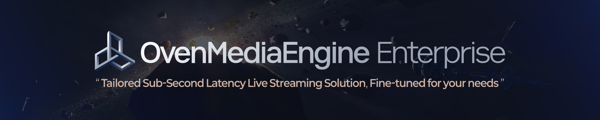

## What is OvenMediaEngine Enterprise?

[**OvenMediaEngine Enterprise**](https://airensoft.com/ome-enterprise.html) is a Sub-Second Latency Streaming Server for Enterprises, developed based on [OvenMediaEngine](https://github.com/AirenSoft/OvenMediaEngine), the open-source streaming server using WebRTC, Low Latency HLS (LL-HLS), and SRT.

It’s offering more and more enterprise-grade features tailored to your needs and objectives.

## Key Features and Benefits

  
<strong>Comemrcial License</strong>

  
<strong>Pre-Built Package</strong>

  
<strong>Guaranteed Long-term Support</strong>

  
<strong>Customization</strong>

  
<strong>Direct-to-Engineer Support</strong>

  
<strong>Advanced Security</strong>

  
<strong>High Availability</strong>

  
<strong>Web Console</strong>

  
<strong>Operations &#x26; Monitoring</strong>

  
<strong>Performance Optimization</strong>

  
<strong>Enhancement</strong>

  
<strong>Workflow Integration &#x26; External System Connectivity</strong>

:::tip

**Official x264 Commercial License Support**: OvenMediaEngine Enterprise provides the commercial version of x264 (add-on). For more details, please visit [https://ovenmedialabs.com/ome-enterprise.html#x264](https://ovenmedialabs.com/ome-enterprise.html#x264).

:::

## Supported Operating Systems

* Ubuntu 22+
* RHEL 8+
* Docker

## Contact

If you are interested in OvenMediaEngine Enterprise, please feel free to contact the OME Enterprise Team anytime.

* [contact@ovenmedialabs.com](mailto:contact@ovenmedialabs.com)

### Related Web Page

* [OvenMediaEngine Enterprise](https://ovenmedialabs.com/ome-enterprise.html)
* [OvenMediaEngine Support](https://ovenmedialabs.com/ome-enterprise.html#enterprise-support)
* [OvenMeida Labs Contact](https://ovenmedialabs.com/contact.html)
