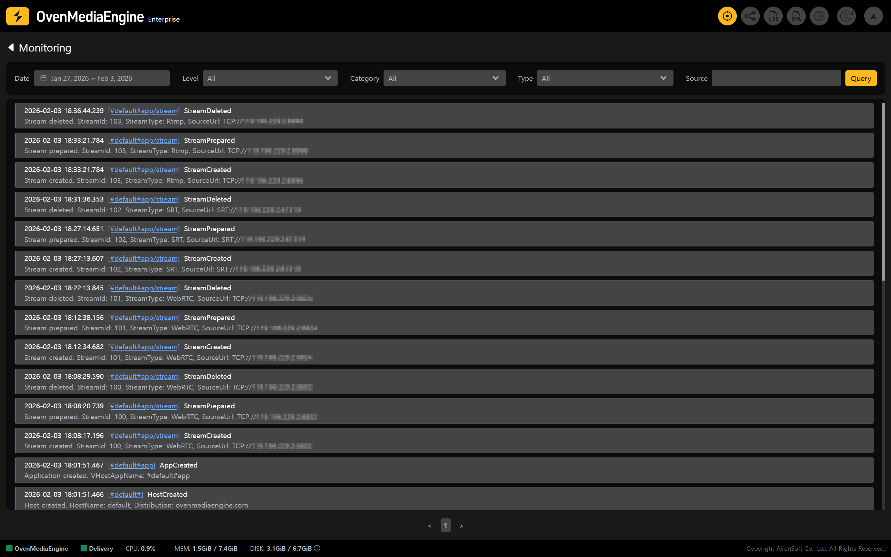
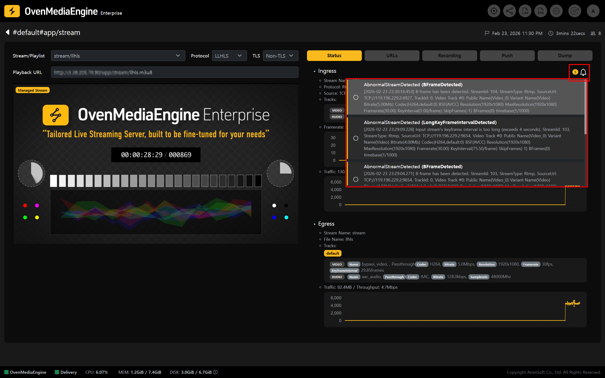
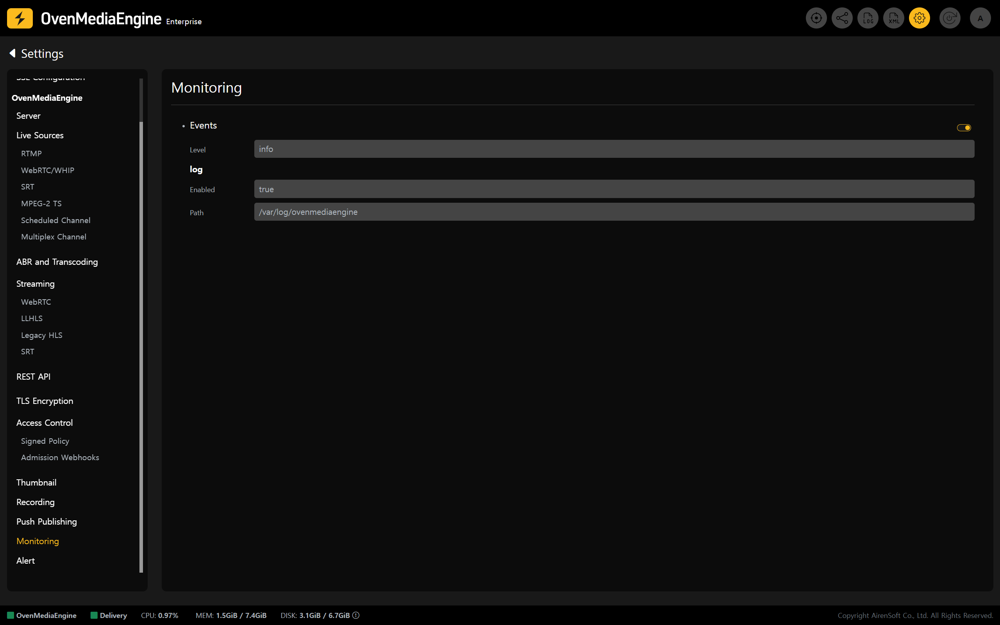

## View Event Monitoring

OvenMediaEngine Enterprise on AWS has Event Monitoring enabled by default.

* Click **\[Monitoring]** in the upper-right corner of the Web Console to view status information related to `Server`, `Host`, `App`, and `Stream`.

:::info

For more details on Event Monitoring, please refer to the [Event Monitoring](../web-console/web-console-overview/event-monitoring/README.md) guide.

:::

You can click the \[Alarm] icon in the stream detail view to check the `Warning` and `Error` alarms that occurred in the selected Stream during the last 24 hours.

:::info

For the Alarm Level of Stream Events, please refer to [Stream Event Category](../web-console/web-console-overview/event-monitoring/event-specification.md#stream-events-streamevent).

:::

You can click the \[Alarm] icon displaying the number of alarms to view the alarm list. By clicking the circular button located on the left side of each alarm entry, you can mark the alarm as read or unread. Additionally, clicking an alarm message will take you to the \[Event Timeline] page for the corresponding stream.

## Configure Event Monitoring

* Click the \[Settings] icon in the upper-right corner of the Web Console to open the Settings page, then select **\[Monitoring]** from the left menu to adjust detailed settings.
  * After completing the configuration, be sure to click \[Update Configuration] in the upper-right corner to save your changes.

:::info

For Event Level classifications (categories and types), please refer to the [Event Specification](../web-console/web-console-overview/event-monitoring/event-specification.md#event-categories-and-types) guide.

:::

