## Subscribe to OvenMediaEngine Enterprise

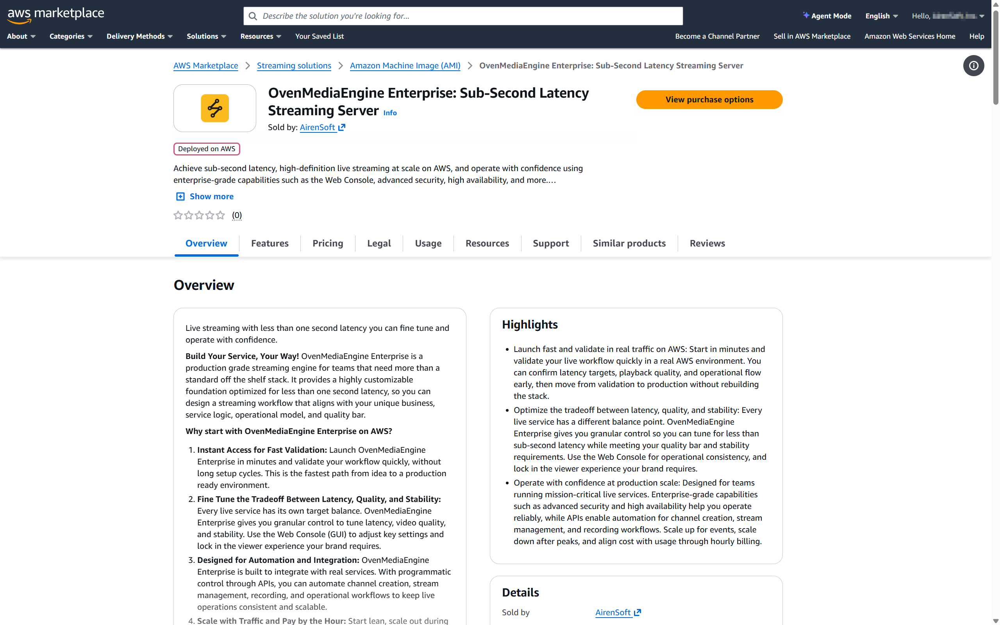

1. Please sign in to [AWS Marketplace](https://aws.amazon.com/marketplace).
2. Search for **OvenMediaEngine Enterprise**, then open the product page and review the details.
3. To proceed, click \[View purchase options] and accept the terms and subscription offer.
4. Once confirmed, click \[Subscribe] to complete your subscription.
   * After subscribing, you can deploy and run OvenMediaEngine Enterprise on Amazon EC2. For detailed instructions, please refer to the [AWS Buyer's Guide](https://docs.aws.amazon.com/marketplace/latest/buyerguide/buyer-getting-started.html).

## Access to OvenMediaEngine Enterprise

### Launch an EC2 instance

5. After deciding on your subscription, click the \[Launch Software] button displayed shortly after to enter the EC2 Instance configuration page.
   * If the \[Launch Software] button does not appear even after waiting, you can go directly to the page where you can launch the instance by clicking \[AWS Marketplace Software] (or \[Manage Subscriptions]) in the [AWS Console Home](https://console.aws.amazon.com) or [AWS Marketplace](https://aws.amazon.com/marketplace).

:::tip

1) OvenMediaEngine Enterprise can run on various EC2 instance types, but we recommend `c5.xlarge` or larger.
2) For the Security group, we recommend selecting the \[Vendor-recommended security group] so that a Security group including the required ports is created automatically.

:::

#### \[Option A]  If you select “**Launch from EC2 Console**”

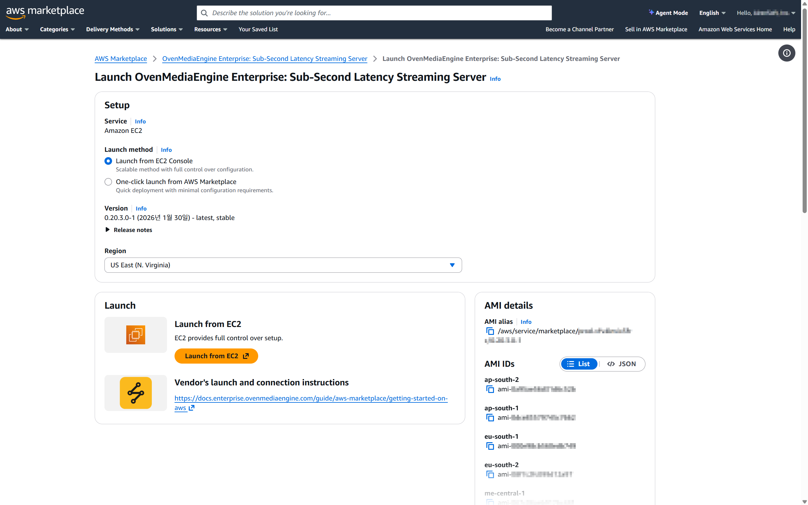

2. On the \[Setup] page, if you selected \[Launch from EC2 Console] as the Launch method, click **\[Launch from EC2]** under \[Launch] to configure the instance details.

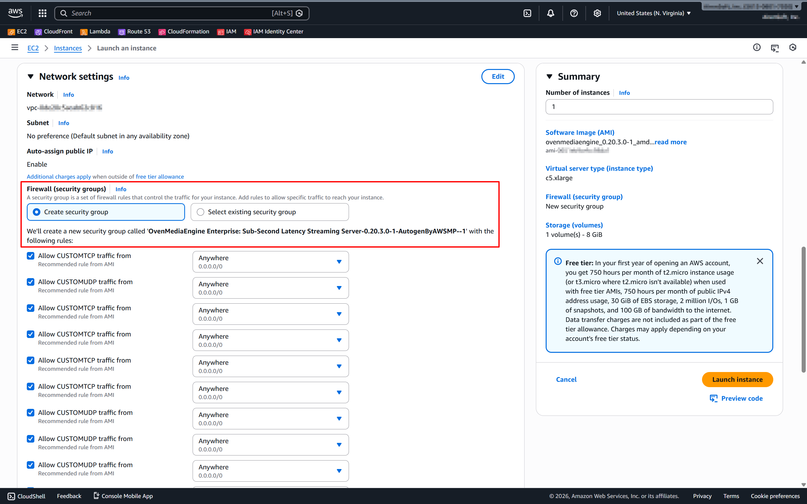

3. While configuring the instance, check in the \[Network settings] section that the **\[Vendor-recommended security group]** is applied as shown above, then complete the remaining settings.
4. Then click \[Launch instance] on the right to create and run the instance.

:::info

For details on the ports included in the \[Vendor-recommended security group], please refer to the [Inbound Security Group Rules](inbound-security-group-rules.md) guide.

:::

***

#### \[Option B] If you select “**One-click launch from AWS Marketplace**”

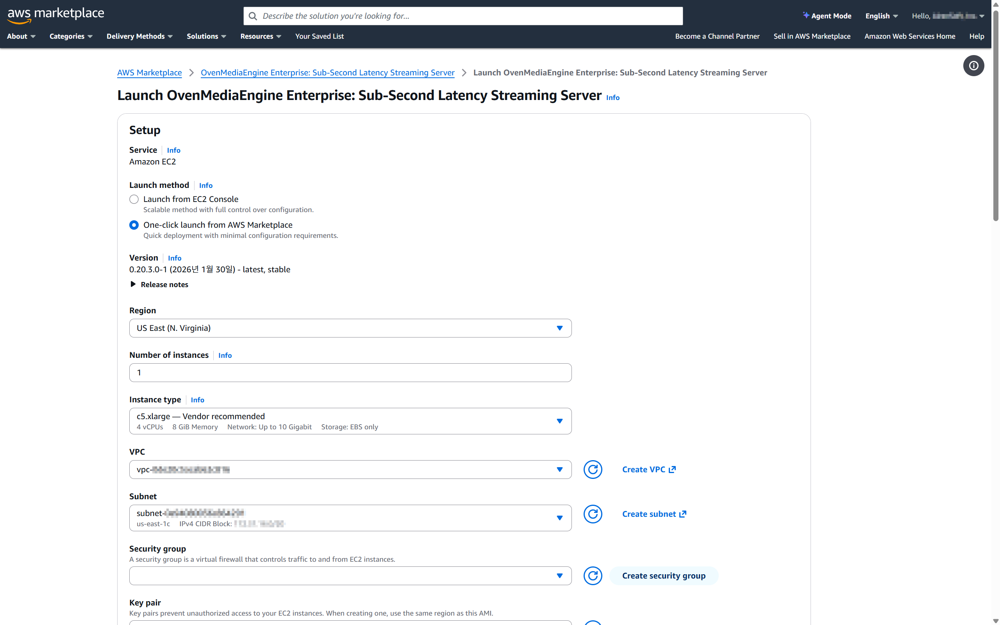

2. On the **\[**&#x53;etup] page, if you selected \[One-click launch from AWS Marketplace] as the launch method, complete the detailed settings for each item as needed.

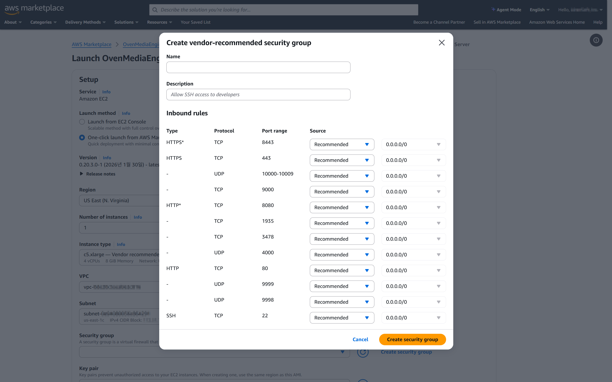

3. In the \[Security group] section, click \[Create security group]. After reviewing the **\[Vendor-recommended security group]** creation details, create the security group.
4. Then click \[Launch] (or \[One-click launch]) at the bottom to create and run the instance.

:::info

For details on the ports included in the \[Vendor-recommended security group], please refer to the [Inbound Security Group Rules](inbound-security-group-rules.md) guide.

:::

### Check required instance information

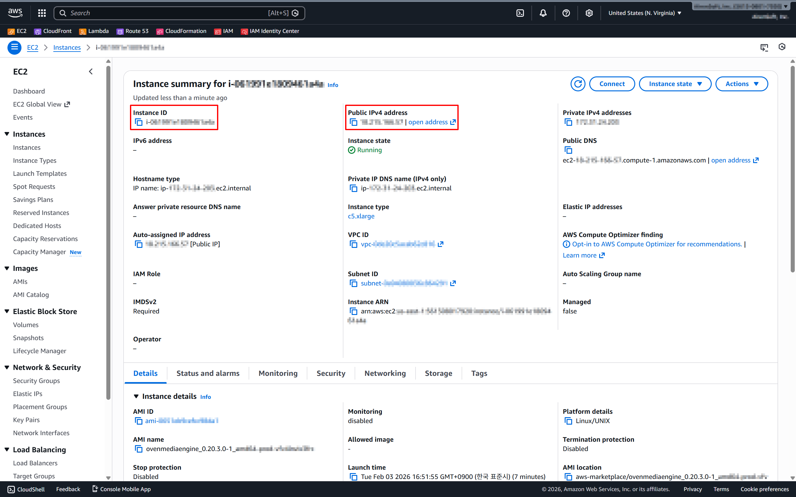

5. Once the instance is Running, open the EC2 dashboard and note the following:
   * Public IPv4 Address (e.g., `54.x.x.x`)
   * Instance ID (e.g., `i-0abcdef1234567890`)

### Connect to the Web Console and sign in

6. Open the OvenMediaEngine Enterprise Web Console in your browser using the following:
   * **`http://`**`{Public IPv4 Address}:`**`8080`**

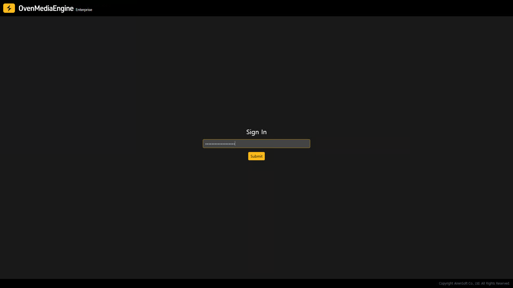

7. In the Password field, enter your **Instance ID**, then sign in.

:::info

When you launch the Web Console, if you see a loading page such as _"Waiting for launching OvenMediaEngine Web Console,"_ your instance is still booting. Please wait a moment.

:::

## Post-Setup Verification for OvenMediaEngine Enterprise

In this example, we used OBS Studio, one of the most widely used live encoder software tools, along with the RTMP protocol.

### Streaming with a Live Encoder (OBS Studio)

1. Launch Open Broadcaster Software (OBS) Studio.
   * If OBS Studio is not installed, download and install it from: [https://obsproject.com/download](https://obsproject.com/download)
2. Add or select the media source you want to stream (e.g., Media Source, Camera, Screen Capture, or more).
3. Click \[Settings] in the lower-right corner of OBS.

### Configure the Stream destination in OBS

4. In the Settings window, select the \[Stream] tab on the left.
5. In \[Service], select \[Custom], then enter the Ingress URL into the Server filed.
   * Ingress URL format: **`rtmp://`**`{Public IPv4}:`**`1935`**`/{app}/{stream}`

:::info

If the Ingress URL already includes the stream key, you may leave Stream Key empty.

:::

6. Next, in the \[Output] tab, we recommend setting the **`Keyframe Interval`** to **1-second** and **`B-frames`** to **0** for smooth sub-second latency and low-latency streaming.

:::tip

Setting B-frames to 0 (`bframes=0`) helps reduce playback stuttering in `WebRTC` output. The example above shows the configuration when using the `x264` encoder. Depending on the selected encoder, available options and layout may vary. When using `WebRTC` as the output, setting B-frames to 0 is recommended.

:::

7. If needed, adjust additional settings in tabs such as \[Audio] and \[Video], then click \[OK] to return to the OBS main screen.
8. Finally, click \[Start Streaming] to begin publishing.

:::info

If you would like to verify basic operation using other protocols (RTSP Pull, WebRTC/WHIP, SRT, RTMP/E-RTMP, etc.), please refer to the [Publish Streams](../publish-streams/README.md) section.

:::

### Verify stream status and playback in the Web Console

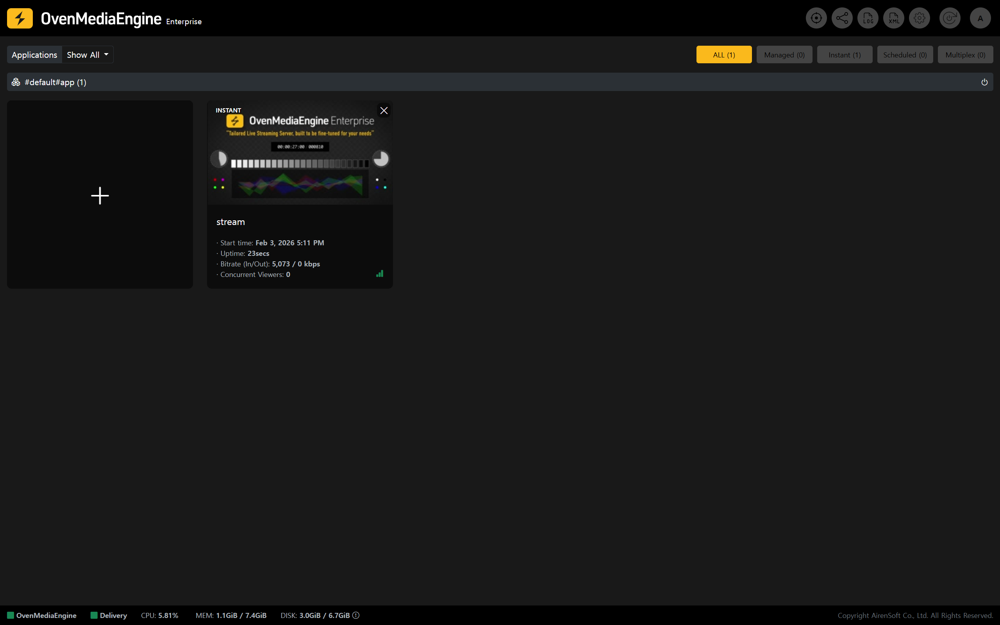

9. In the Web Console, confirm that the stream is created and appears in the stream list.

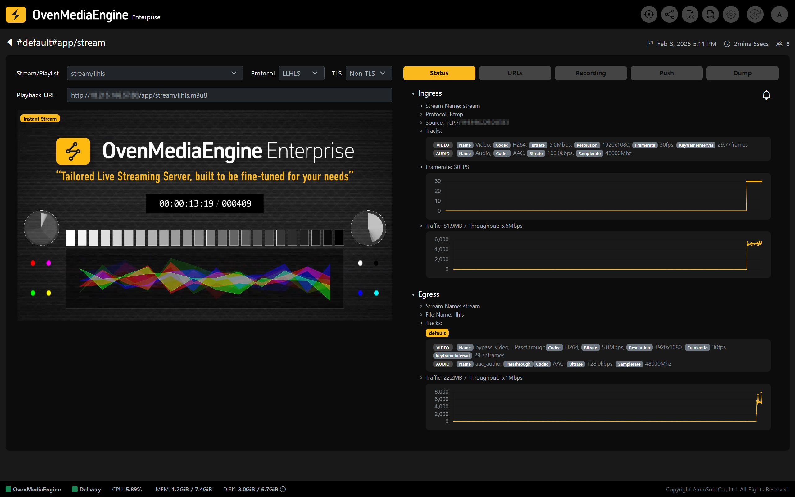

10. Open the stream details page and verify:
    1. Playback status.
    2. Statistics (bitrate, FPS, etc.).
    3. Playback URL.

## Play via Egress Protocol (WebRTC, LLHLS, HLS, SRT)

### Play with the embedded player

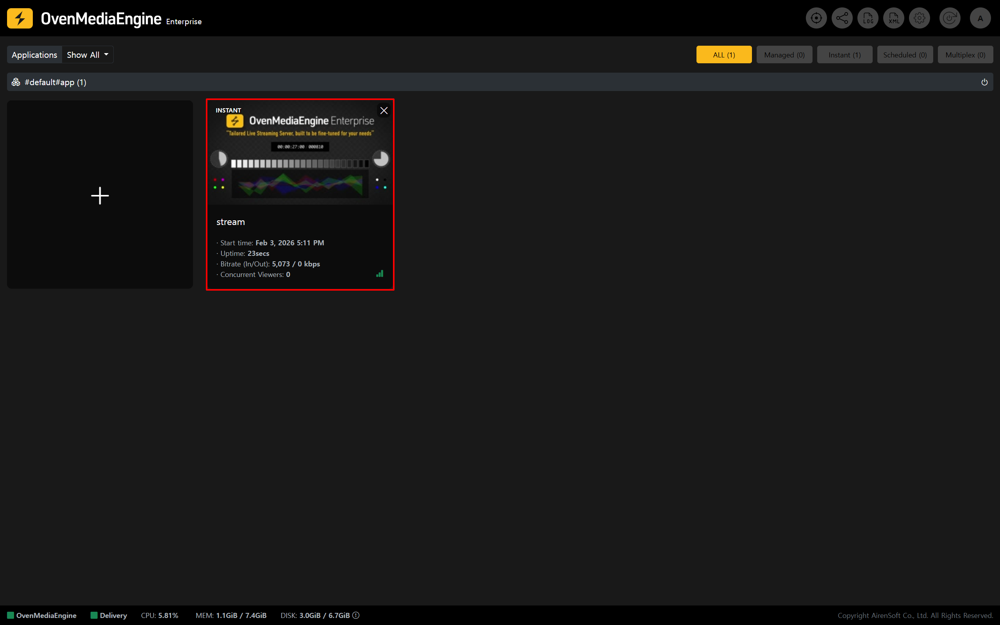

* On the Web Console Stream List (main page), click the \[Stream Box] you want to view in detail.

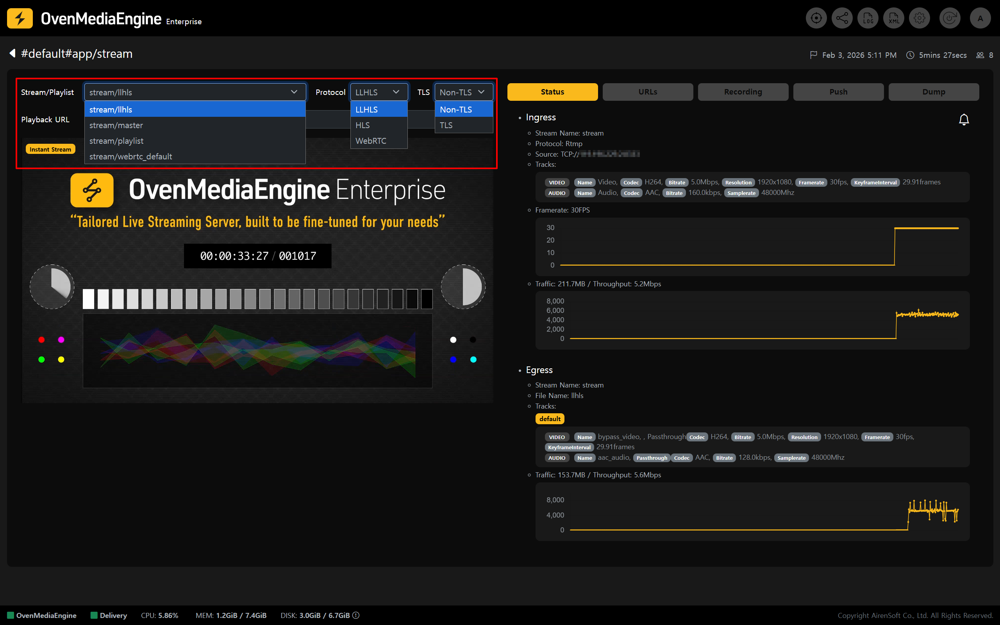

* Then, in the player provided by OvenMediaEngine Enterprise (OvenPlayer), select options such as `Playlist`, `Protocol`, and `TLS` to start playback.

### Play with an external player

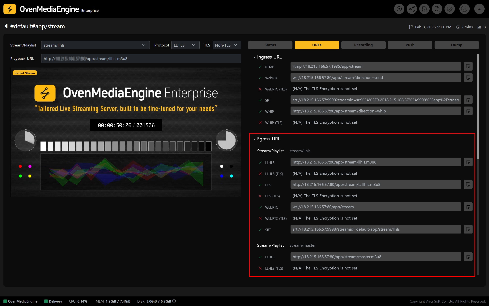

* In the stream detail view, click the \[URLs] tab and use an \[Egress URL] from the list to play the stream in an external player.
  * Alternatively, based on the Playlist, Protocol, and TLS settings you selected under "[Play with the embedded player](./README.md#play-with-the-embedded-player)," you can use the \[Playback URL] shown at the bottom to play in an external player.

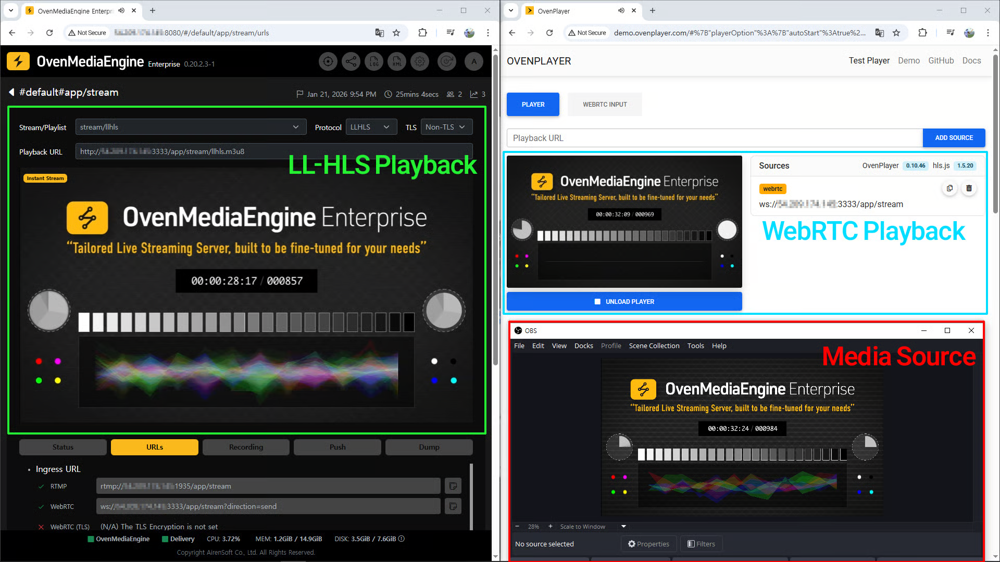

* Please test playback using an external player such as [http://demo.ovenplayer.com](http://demo.ovenplayer.com/), as shown in the example above.
  * LLHLS URL format: `http[s]://{Public IPv4 or Domain}:{Port}/{App name}/{Stream name}/{Playlist name}.m3u8`
  * HLS URL format: `http[s]://{Public IPv4 or Domain}:{Port}/{App name}/{Stream name}/ts:{Playlist name}.m3u8`
  * WebRTC URL format: `ws[s]://{Public IPv4 or Domain}:{Port}/{App name}/{Stream name}/{Playlist name}`
  * SRT URL format: `srt://{Public IPv4 or Domain}:{Port}?streamid={Host name}/{App name}{Stream name}/{Playlist name}`

:::tip

- When testing a **Non-TLS** URL, use: [**http://**&#x64;emo.ovenplayer.com](http://demo.ovenplayer.com/)
- When testing a **TLS** URL, use: [**https://**&#x64;emo.ovenplayer.com](https://demo.ovenplayer.com/)

:::

