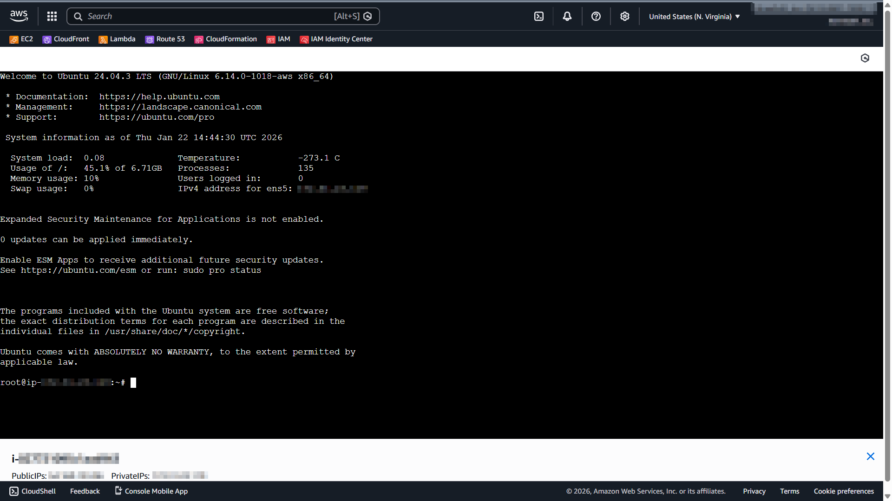

OvenMediaEngine Enterprise on AWS **continuously generates** **Log Files** while the service is running. If logs accumulate, Disk usage may increase excessively. To prevent this in advance, OvenMediaEngine Enterprise provides the **Automatic Log Cleanup** feature.

## Default Log Cleanup Policy <a href="#default-log-cleanup-policy" id="default-log-cleanup-policy"></a>

The default Automatic Log Cleanup policy applied to OvenMediaEngine Enterprise on AWS is as follows:

* **Retention (Days):** Logs older than 90 days are automatically deleted.
* **Minimum Retention (Days):** Logs from the most recent 1 day are always retained.
* **Size Limit (MB):** If the total size exceeds 1GB (1024MB), the oldest files are deleted first to free up space.
* **Run Schedule:** Automatic Log Cleanup is enabled by default and runs automatically every day at 03:00 (UTC).

This policy applies to the following logs:

<table><thead><tr><th width="164.7777099609375">Log Type</th><th width="221.6666259765625">Directory</th><th width="199.9998779296875">File Pattern</th><th>Description</th></tr></thead><tbody><tr><td>OvenMediaEngine</td><td>/var/log/ovenmediaengine</td><td>`ovenmediaengine.log.*`</td><td>OME Core Engine Log (Rotated)</td></tr><tr><td>Web Console</td><td>/var/log/ovenmediaengine/ovenstudio</td><td>`oven-studio_*.log`</td><td>Web Console Service Log</td></tr><tr><td>OvenMediaEngine Delivery</td><td>/var/log/ovenmediaengine/ovenmediaengine-delivery</td><td>`delivery-daemon.log.*`</td><td>Recording Delivery System Log</td></tr><tr><td>OvenMediaEngine Monitoring</td><td>/var/log/ovenmediaengine</td><td>`events.log.*`</td><td>OME Monitoring Event Log</td></tr></tbody></table>

## Changing the Log Cleanup Policy <a href="#changing-the-log-cleanup-policy" id="changing-the-log-cleanup-policy"></a>

If you need to adjust the policy (such as retention period or size limit) for your environment, follow the steps below.


### Edit the Log Cleanup Script



1. Connect to your instance via SSH (following the [EC2 connection official guide](https://docs.aws.amazon.com/AWSEC2/latest/UserGuide/connect.html)), then open the script with the command below:

```bash
sudo vi /opt/omee-log-cleanup.sh
```


### Update the Policy using Variables

2. The variables defined at the top of the script are used as the default values:

```bash
# Configuration (Adjust according to your environment)
RETENTION_DAYS=90    # Max retention period (days)
MIN_RETENTION_DAYS=1    # Min retention period (days) - Safety guard for size limit
MAX_TOTAL_SIZE_MB=1024    # Max allowed size (MB) - e.g., 1GB
```

<table><thead><tr><th width="176.2222900390625">Value</th><th width="159.5555419921875" align="center">Input Range</th><th>Description</th></tr></thead><tbody><tr><td>`RETENTION_DAYS`</td><td align="center"><p>0&#126;</p><ul><li>Default: 90</li></ul></td><td>Sets the maximum retention period (days) for stored logs.</td></tr><tr><td>`MIN_RETENTION_DAYS`</td><td align="center"><p>0&#126;</p><ul><li>Default: 1</li></ul></td><td><p>Sets the minimum retention period (days) for stored logs.</p><ul><li>This is a safety guard to prevent files within this period from being deleted, even when the size limit is exceeded.</li></ul></td></tr><tr><td>`MAX_TOTAL_SIZE_MB`</td><td align="center"><p>0&#126;</p><ul><li>Default: 1024</li></ul></td><td>Sets the maximum allowed storage size (MB) for retained logs.</td></tr></tbody></table>

3. If you modify these variables, the new values will be applied to all `cleanup_logs` entries in the script.

```bash
# 1. OvenMediaEngine Core Logs
cleanup_logs "/var/log/ovenmediaengine" "ovenmediaengine.log.*" $RETENTION_DAYS $MIN_RETENTION_DAYS $MAX_TOTAL_SIZE_MB

# 2. OvenStudio Logs
cleanup_logs "/var/log/ovenmediaengine/ovenstudio" "oven-studio_*.log" $RETENTION_DAYS $MIN_RETENTION_DAYS $MAX_TOTAL_SIZE_MB

# 3. Delivery Daemon Logs
cleanup_logs "/var/log/ovenmediaengine/ovenmediaengine-delivery" "delivery-daemon.log.*" $RETENTION_DAYS $MIN_RETENTION_DAYS $MAX_TOTAL_SIZE_MB

# 4. Events Logs
cleanup_logs "/var/log/ovenmediaengine" "events.log.*" $RETENTION_DAYS $MIN_RETENTION_DAYS $MAX_TOTAL_SIZE_MB
```


### Customize Policy per Log Type (Optional) <a href="#customize-policy-per-log-type-optional" id="customize-policy-per-log-type-optional"></a>

* If you want different policies for different log files, edit the `cleanup_logs` calls near the bottom of the script.

```bash
# 1. OvenMediaEngine Core Logs
cleanup_logs "/var/log/ovenmediaengine" "ovenmediaengine.log.*" $RETENTION_DAYS $MIN_RETENTION_DAYS $MAX_TOTAL_SIZE_MB

# 2. OvenStudio Logs
cleanup_logs "/var/log/ovenmediaengine/ovenstudio" "oven-studio_*.log" $RETENTION_DAYS $MIN_RETENTION_DAYS $MAX_TOTAL_SIZE_MB

# 3. Delivery Daemon Logs
cleanup_logs "/var/log/ovenmediaengine/ovenmediaengine-delivery" "delivery-daemon.log.*" $RETENTION_DAYS $MIN_RETENTION_DAYS $MAX_TOTAL_SIZE_MB

# 4. Events Logs
cleanup_logs "/var/log/ovenmediaengine" "events.log.*" $RETENTION_DAYS $MIN_RETENTION_DAYS $MAX_TOTAL_SIZE_MB
```

#### Syntax

```bash
cleanup_logs "<log_directory>" "<file_pattern>" retention_days min_retention_days max_total_size_mb
```

#### Example

* **Main Log** (`ovenmediaengine.log.*`) is typically more important, so this example keeps logs for 7–180 days and allows up to 5GB of total storage.

```bash
cleanup_logs "/var/log/ovenmediaengine" "ovenmediaengine.log.*" 180 7 5120
```

* **Event Log** (`events.log.*`) is relatively less critical, so this example keeps logs for 1–30 days and allows up to 500MB of total storage.

```bash
cleanup_logs "/var/log/ovenmediaengine" "events.log.*" 30 1 500
```


### Save the Log Cleanup Script <a href="#save-the-log-cleanup-script" id="save-the-log-cleanup-script"></a>

4. After editing the script, save the file to apply the changes immediately. There is no need to restart the instance, restart OvenMediaEngine (service), or re-register the crontab.


