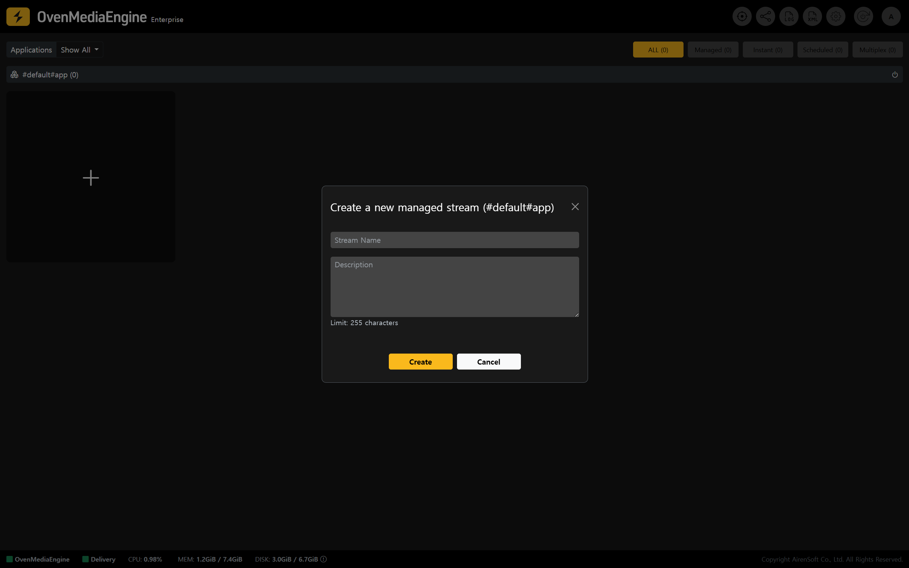
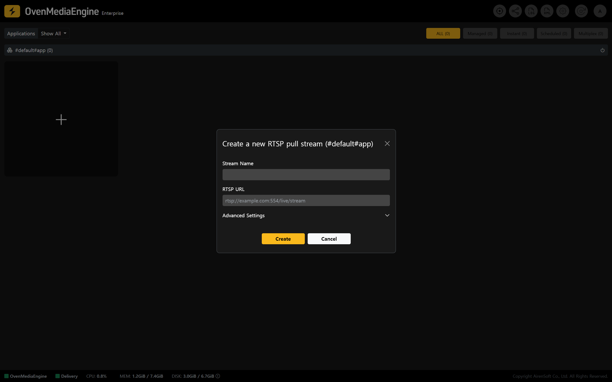
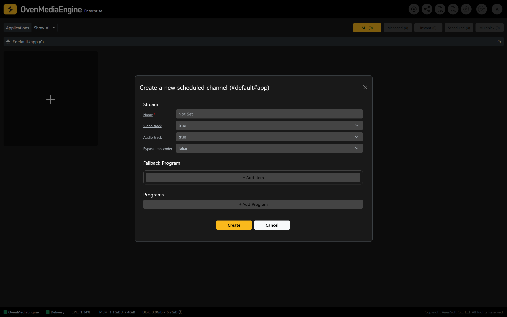
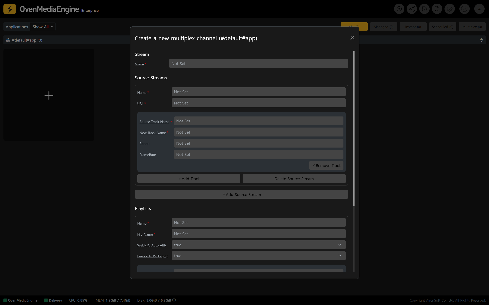

OvenMediaEngine Enterprise’s most important core operation is to receive Media Sources (Ingest/Input/Ingress) and deliver the generated Streams with sub-second latency (Deliver/Output/Egress). To help you run Publish Streams more easily and reliably, OvenMediaEngine Enterprise provides a set of convenience features that you can use based on your service requirements and operating environment.

## Managed Stream and Instant Stream

### Managed Stream Overview

* A Managed Stream is a persistent stream entry that you create by pre-registering a \[Stream Name] in OvenMediaEngine Enterprise. A Managed Stream remains in the Stream List until you delete it.

#### Why is Managed Stream needed?

* In traditional Broadcasting and Studio environments, it is common to standardize recurring stream names (for example, `studio_cam_01`, `studio_cam_02`, `program_main`, `backup_main`, etc.) and continuously monitor/track their publishing status. In some cases, only Streams with approved names are allowed for security reasons. In these scenarios, using Managed Streams helps you meet operational requirements and reduce human errors by keeping the Stream List organized.
* In Enterprise environments where access control and permission policies must clearly define what can be ingested, the system may be configured to accept only predefined streams. Also, when external systems such as Players are configured to connect based on a specific Stream Name, Managed Streams become the operational baseline that helps prevent mistakes.

:::tip

For more details and advanced options, please refer to the [Managed and Instant Streams](../../web-console/web-console-overview/stream-list/managed-and-instant-streams.md) guide.

:::

### Instant Stream Overview

* An Instant Stream is a feature that automatically detects streams that are not pre-registered as Managed Streams when they are published to OvenMediaEngine Enterprise, classifies them as Instant Streams, and displays them in the Stream List. When publishing stops, the Instant Stream is automatically removed from the Stream List.

#### Why is Instant Stream needed?

* In field operations where streams frequently appear and disappear (test publishing, live events, adding temporary on-site cameras, etc.), registering every stream manually is inconvenient. OvenMediaEngine Enterprise automatically detects incoming media sources so you can start monitoring immediately, and it automatically cleans up entries when streams end, supporting a more flexible operational workflow.

:::tip

For more details and advanced options, please refer to the [Managed and Instant Streams](../../web-console/web-console-overview/stream-list/managed-and-instant-streams.md) guide.

:::

## RTSP Pull Stream

### RTSP Pull Stream Overview

* RTSP Pull Stream allows OvenMediaEngine Enterprise to connect directly to an external RTSP URL (for example, CCTV, IP Camera, NVR, etc.), pull the media source, and convert it into a service-ready Stream.
  &#x20;You can create Streams through RTSP pulling alone, without a dedicated publishing Encoder or Gateway. The created Stream can then be re-delivered via the Protocols you need, such as WebRTC, LLHLS, HLS, and SRT, and connected to your service immediately.

#### Why is RTSP Pull Stream needed?

* In environments where you need to convert RTSP Sources (CCTV, IP cameras, NVRs, etc.) into sub-second streaming for playback on web or mobile players, or where you must operate and monitor many channels, RTSP Pull helps you build a centrally managed live streaming pipeline with minimal effort, without changing devices or installing additional programs on-site.

:::tip

For usage instructions, please refer to the [Publish via RTSP Pull (CCTV)](publish-via-rtsp-pull-cctv.md) guide.

:::

## Scheduled Channel

### Scheduled Channel Overview

* Scheduled Channel lets you schedule and publish Media Files and/or Live inputs. If Live input is interrupted for any reason, the built-in Failover automatically switches to a fallback input. When the Live input resumes, it switches back to Live immediately, providing an uninterrupted streaming experience.

#### Why is Scheduled Channel needed?

* Operational scenarios such as **24/7 channel operation**, on-the-hour programming, and inserting ads, highlights, or announcements require timetable-based scheduling. With Scheduled Channel, the System automatically publishes and switches streams according to the defined schedule. Even if Live equipment issues occur, it automatically fails over to keep the Stream running without interruption.

### Scheduled Channel Menu Overview

* As shown in the image, you can create a Scheduled Channel in the Web Console.
  * **Name**: The basic name required to create the Scheduled Channel.
  * **Video track**: Determines whether the Scheduled Channel uses a Video track. If Video track is set to `true` but the item has no Video track, an error occurs.
  * **Audio track**: Determines whether the Scheduled Channel uses an Audio track. If Audio track is set to `true` but the item has no Audio track, an error occurs.
  * **Bypass transcoder****:** If you want to publish the Media Source without transcoding, set this to `true` to enable bypass.
* By configuring a Fallback Program, the system automatically switches to a fallback input when there is no scheduled program for the current time or when an item error occurs. If the Program is updated or the streaming returns to normal, it switches back to the original Program.
  * **URL**: The location (URL) of the fallback Media Source.
  * **Start**: The start time (in milliseconds) for where playback begins within the fallback Media Source file.
  * **Duration**: The playback duration (in milliseconds) of the fallback Media Source file.
* You can schedule playback by setting start and end times in the `ISO8601` format.
  * **Name**: Optional reference name for the Program. If not set, a name is assigned automatically.
  * Scheduled: Sets the Program start time.
  * **Repeat**: Determines whether the Program repeats after it finishes.
  * **URL**: The location (URL) of the Media Source.
    * If the URL starts with `file://`, it references a file under the `MediaRootDir` directory.
    * If the URL starts with `stream://`, it references another Stream within the same OvenMediaEngine instance.
  * **Start**: Sets the start time (in milliseconds) for where playback begins within the Media Source file. If not set, the default is `0`.
  * **Duration**: Sets the playback duration (in milliseconds) of the Media Source. When the specified Duration ends, the next item in the Program is played. If Duration is not set, it uses the Media Source’s full playback time.

:::tip

For more details and advanced options, please refer to the [Scheduled Channels](../../web-console/web-console-overview/stream-list/scheduled-channels.md) guide.

:::

## Multiplex Channel

### Multiplex Channel Overview

* Multiplex Channel can combine multiple input streams into one to build ABR, or duplicate an external stream and forward it to another `App`. It can also reuse already-encoded tracks from another local stream and build them as its own Tracks, which can be useful when you need to change the Codec or retune quality.

#### Why is Multiplex Channel needed?

* In Production environments, inputs often increase (Multi Camera/Multi Source), and service requirements may require consolidating multiple sources (ABR composition or Multi View). With Multiplex Channel, you can flexibly restructure or replicate Streams for re-delivery, and you can reuse existing Tracks when appropriate to reduce unnecessary re-encoding overhead while scaling your pipeline.

### Multiplex Channel Menu Overview

* As shown in the image, you can create a Multiplex Channel in the Web Console.
  * **Name**: The name of the new Multiplex Channel.
* Multiplex Channel multiplexes multiple Source Streams. A Source Stream can also be loaded as a Stream from a different `Vhost` or `App`.
  * **Name**: The name of the Source Stream to multiplex.
  * **URL**: The location (URL) of the Source Stream.
  * **Source Track Name**: The Source Track name is either `<OutputProfile><Encodes><VideoName>` or `<OutputProfile><Encodes><AudioName>` of the Source Stream.
  * **New Track Name**: Because multiple Streams are merged into a single Stream, Track names may collide. This is the Track name remapped for use inside the Multiplex Channel.
* A Playlist configured in a Multiplex Channel exists only within that Multiplex Channel. The Playlist must be built using the newly mapped Track names in `<SourceStreams>`’s `<TrackMap>`, and it must follow the same structure as `<OutputProfile>`.
  * **WebRTC Auto ABR**: Set to `true` by default. When using WebRTC, it automatically switches renditions.
  * **Enable Ts Packaging**: If `<EnableTsPackaging>` is enabled in the Playlist, the HLS Publisher packages TS files using that Playlist and prepares them for streaming.
  * **audio**: The remapped Track name set on the Source Stream, used as the Audio Track name in the Playlist.
  * **video**: The remapped Track name set on the Source Stream, used as the Video Track name in the Playlist.

:::tip

For more details and advanced options, please refer to the [Multiplex Channels](../../web-console/web-console-overview/stream-list/multiplex-channels.md) guide.

:::

