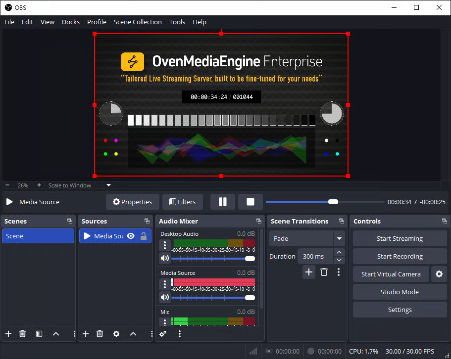
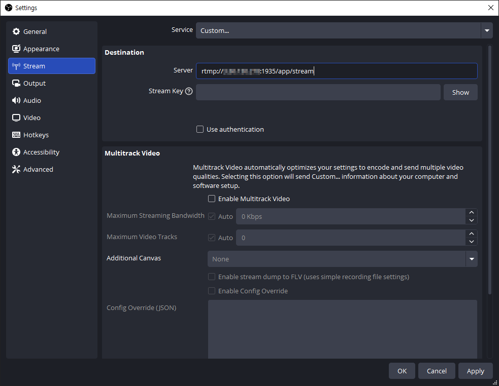
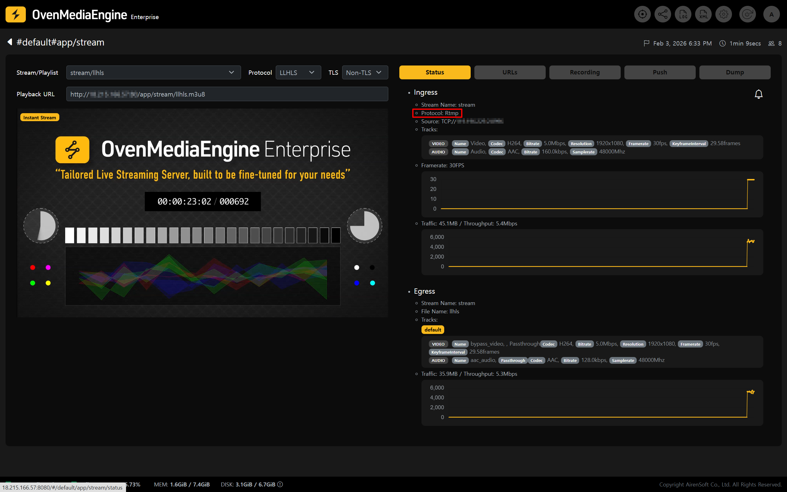

`RTMP` is one of the **most widely used protocols** for publishing streams from a live encoder to a service. It offers excellent compatibility with widely used encoders such as OBS Studio, making it suitable for getting started with streaming quickly. In addition, by using E-RTMP (Enhanced RTMP), you can configure streaming in a more controlled manner through extended options required for operational environments, such as authentication and security.

This guide walks you through the process of publishing a stream via `RTMP`/`E-RTMP`, followed by the basic steps for playback and status verification after publishing.

<table><thead><tr><th width="151">Item</th><th>Supported</th></tr></thead><tbody><tr><td>Container</td><td>FLV</td></tr><tr><td>Transport</td><td>TCP</td></tr><tr><td>Codec</td><td>H.264, AAC / H.265 (E-RTMP only)</td></tr></tbody></table>

## Start Publishing an RTMP/E-RTMP Stream

For this example, we used OBS Studio, one of the most commonly used live encoder software applications.

### Publish with a Live Encoder (OBS Studio)

1. Launch Open Broadcaster Software (OBS) Studio.
   * If OBS Studio is not installed, download it from the official page ([https://obsproject.com/download](https://obsproject.com/download)).
2. Add a media source you want to publish (e.g., Media Source, Camera. or Screen Capture).
3. Click \[Settings] in the bottom-right corner of OBS.

### Configure Streaming in OBS

4. On the left side of the Settings window, select the \[Stream] tab.
5. Under \[Service], select **\[Custom]**, then enter the SRT Ingress URL in the Server field.
   * Ingress URL Format: **`rtmp://`**`{Public IPv4 or Domain}:`**`1935`**`/{app}/{stream}`

:::info

If you are not sure about the RTMP or E-RTMP Input URL pattern, create a \[Managed Stream] in the Web Console and check it under the \[URLs] tab.

:::

6. Next, in the \[Output] tab, we recommend setting the **`Keyframe Interval`** to **1-second** and **`B-frames`** to **0** for smooth sub-second latency and low-latency streaming.
   * When using Enhanced RTMP (E-RTMP), set the video encoder to `H.265 (HEVC)`.

:::tip

Setting B-frames to 0 (`bframes=0`) helps reduce playback stuttering in `WebRTC` output. The example above shows the configuration when using the `x264` encoder. Depending on the selected encoder, available options and layout may vary. When using `WebRTC` as the output, setting B-frames to 0 is recommended.

:::

7. Adjust additional settings as needed in \[Audio], \[Video], and other tabs, then click \[OK] to return to the main OBS window.
8. When all settings are ready, click \[Start Streaming] to begin publishing.

### Check Stream Status and Playback in the Web Console

9. In the Web Console, check whether the stream published from OBS or the OvenPlayer Demo appears in the list.

