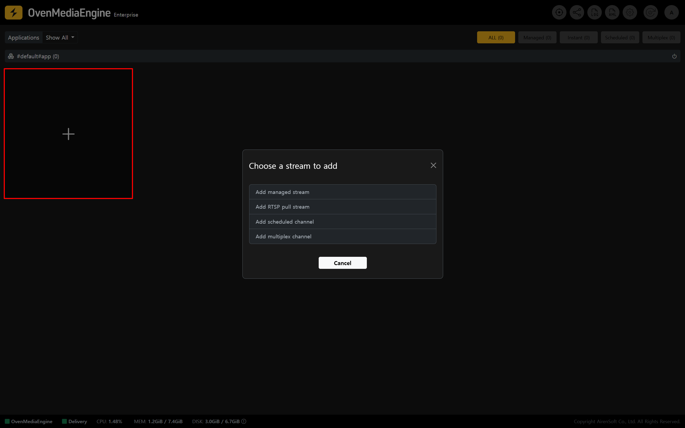
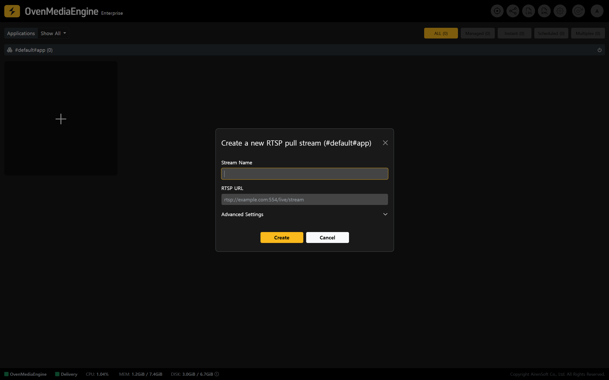
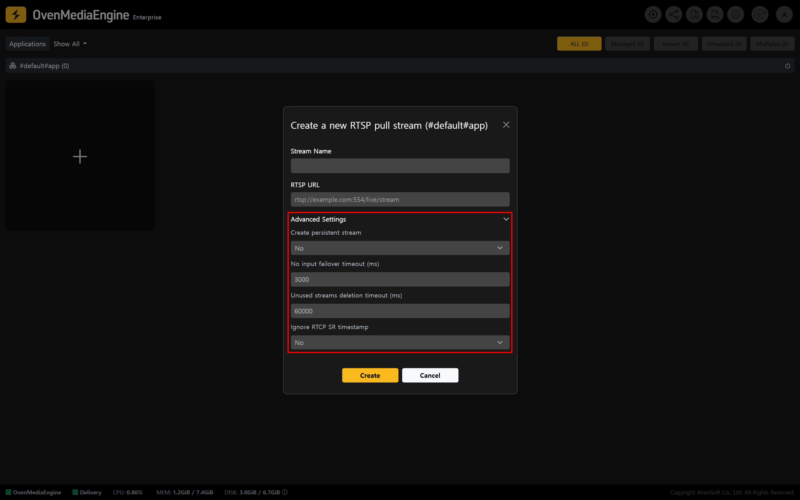
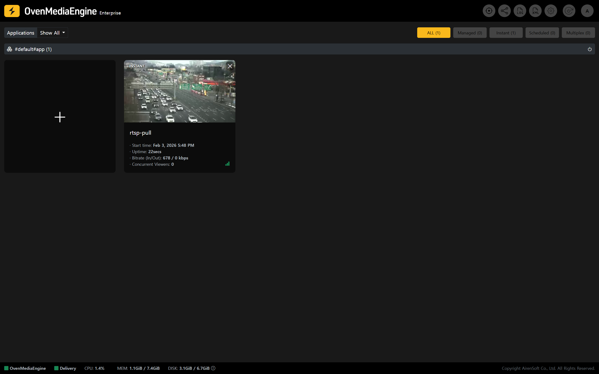
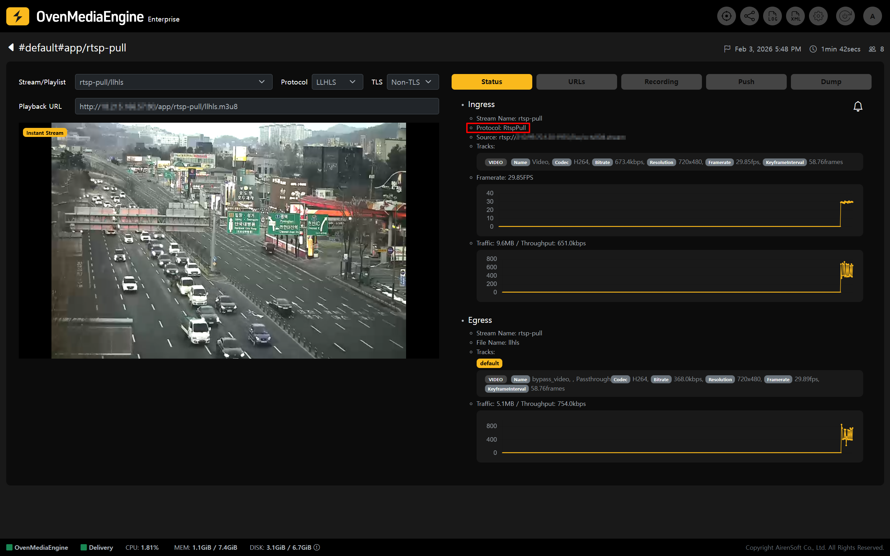

If you need to convert your `RTSP`-based videos, such as CCTV, IP camera, etc., into real-time streams in your service, you can use the RTSP Pull feature in OvenMediaEngine Enterprise on AWS.

With this approach, OvenMediaEngine **connects directly to an external RTSP (media source) and pulls the video (pulling)**, allowing you to build a streaming environment easily without any additional streaming tools.

<table><thead><tr><th width="151">Item</th><th>Supported</th></tr></thead><tbody><tr><td>Container</td><td>RTP</td></tr><tr><td>Transport</td><td>UDP / TCP</td></tr><tr><td>Codec</td><td>H.264, H.265, Opus, AAC</td></tr></tbody></table>

## Start Publishing an RTSP Pull Stream

### Create an RTSP Pull Stream and enter information

1. Stream List on the Web Console (main page), click \[+] in the page, then select \[Add RTSP pull stream] from the menu.

2. Enter a \[Stream Name] that is easy to identify, and the \[RTSP URL] to connect to.

:::tip

A typical RTSP URL format is `rtsp://{ID}:{Password}@{IP}:{Port}/path`, but formats may vary by product. Please check the RTSP URL format recommended by your vendor.

:::

### Ensuring stability with Advanced Settings (Optional)

* You can additionally use \[Advanced Settings] to configure streaming behavior optimized for your network environment.

:::info

If you are using RTSP Pull Streams for the first time, we recommend creating the stream using the default system settings. If further optimization is needed for your environment later, update the stream after adjusting the relevant options.

:::

<table><thead><tr><th width="154" align="center">Value</th><th width="159.5555419921875" align="center">Input Range</th><th>Description</th></tr></thead><tbody><tr><td align="center">Create persistent stream</td><td align="center">
Yes | No
<ul><li>Default: No</li></ul></td><td>
Keeps the stream persistent
<ul><li>If set to `Yes`, the stream will not be deleted automatically after creation and will remain until an explicit `Delete` request is made.</li></ul></td></tr><tr><td align="center">No input failover timeout (ms)</td><td align="center">
0&#126;
<ul><li>Default: 3000</li></ul></td><td>
If no media source is received as input (ingress) for the specified period (milliseconds), the stream is deleted.
<ul><li>This rule is ignored if `Create persistent stream` is set to `Yes`.</li></ul></td></tr><tr><td align="center">Unused streams deletion timeout (ms)</td><td align="center">
0&#126;
<ul><li>Default: 60000</li></ul></td><td>
If there is no output (egress) for the specified period (milliseconds), the stream is deleted.
<ul><li>This rule is ignored if `Create persistent stream` is set to `Yes`.</li></ul></td></tr><tr><td align="center">Ignore RTCP SR timestamp</td><td align="center">
Yes | No
<ul><li>Default: No</li></ul></td><td>
Selects whether to wait for RTCP SR (Sender Report), which includes timestamp information.
<ul><li>If set to `Yes`, the stream starts immediately without waiting for RTCP SR, so the first video appears faster. However, stability may vary depending on any device.</li></ul></td></tr></tbody></table>

### Verify stream output and status

3. Stream List on the Web Console, verify that the media source pulled via RTSP is being delivered successfully through OvenMediaEngine Enterprise.

4. You can view various metadata on the stream details page.

