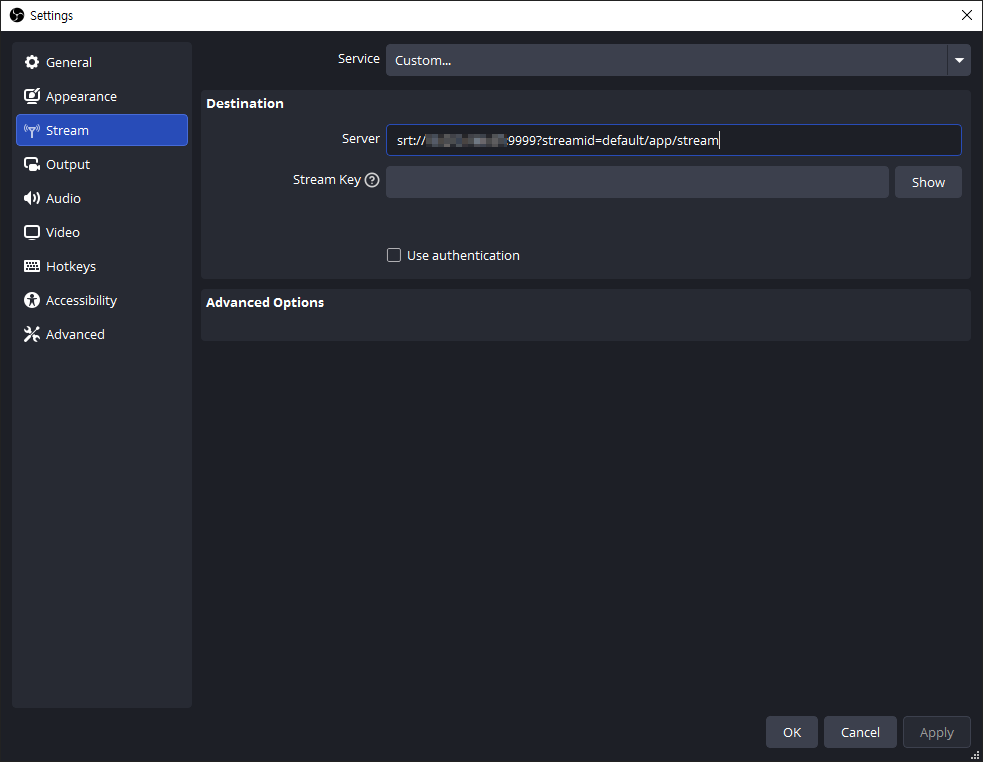
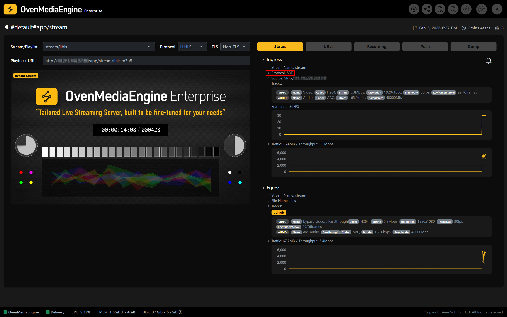

`SRT` (Secure Reliable Transport) is a protocol designed to deliver stable live streams even in network conditions where quality is hard to predict. Because it can maintain relatively robust contribution quality in segments with packet loss or jitter, it is especially useful for scenarios with high network variability, such as on-site production or long-distance transmission.

You can publish a stream to OvenMediaEngine Enterprise on AWS via `SRT`. For live contribution, the **stream is received in an MPEG-2 TS container**, which is more flexible than RTMP in carrying various codecs. If needed, you can also leverage a simulcast setup.

This guide walks you through the SRT publishing procedure and the basic verification steps after publishing, in order.

<table><thead><tr><th width="151">Item</th><th>Supported</th></tr></thead><tbody><tr><td>Container</td><td>MPEG-2 TS</td></tr><tr><td>Transport</td><td>SRT</td></tr><tr><td>Codec</td><td>H.264, H.265, AAC</td></tr></tbody></table>

## Start Publishing an SRT Stream 

In this example, we use OBS Studio, one of the most commonly used live encoder applications.

### Publish with a Live Encoder (OBS Studio) 

1. Launch Open Broadcaster Software (OBS) Studio.
   * If OBS Studio is not installed, download it from the official page ([https://obsproject.com/download](https://obsproject.com/download)).
2. Add a media source you want to publish (e.g., Media Source, Camera, or Screen Capture).
3. Click \[Settings] in the bottom-right corner of OBS.

### Configure Streaming in OBS 

4. On the left side of the Settings window, select the \[Stream] tab.
5. Under \[Service], select **\[Custom]**, then enter the SRT Ingress URL in the Server field.
   * SRT URL Format: **`srt://`**`{Public IPv4 or Domain}:`**`9999?streamid=`**`{host}/{app}/{stream}`

:::info

If you are not sure about the SRT Input URL pattern, create a \[Managed Stream] in the Web Console and check it in the \[URLs] tab.

:::

6. Next, in the \[Output] tab, we recommend setting the **`Keyframe Interval`** to **1-second** and **`B-frames`** to **0** for smooth sub-second latency and low-latency streaming.

:::tip

Setting B-frames to 0 (`bframes=0`) helps reduce playback stuttering in `WebRTC` output. The example above shows the configuration when using the `x264` encoder. Depending on the selected encoder, available options and layout may vary. When using `WebRTC` as the output, setting B-frames to 0 is recommended.

:::

7. Adjust additional settings as needed in \[Audio], \[Video], and other tabs, then click \[OK] to return to the main OBS window.
8. When all settings are ready, click \[Start Streaming] to begin publishing.

### Check Stream Status and Playback in the Web Console 

9. In the Web Console, check whether the stream published from OBS or the OvenPlayer Demo appears in the list.

