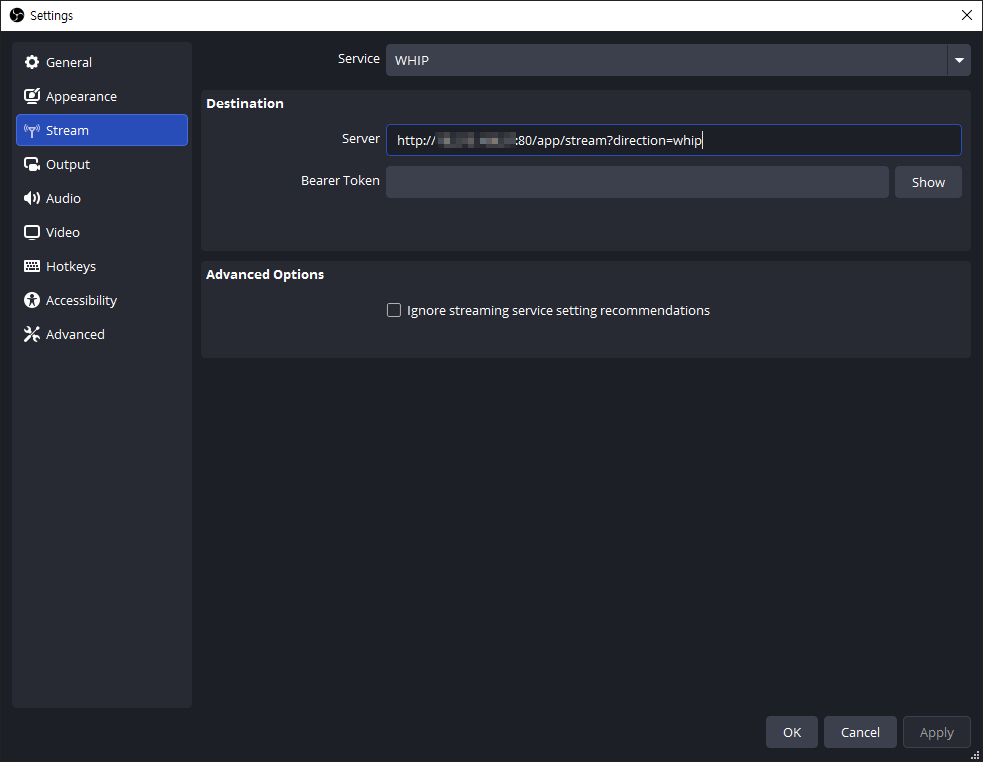
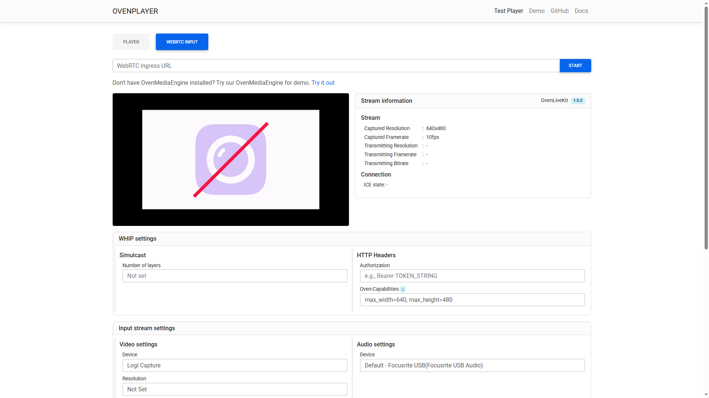
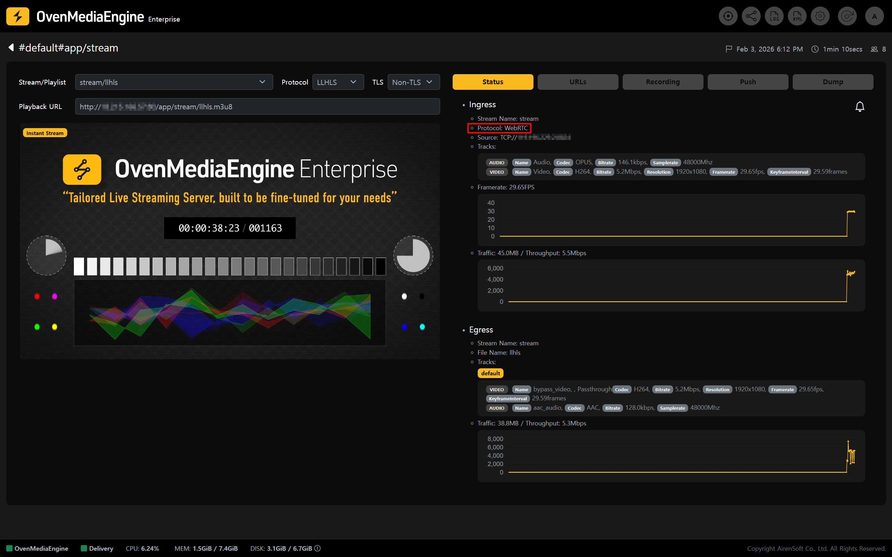

You can publish a media source to OvenMediaEngine Enterprise on AWS via `WebRTC/WHIP` Protocol from a **WebRTC-capable live encoder** or a **web browser,** with no additional plug-ins required.

In addition, by leveraging WebRTC Simulcast, you can send multiple quality layers within a single publishing session. This helps deliver more stable sub-second live streaming by adapting to each viewer’s network conditions, and it can also reduce transcoding load depending on your workflow.

This guide walks you through how to publish a stream via WebRTC/WHIP and how to perform basic playback and status checks after publishing.

<table><thead><tr><th width="151">Item</th><th>Supported</th></tr></thead><tbody><tr><td>Container</td><td>RTP / RTCP</td></tr><tr><td>Security</td><td>DTLS, SRTP</td></tr><tr><td>Transport</td><td>ICE</td></tr><tr><td>Error Correction</td><td>ULPFEC (`VP8`, `H.264`), In-band FEC (`Opus`)</td></tr><tr><td>Codec</td><td>VP8, H.264, H.265, Opus</td></tr><tr><td>Signaling</td><td>Self-Defined Signaling Protocol, Embedded WebSocket-based Server / WHIP</td></tr></tbody></table>

## Start Publishing a WebRTC/WHIP Stream

In this example, we use OBS Studio (Option A), one of the most commonly used live encoder software, and the OvenPlayer Demo provided by OvenMedia Labs (Option B).

### \[Option A] Publish from a Live Encoder (OBS Studio)

1. Launch Open Broadcaster Software (OBS) Studio.
   * If OBS Studio is not installed, download it from the official page ([https://obsproject.com/download](https://obsproject.com/download)).
2. Add a media source you want to publish (e.g., Media Source, Camera. or Screen Capture).
3. Click \[Settings] in the bottom-right corner of OBS.

4. In the left menu of Settings, select the \[Stream] tab.
5. Under \[Service], select **\[WHIP]**, then enter one of the WebRTC/WHIP Ingress URL patterns below in the Server field.
   1. Non-TLS:
      * WebRTC Input URL Format: **`ws://`**`{Public IPv4 or Domain}:`**`80`**`/{app}/{stream}`**`?direction=send`**
      * WHIP URL Format: **`http://`**`{Public IPv4 or Domain}:`**`80`**`/{app}/{stream}`**`?direction=whip`**
   2. TLS:
      * WebRTC (TLS) Input URL Format: **`wss://`**`{Public IPv4 or Domain}:`**`443`**`/{app}/{stream}`**`?direction=send`**
      * WHIP (TLS) URL Format: **`https://`**`{Public IPv4 or Domain}:`**`443`**`/{app}/{stream}`**`?direction=whip`**

:::info

If you are not sure about the WebRTC Input or WHIP URL pattern, create a \[Managed Stream] in the Web Console and check it under the \[URLs] tab.

:::

6. Next, in the \[Output] tab, we recommend setting the **`Keyframe Interval`** to **1-second** and **`B-frames`** to **0** for smooth sub-second latency and low-latency streaming.

:::tip

Setting B-frames to 0 (`bframes=0`) helps reduce playback stuttering in `WebRTC` output. The example above shows the configuration when using the `x264` encoder. Depending on the selected encoder, available options and layout may vary. When using `WebRTC` as the output, setting B-frames to 0 is recommended.

:::

7. If needed, adjust additional settings in tabs such as \[Audio] and \[Video], then click \[OK] to return to the OBS main screen.
8. Finally, click \[Start Streaming] to begin publishing.

### \[Option B] Publish using the OvenPlayer Demo

1. For Non-TLS, open: [http://demo.ovenplayer.com/demo\_input.html](http://demo.ovenplayer.com/demo_input.html) or For TLS, open: [https://demo.ovenplayer.com/demo\_input.html](https://demo.ovenplayer.com/demo_input.html).
2. In the \[WebRTC Ingress URL] field, enter one of the WebRTC/WHIP Ingress URL patterns below, depending on whether you use Non-TLS or TLS.
   1. Non-TLS:
      * WebRTC Input URL Format: **`ws://`**`{Public IPv4 or Domain}:`**`80`**`/{app}/{stream}`**`?direction=send`**
      * WHIP URL Format: **`http://`**`{Public IPv4 or Domain}:`**`80`**`/{app}/{stream}`**`?direction=whip`**
   2. TLS:
      * WebRTC (TLS) Input URL Format: **`wss://`**`{Public IPv4 or Domain}:`**`443`**`/{app}/{stream}`**`?direction=send`**
      * WHIP (TLS) URL Format: **`https://`**`{Public IPv4 or Domain}:`**`443`**`/{app}/{stream}`**`?direction=whip`**
3. Click \[START] on the right to verify that publishing is working properly.

:::info

If you are not sure about the WebRTC Input or WHIP URL pattern, create a \[Managed Stream] in the Web Console and check it under the \[URLs] tab.

:::

### Check Stream Status and Playback in the Web Console

* In the Web Console, check whether the stream published from OBS or the OvenPlayer Demo appears in the list.

