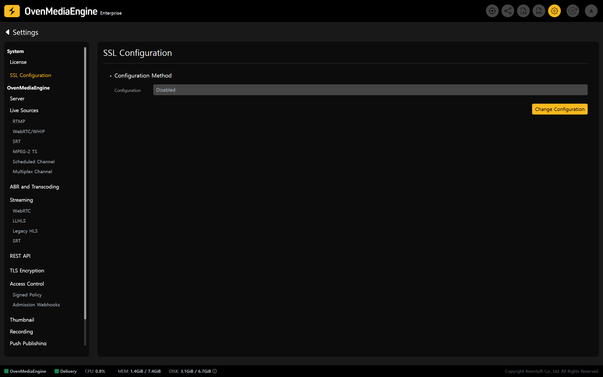
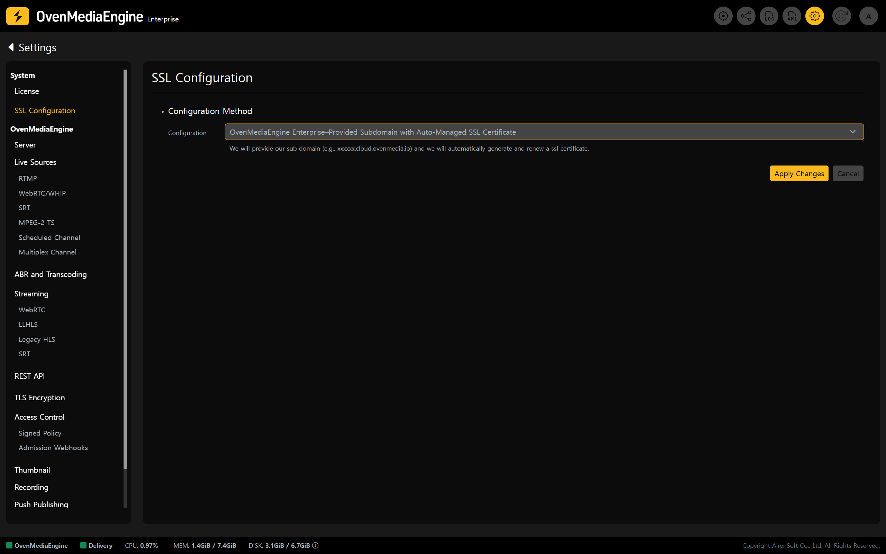
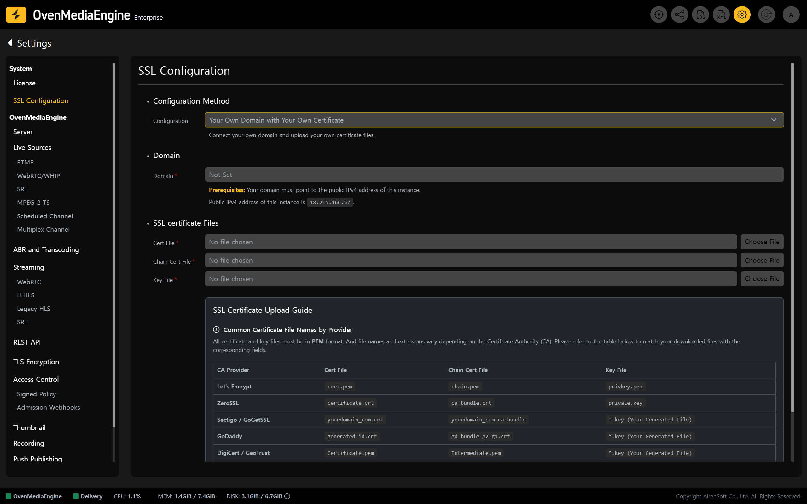
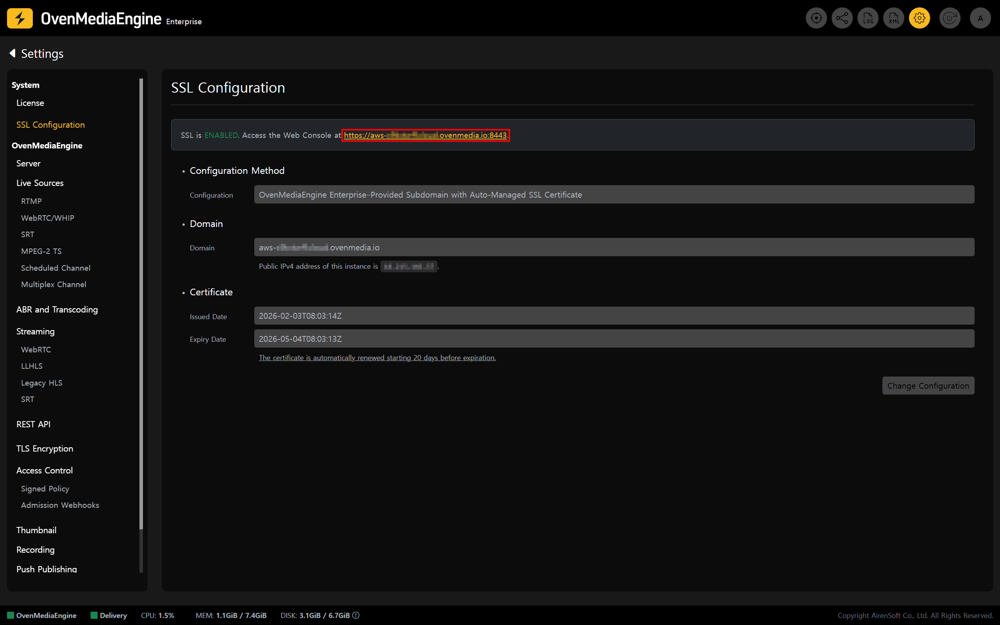
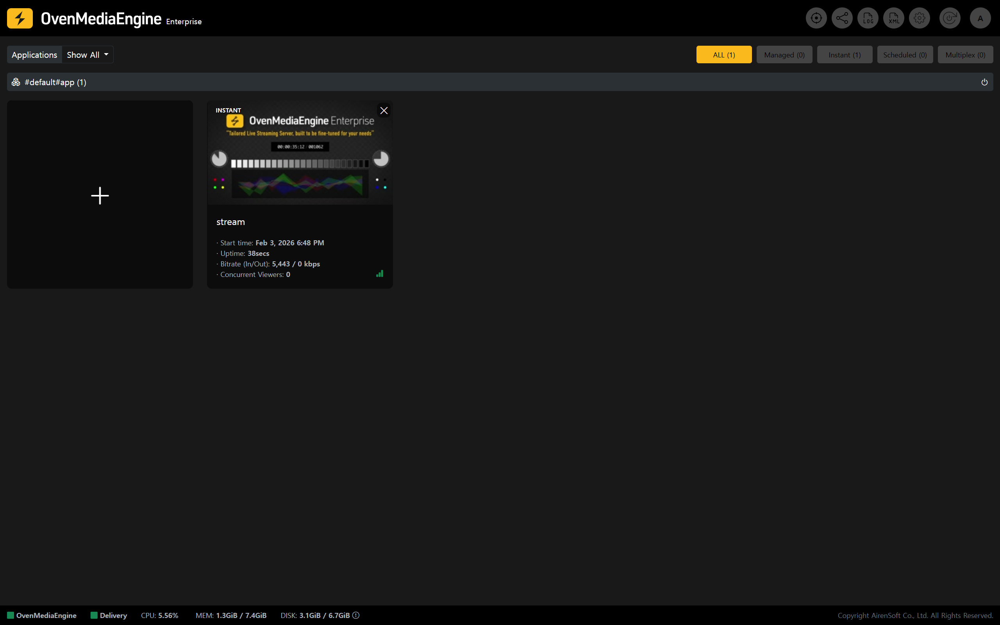
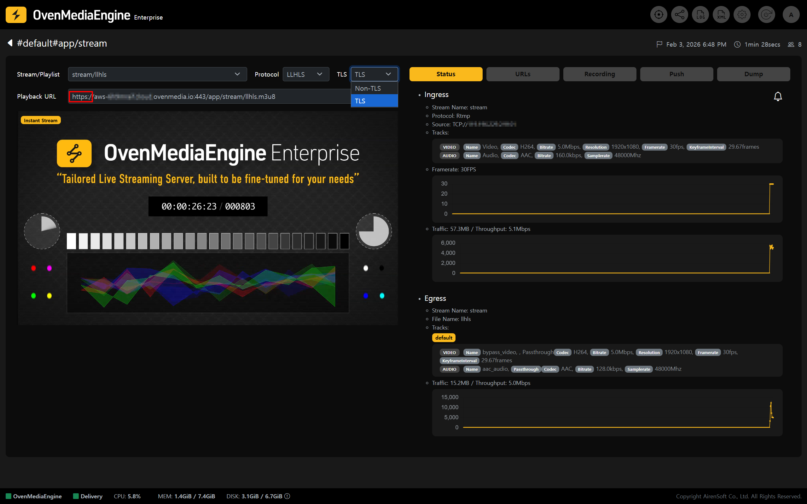
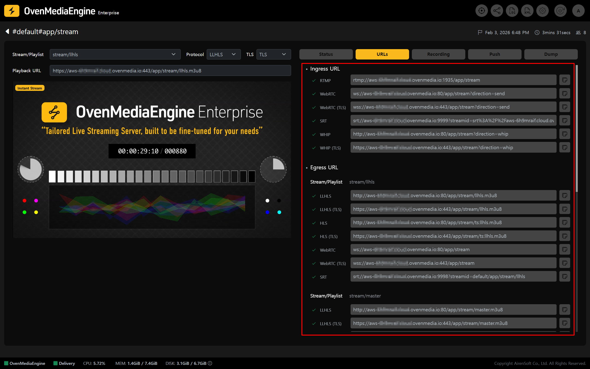

import Tabs from '@theme/Tabs';
import TabItem from '@theme/TabItem';

Modern web browsers such as Chrome, Safari, Firefox, and Edge enforce security restrictions that **prevent the use of camera/microphone permissions** and **block playback of unsecured streams** in environments **without SSL (HTTPS)**. In particular, to use WebRTC publishing/playback and HLS playback smoothly, communication between the **server and the client must be encrypted via HTTPS/WSS**.

OvenMediaEngine Enterprise on AWS provides features that make this configuration easy. Completing the security setup described in this guide is a required step to build and operate a stable and secure streaming service.

## Configure and Verify SSL

### Configure SSL in the Web Console

1. Click the \[Settings] icon in the upper-right corner of the Web Console to open the Settings page, then select **\[SSL Configuration]** from the left menu.
2. In the Configuration Method section, click \[Change Configuration] to switch to edit mode.

3. Choose an SSL configuration method that fits your service environment.

<Tabs>
<TabItem value="option-a" label="Option A">

#### OvenMediaEngine Enterprise–Provided Subdomain with Auto-Managed SSL Certificate \[Recommended]

* Without any complex setup, OvenMediaEngine Enterprise automatically provisions a dedicated subdomain and SSL certificate required for SSL configuration, and manages certificate renewals starting 20 days before expiration.

</TabItem>
<TabItem value="option-b" label="Option B">

#### Your Own Domain with Your Own Certificate

* Register your domain and SSL certificate directly in OvenMediaEngine Enterprise. With this option, the instance IP (Public IPv4 address) is shown \[SSL Configuration] page on the Web Console. To map your domain to this instance, update your domain’s DNS records in your DNS management console to point to the displayed IP.
* Please ensure that your SSL certificate is renewed manually before it expires.

</TabItem>
</Tabs>

* If you choose the _Your Own Domain with Your Own Certificate_ option (Option B), please refer to the "[Custom SSL Certificate File Guide](custom-ssl-certificate-file-guide.md)" for the required certificate files to upload.

:::danger

**Important: Assign an Elastic IP before configuring SSL.**

You must first associate an **AWS Elastic IP** (EIP) with the instance to keep its public IP address fixed. If the instance is stopped and started again without an Elastic IP, its public IP may change. This can break your domain mapping and cause service downtime. To ensure stable domain resolution and uninterrupted secure connections, secure a fixed public IP first, then proceed with the SSL configuration.

:::

### Access via HTTPS

4. Once SSL is applied successfully, you can access the Web Console using the URL shown on the \[SSL Configuration] page.
   * For example, **`https://`**`aws-xxxxxxx.cloud.ovenmedia.io:8443`.

### Verify SSL playback and check URLs

5. Following "[Post-Setup Verification for OvenMediaEngine Enterprise](../getting-started-on-aws/README.md#post-setup-verification-for-ovenmediaengine-enterprise)", publish a media source to `rtmp://``{Domain}``:1935/{app}/{stream}`, then confirm Stream List on the Web Console that the stream is being delivered properly.

6. If playback works normally even after selecting `TLS` in the stream detail view, the SSL setup is complete.

7. In the \[URLs] tab, you can view the TLS-enabled Ingress URL and Egress URL at a glance. Your service is now ready to deliver stable and secure streaming over encrypted connections.

