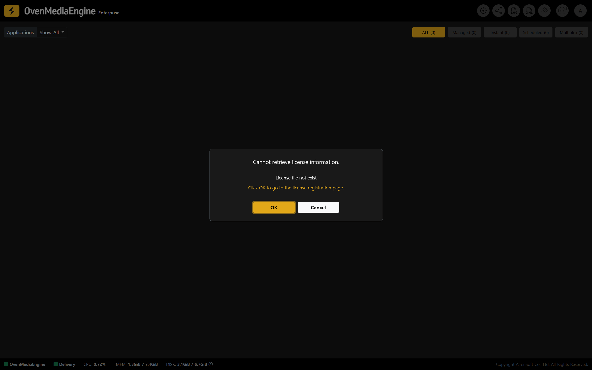
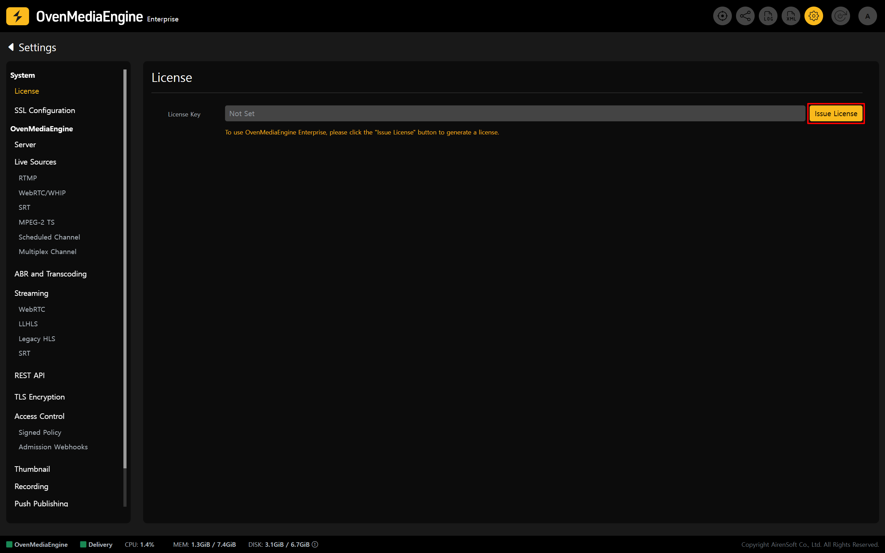
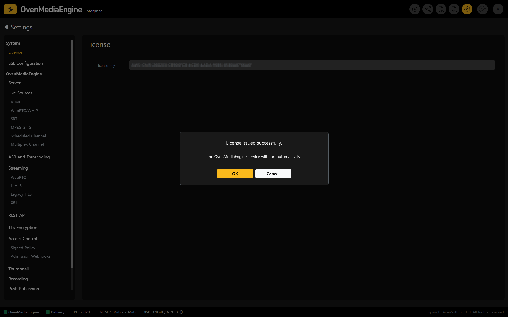

If you see a license-related alert, such as "Cannot retrieve license information" immediately after logging in to the Web Console, the license may not have been issued successfully due to a temporary **network/connectivity issue** during instance provisioning or a communication issue with the **license server**.

## Reissuing a License Key

### Issue a License Key

1. A **valid License Key** is required to use OvenMediaEngine Enterprise properly. Please click \[OK] in the pop-up to go to the License Settings page and reissue the License Key.

2. Click **\[Issue License]** and wait a moment. The system will automatically issue and apply a new License Key.

### Verify the New License Key Is Applied

3. If the license authentication alert/error message disappears, the License Key has been applied successfully. You can then use all OvenMediaEngine Enterprise features normally.
4. Run a basic streaming test by following the "[Post-Setup Verification for OvenMediaEngine Enterprise](../getting-started-on-aws/README.md#post-setup-verification-for-ovenmediaengine-enterprise)" procedure.

:::warning

If the issue persists, first check the instance’s outbound network connectivity (Security Group rules, route settings, NAT/IGW, etc.) and confirm that the instance can reach the license server.

:::

