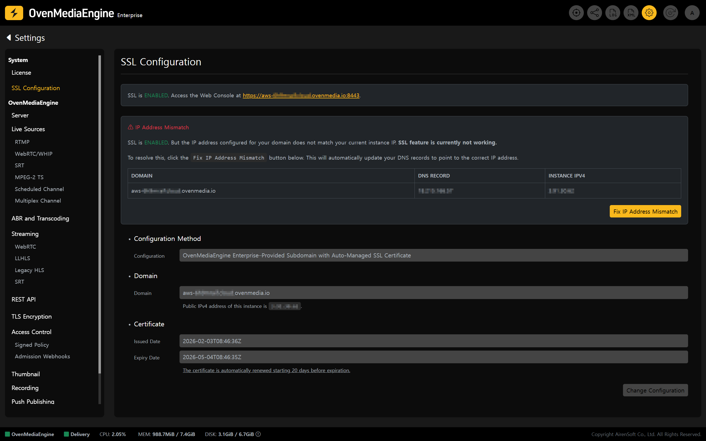
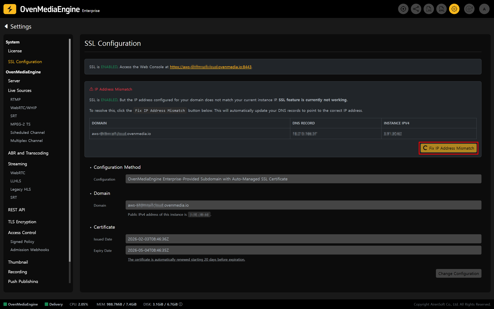
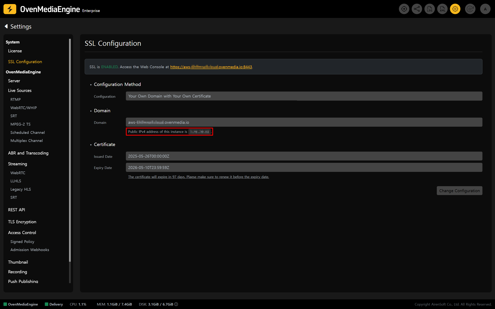

If the Public IP of a running Instance changes, the existing Domain mapping may break, which can cause issues with **Web Console access** or your **streaming service**.&#x20;

In this case, check the current connection status in the Web Console’s \[SSL Configuration] page, and restore the connection by following the steps below based on your SSL setup method (Option A/B).

## When Using "OvenMediaEngine Enterprise–Provided Subdomain with an Auto-Managed SSL Certificate" 

If you are using the default Subdomain and Auto-Managed SSL Certificate provided by OvenMediaEngine Enterprise on AWS, the fix is very simple.

### Check IP and Domain Mapping Status 

1. In the Web Console, click the \[Settings] icon in the upper-right corner to open the Settings page.
   &#x20;Then, select \[SSL Configuration] from the left menu to open the SSL configuration page.

2. If the Instance IP and the configured Domain do not match, the system detects it and displays an **IP Address Mismatch** alert.

:::danger

To prevent recurring issues, **assign an AWS Elastic IP** (EIP) and **pin the Instance's Public IP** before reconfiguring SSL.

* If the Instance is not assigned a fixed Public IP, its Public IP may change when you **stop** and **start** (or reboot) the Instance, which can break the existing Domain mapping and cause service downtime. To ensure stable Domain operation and continuous secure connections, assign an AWS Elastic IP first, and then proceed with SSL configuration.

:::

### Reconnect IP and Domain 

3. On the \[SSL Configuration] page, click **\[Fix IP Address Mismatch]** next to the error message. The system automatically detects the new Instance IP (Public IPv4 address) and updates the Domain mapping information.
4. Once the update is complete, Web Console access and the Streaming service should be restored.

:::tip

DNS changes may take time to propagate across the global network. Depending on the environment, it may take from a few minutes to several hours. If access does not work immediately after the change, please wait and try again.

:::

### Confirm Reconnection 

5. Follow the "[Verify SSL playback and check URLs](../ssl-configuration-on-aws/#verify-ssl-playback-and-check-urls)" guide to run a basic streaming test and confirm everything is working normally.

## When Using "Your Own Domain with Your Own Certificate" 

If you are using a domain you own along with your own SSL certificate, you must reconfigure SSL settings in the Web Console and update the DNS records of the domain currently in use.

### Check IP Address 

1. In the Web Console, click the \[Settings] icon in the upper-right corner to open the Settings page.
   &#x20;Then, select \[SSL Configuration] from the left menu to open the SSL configuration page.

:::info

At this stage, the system cannot determine whether the configuration is valid, so it may not display warnings such as an IP Address Mismatch to the user.

:::

2. On the \[SSL Configuration] page, verify the Instance IP (Public IPv4 address) shown in the interface.

:::danger

To prevent recurring issues, **assign an AWS Elastic IP** (EIP) and **pin the Instance's Public IP** before reconfiguring SSL.

* If the Instance is not assigned a fixed Public IP, its Public IP may change when you **stop** and **start** (or reboot) the Instance, which can break the existing Domain mapping and cause service downtime. To ensure stable Domain operation and continuous secure connections, assign an AWS Elastic IP first, and then proceed with SSL configuration.

:::

### Update the IP Address for the Domain 

3. Update the DNS record of your domain so that it points to the Public IPv4 address confirmed in \[SSL Configuration].
4. Return to the Web Console, click \[Change Configuration] on the \[SSL Configuration] page, switch to edit mode, and first apply the configuration as **Disabled**.
5. Then follow the "[Configure and Verify SSL](../ssl-configuration-on-aws/#configure-and-verify-ssl)" guide and configure SSL again using the **Your Own Domain with Your Own Certificate** option.

:::tip

DNS changes may take time to propagate across the global network. Depending on the environment, it may take from a few minutes to several hours. If access does not work immediately after the change, please wait and try again.

:::

### Verify Reconnection 

6. Follow the "[Verify SSL playback and check URLs](../ssl-configuration-on-aws/#verify-ssl-playback-and-check-urls)" guide to run a basic streaming test and confirm everything is working normally.

