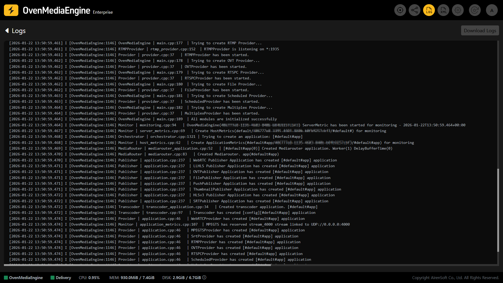
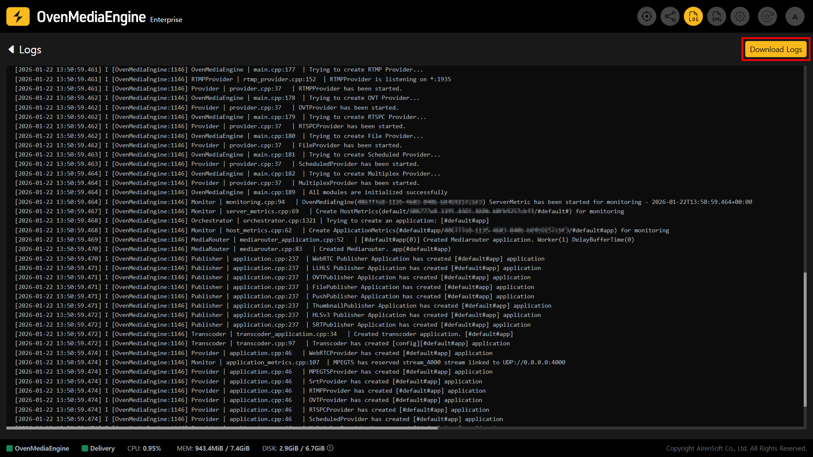

While operating a service based on OvenMediaEngine Enterprise on AWS, unexpected issues may occur, such as streaming interruptions or audio/video not playing back properly. In such cases, it is important to determine whether the root cause is a **configuration mistake**, an issue caused by the **network environment**, or a **temporary system error**.

OvenMediaEngine Enterprise on AWS provides the \[Download Logs] feature, which allows you to download the current state data as-is. Using this feature, you can share an issue with the OvenMediaEngine Enterprise Team quickly and accurately at any time.

## Log Download and Submission

### Go to the Logs page

1. If you need Technical Support, click the \[Log] icon in the upper-right corner of the Web Console to open the Logs page.

### Download logs

2. Click **\[Download Logs]** in the upper-right corner of the Logs page to download key logs from the server as a single file (`.zip`) to your PC.

### Submit the log file

3. OvenMediaEngine Enterprise on AWS provides **email-based Basic Technical Support** during your subscription period. Please send the downloaded log file to the OvenMediaEngine Enterprise Team. Based on the logs, we will review the issue in detail and provide guidance on the resolution.
   * **Basic Technical Support:** [support@ovenmedialabs.com](mailto:support@ovenmedialabs.com)

## Direct-to-Engineer Support Program

OvenMediaEngine Enterprise on AWS provides email-based Basic Technical Support during your subscription period. If you need **faster**, **more direct support** via a **private channel** (Slack), please refer to the page below.

* **Support Program:** [https://ovenmedialabs.com/ome-enterprise.html#enterprise-support](https://ovenmedialabs.com/ome-enterprise.html#enterprise-support)
* **Support Program Contact:** [contact@ovenmedialabs.com](mailto:contact@ovenmedialabs.com)
