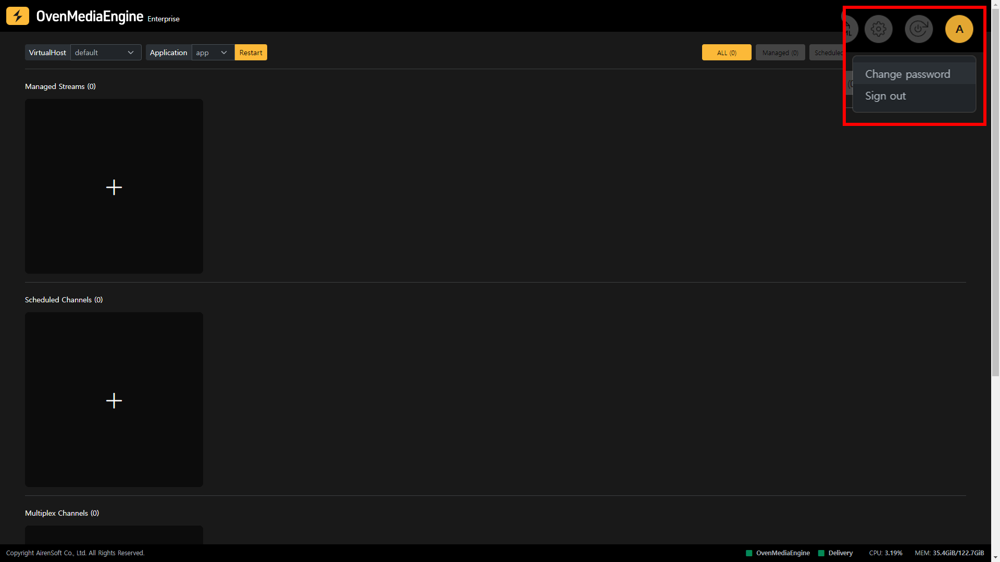
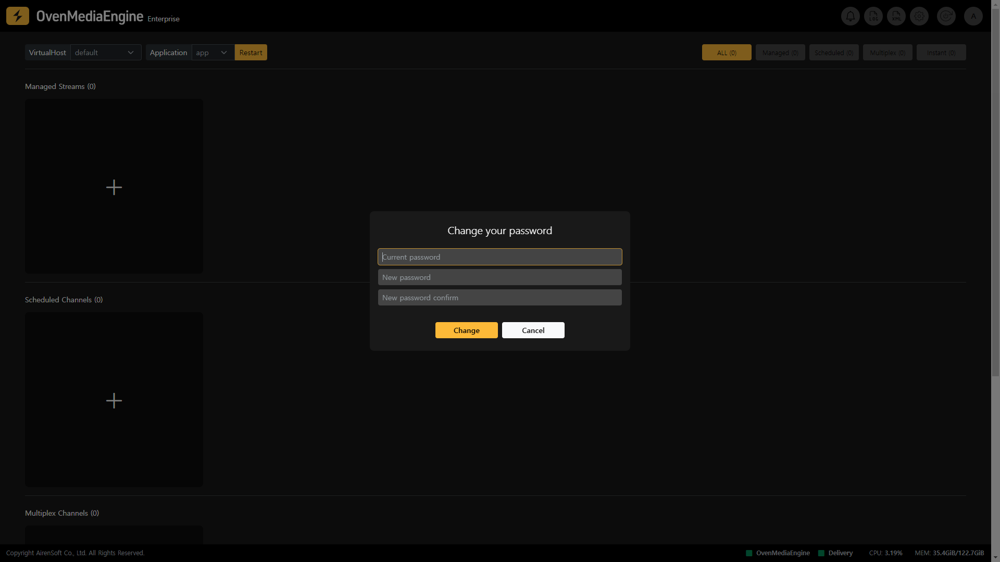

## Change Password

To change your OvenMediaEngine Enterprise access password, sign in to OvenMediaEngine Enterprise as shown in the image above, then click on your account icon in the upper right corner of the [Web Console Home](web-console-home.md). You can then change your password by selecting Change Password from the drop-down menu that appears.

When the password change pop-up appears as shown in the image above, you can change the OvenMediaEngine Enterprise access password by entering the current password and the password you want to change in order.
