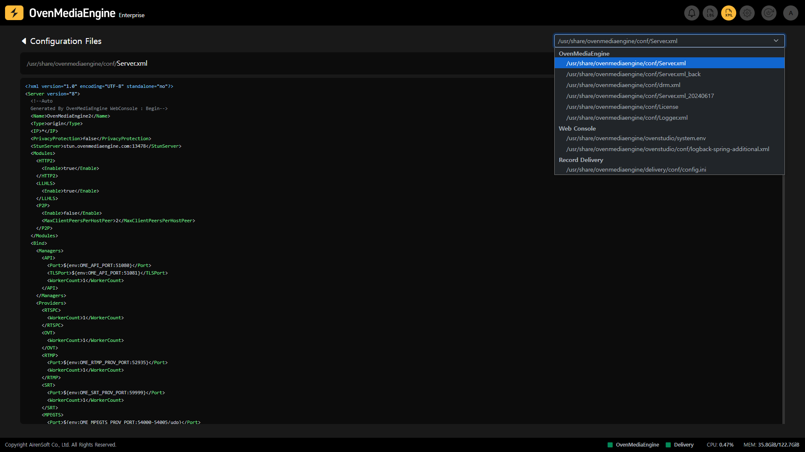

You can access this page by clicking the XML icon on the right side of the Web Console navigation bar. From this page, you can review various settings by viewing the Configuration Files and contents that OvenMediaEngine Enterprise references.

You can also view all `.XML` files in the folder where OvenMediaEngine Enterprise is installed by clicking the drop-down menu in the upper right. If OvenMediaEngine is not working as intended, you can use this feature to view the Configuration Files and, if necessary, restart the system.
