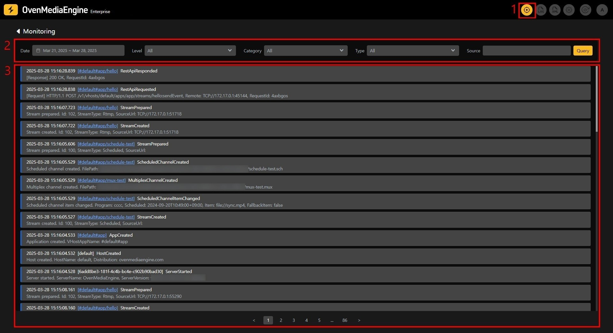
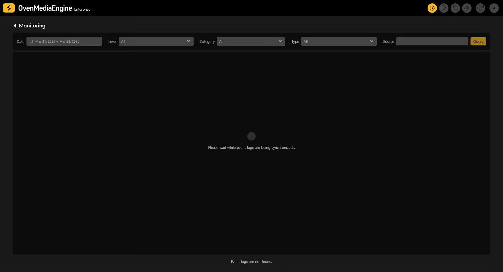
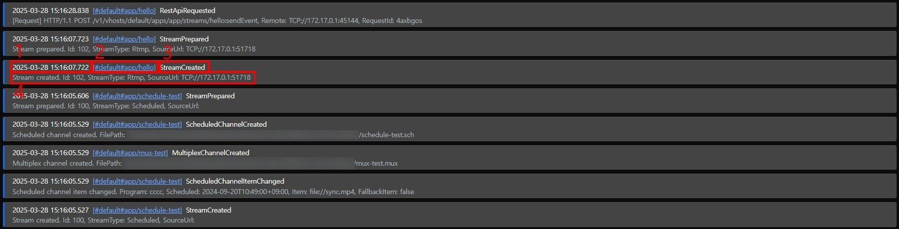
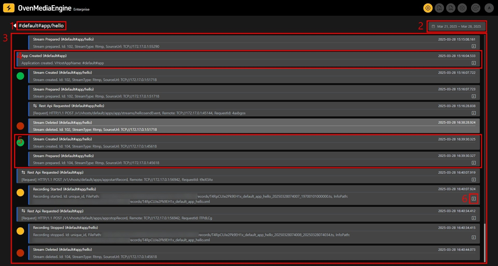
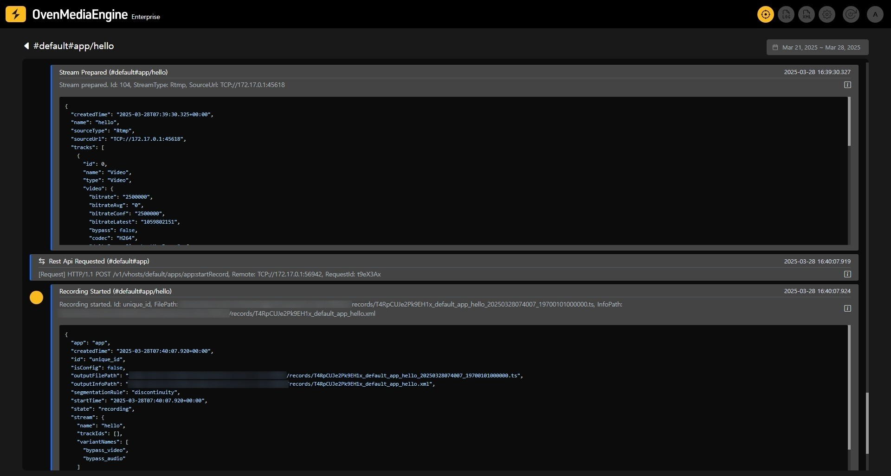
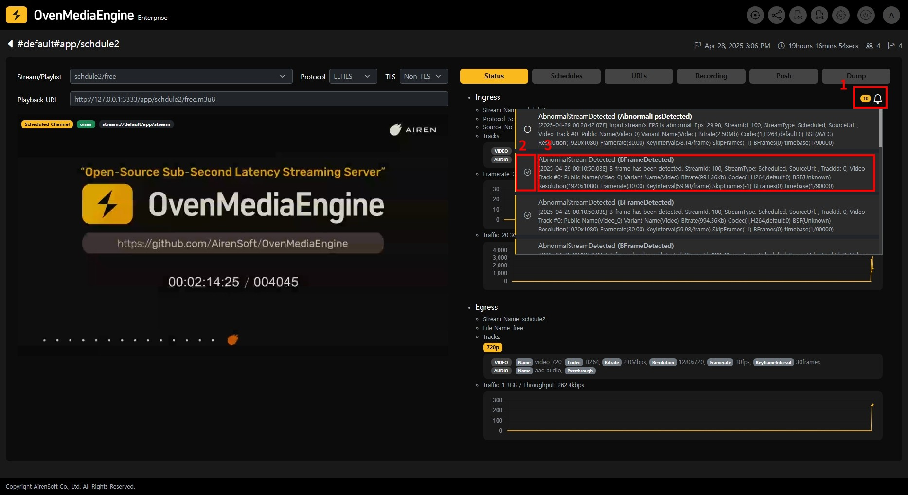

OvenMediaEngine Enterprise provides a function to monitor various events such as application creation/deletion, stream creation/deletion, Rest API calls, etc.

Events are recorded in `JSON` format files, and the Web Console automatically collects the recorded events and provides a UI for monitoring.

## Activating Event Monitoring

Event monitoring is disabled by default at initial installation and can be activated by referring to the [Configuration](configuration.md) document.

## Event List

### Query Filter and Event Log List

1. Navigate to the Monitoring page using the navigation at the top of the screen.
2. You can filter and query event logs.
3. The event log list is displayed.

:::info

If there are many accumulated event logs, it may take a long time to synchronize when starting the Web Console.

:::

### Event Log

Each item of the event log displayed on the screen is as follows:

1. Displays the time when the event occurred.
2. Displays the unique ID of the source (server, Virtual Host, application, or stream) where the event occurred.
   &#x20;If the source is an application or stream, click to go to the event timeline page where you can view detailed information about events from that source.
3. Displays the type of event that occurred.
4. Displays a one-line summary of the event that occurred.

:::info

Please refer to the [Event Specification](event-specification.md) document for details on events.

:::

## Event Timeline

You can enter the event timeline page by clicking the source ID.

On the event timeline page, you can check the list of events that occurred on that source and detailed information at the time the events occurred.

1. Displays the ID of the selected source.
2. Displays the period of the timeline. This period is set to the period queried on the event list page.
3. The event history of the selected source is displayed. The maximum number of items displayed is 1,000.
4. Displays application events. Even if the selected source is a stream, the events of the application where the stream was created are also displayed.
5. Displays stream events. Circular icons are displayed according to the type of event.

<table><thead><tr><th width="144">Icon Color</th><th>Description</th></tr></thead><tbody><tr><td>Green</td><td>Stream creation</td></tr><tr><td>Red</td><td>Stream deletion</td></tr><tr><td>Yellow</td><td>
Scheduled Channel creation/modification/deletion,

Multiplex Channel creation/modification/deletion,

Recording start/stop,

Push Publishing start/stop
</td></tr></tbody></table>

6. Certain events allow you to check detailed information at the time of occurrence in `JSON` format:

## Input Stream Alert Notifications | 0.18.1.2+

On the stream details page, you can check alert notifications of the input stream from the last 24 hours. These are displayed for [stream event categories](event-specification.md#stream-events-streamevent) with event levels of `Warning` and `Error` .&#x20;

1. You can check alert notifications by clicking the icon. The number of unread notifications is displayed beside the icon.
2. Click to mark the notification as acknowledged.
3. The content of the alert notification is displayed. Click to navigate to the event timeline page of the stream.
